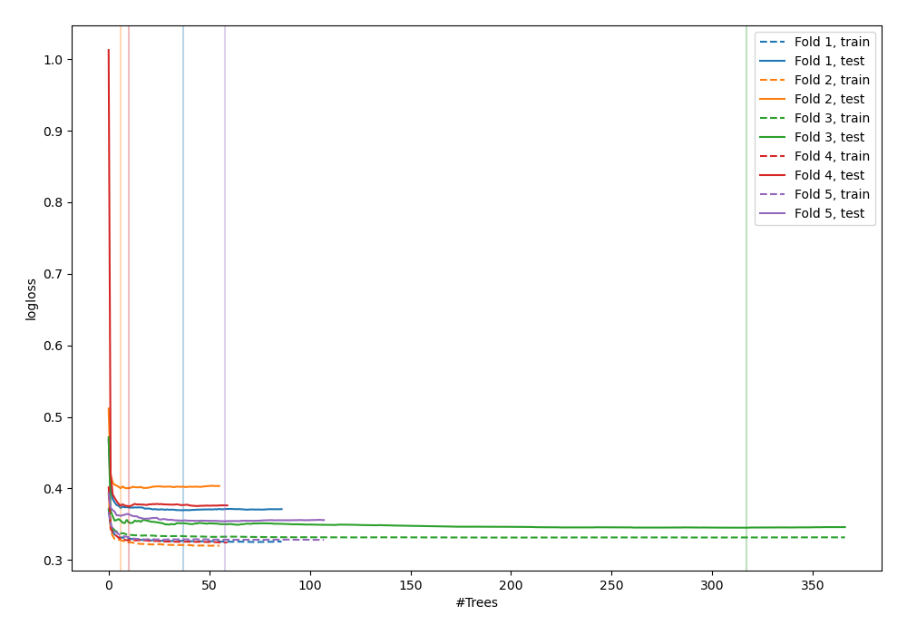
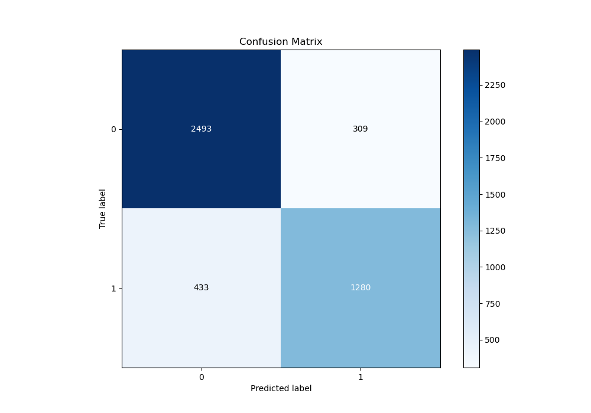
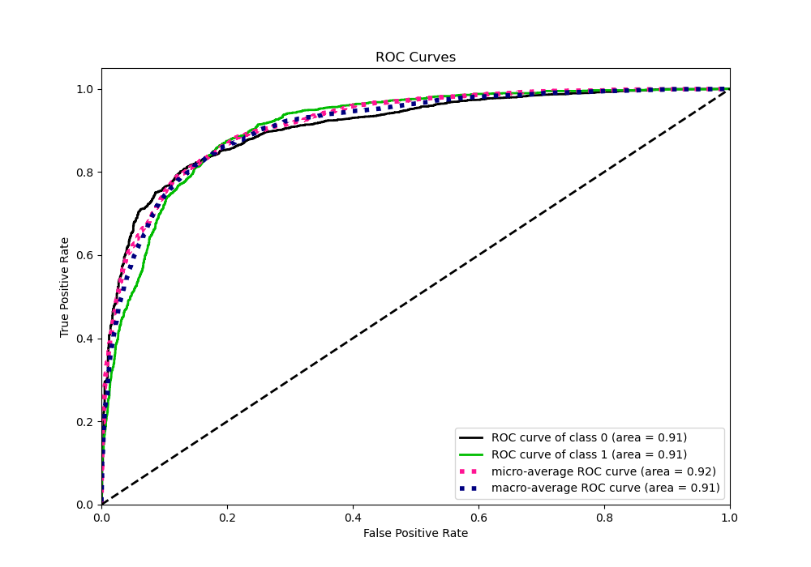
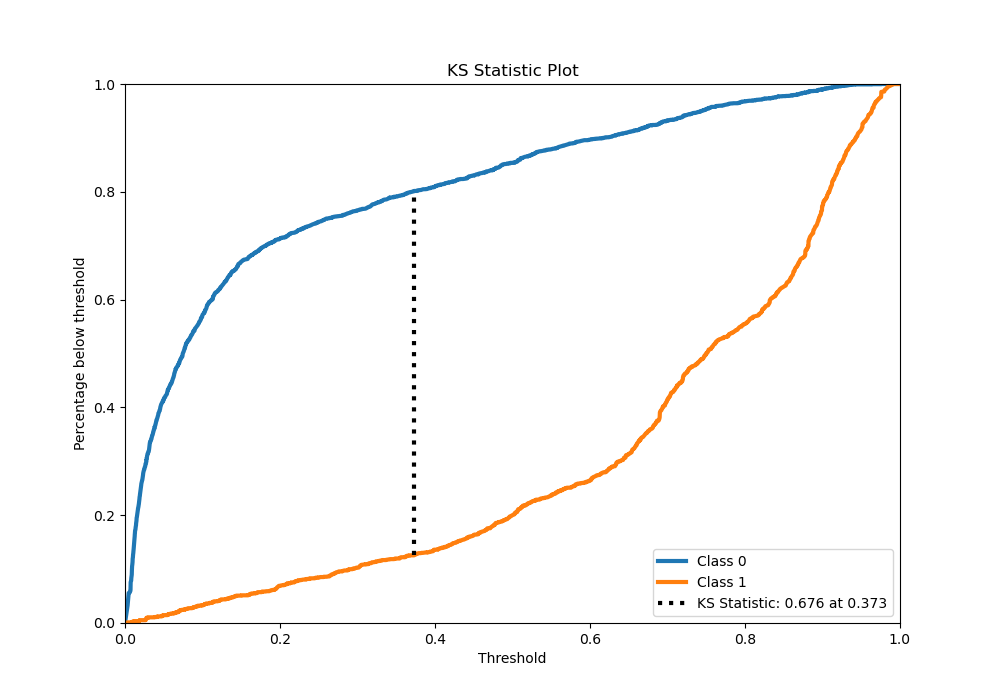
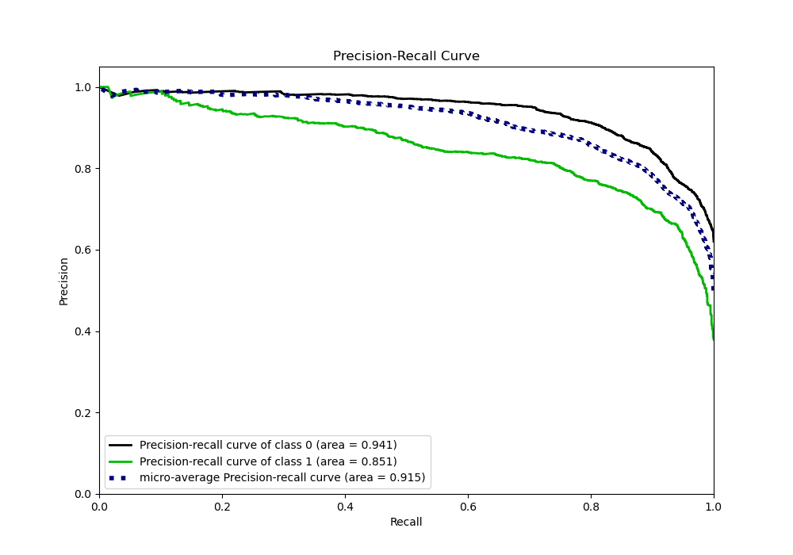
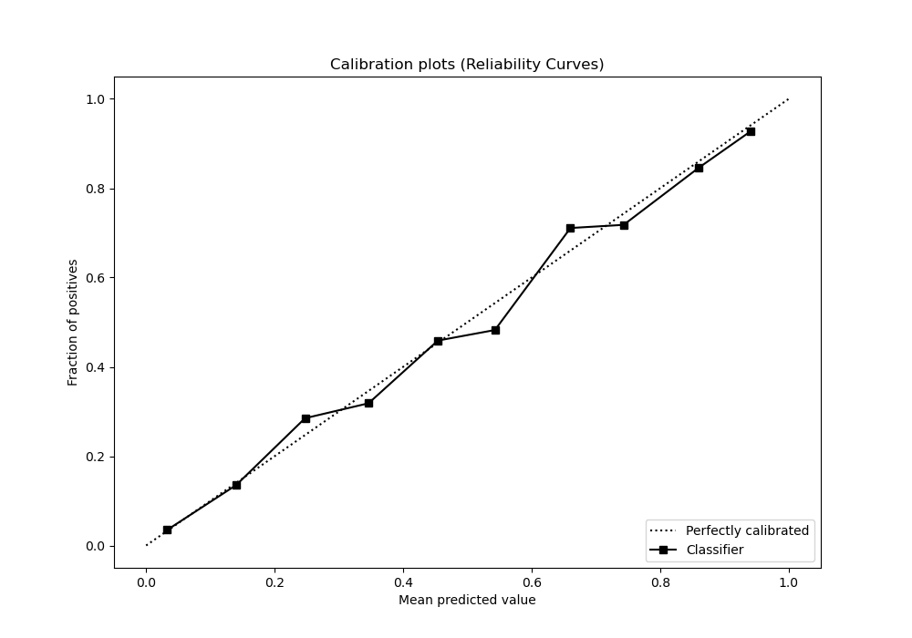
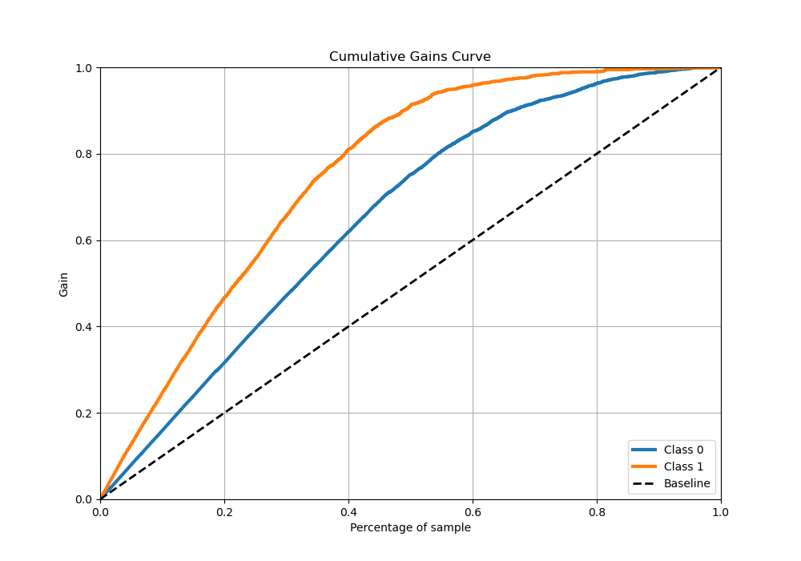
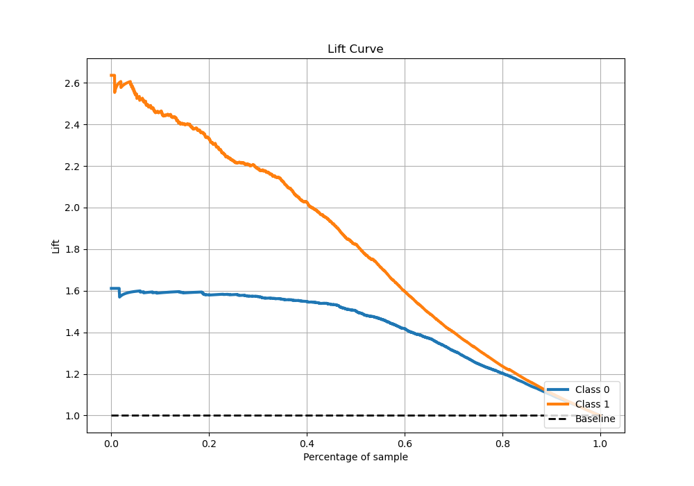

# Summary of 40_RandomForest_Stacked

[<< Go back](../README.md)

## Random Forest
- **n_jobs**: -1
- **criterion**: entropy
- **max_features**: 0.7
- **min_samples_split**: 30
- **max_depth**: 4
- **eval_metric_name**: logloss
- **explain_level**: 0

## Validation
 - **validation_type**: kfold
 - **stratify**: True
 - **k_folds**: 5
 - **shuffle**: True
 - **random_seed**: 42

## Optimized metric
logloss

## Training time

47.2 seconds

## Metric details
|           |    score |   threshold |
|:----------|---------:|------------:|
| logloss   | 0.368743 | nan         |
| auc       | 0.908658 | nan         |
| f1        | 0.794713 |   0.410774  |
| accuracy  | 0.835659 |   0.577267  |
| precision | 0.986577 |   0.94963   |
| recall    | 1        |   0.0030137 |
| mcc       | 0.65856  |   0.410774  |

## Metric details with threshold from accuracy metric
|           |    score |   threshold |
|:----------|---------:|------------:|
| logloss   | 0.368743 |  nan        |
| auc       | 0.908658 |  nan        |
| f1        | 0.775288 |    0.577267 |
| accuracy  | 0.835659 |    0.577267 |
| precision | 0.805538 |    0.577267 |
| recall    | 0.747227 |    0.577267 |
| mcc       | 0.64717  |    0.577267 |

## Confusion matrix (at threshold=0.577267)
|              |   Predicted as 0 |   Predicted as 1 |
|:-------------|-----------------:|-----------------:|
| Labeled as 0 |             2493 |              309 |
| Labeled as 1 |              433 |             1280 |

## Learning curves

## Confusion Matrix

## Normalized Confusion Matrix

## ROC Curve

## Kolmogorov-Smirnov Statistic

## Precision-Recall Curve

## Calibration Curve

## Cumulative Gains Curve

## Lift Curve

[<< Go back](../README.md)
