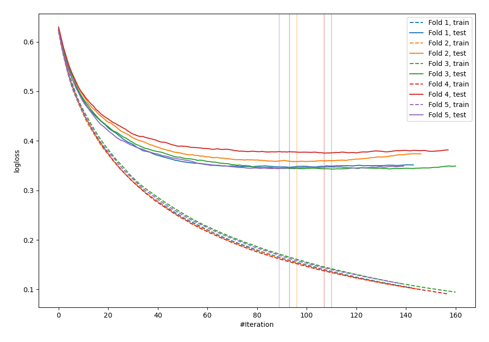
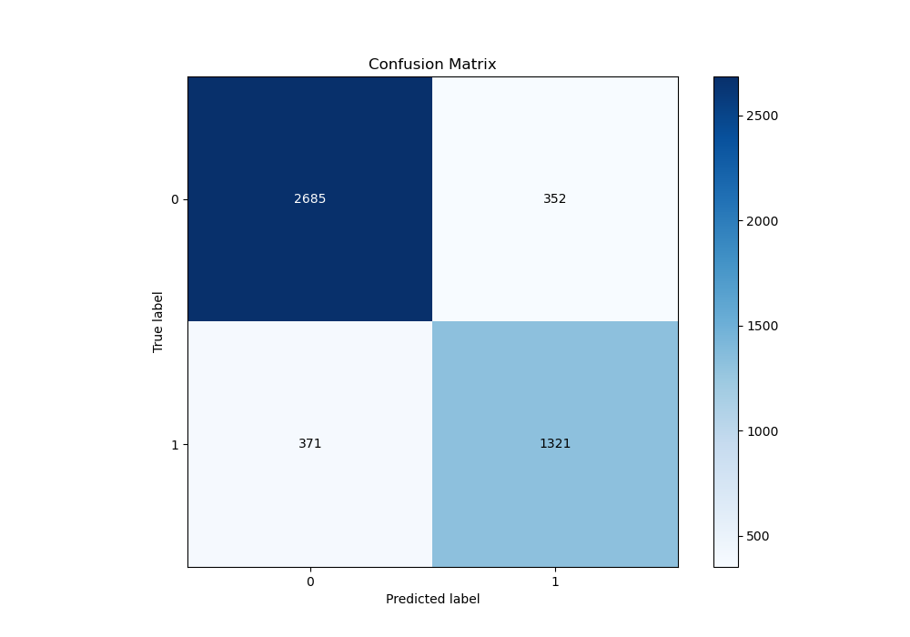
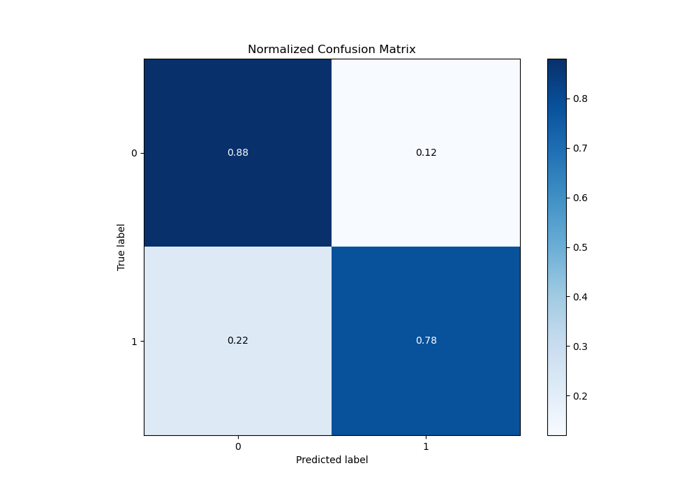
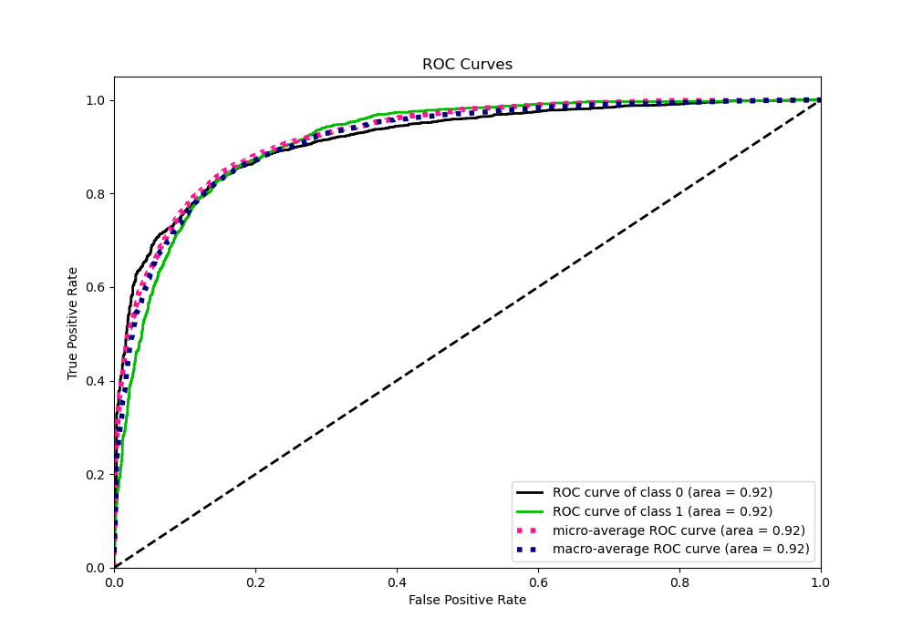
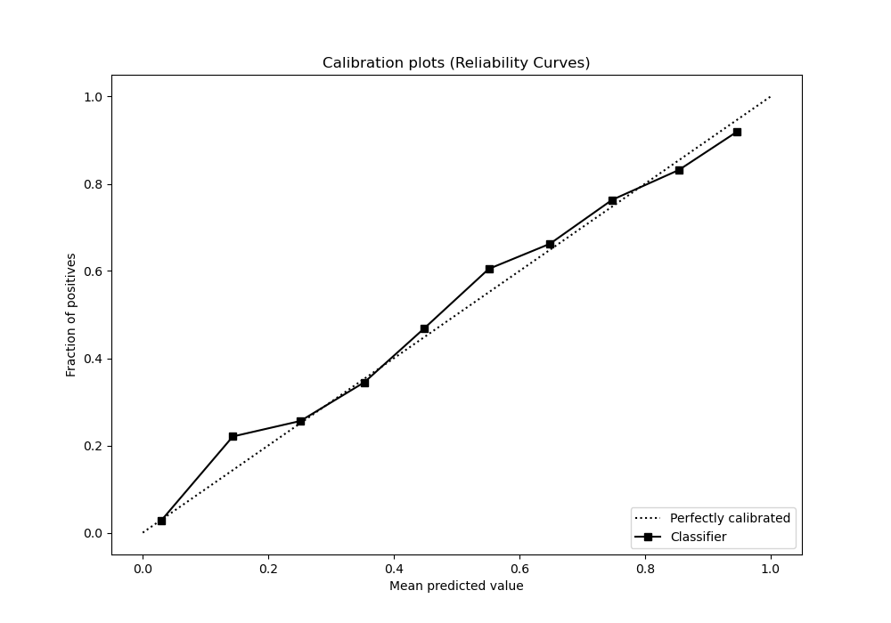
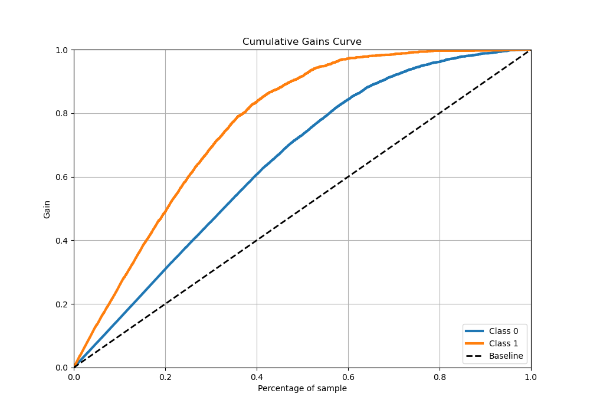

# Summary of 41_LightGBM

[<< Go back](../README.md)

## LightGBM
- **n_jobs**: -1
- **objective**: binary
- **num_leaves**: 95
- **learning_rate**: 0.1
- **feature_fraction**: 0.5
- **bagging_fraction**: 0.5
- **min_data_in_leaf**: 50
- **metric**: binary_logloss
- **custom_eval_metric_name**: None
- **explain_level**: 0

## Validation
 - **validation_type**: kfold
 - **stratify**: True
 - **k_folds**: 5
 - **shuffle**: True
 - **random_seed**: 42

## Optimized metric
logloss

## Training time

31.6 seconds

## Metric details
|           |    score |     threshold |
|:----------|---------:|--------------:|
| logloss   | 0.353357 | nan           |
| auc       | 0.915609 | nan           |
| f1        | 0.790556 |   0.371634    |
| accuracy  | 0.847114 |   0.476451    |
| precision | 0.972222 |   0.953092    |
| recall    | 1        |   0.000393207 |
| mcc       | 0.66721  |   0.453178    |

## Metric details with threshold from accuracy metric
|           |    score |   threshold |
|:----------|---------:|------------:|
| logloss   | 0.353357 |  nan        |
| auc       | 0.915609 |  nan        |
| f1        | 0.785141 |    0.476451 |
| accuracy  | 0.847114 |    0.476451 |
| precision | 0.7896   |    0.476451 |
| recall    | 0.780733 |    0.476451 |
| mcc       | 0.666512 |    0.476451 |

## Confusion matrix (at threshold=0.476451)
|              |   Predicted as 0 |   Predicted as 1 |
|:-------------|-----------------:|-----------------:|
| Labeled as 0 |             2685 |              352 |
| Labeled as 1 |              371 |             1321 |

## Learning curves

## Confusion Matrix

## Normalized Confusion Matrix

## ROC Curve

## Kolmogorov-Smirnov Statistic

## Precision-Recall Curve

## Calibration Curve

## Cumulative Gains Curve

## Lift Curve

[<< Go back](../README.md)
