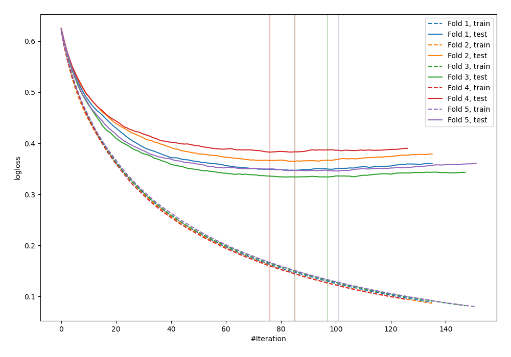
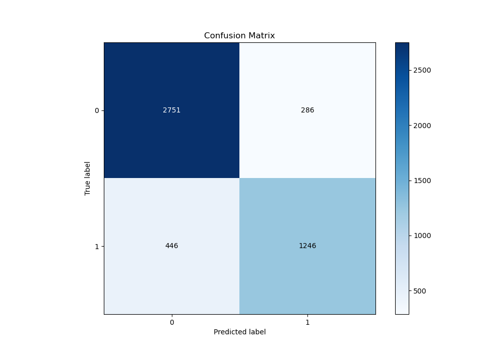
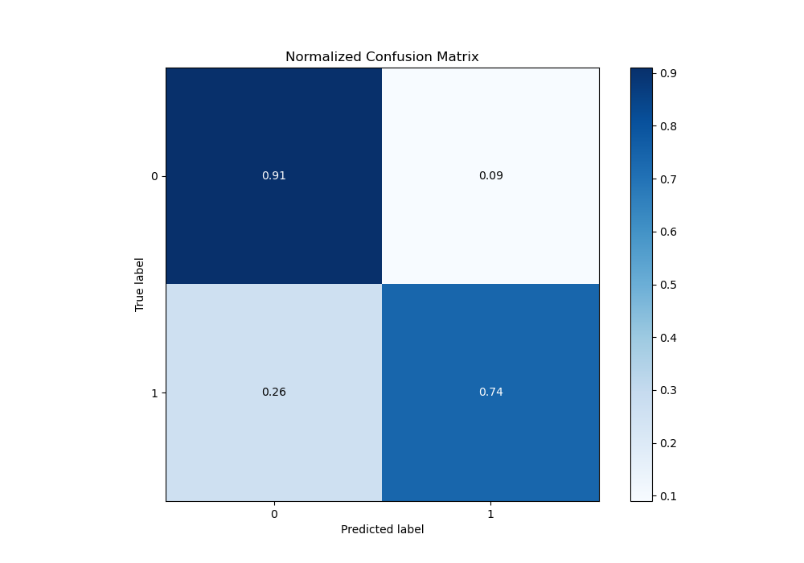
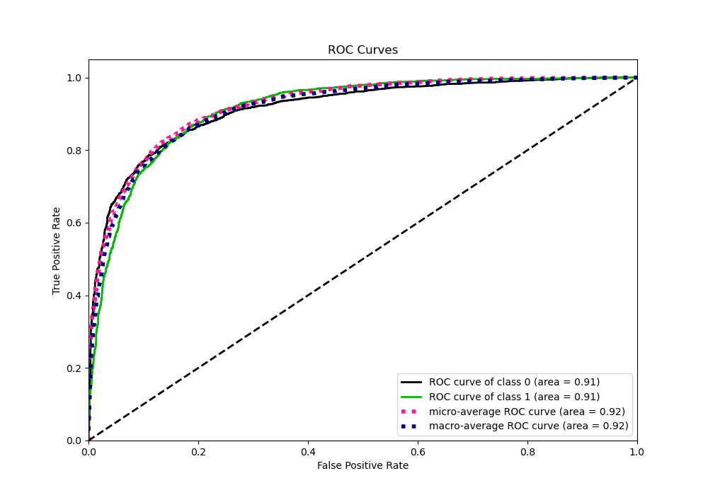
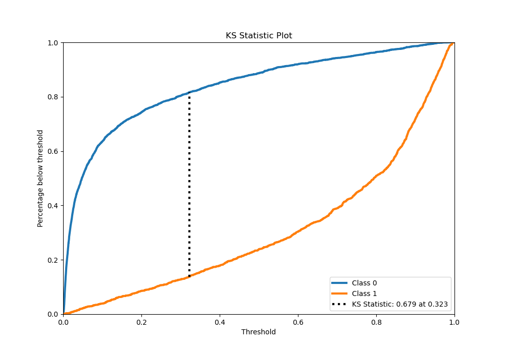
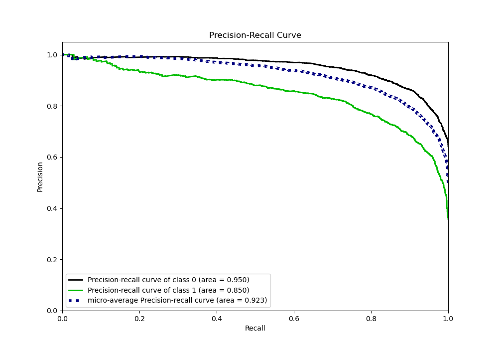
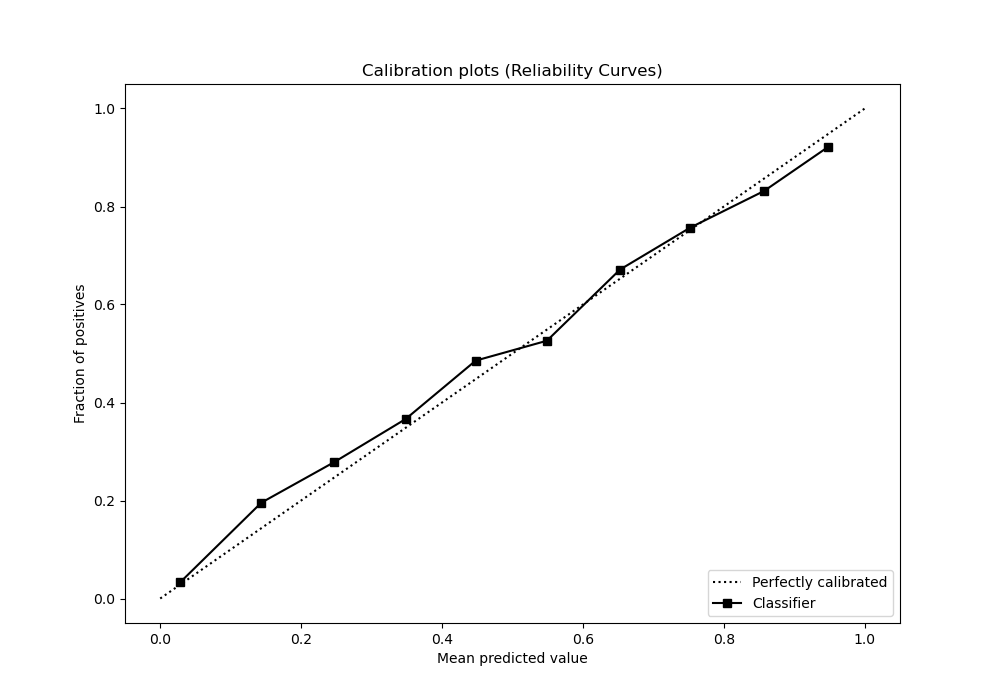
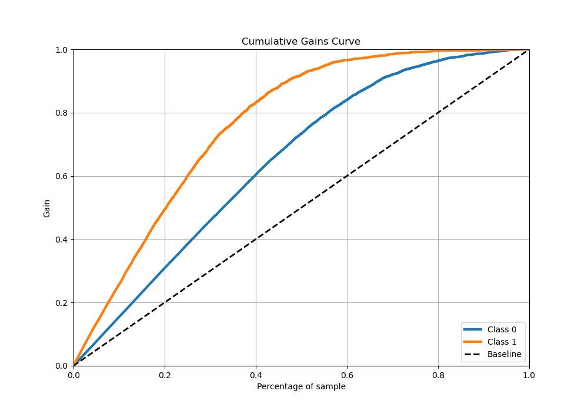

# Summary of 43_LightGBM

[<< Go back](../README.md)

## LightGBM
- **n_jobs**: -1
- **objective**: binary
- **num_leaves**: 127
- **learning_rate**: 0.1
- **feature_fraction**: 1.0
- **bagging_fraction**: 0.9
- **min_data_in_leaf**: 50
- **metric**: binary_logloss
- **custom_eval_metric_name**: None
- **explain_level**: 0

## Validation
 - **validation_type**: kfold
 - **stratify**: True
 - **k_folds**: 5
 - **shuffle**: True
 - **random_seed**: 42

## Optimized metric
logloss

## Training time

31.2 seconds

## Metric details
|           |    score |     threshold |
|:----------|---------:|--------------:|
| logloss   | 0.354865 | nan           |
| auc       | 0.914954 | nan           |
| f1        | 0.785886 |   0.310832    |
| accuracy  | 0.84521  |   0.544215    |
| precision | 0.986667 |   0.978095    |
| recall    | 1        |   0.000280007 |
| mcc       | 0.660911 |   0.43264     |

## Metric details with threshold from accuracy metric
|           |    score |   threshold |
|:----------|---------:|------------:|
| logloss   | 0.354865 |  nan        |
| auc       | 0.914954 |  nan        |
| f1        | 0.772953 |    0.544215 |
| accuracy  | 0.84521  |    0.544215 |
| precision | 0.813316 |    0.544215 |
| recall    | 0.736407 |    0.544215 |
| mcc       | 0.657833 |    0.544215 |

## Confusion matrix (at threshold=0.544215)
|              |   Predicted as 0 |   Predicted as 1 |
|:-------------|-----------------:|-----------------:|
| Labeled as 0 |             2751 |              286 |
| Labeled as 1 |              446 |             1246 |

## Learning curves

## Confusion Matrix

## Normalized Confusion Matrix

## ROC Curve

## Kolmogorov-Smirnov Statistic

## Precision-Recall Curve

## Calibration Curve

## Cumulative Gains Curve

## Lift Curve

[<< Go back](../README.md)
