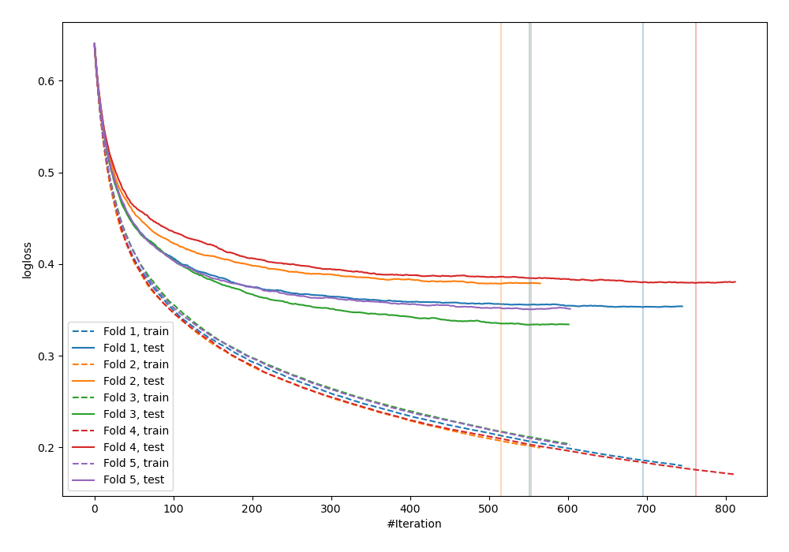
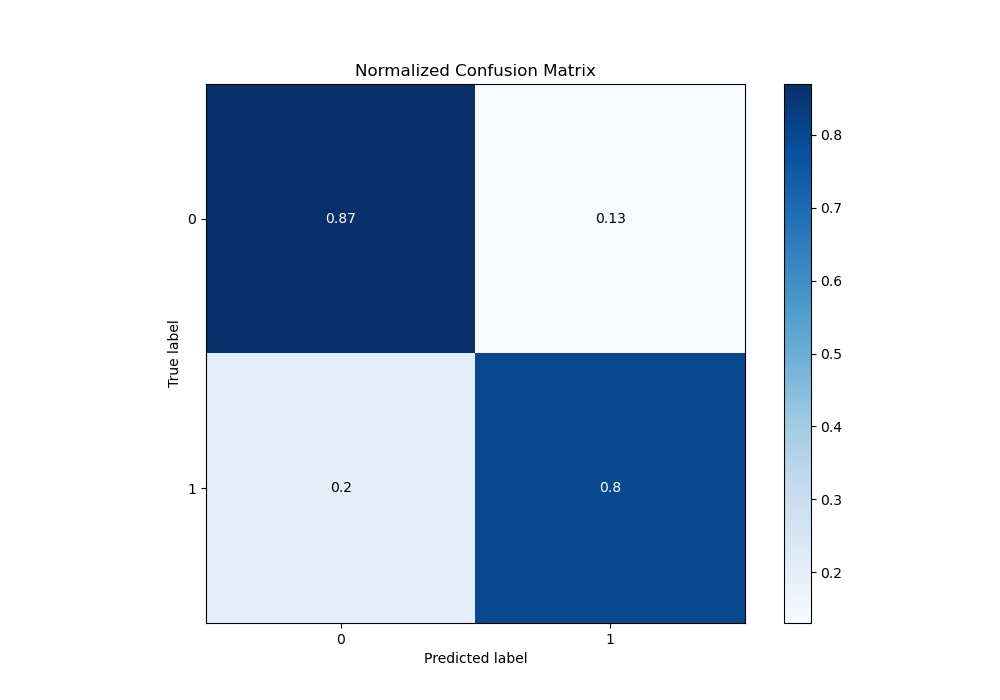
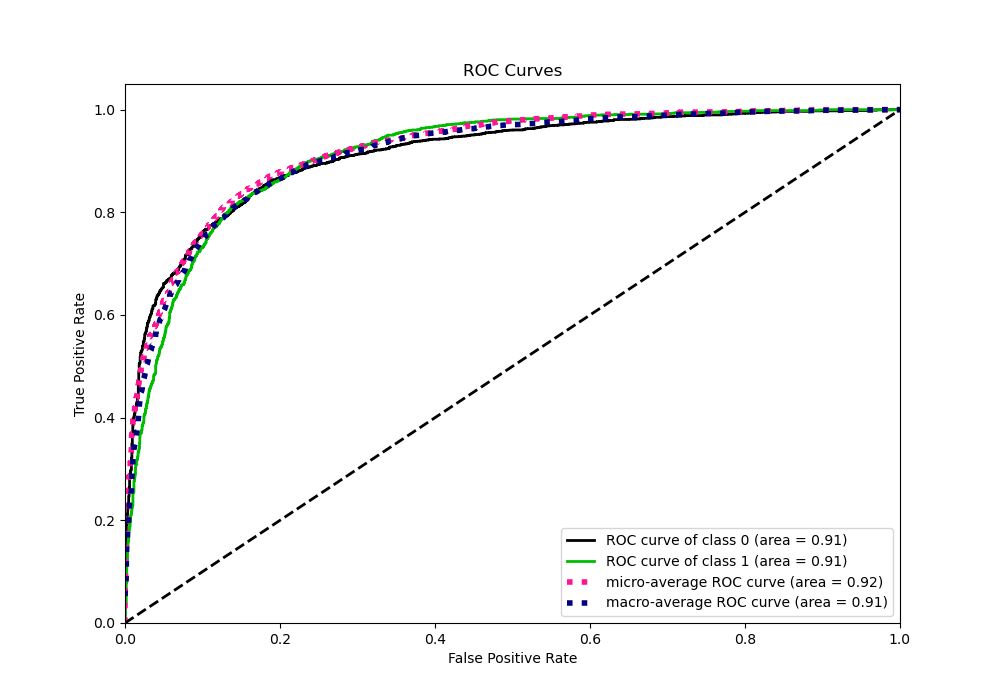
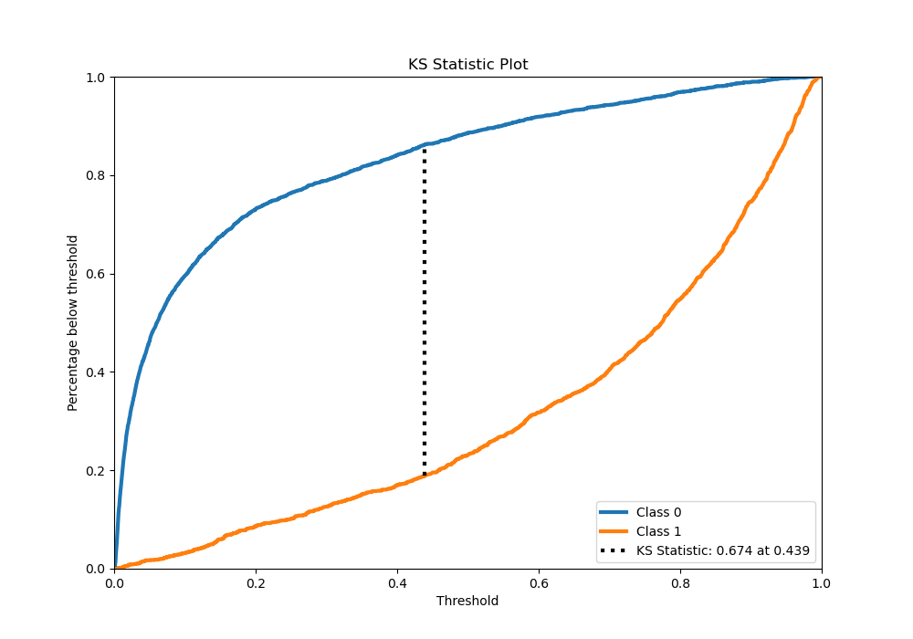
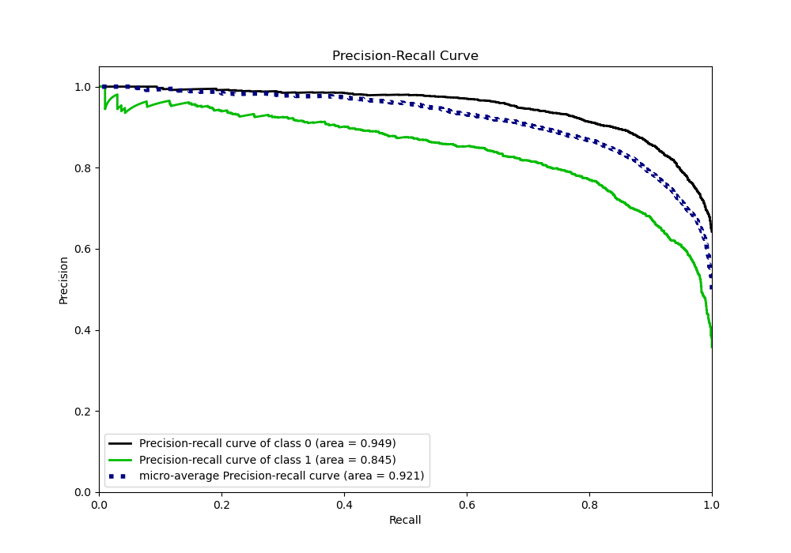
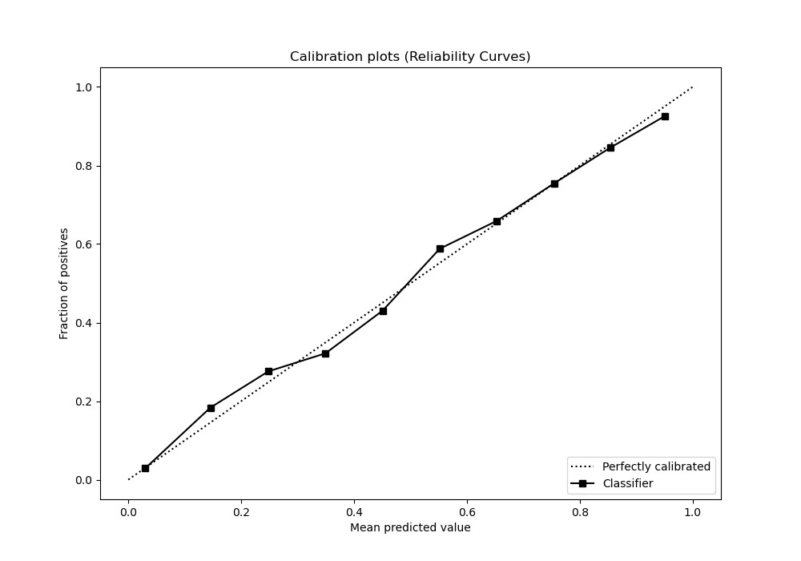
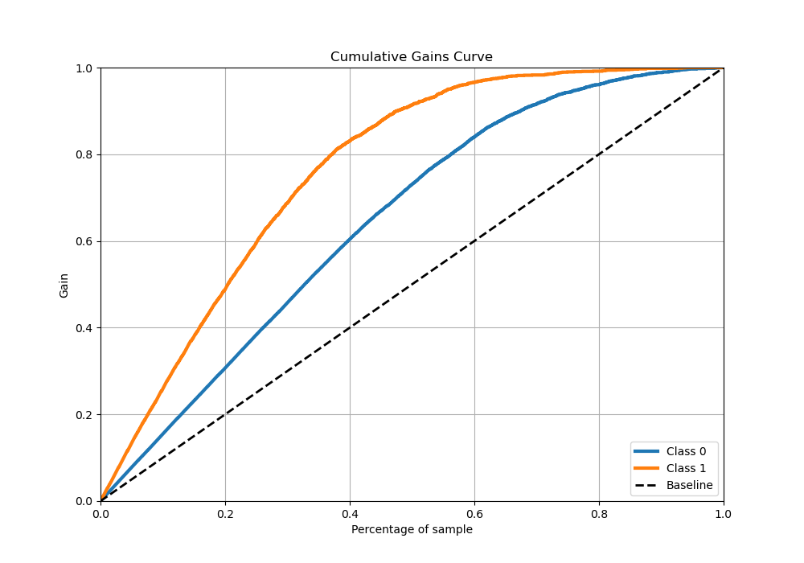
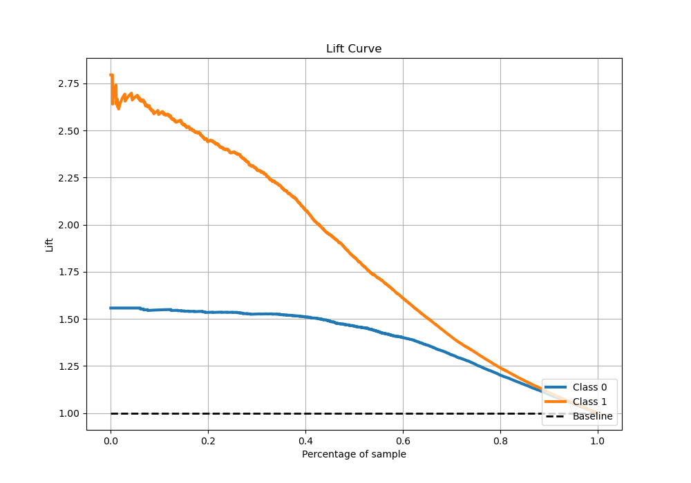

# Summary of 44_Xgboost

[<< Go back](../README.md)

## Extreme Gradient Boosting (Xgboost)
- **n_jobs**: -1
- **objective**: binary:logistic
- **eta**: 0.05
- **max_depth**: 9
- **min_child_weight**: 10
- **subsample**: 0.7
- **colsample_bytree**: 0.6
- **eval_metric**: logloss
- **explain_level**: 0

## Validation
 - **validation_type**: kfold
 - **stratify**: True
 - **k_folds**: 5
 - **shuffle**: True
 - **random_seed**: 42

## Optimized metric
logloss

## Training time

58.1 seconds

## Metric details
|           |    score |     threshold |
|:----------|---------:|--------------:|
| logloss   | 0.359043 | nan           |
| auc       | 0.912383 | nan           |
| f1        | 0.787222 |   0.430857    |
| accuracy  | 0.84373  |   0.456182    |
| precision | 0.959016 |   0.968588    |
| recall    | 1        |   0.000450551 |
| mcc       | 0.663646 |   0.456182    |

## Metric details with threshold from accuracy metric
|           |    score |   threshold |
|:----------|---------:|------------:|
| logloss   | 0.359043 |  nan        |
| auc       | 0.912383 |  nan        |
| f1        | 0.786354 |    0.456182 |
| accuracy  | 0.84373  |    0.456182 |
| precision | 0.769666 |    0.456182 |
| recall    | 0.803783 |    0.456182 |
| mcc       | 0.663646 |    0.456182 |

## Confusion matrix (at threshold=0.456182)
|              |   Predicted as 0 |   Predicted as 1 |
|:-------------|-----------------:|-----------------:|
| Labeled as 0 |             2630 |              407 |
| Labeled as 1 |              332 |             1360 |

## Learning curves

## Confusion Matrix

## Normalized Confusion Matrix

## ROC Curve

## Kolmogorov-Smirnov Statistic

## Precision-Recall Curve

## Calibration Curve

## Cumulative Gains Curve

## Lift Curve

[<< Go back](../README.md)
