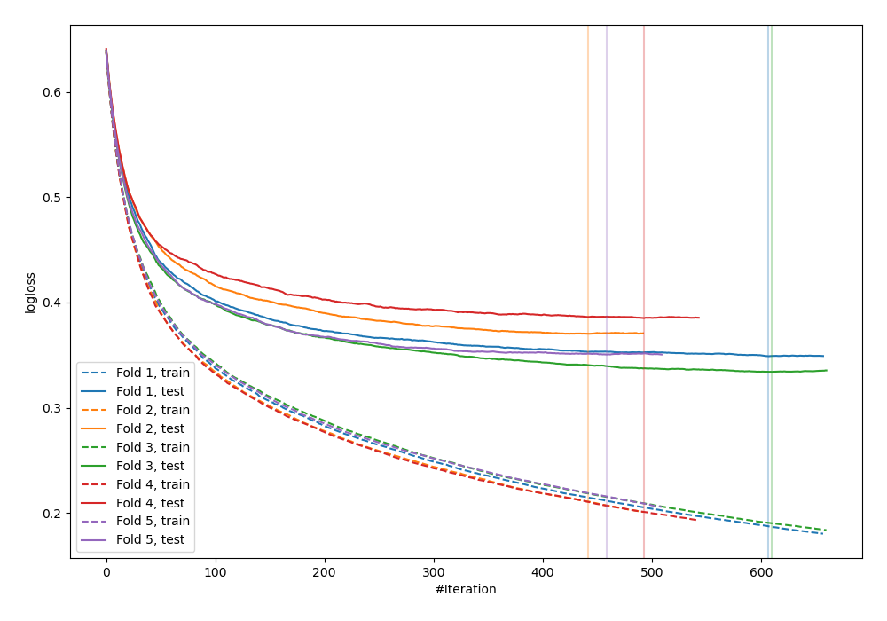
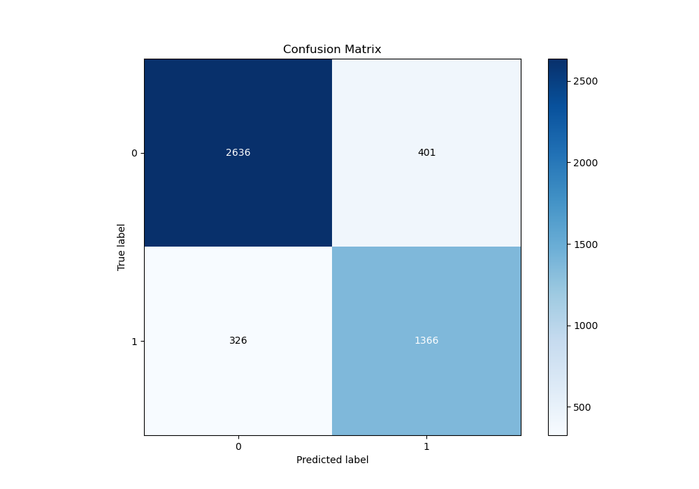
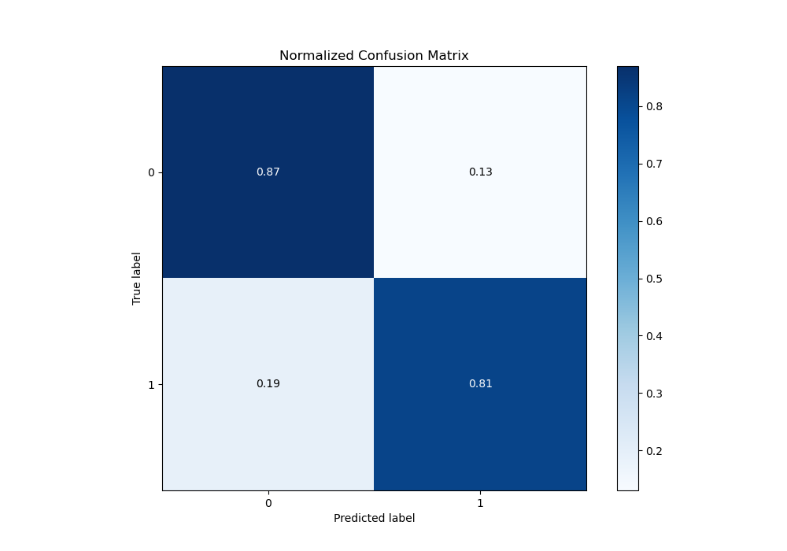
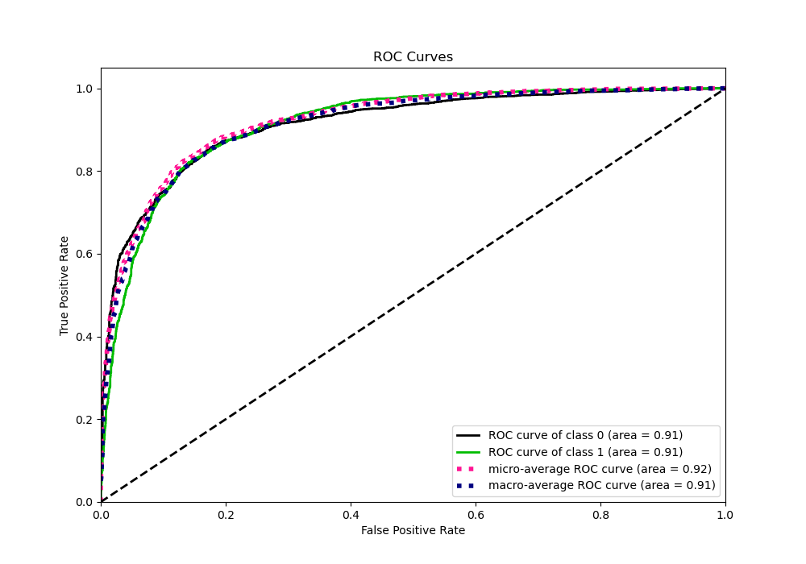
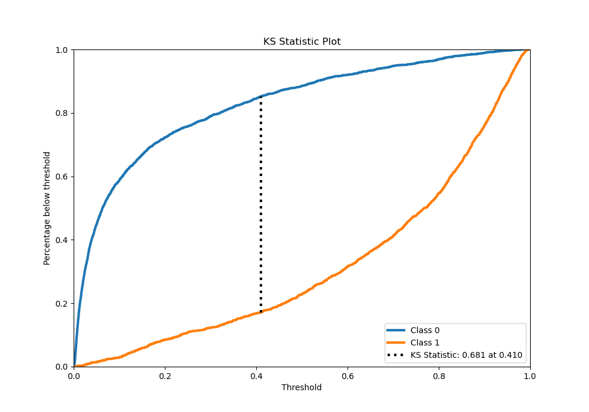
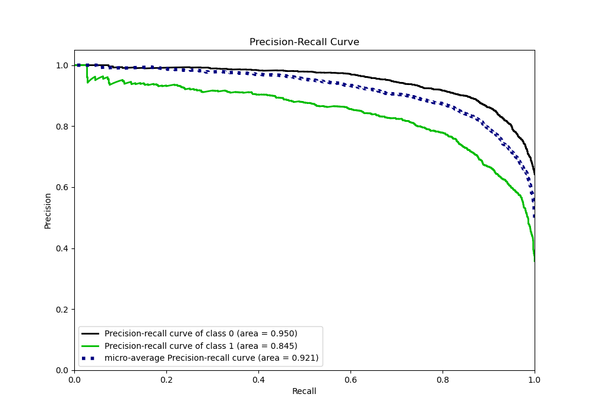
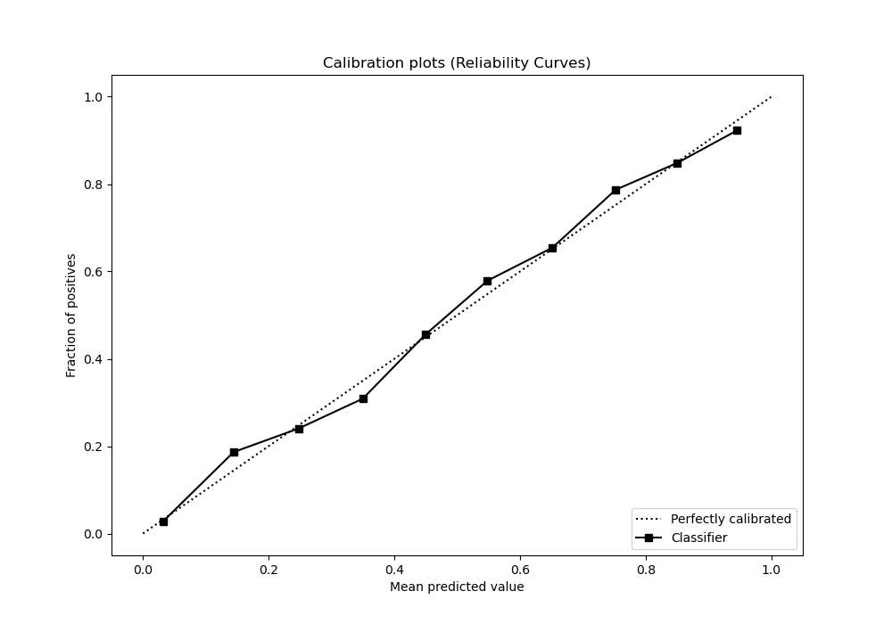
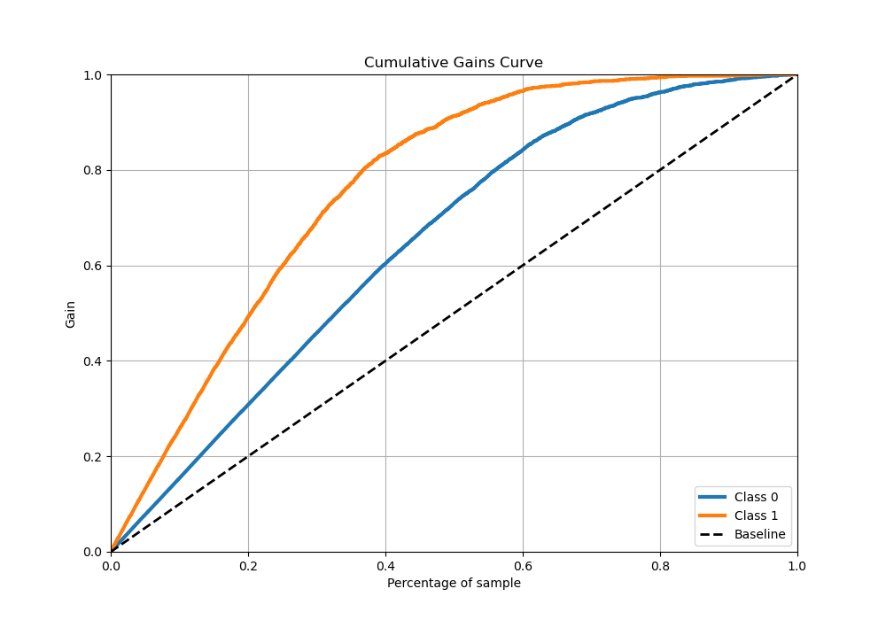
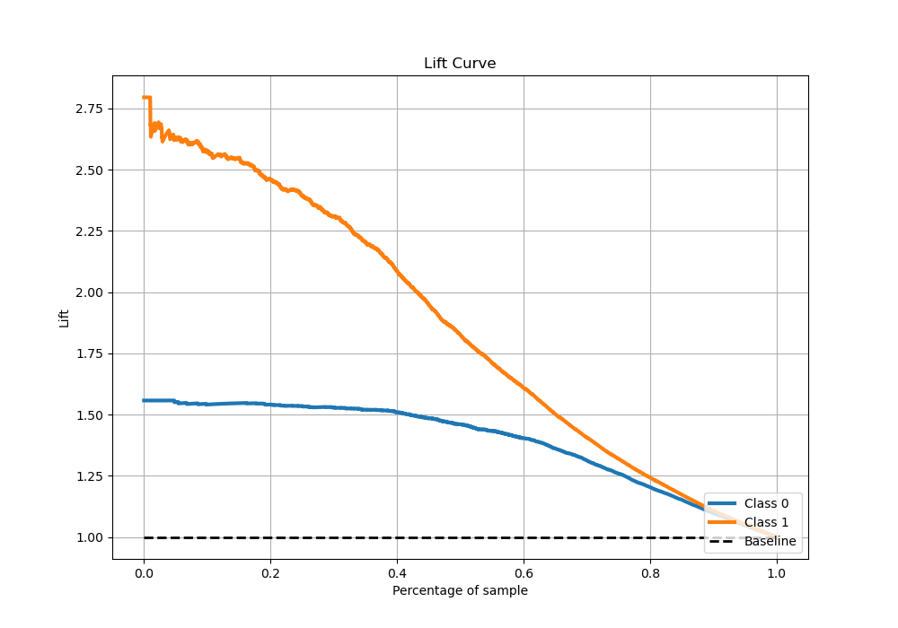

# Summary of 45_Xgboost

[<< Go back](../README.md)

## Extreme Gradient Boosting (Xgboost)
- **n_jobs**: -1
- **objective**: binary:logistic
- **eta**: 0.05
- **max_depth**: 9
- **min_child_weight**: 10
- **subsample**: 0.9
- **colsample_bytree**: 0.6
- **eval_metric**: logloss
- **explain_level**: 0

## Validation
 - **validation_type**: kfold
 - **stratify**: True
 - **k_folds**: 5
 - **shuffle**: True
 - **random_seed**: 42

## Optimized metric
logloss

## Training time

44.3 seconds

## Metric details
|           |    score |     threshold |
|:----------|---------:|--------------:|
| logloss   | 0.357745 | nan           |
| auc       | 0.913096 | nan           |
| f1        | 0.791786 |   0.42692     |
| accuracy  | 0.846268 |   0.450249    |
| precision | 0.96     |   0.9733      |
| recall    | 1        |   0.000502913 |
| mcc       | 0.670398 |   0.42692     |

## Metric details with threshold from accuracy metric
|           |    score |   threshold |
|:----------|---------:|------------:|
| logloss   | 0.357745 |  nan        |
| auc       | 0.913096 |  nan        |
| f1        | 0.789824 |    0.450249 |
| accuracy  | 0.846268 |    0.450249 |
| precision | 0.773062 |    0.450249 |
| recall    | 0.807329 |    0.450249 |
| mcc       | 0.669117 |    0.450249 |

## Confusion matrix (at threshold=0.450249)
|              |   Predicted as 0 |   Predicted as 1 |
|:-------------|-----------------:|-----------------:|
| Labeled as 0 |             2636 |              401 |
| Labeled as 1 |              326 |             1366 |

## Learning curves

## Confusion Matrix

## Normalized Confusion Matrix

## ROC Curve

## Kolmogorov-Smirnov Statistic

## Precision-Recall Curve

## Calibration Curve

## Cumulative Gains Curve

## Lift Curve

[<< Go back](../README.md)
