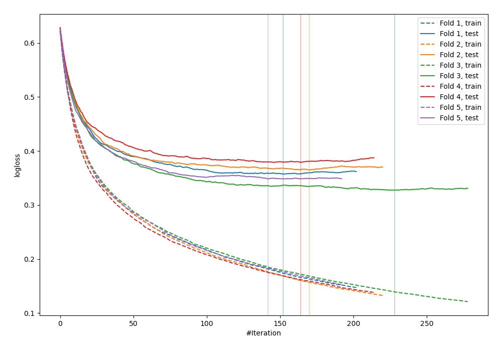
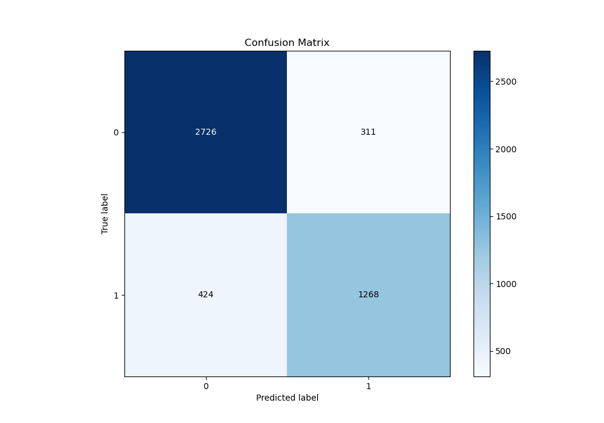
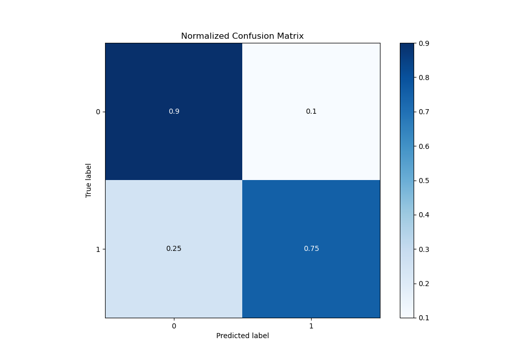
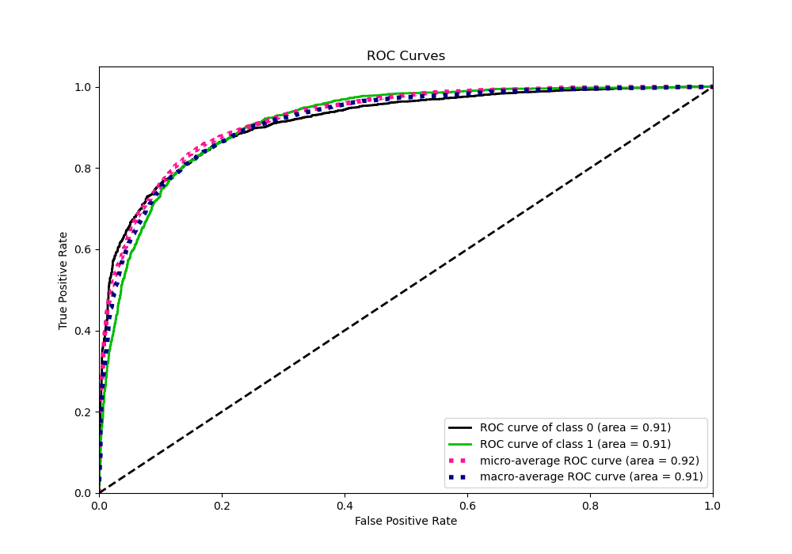
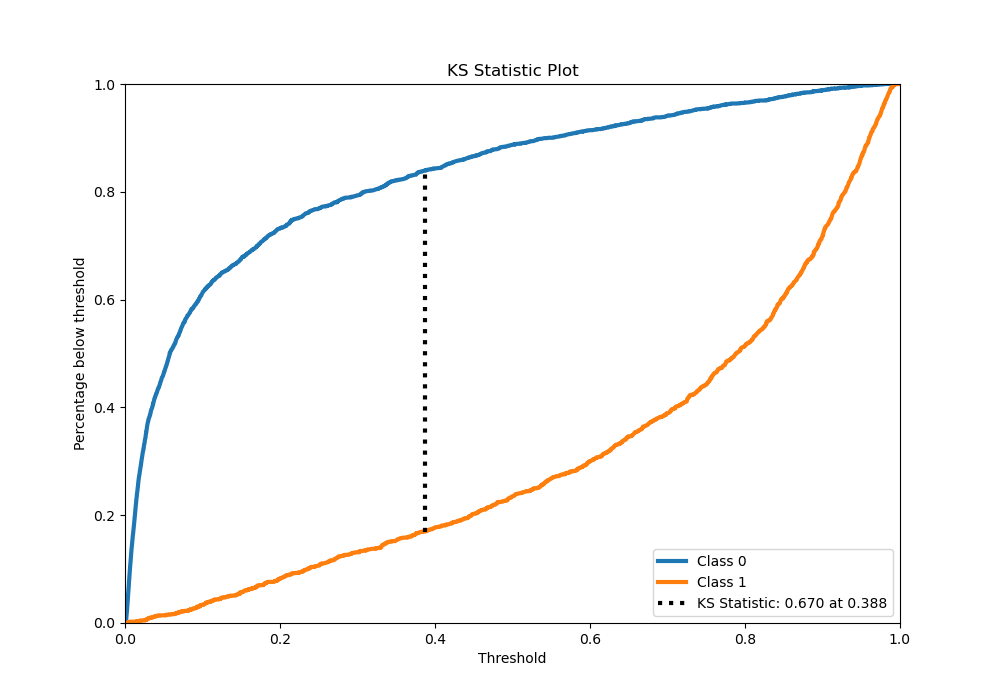
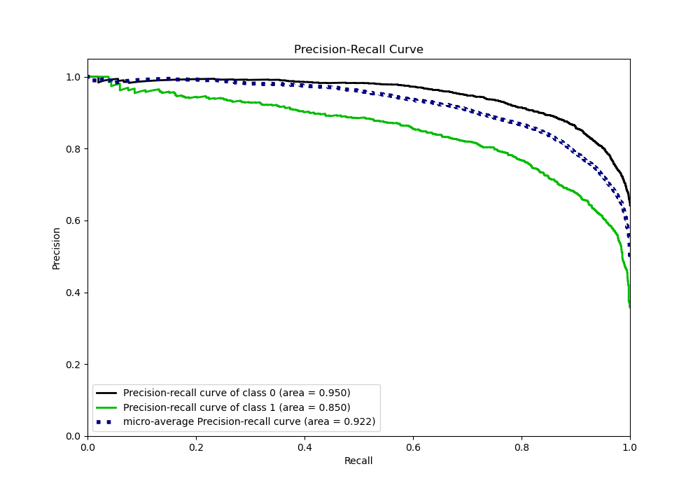
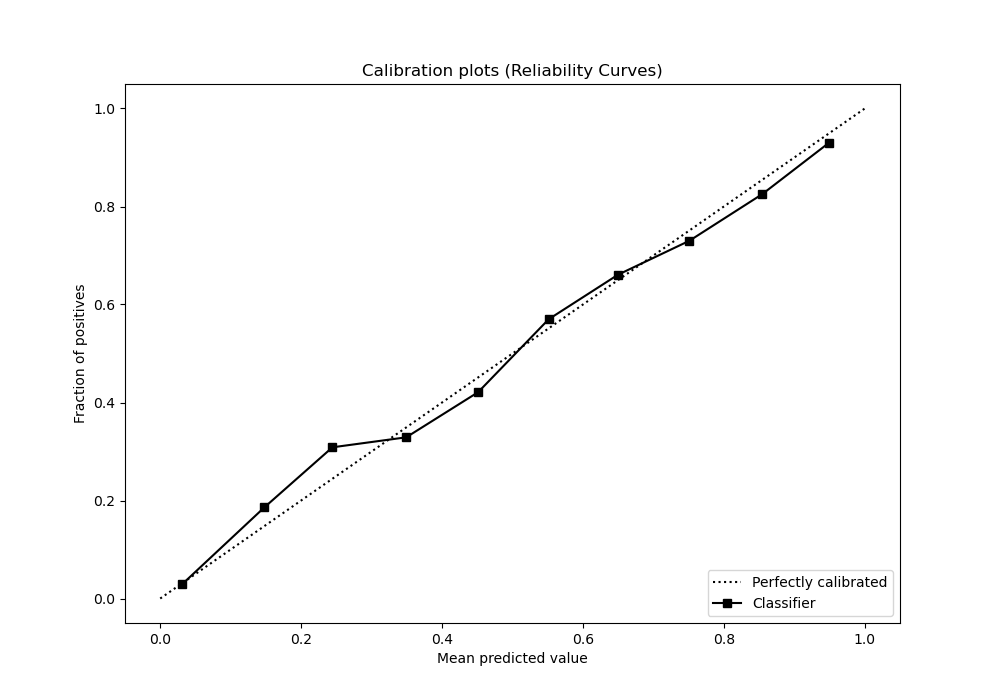
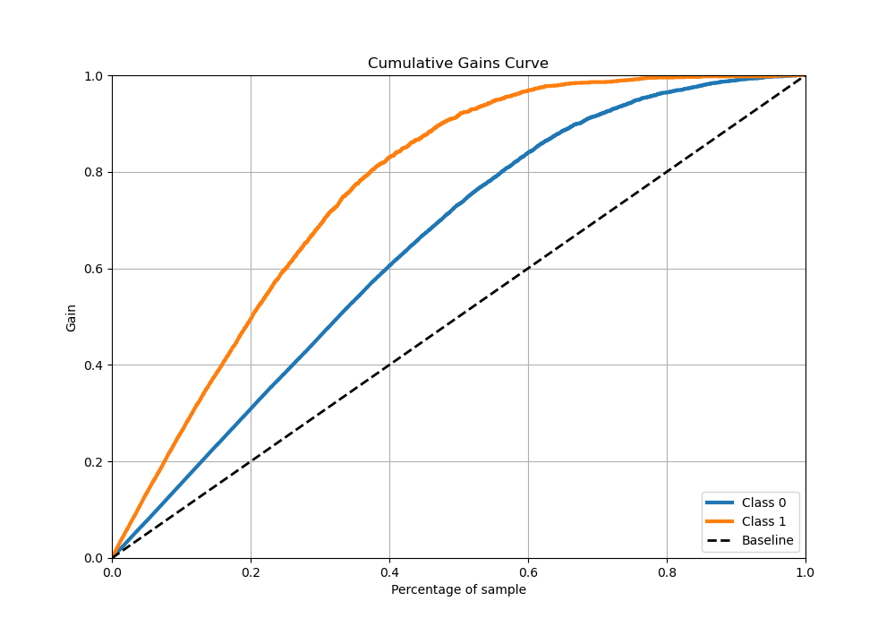
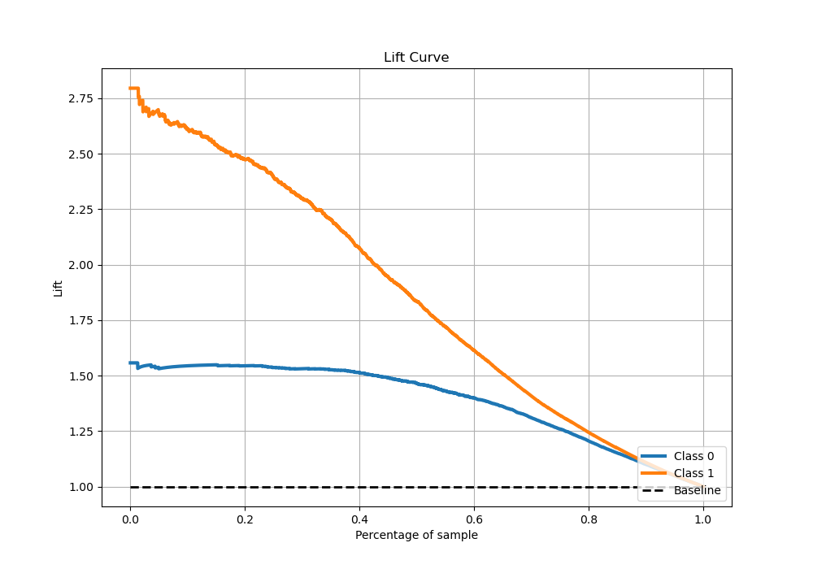

# Summary of 46_Xgboost

[<< Go back](../README.md)

## Extreme Gradient Boosting (Xgboost)
- **n_jobs**: -1
- **objective**: binary:logistic
- **eta**: 0.1
- **max_depth**: 8
- **min_child_weight**: 1
- **subsample**: 0.5
- **colsample_bytree**: 0.5
- **eval_metric**: logloss
- **explain_level**: 0

## Validation
 - **validation_type**: kfold
 - **stratify**: True
 - **k_folds**: 5
 - **shuffle**: True
 - **random_seed**: 42

## Optimized metric
logloss

## Training time

34.6 seconds

## Metric details
|           |    score |    threshold |
|:----------|---------:|-------------:|
| logloss   | 0.355223 | nan          |
| auc       | 0.914517 | nan          |
| f1        | 0.78437  |   0.424692   |
| accuracy  | 0.844576 |   0.533372   |
| precision | 0.986667 |   0.977968   |
| recall    | 1        |   0.00053575 |
| mcc       | 0.660284 |   0.465626   |

## Metric details with threshold from accuracy metric
|           |    score |   threshold |
|:----------|---------:|------------:|
| logloss   | 0.355223 |  nan        |
| auc       | 0.914517 |  nan        |
| f1        | 0.775298 |    0.533372 |
| accuracy  | 0.844576 |    0.533372 |
| precision | 0.80304  |    0.533372 |
| recall    | 0.749409 |    0.533372 |
| mcc       | 0.657634 |    0.533372 |

## Confusion matrix (at threshold=0.533372)
|              |   Predicted as 0 |   Predicted as 1 |
|:-------------|-----------------:|-----------------:|
| Labeled as 0 |             2726 |              311 |
| Labeled as 1 |              424 |             1268 |

## Learning curves

## Confusion Matrix

## Normalized Confusion Matrix

## ROC Curve

## Kolmogorov-Smirnov Statistic

## Precision-Recall Curve

## Calibration Curve

## Cumulative Gains Curve

## Lift Curve

[<< Go back](../README.md)
