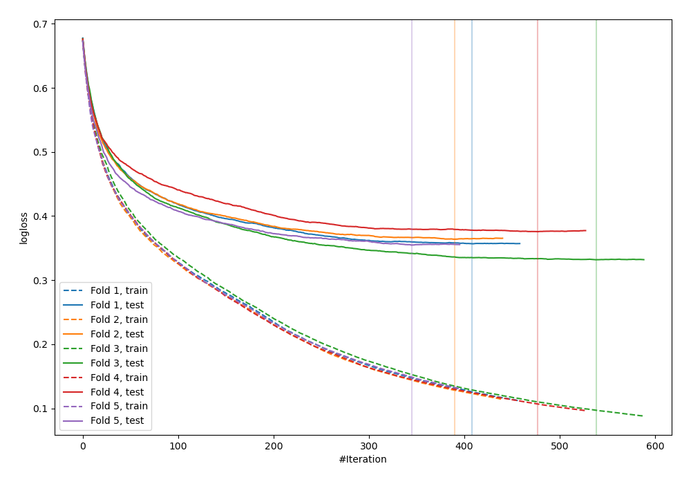
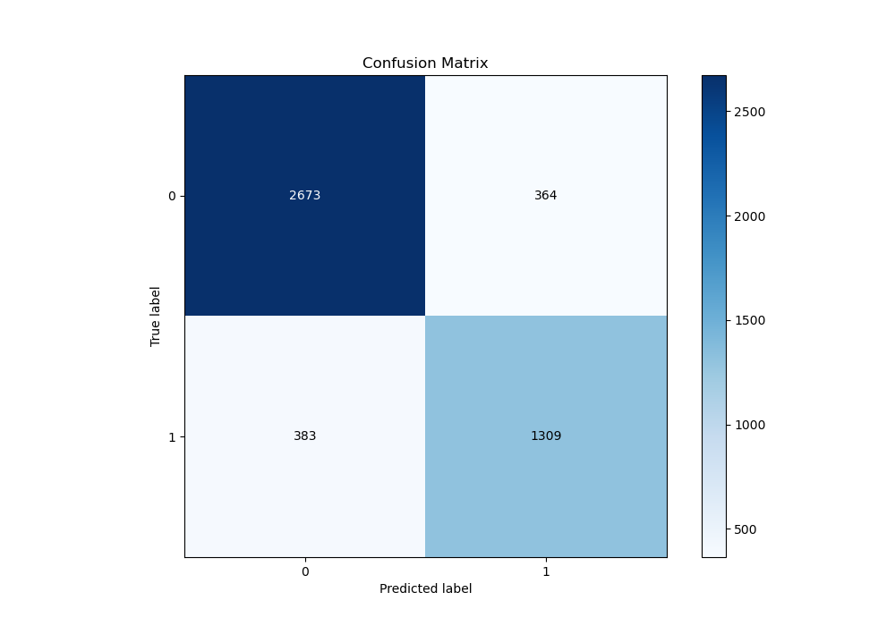
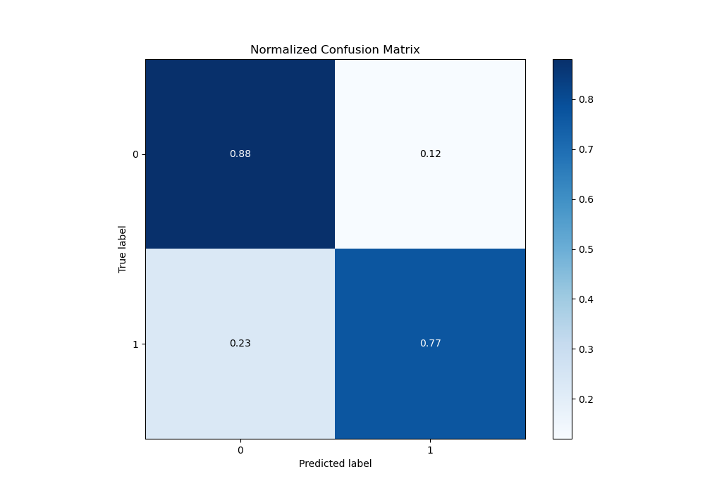
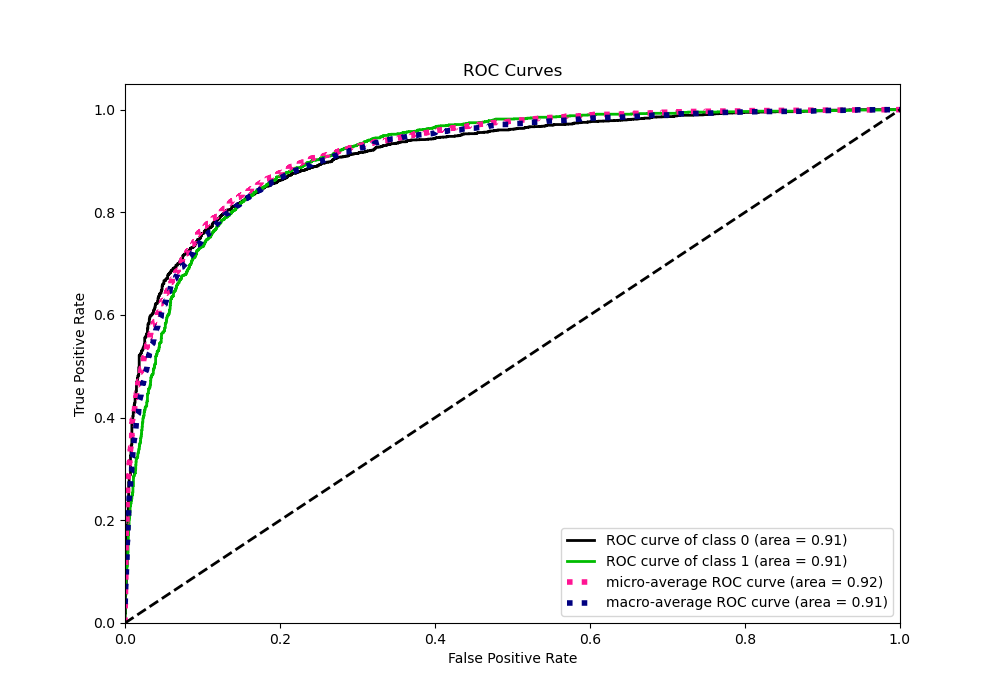
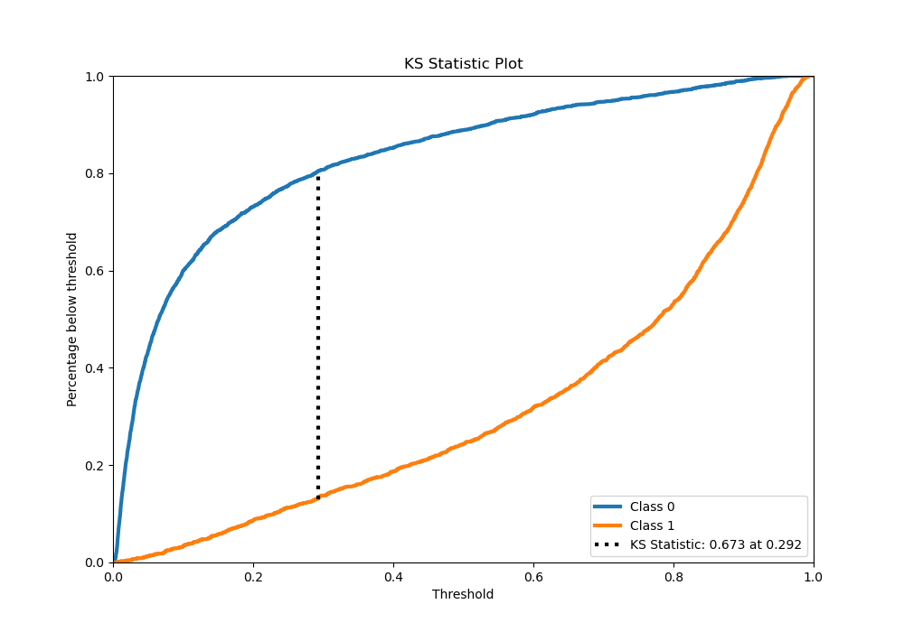
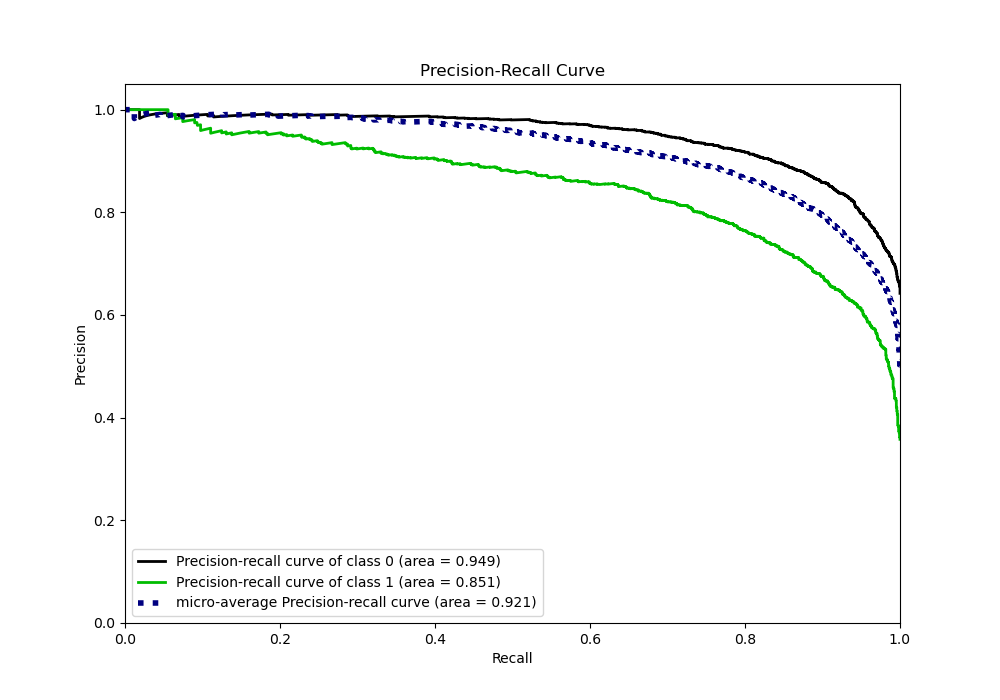
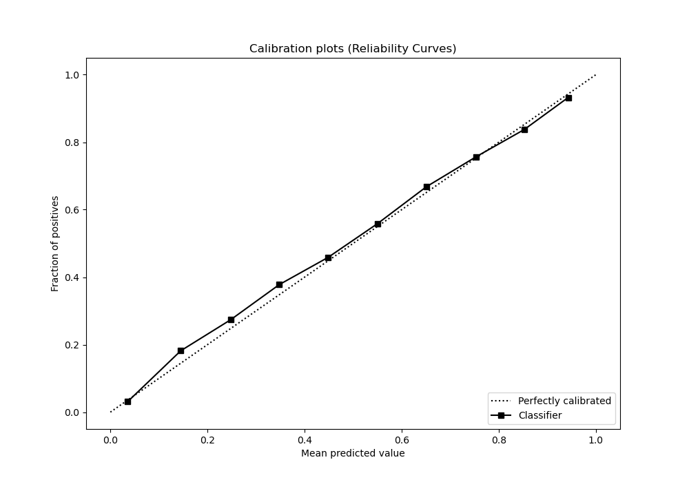
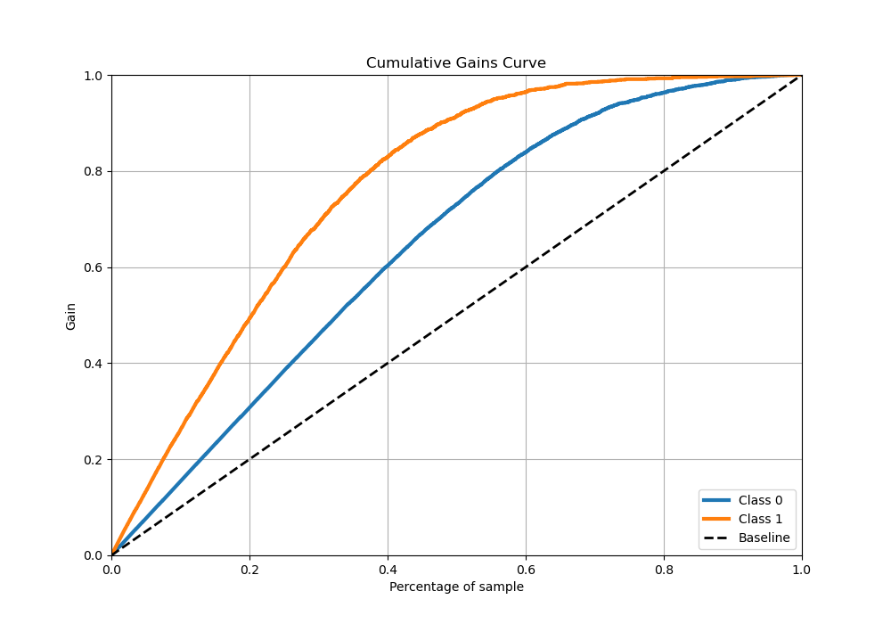
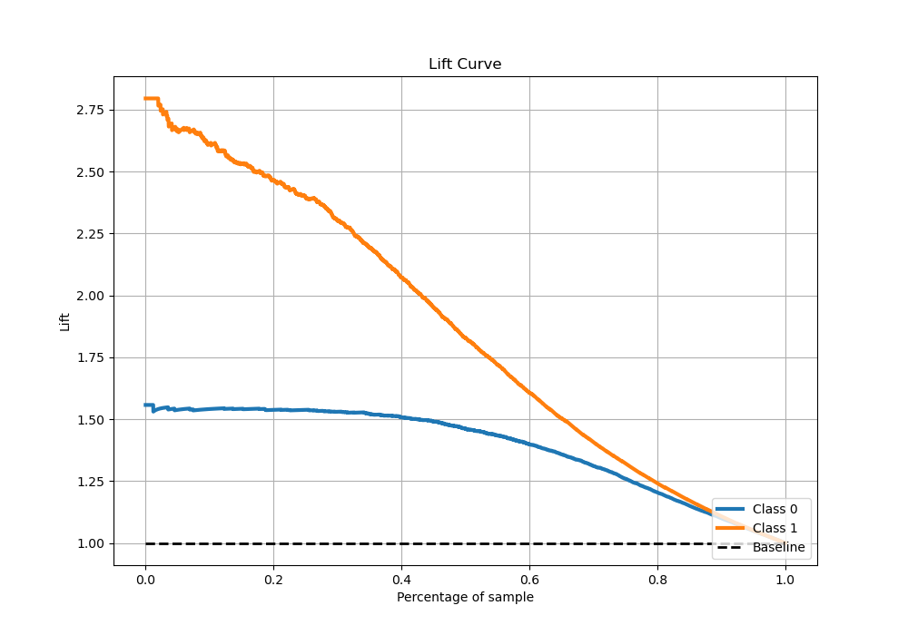

# Summary of 48_CatBoost

[<< Go back](../README.md)

## CatBoost
- **n_jobs**: -1
- **learning_rate**: 0.05
- **depth**: 9
- **rsm**: 0.9
- **loss_function**: Logloss
- **eval_metric**: Logloss
- **explain_level**: 0

## Validation
 - **validation_type**: kfold
 - **stratify**: True
 - **k_folds**: 5
 - **shuffle**: True
 - **random_seed**: 42

## Optimized metric
logloss

## Training time

187.5 seconds

## Metric details
|           |    score |    threshold |
|:----------|---------:|-------------:|
| logloss   | 0.356548 | nan          |
| auc       | 0.91367  | nan          |
| f1        | 0.785252 |   0.38293    |
| accuracy  | 0.842038 |   0.473541   |
| precision | 1        |   0.967354   |
| recall    | 1        |   0.00120954 |
| mcc       | 0.658415 |   0.38293    |

## Metric details with threshold from accuracy metric
|           |    score |   threshold |
|:----------|---------:|------------:|
| logloss   | 0.356548 |  nan        |
| auc       | 0.91367  |  nan        |
| f1        | 0.778009 |    0.473541 |
| accuracy  | 0.842038 |    0.473541 |
| precision | 0.782427 |    0.473541 |
| recall    | 0.773641 |    0.473541 |
| mcc       | 0.65544  |    0.473541 |

## Confusion matrix (at threshold=0.473541)
|              |   Predicted as 0 |   Predicted as 1 |
|:-------------|-----------------:|-----------------:|
| Labeled as 0 |             2673 |              364 |
| Labeled as 1 |              383 |             1309 |

## Learning curves

## Confusion Matrix

## Normalized Confusion Matrix

## ROC Curve

## Kolmogorov-Smirnov Statistic

## Precision-Recall Curve

## Calibration Curve

## Cumulative Gains Curve

## Lift Curve

[<< Go back](../README.md)
