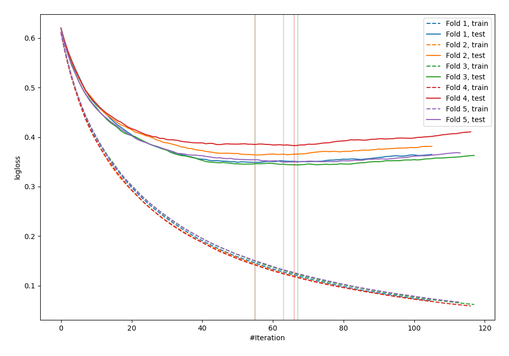
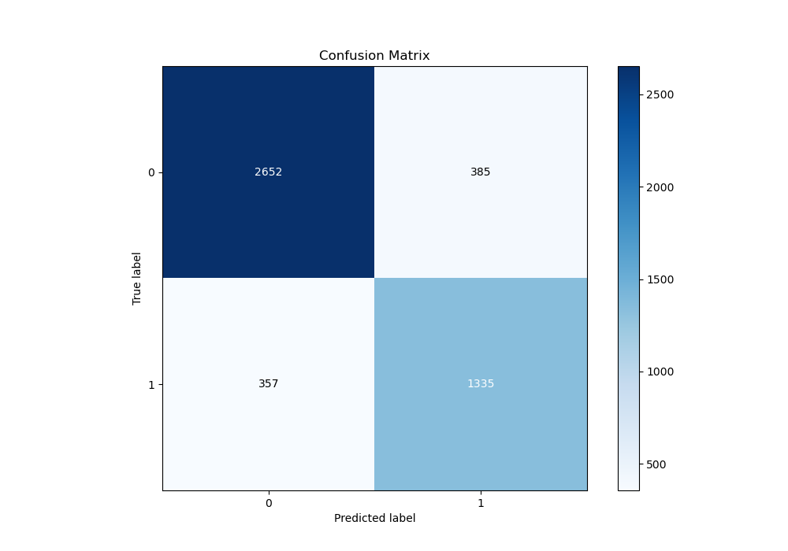
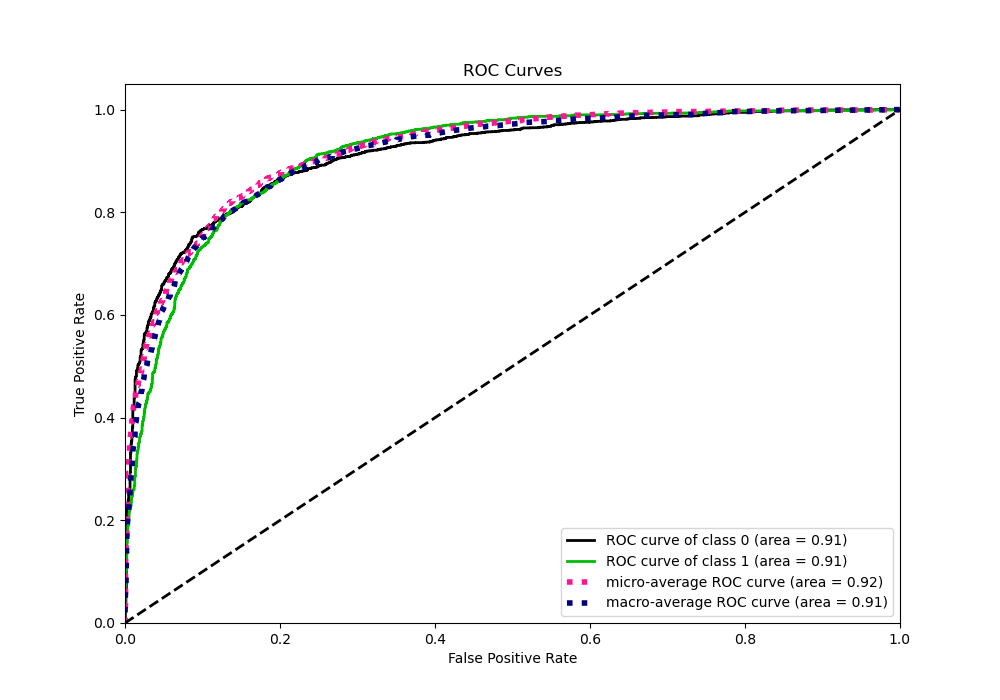
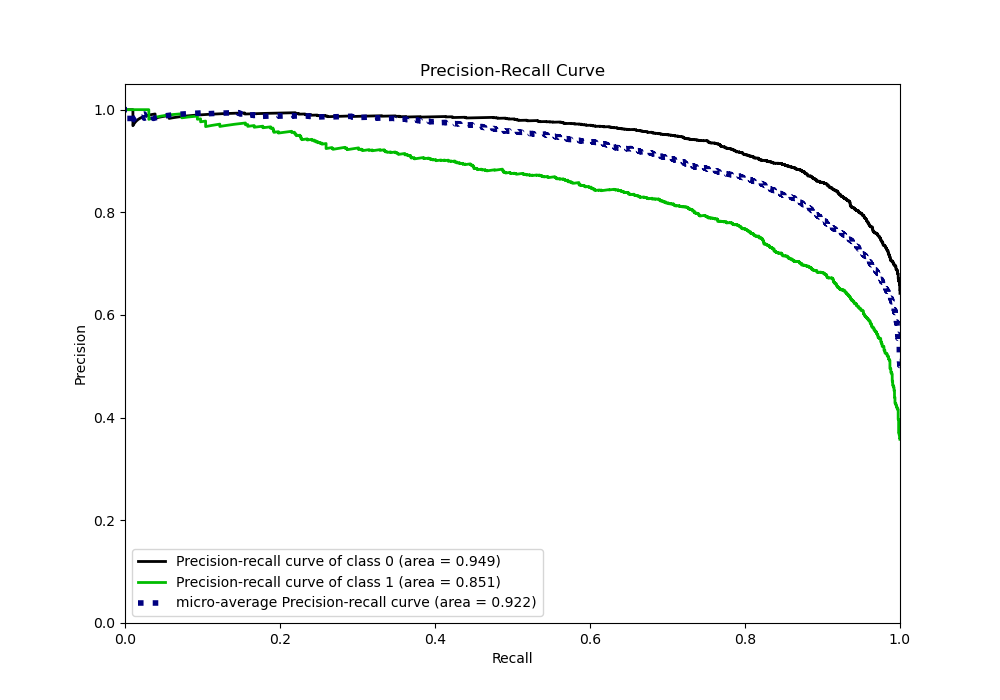
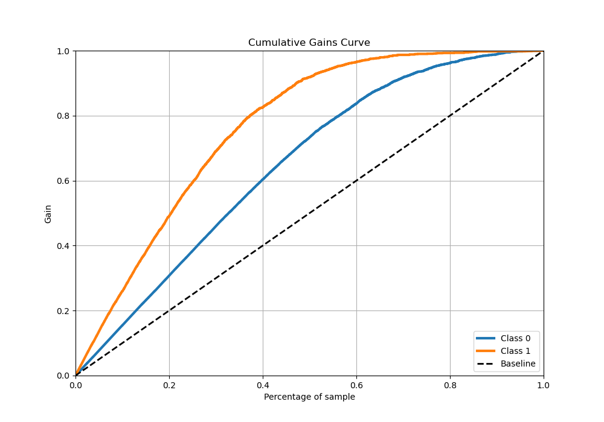
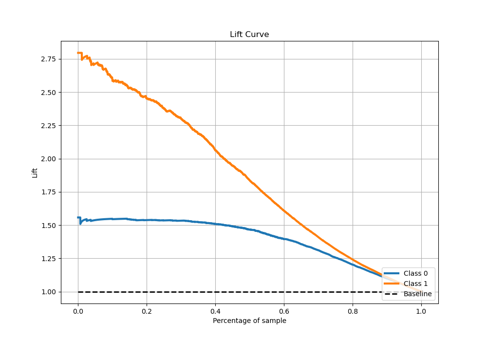

# Summary of 49_LightGBM

[<< Go back](../README.md)

## LightGBM
- **n_jobs**: -1
- **objective**: binary
- **num_leaves**: 63
- **learning_rate**: 0.1
- **feature_fraction**: 0.8
- **bagging_fraction**: 0.5
- **min_data_in_leaf**: 15
- **metric**: binary_logloss
- **custom_eval_metric_name**: None
- **explain_level**: 0

## Validation
 - **validation_type**: kfold
 - **stratify**: True
 - **k_folds**: 5
 - **shuffle**: True
 - **random_seed**: 42

## Optimized metric
logloss

## Training time

25.5 seconds

## Metric details
|           |    score |   threshold |
|:----------|---------:|------------:|
| logloss   | 0.357755 | nan         |
| auc       | 0.913426 | nan         |
| f1        | 0.783563 |   0.384329  |
| accuracy  | 0.843096 |   0.447205  |
| precision | 0.991803 |   0.965307  |
| recall    | 1        |   0.0013078 |
| mcc       | 0.659874 |   0.447205  |

## Metric details with threshold from accuracy metric
|           |    score |   threshold |
|:----------|---------:|------------:|
| logloss   | 0.357755 |  nan        |
| auc       | 0.913426 |  nan        |
| f1        | 0.782532 |    0.447205 |
| accuracy  | 0.843096 |    0.447205 |
| precision | 0.776163 |    0.447205 |
| recall    | 0.789007 |    0.447205 |
| mcc       | 0.659874 |    0.447205 |

## Confusion matrix (at threshold=0.447205)
|              |   Predicted as 0 |   Predicted as 1 |
|:-------------|-----------------:|-----------------:|
| Labeled as 0 |             2652 |              385 |
| Labeled as 1 |              357 |             1335 |

## Learning curves

## Confusion Matrix

## Normalized Confusion Matrix

## ROC Curve

## Kolmogorov-Smirnov Statistic

## Precision-Recall Curve

## Calibration Curve

## Cumulative Gains Curve

## Lift Curve

[<< Go back](../README.md)
