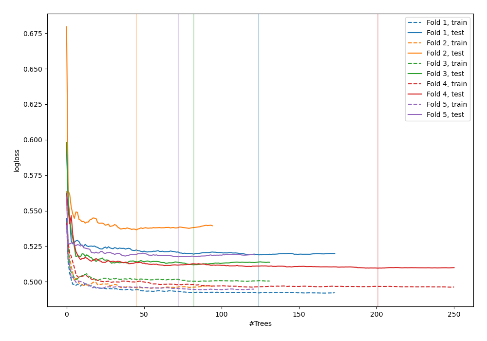
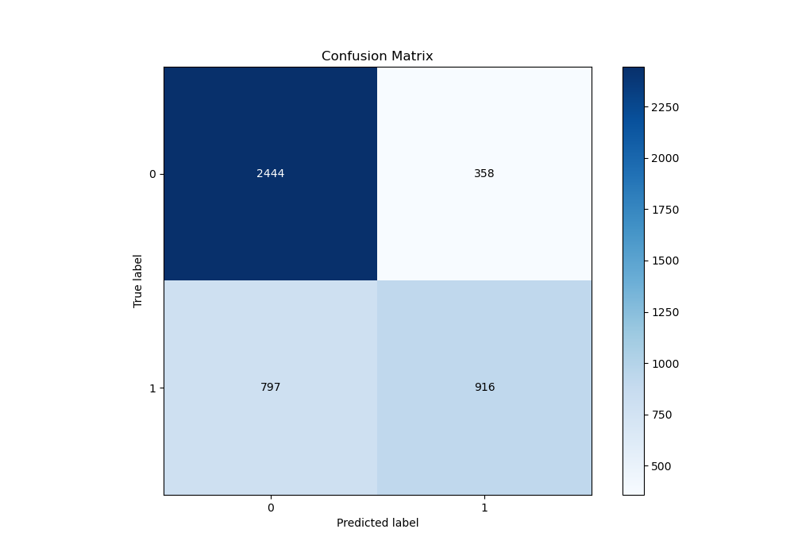
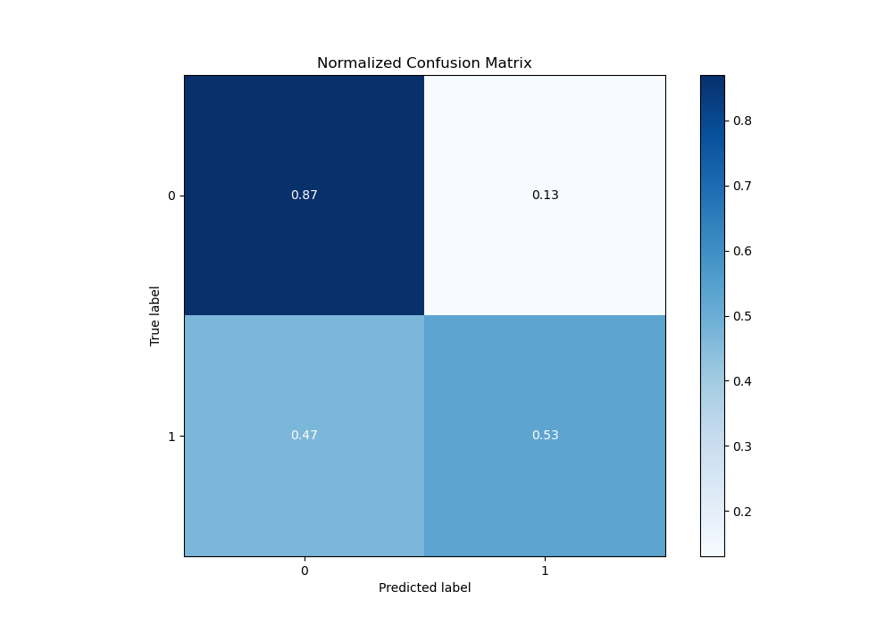
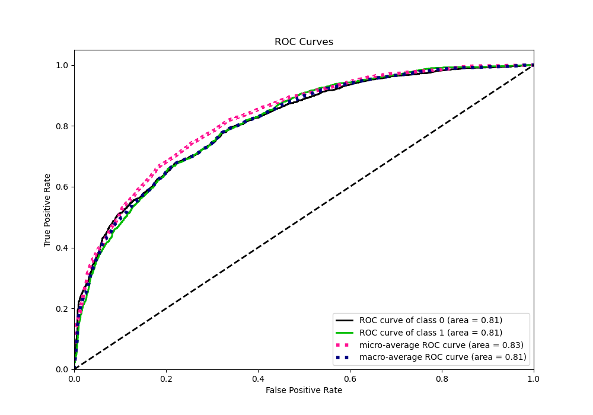
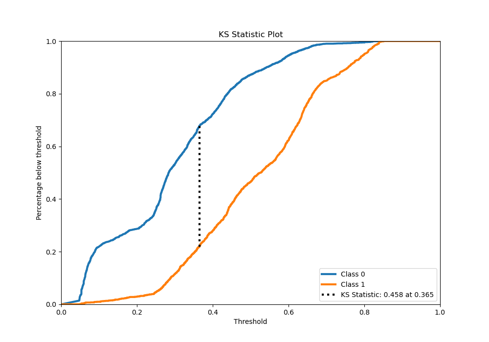
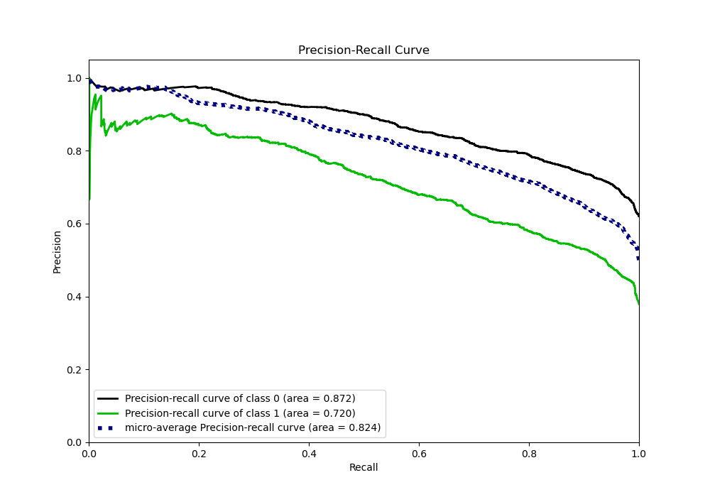
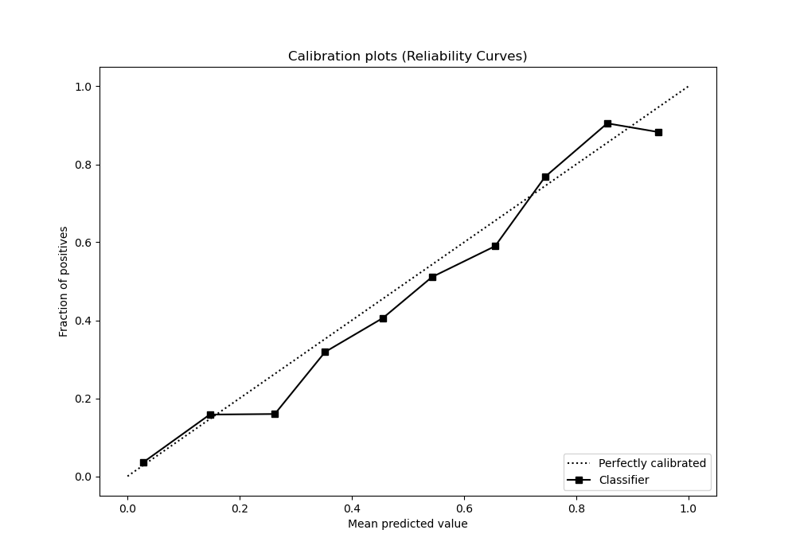
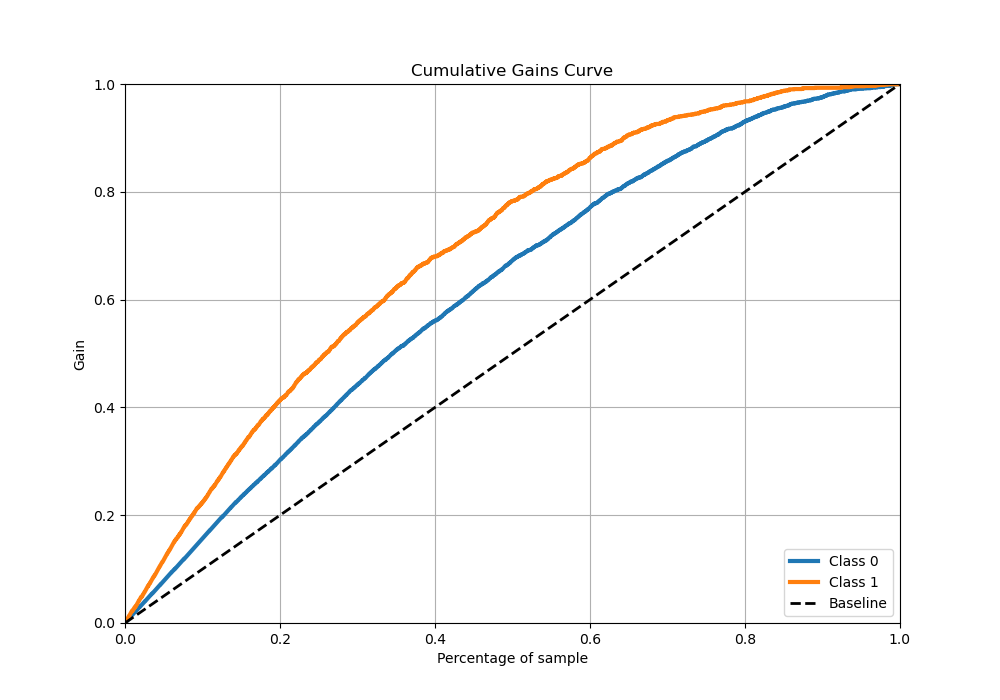
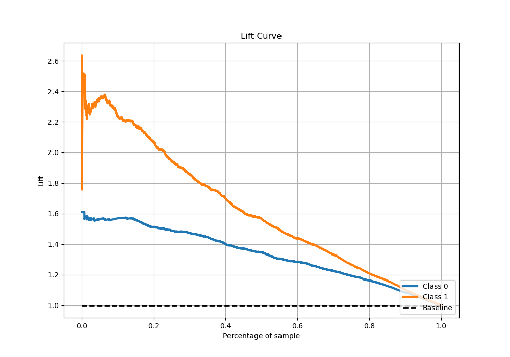

# Summary of 4_Default_RandomForest

[<< Go back](../README.md)

## Random Forest
- **n_jobs**: -1
- **criterion**: gini
- **max_features**: 0.9
- **min_samples_split**: 30
- **max_depth**: 4
- **eval_metric_name**: logloss
- **explain_level**: 0

## Validation
 - **validation_type**: kfold
 - **stratify**: True
 - **k_folds**: 5
 - **shuffle**: True
 - **random_seed**: 42

## Optimized metric
logloss

## Training time

50.1 seconds

## Metric details
|           |    score |   threshold |
|:----------|---------:|------------:|
| logloss   | 0.518871 | nan         |
| auc       | 0.810651 | nan         |
| f1        | 0.674881 |   0.362259  |
| accuracy  | 0.744186 |   0.5003    |
| precision | 0.901408 |   0.701831  |
| recall    | 1        |   0.0427518 |
| mcc       | 0.452755 |   0.432921  |

## Metric details with threshold from accuracy metric
|           |    score |   threshold |
|:----------|---------:|------------:|
| logloss   | 0.518871 |    nan      |
| auc       | 0.810651 |    nan      |
| f1        | 0.613324 |      0.5003 |
| accuracy  | 0.744186 |      0.5003 |
| precision | 0.718995 |      0.5003 |
| recall    | 0.534734 |      0.5003 |
| mcc       | 0.438783 |      0.5003 |

## Confusion matrix (at threshold=0.5003)
|              |   Predicted as 0 |   Predicted as 1 |
|:-------------|-----------------:|-----------------:|
| Labeled as 0 |             2444 |              358 |
| Labeled as 1 |              797 |              916 |

## Learning curves

## Confusion Matrix

## Normalized Confusion Matrix

## ROC Curve

## Kolmogorov-Smirnov Statistic

## Precision-Recall Curve

## Calibration Curve

## Cumulative Gains Curve

## Lift Curve

[<< Go back](../README.md)
