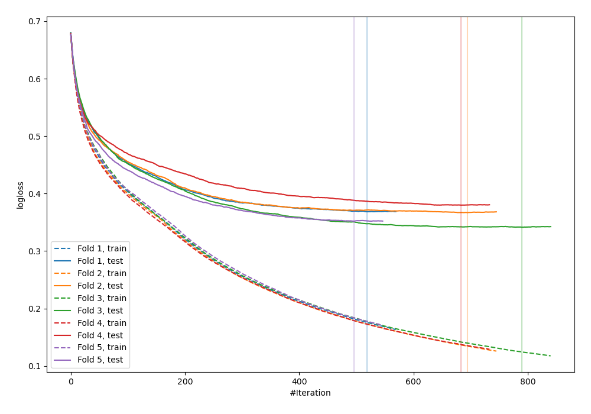
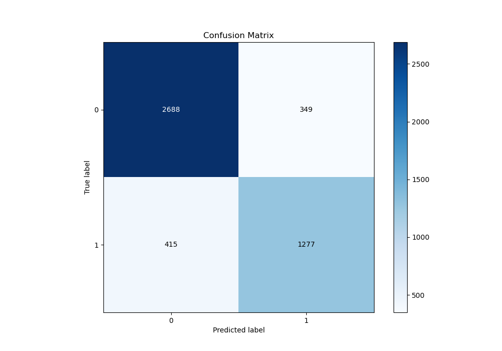
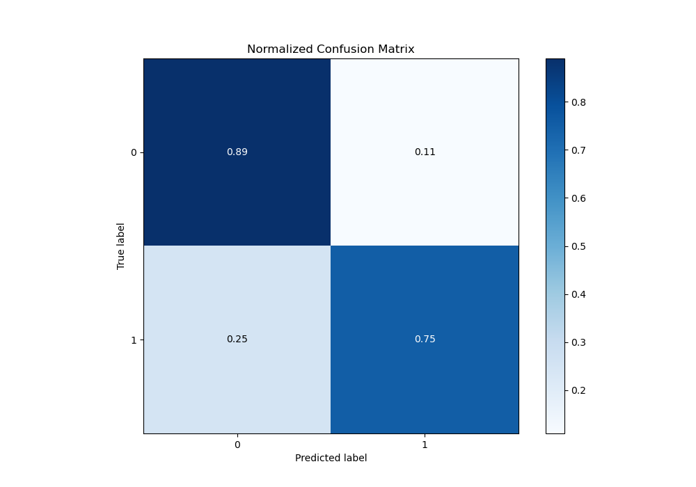
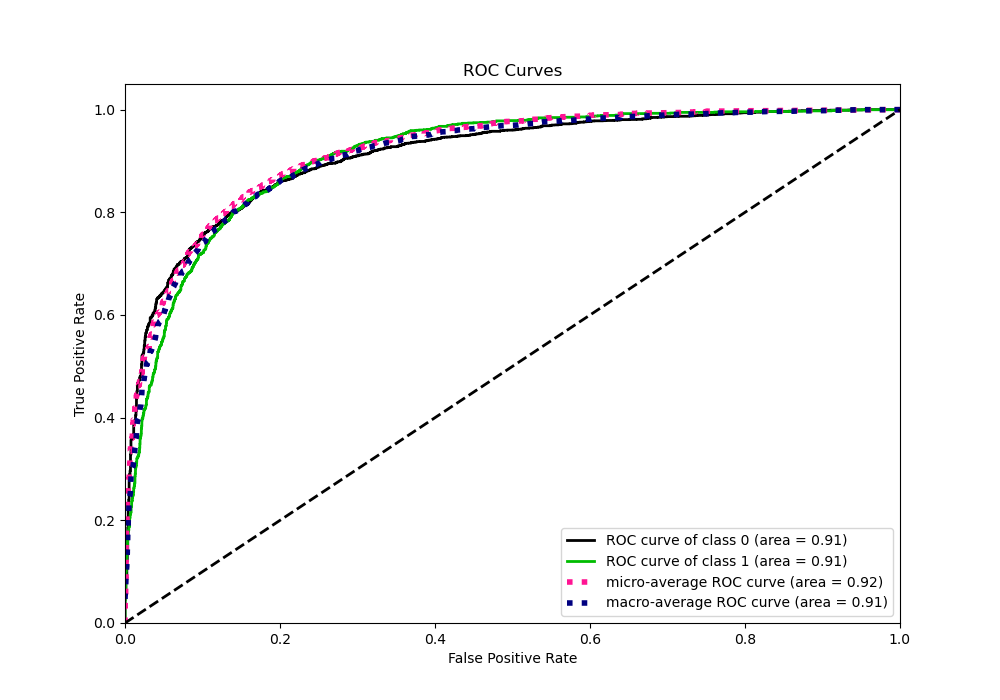
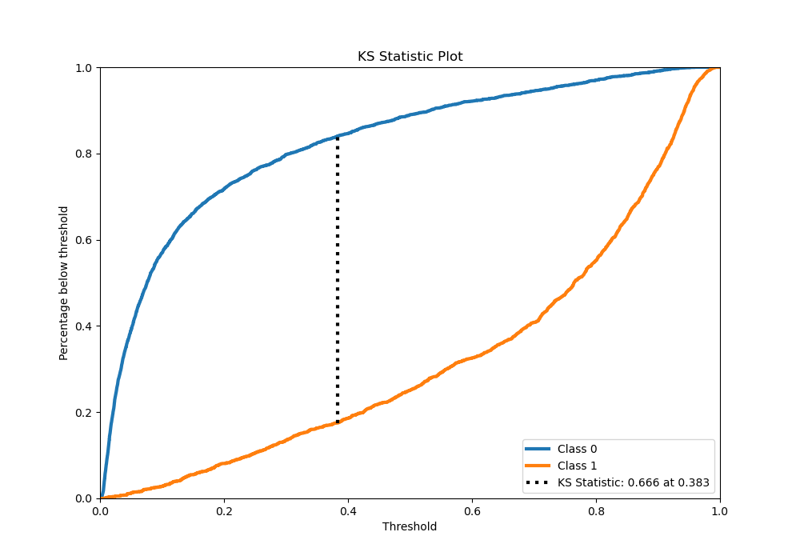
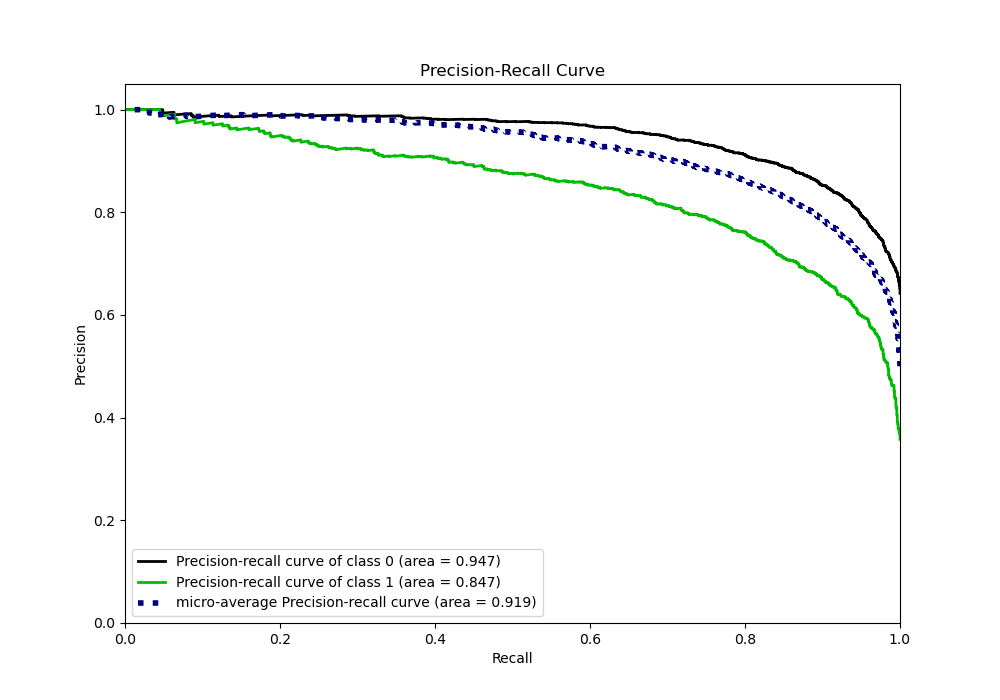
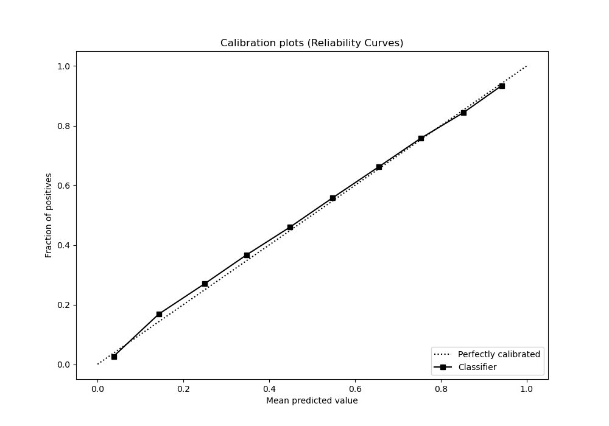
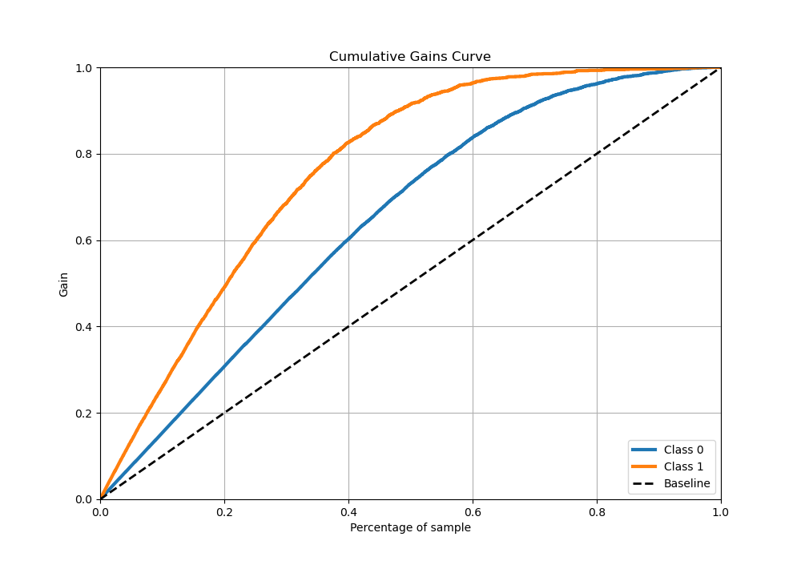
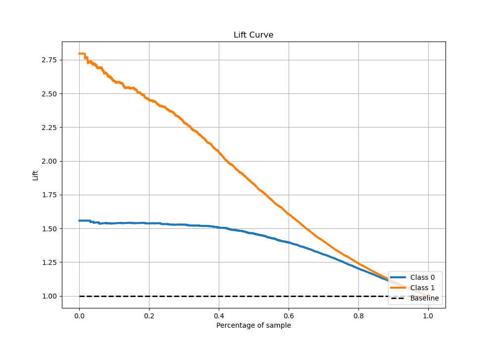

# Summary of 52_CatBoost

[<< Go back](../README.md)

## CatBoost
- **n_jobs**: -1
- **learning_rate**: 0.05
- **depth**: 6
- **rsm**: 1.0
- **loss_function**: Logloss
- **eval_metric**: Logloss
- **explain_level**: 0

## Validation
 - **validation_type**: kfold
 - **stratify**: True
 - **k_folds**: 5
 - **shuffle**: True
 - **random_seed**: 42

## Optimized metric
logloss

## Training time

58.1 seconds

## Metric details
|           |    score |    threshold |
|:----------|---------:|-------------:|
| logloss   | 0.361659 | nan          |
| auc       | 0.910834 | nan          |
| f1        | 0.779623 |   0.391043   |
| accuracy  | 0.838444 |   0.491755   |
| precision | 1        |   0.959571   |
| recall    | 1        |   0.00133884 |
| mcc       | 0.651792 |   0.427903   |

## Metric details with threshold from accuracy metric
|           |    score |   threshold |
|:----------|---------:|------------:|
| logloss   | 0.361659 |  nan        |
| auc       | 0.910834 |  nan        |
| f1        | 0.769741 |    0.491755 |
| accuracy  | 0.838444 |    0.491755 |
| precision | 0.785363 |    0.491755 |
| recall    | 0.754728 |    0.491755 |
| mcc       | 0.64569  |    0.491755 |

## Confusion matrix (at threshold=0.491755)
|              |   Predicted as 0 |   Predicted as 1 |
|:-------------|-----------------:|-----------------:|
| Labeled as 0 |             2688 |              349 |
| Labeled as 1 |              415 |             1277 |

## Learning curves

## Confusion Matrix

## Normalized Confusion Matrix

## ROC Curve

## Kolmogorov-Smirnov Statistic

## Precision-Recall Curve

## Calibration Curve

## Cumulative Gains Curve

## Lift Curve

[<< Go back](../README.md)
