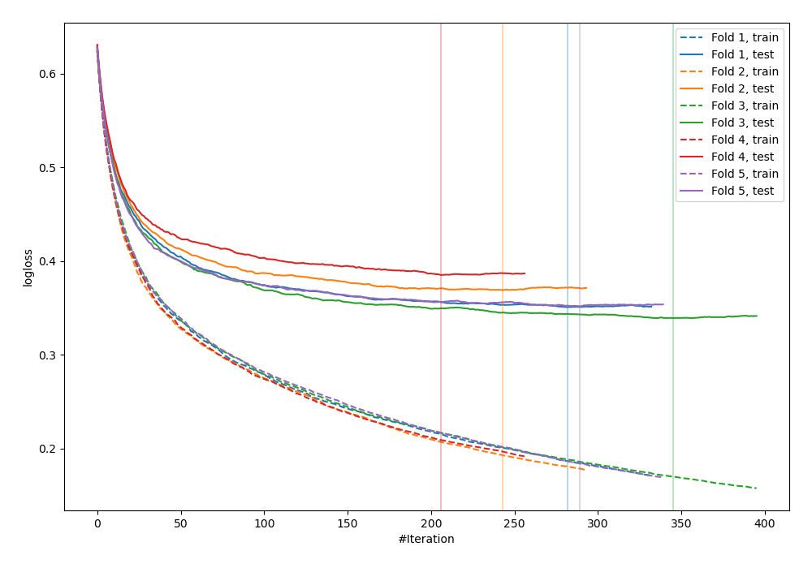
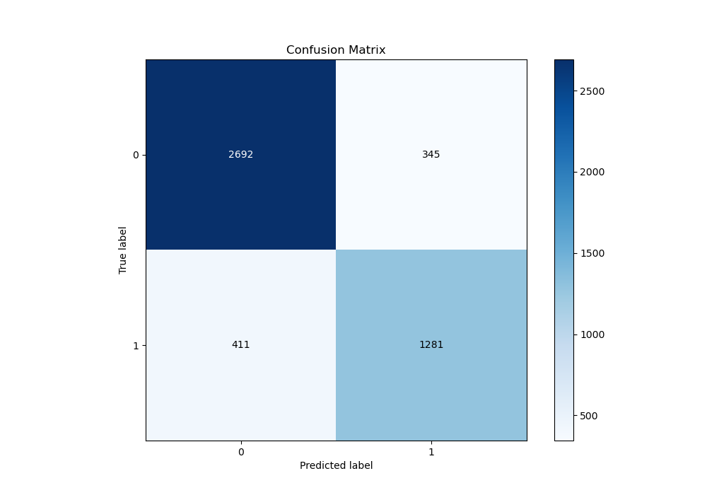
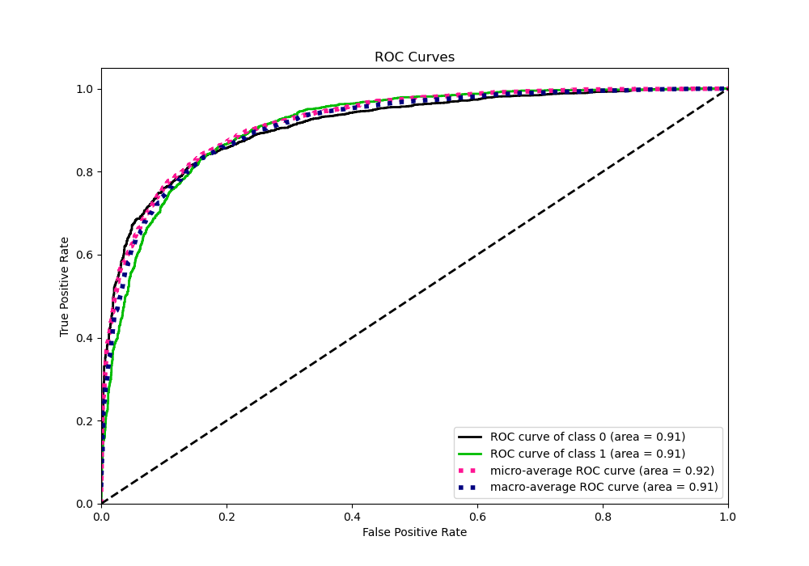
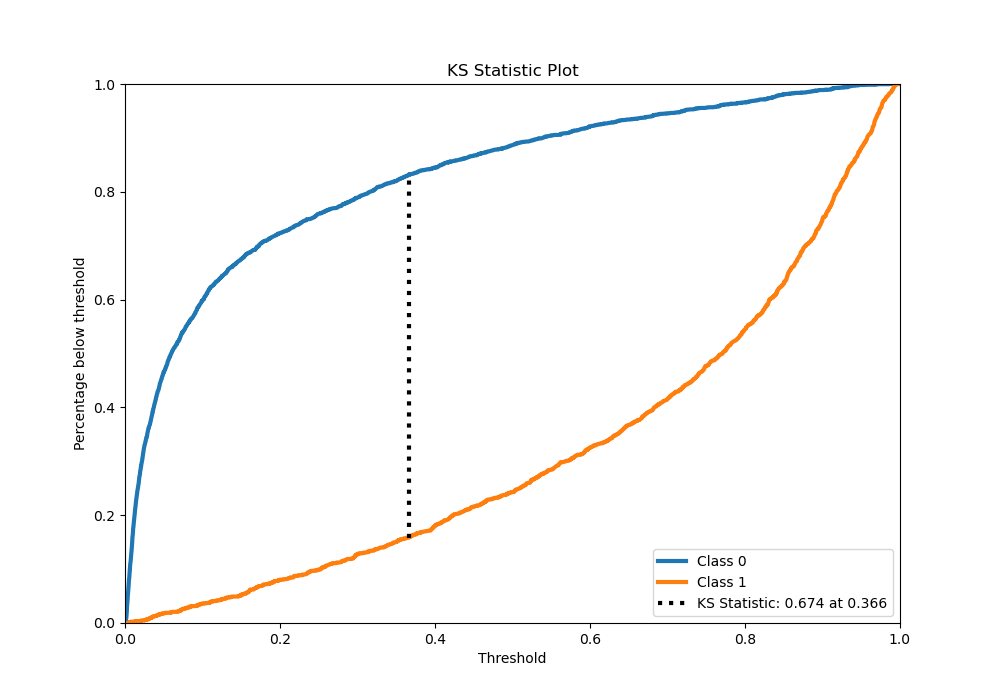
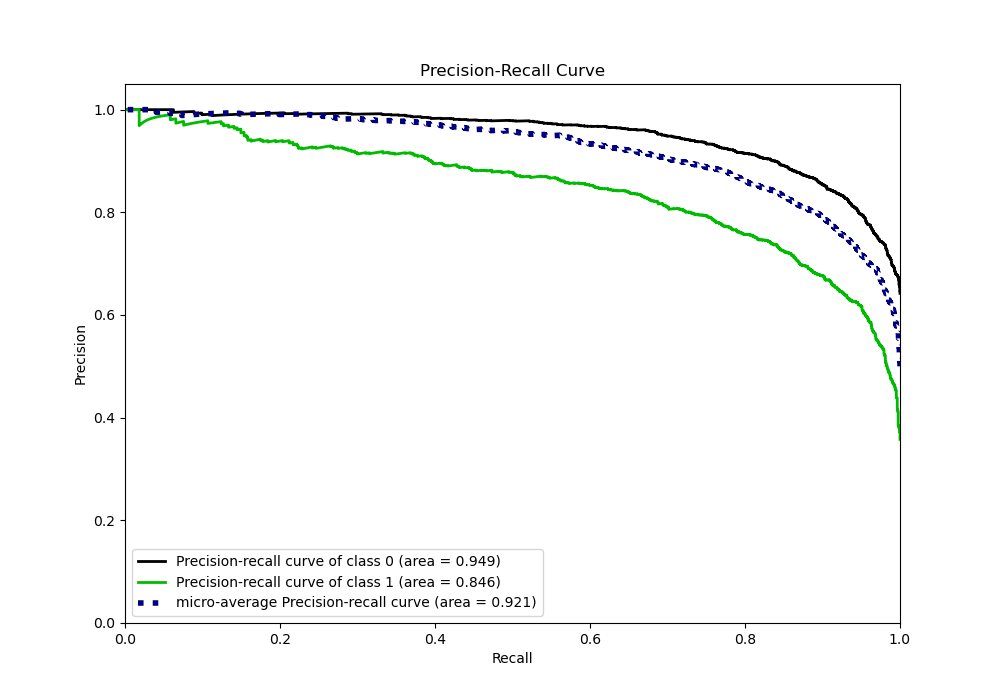
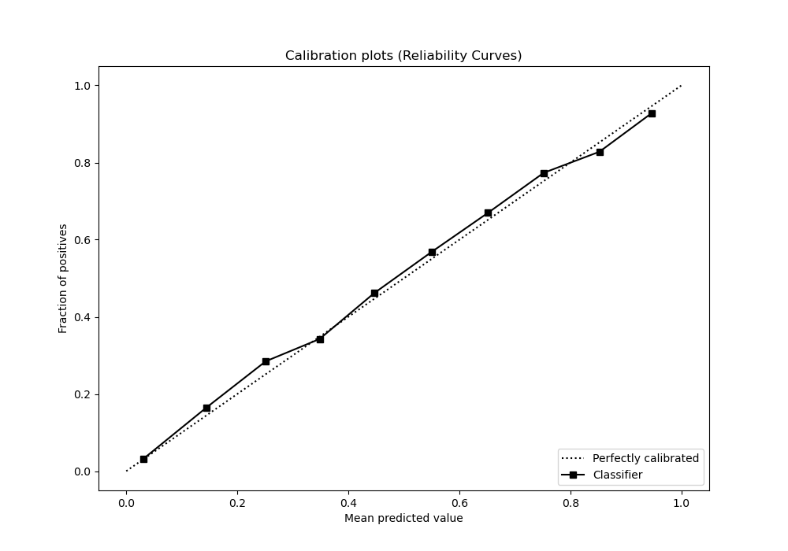
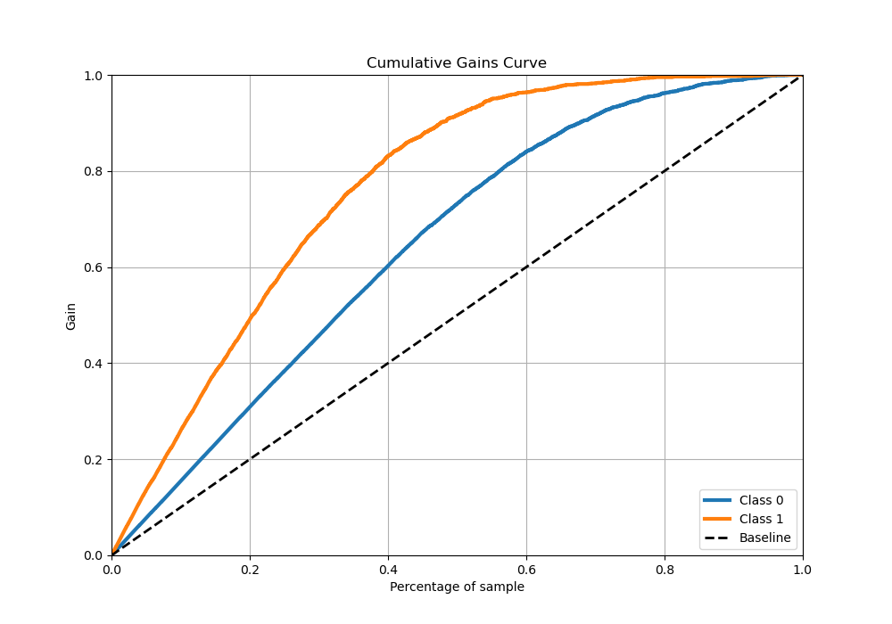
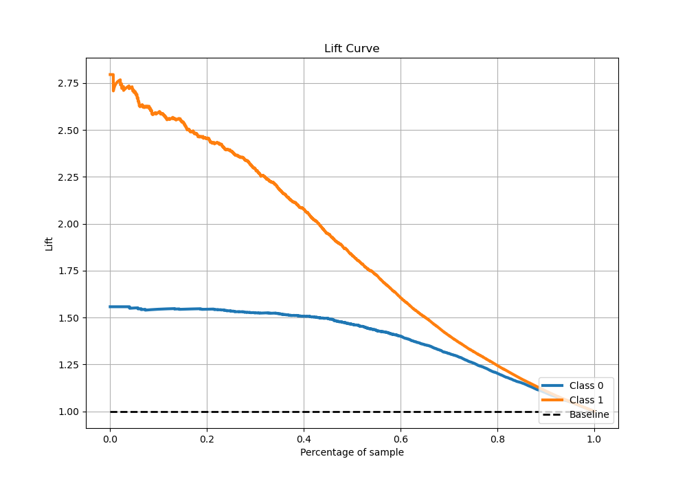

# Summary of 53_Xgboost

[<< Go back](../README.md)

## Extreme Gradient Boosting (Xgboost)
- **n_jobs**: -1
- **objective**: binary:logistic
- **eta**: 0.1
- **max_depth**: 7
- **min_child_weight**: 5
- **subsample**: 0.9
- **colsample_bytree**: 0.5
- **eval_metric**: logloss
- **explain_level**: 0

## Validation
 - **validation_type**: kfold
 - **stratify**: True
 - **k_folds**: 5
 - **shuffle**: True
 - **random_seed**: 42

## Optimized metric
logloss

## Training time

30.8 seconds

## Metric details
|           |    score |     threshold |
|:----------|---------:|--------------:|
| logloss   | 0.358999 | nan           |
| auc       | 0.912144 | nan           |
| f1        | 0.783889 |   0.37705     |
| accuracy  | 0.840135 |   0.499742    |
| precision | 0.986667 |   0.975824    |
| recall    | 1        |   0.000197341 |
| mcc       | 0.654916 |   0.37705     |

## Metric details with threshold from accuracy metric
|           |    score |   threshold |
|:----------|---------:|------------:|
| logloss   | 0.358999 |  nan        |
| auc       | 0.912144 |  nan        |
| f1        | 0.772152 |    0.499742 |
| accuracy  | 0.840135 |    0.499742 |
| precision | 0.787823 |    0.499742 |
| recall    | 0.757092 |    0.499742 |
| mcc       | 0.649405 |    0.499742 |

## Confusion matrix (at threshold=0.499742)
|              |   Predicted as 0 |   Predicted as 1 |
|:-------------|-----------------:|-----------------:|
| Labeled as 0 |             2692 |              345 |
| Labeled as 1 |              411 |             1281 |

## Learning curves

## Confusion Matrix

## Normalized Confusion Matrix

## ROC Curve

## Kolmogorov-Smirnov Statistic

## Precision-Recall Curve

## Calibration Curve

## Cumulative Gains Curve

## Lift Curve

[<< Go back](../README.md)
