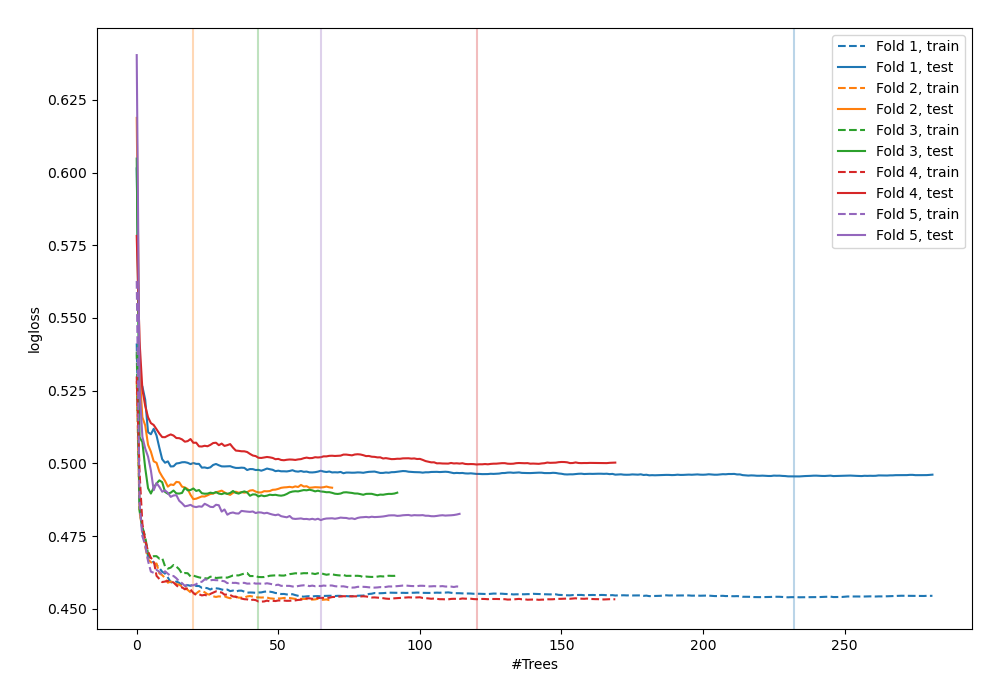
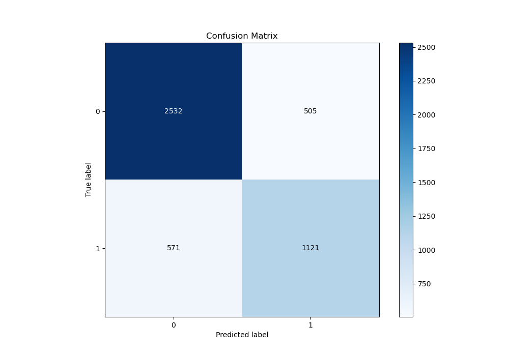
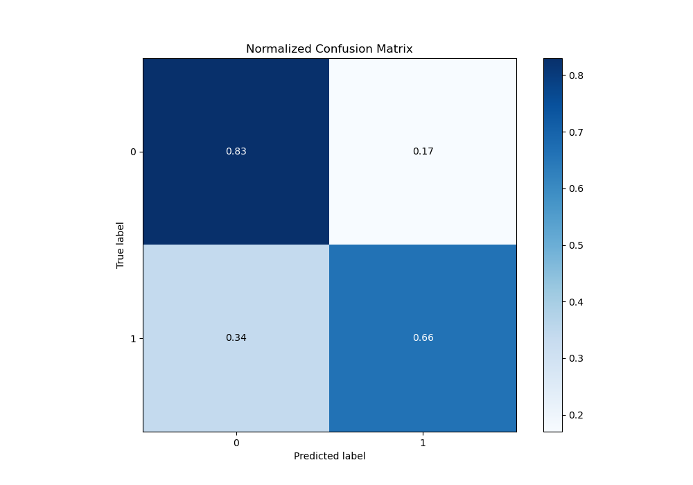
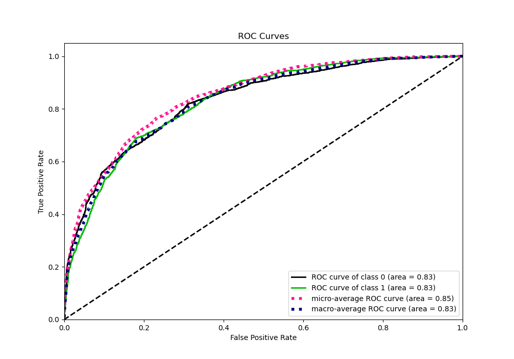
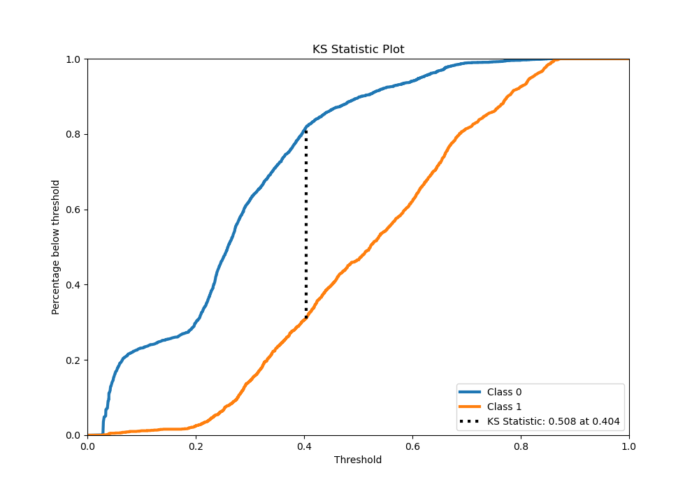
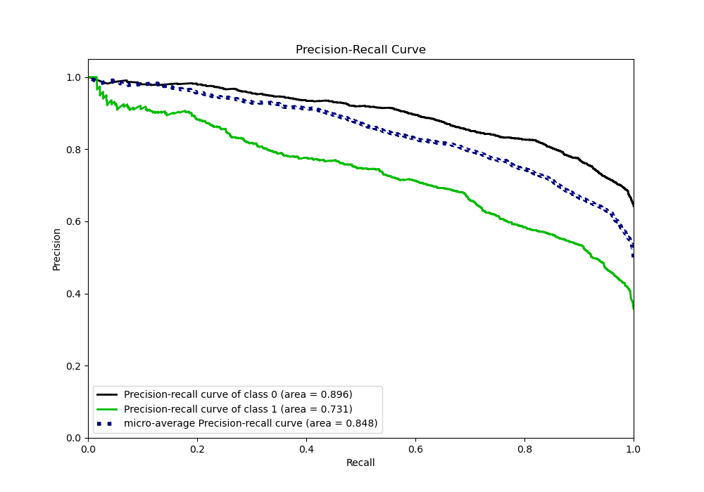
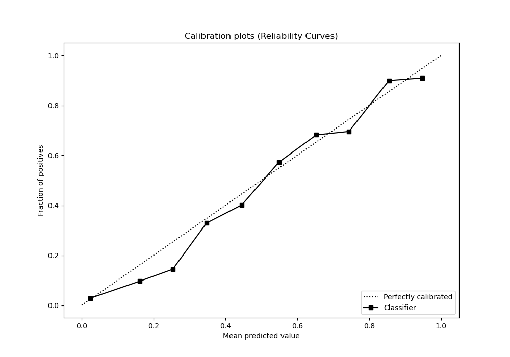
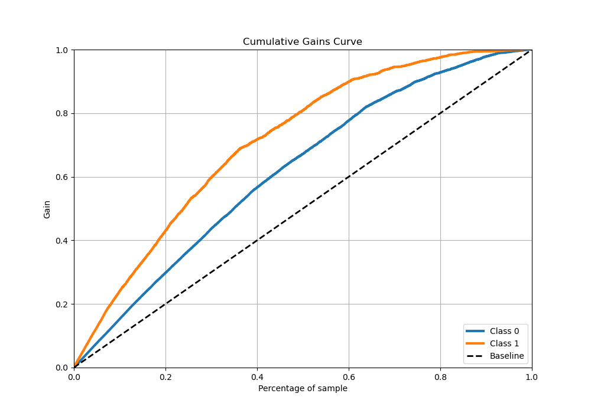
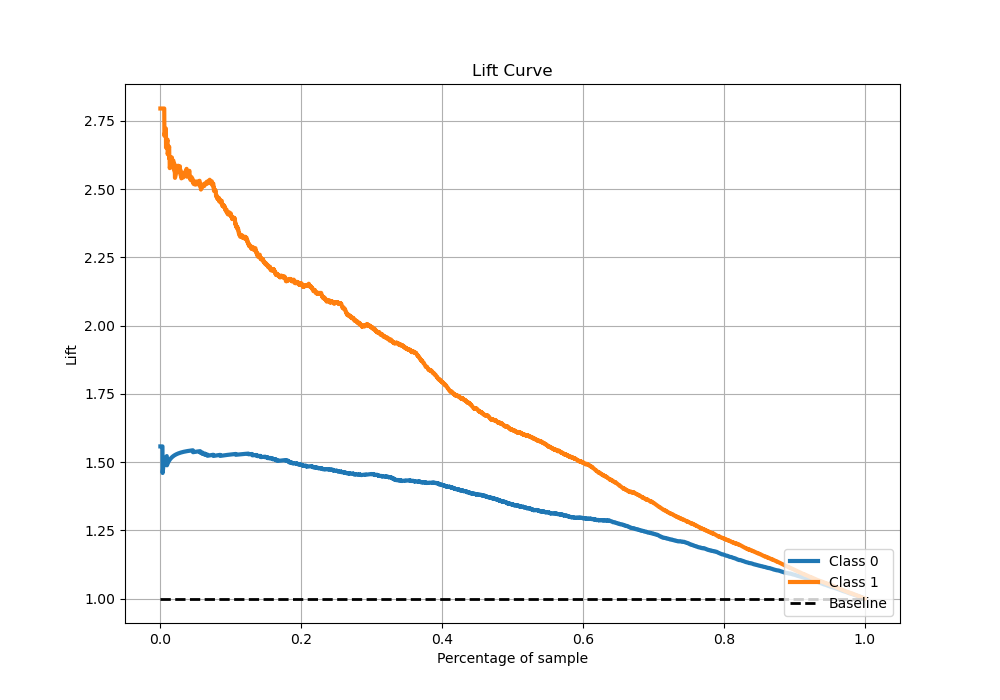

# Summary of 56_RandomForest

[<< Go back](../README.md)

## Random Forest
- **n_jobs**: -1
- **criterion**: gini
- **max_features**: 0.9
- **min_samples_split**: 20
- **max_depth**: 5
- **eval_metric_name**: logloss
- **explain_level**: 0

## Validation
 - **validation_type**: kfold
 - **stratify**: True
 - **k_folds**: 5
 - **shuffle**: True
 - **random_seed**: 42

## Optimized metric
logloss

## Training time

47.6 seconds

## Metric details
|           |    score |   threshold |
|:----------|---------:|------------:|
| logloss   | 0.490398 | nan         |
| auc       | 0.831159 | nan         |
| f1        | 0.684056 |   0.403745  |
| accuracy  | 0.772468 |   0.417872  |
| precision | 0.933333 |   0.829541  |
| recall    | 1        |   0.0255435 |
| mcc       | 0.505817 |   0.403745  |

## Metric details with threshold from accuracy metric
|           |    score |   threshold |
|:----------|---------:|------------:|
| logloss   | 0.490398 |  nan        |
| auc       | 0.831159 |  nan        |
| f1        | 0.675708 |    0.417872 |
| accuracy  | 0.772468 |    0.417872 |
| precision | 0.689422 |    0.417872 |
| recall    | 0.66253  |    0.417872 |
| mcc       | 0.500806 |    0.417872 |

## Confusion matrix (at threshold=0.417872)
|              |   Predicted as 0 |   Predicted as 1 |
|:-------------|-----------------:|-----------------:|
| Labeled as 0 |             2532 |              505 |
| Labeled as 1 |              571 |             1121 |

## Learning curves

## Confusion Matrix

## Normalized Confusion Matrix

## ROC Curve

## Kolmogorov-Smirnov Statistic

## Precision-Recall Curve

## Calibration Curve

## Cumulative Gains Curve

## Lift Curve

[<< Go back](../README.md)
