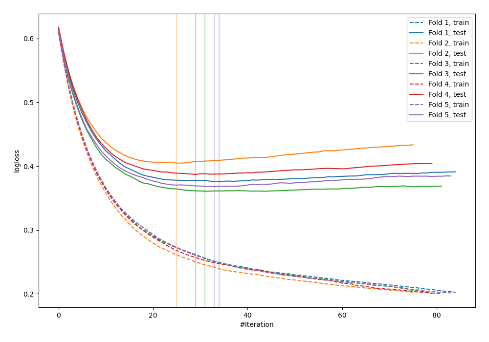
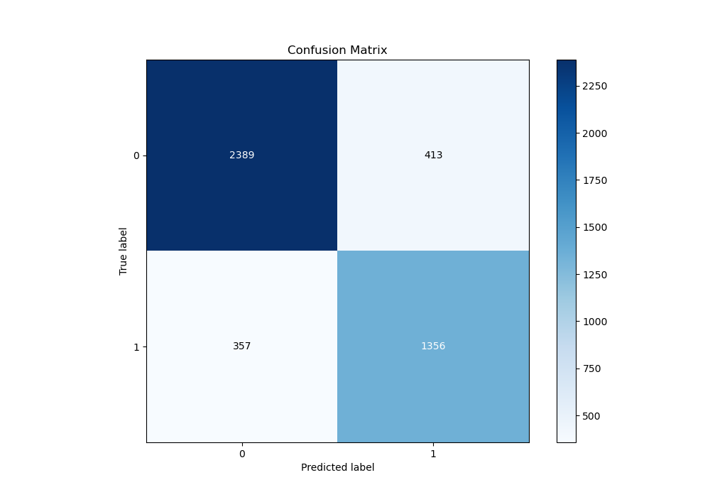
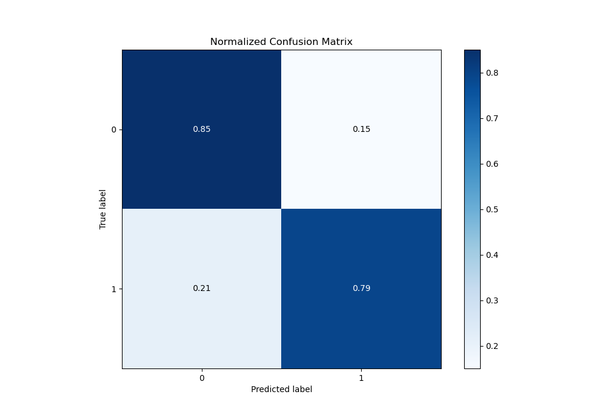
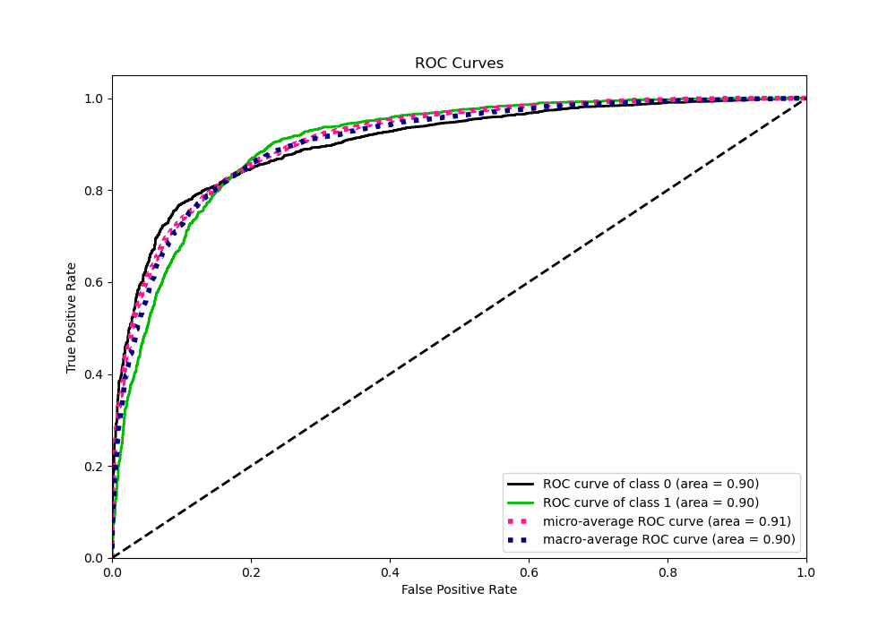
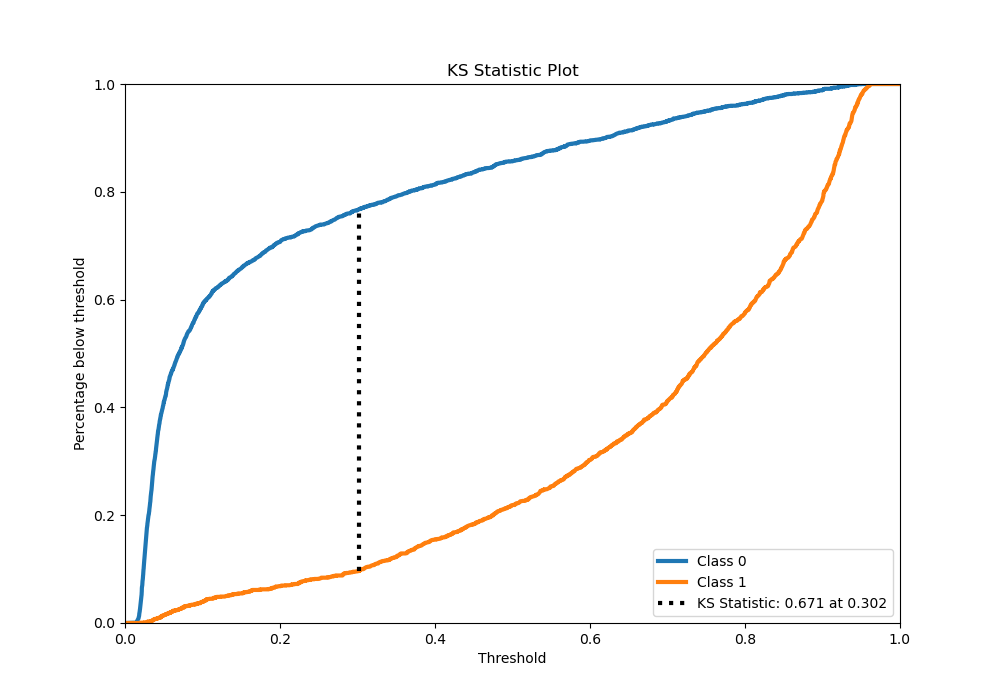
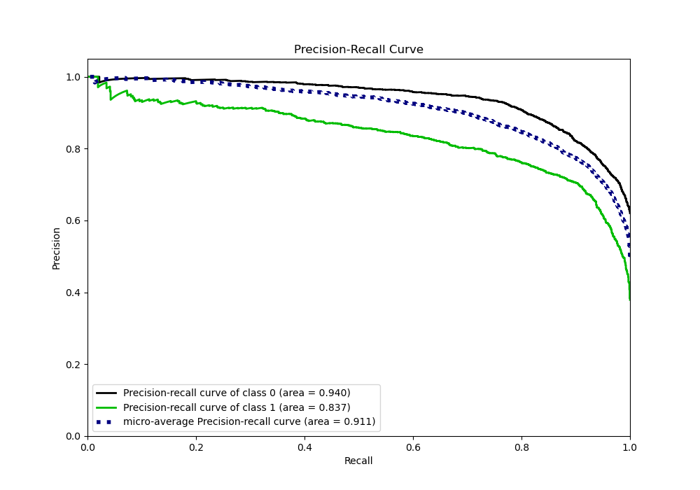
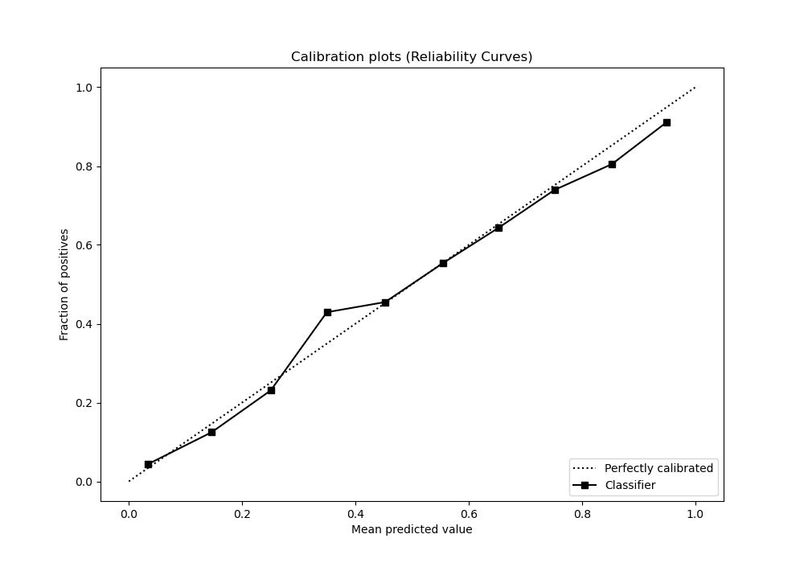
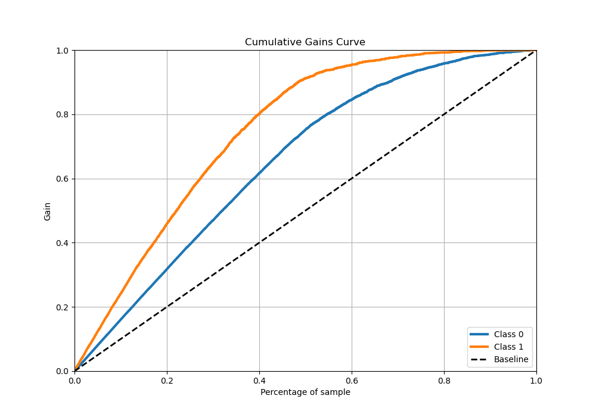
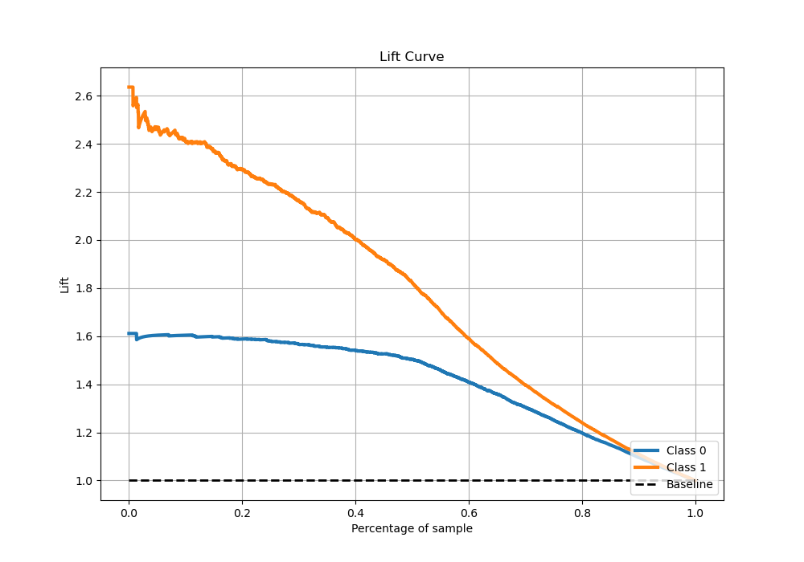

# Summary of 5_Xgboost_Stacked

[<< Go back](../README.md)

## Extreme Gradient Boosting (Xgboost)
- **n_jobs**: -1
- **objective**: binary:logistic
- **eta**: 0.1
- **max_depth**: 7
- **min_child_weight**: 5
- **subsample**: 1.0
- **colsample_bytree**: 0.5
- **eval_metric**: logloss
- **explain_level**: 0

## Validation
 - **validation_type**: kfold
 - **stratify**: True
 - **k_folds**: 5
 - **shuffle**: True
 - **random_seed**: 42

## Optimized metric
logloss

## Training time

22.2 seconds

## Metric details
|           |    score |   threshold |
|:----------|---------:|------------:|
| logloss   | 0.379189 | nan         |
| auc       | 0.904024 | nan         |
| f1        | 0.790624 |   0.35099   |
| accuracy  | 0.829457 |   0.483962  |
| precision | 0.983051 |   0.945776  |
| recall    | 1        |   0.0132077 |
| mcc       | 0.650372 |   0.35099   |

## Metric details with threshold from accuracy metric
|           |    score |   threshold |
|:----------|---------:|------------:|
| logloss   | 0.379189 |  nan        |
| auc       | 0.904024 |  nan        |
| f1        | 0.778863 |    0.483962 |
| accuracy  | 0.829457 |    0.483962 |
| precision | 0.766535 |    0.483962 |
| recall    | 0.791594 |    0.483962 |
| mcc       | 0.640352 |    0.483962 |

## Confusion matrix (at threshold=0.483962)
|              |   Predicted as 0 |   Predicted as 1 |
|:-------------|-----------------:|-----------------:|
| Labeled as 0 |             2389 |              413 |
| Labeled as 1 |              357 |             1356 |

## Learning curves

## Confusion Matrix

## Normalized Confusion Matrix

## ROC Curve

## Kolmogorov-Smirnov Statistic

## Precision-Recall Curve

## Calibration Curve

## Cumulative Gains Curve

## Lift Curve

[<< Go back](../README.md)
