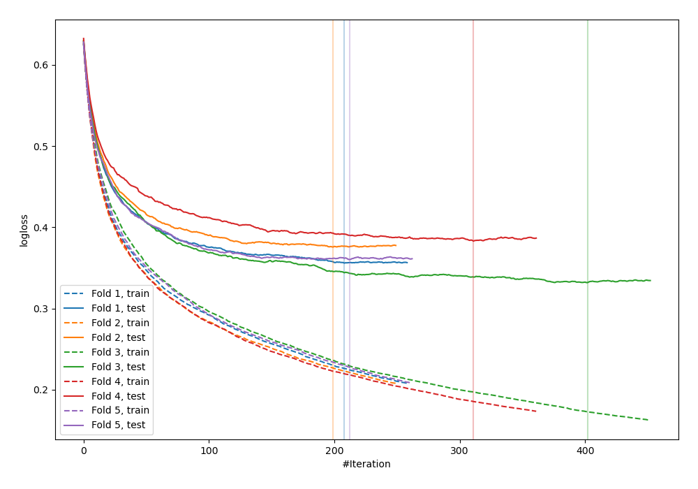
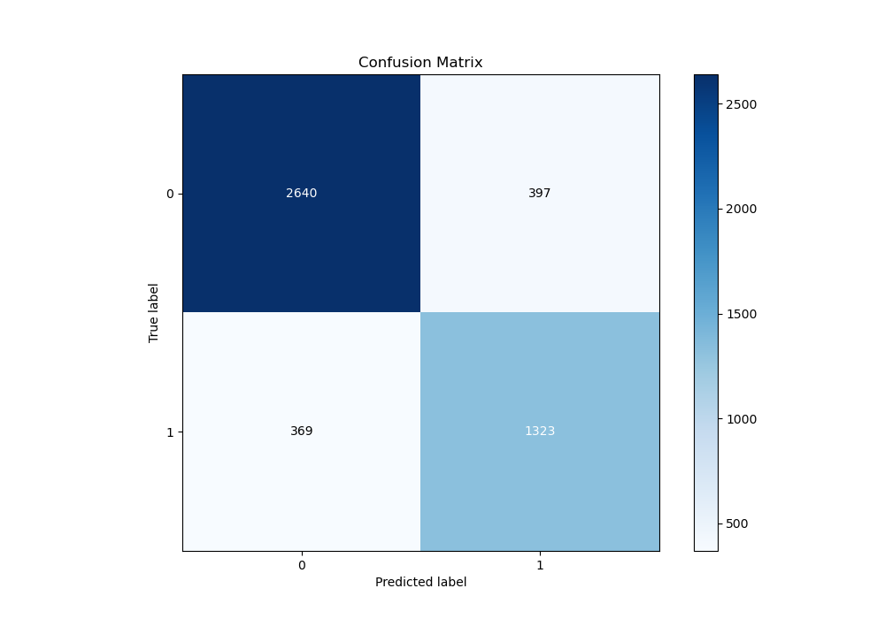
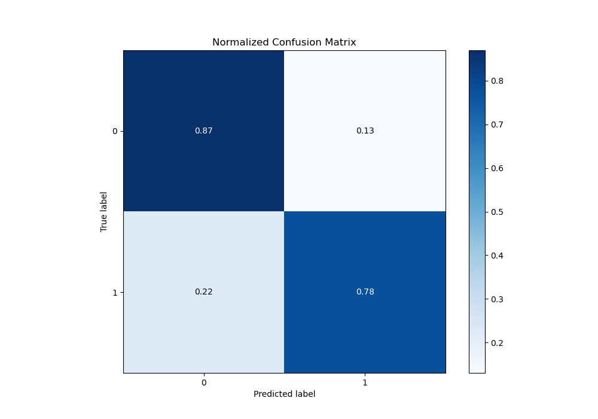
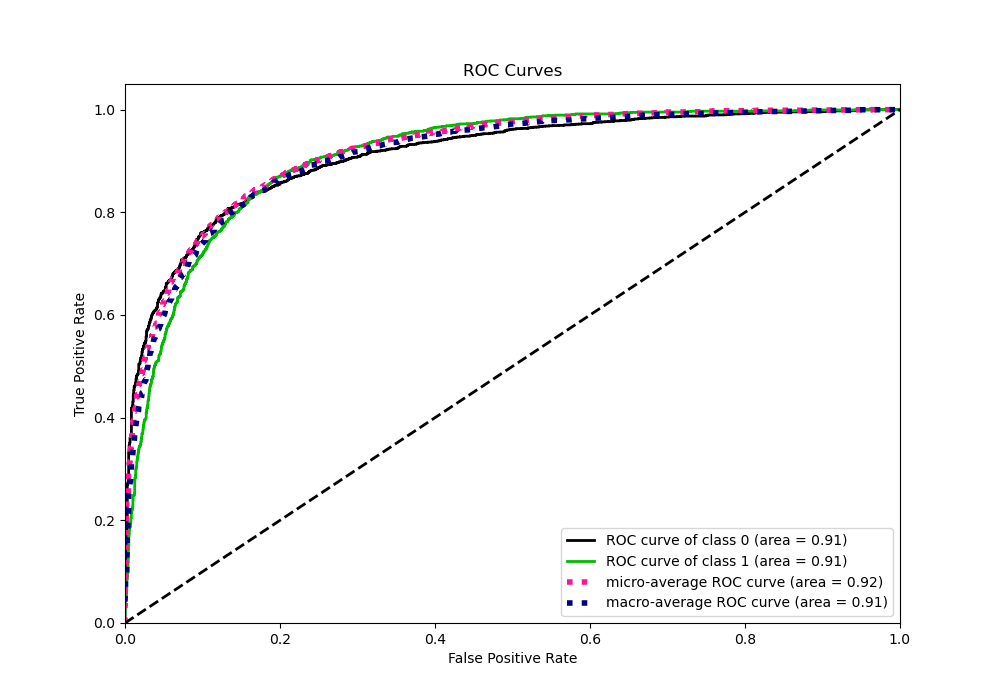
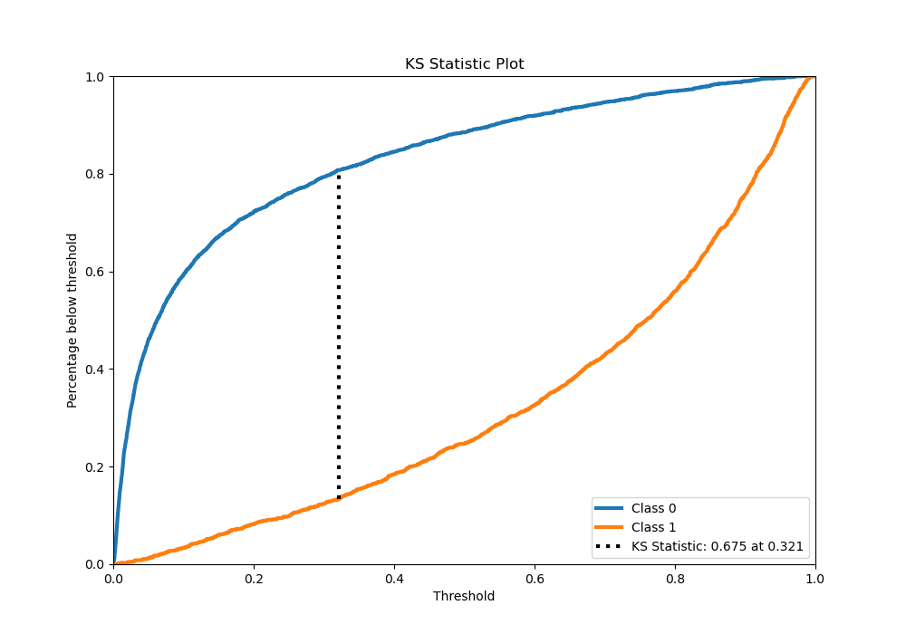
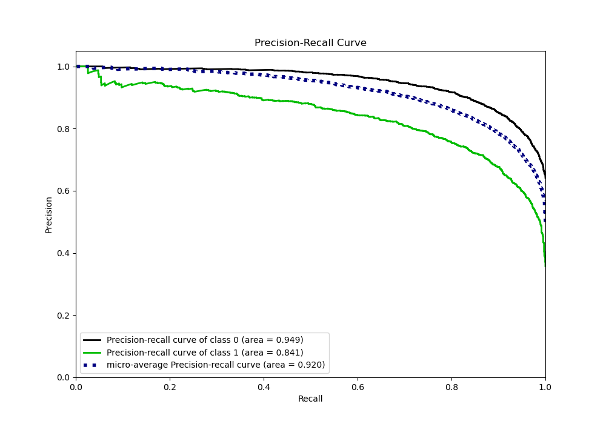
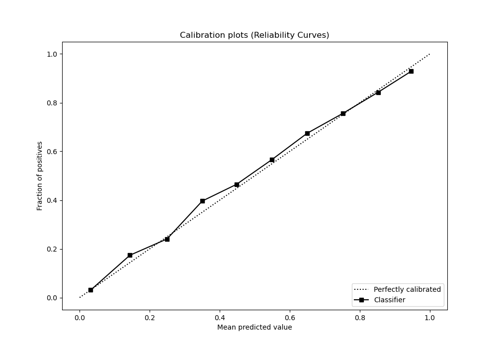
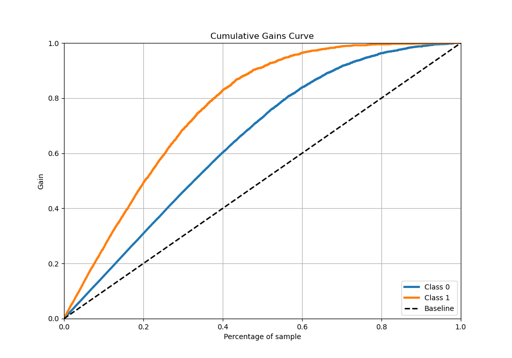
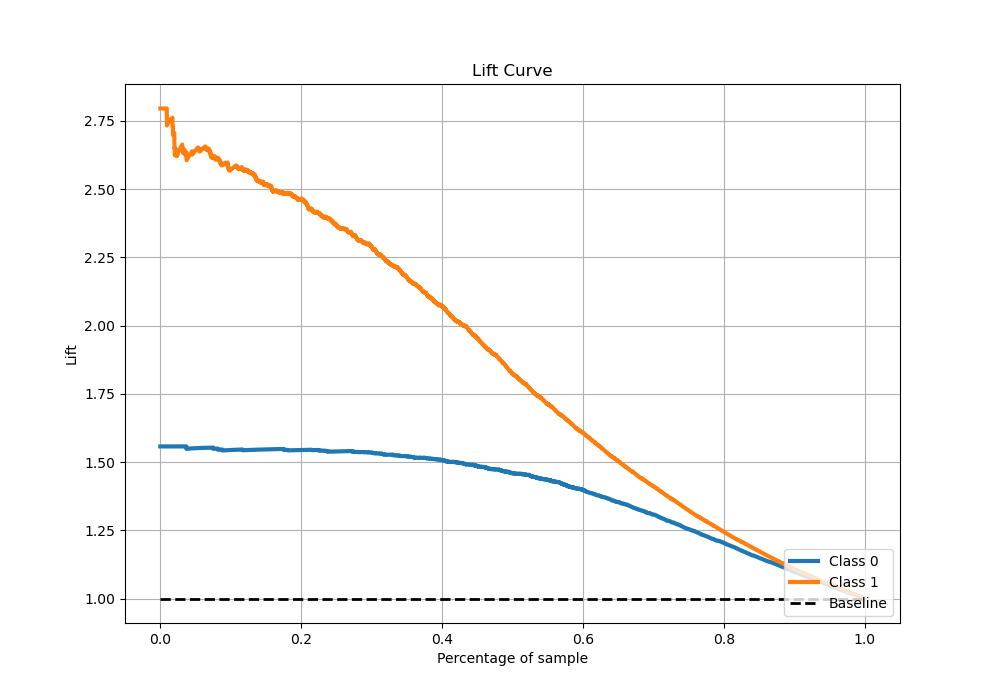

# Summary of 61_Xgboost

[<< Go back](../README.md)

## Extreme Gradient Boosting (Xgboost)
- **n_jobs**: -1
- **objective**: binary:logistic
- **eta**: 0.1
- **max_depth**: 8
- **min_child_weight**: 5
- **subsample**: 0.5
- **colsample_bytree**: 0.5
- **eval_metric**: logloss
- **explain_level**: 0

## Validation
 - **validation_type**: kfold
 - **stratify**: True
 - **k_folds**: 5
 - **shuffle**: True
 - **random_seed**: 42

## Optimized metric
logloss

## Training time

38.6 seconds

## Metric details
|           |    score |     threshold |
|:----------|---------:|--------------:|
| logloss   | 0.36135  | nan           |
| auc       | 0.911148 | nan           |
| f1        | 0.783213 |   0.321764    |
| accuracy  | 0.838021 |   0.456726    |
| precision | 0.986667 |   0.972654    |
| recall    | 1        |   0.000167804 |
| mcc       | 0.651554 |   0.321764    |

## Metric details with threshold from accuracy metric
|           |    score |   threshold |
|:----------|---------:|------------:|
| logloss   | 0.36135  |  nan        |
| auc       | 0.911148 |  nan        |
| f1        | 0.775498 |    0.456726 |
| accuracy  | 0.838021 |    0.456726 |
| precision | 0.769186 |    0.456726 |
| recall    | 0.781915 |    0.456726 |
| mcc       | 0.64887  |    0.456726 |

## Confusion matrix (at threshold=0.456726)
|              |   Predicted as 0 |   Predicted as 1 |
|:-------------|-----------------:|-----------------:|
| Labeled as 0 |             2640 |              397 |
| Labeled as 1 |              369 |             1323 |

## Learning curves

## Confusion Matrix

## Normalized Confusion Matrix

## ROC Curve

## Kolmogorov-Smirnov Statistic

## Precision-Recall Curve

## Calibration Curve

## Cumulative Gains Curve

## Lift Curve

[<< Go back](../README.md)
