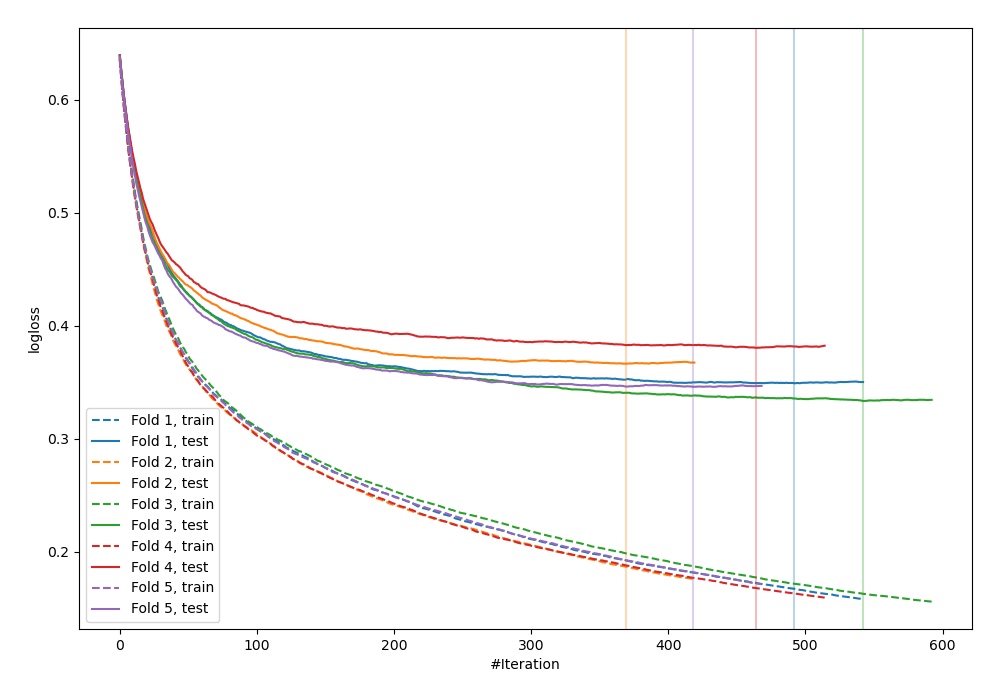
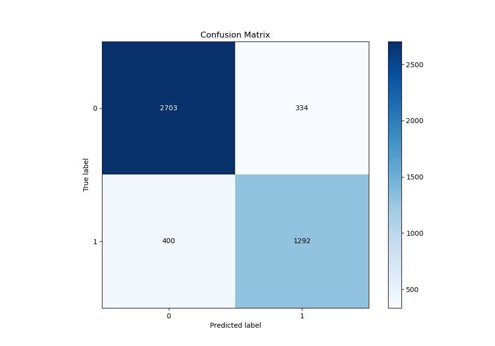
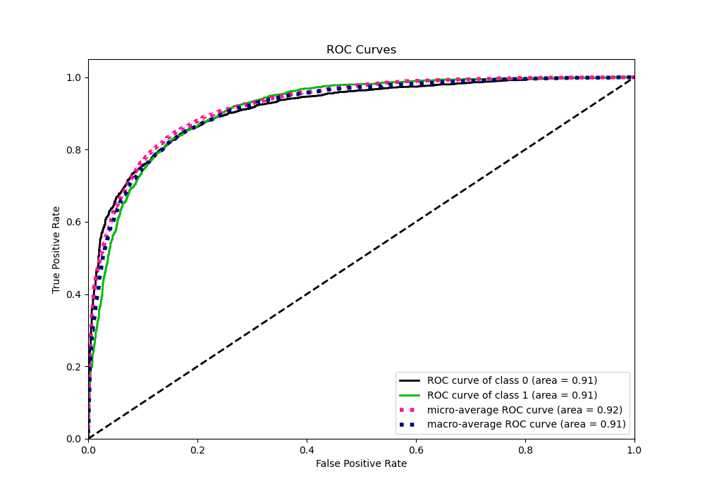
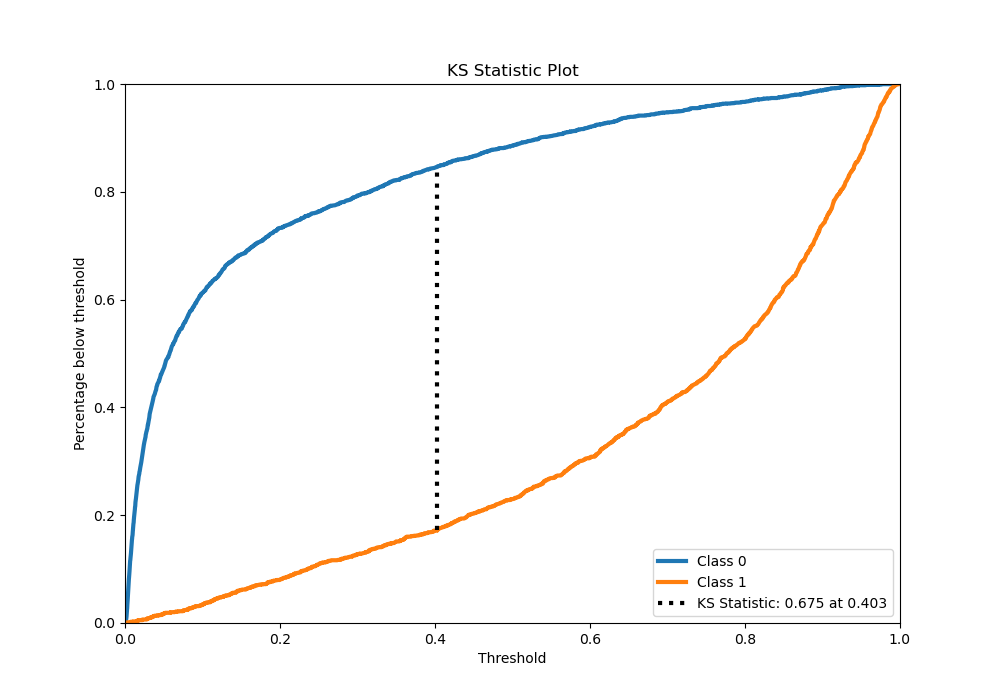
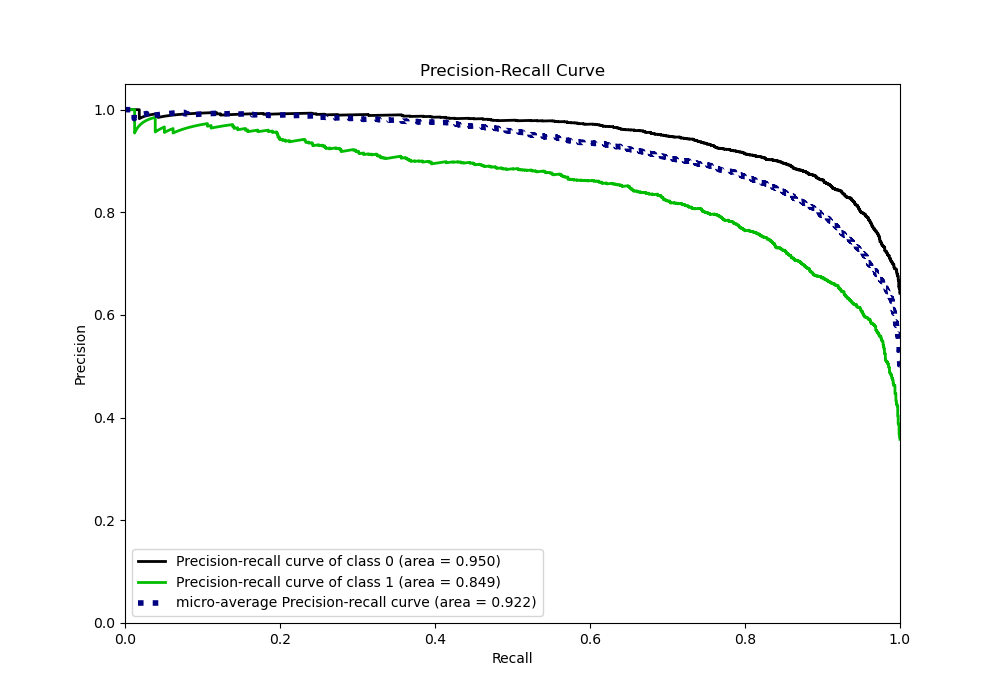
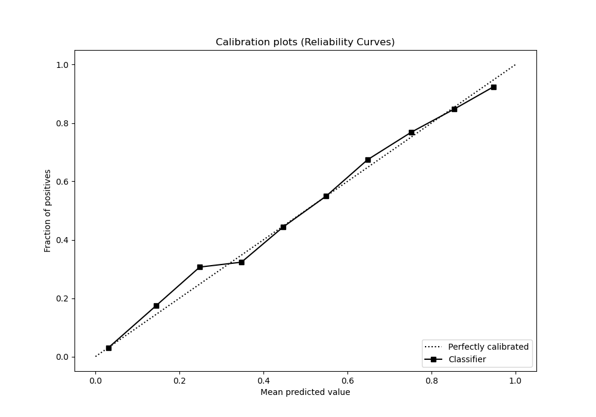
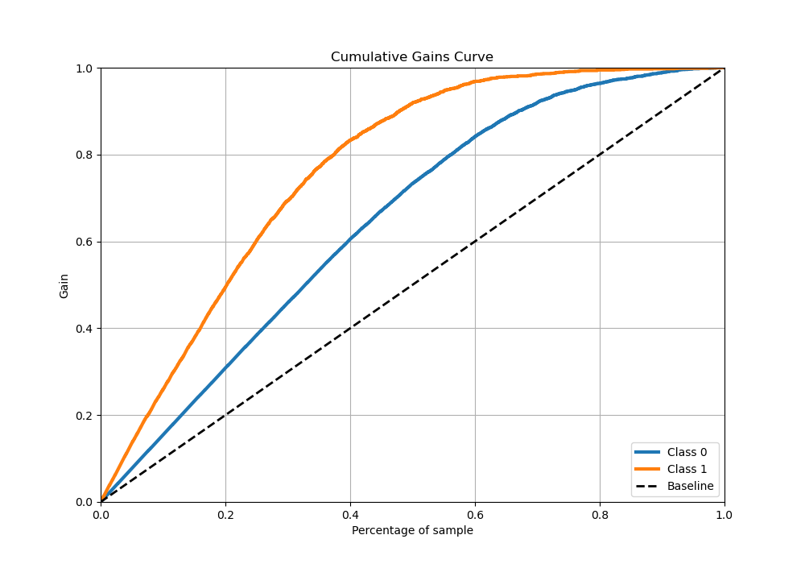
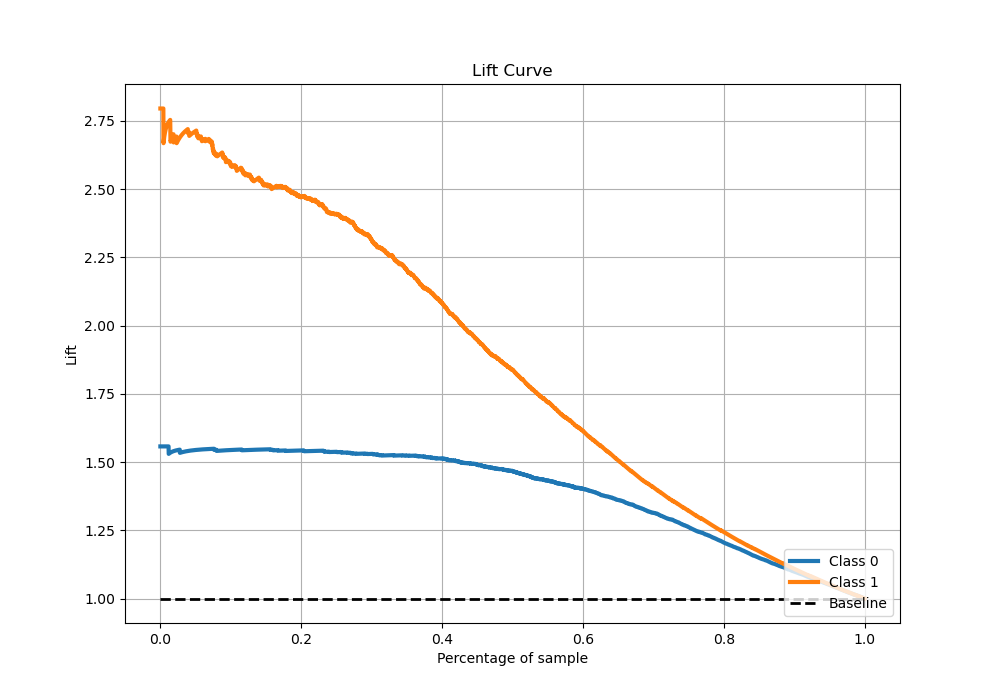

# Summary of 62_Xgboost

[<< Go back](../README.md)

## Extreme Gradient Boosting (Xgboost)
- **n_jobs**: -1
- **objective**: binary:logistic
- **eta**: 0.05
- **max_depth**: 9
- **min_child_weight**: 5
- **subsample**: 0.8
- **colsample_bytree**: 0.6
- **eval_metric**: logloss
- **explain_level**: 0

## Validation
 - **validation_type**: kfold
 - **stratify**: True
 - **k_folds**: 5
 - **shuffle**: True
 - **random_seed**: 42

## Optimized metric
logloss

## Training time

49.1 seconds

## Metric details
|           |    score |     threshold |
|:----------|---------:|--------------:|
| logloss   | 0.355143 | nan           |
| auc       | 0.914438 | nan           |
| f1        | 0.786941 |   0.403906    |
| accuracy  | 0.844787 |   0.510535    |
| precision | 0.970414 |   0.959706    |
| recall    | 1        |   0.000426377 |
| mcc       | 0.661326 |   0.421906    |

## Metric details with threshold from accuracy metric
|           |    score |   threshold |
|:----------|---------:|------------:|
| logloss   | 0.355143 |  nan        |
| auc       | 0.914438 |  nan        |
| f1        | 0.778782 |    0.510535 |
| accuracy  | 0.844787 |    0.510535 |
| precision | 0.794588 |    0.510535 |
| recall    | 0.763593 |    0.510535 |
| mcc       | 0.659621 |    0.510535 |

## Confusion matrix (at threshold=0.510535)
|              |   Predicted as 0 |   Predicted as 1 |
|:-------------|-----------------:|-----------------:|
| Labeled as 0 |             2703 |              334 |
| Labeled as 1 |              400 |             1292 |

## Learning curves

## Confusion Matrix

## Normalized Confusion Matrix

## ROC Curve

## Kolmogorov-Smirnov Statistic

## Precision-Recall Curve

## Calibration Curve

## Cumulative Gains Curve

## Lift Curve

[<< Go back](../README.md)
