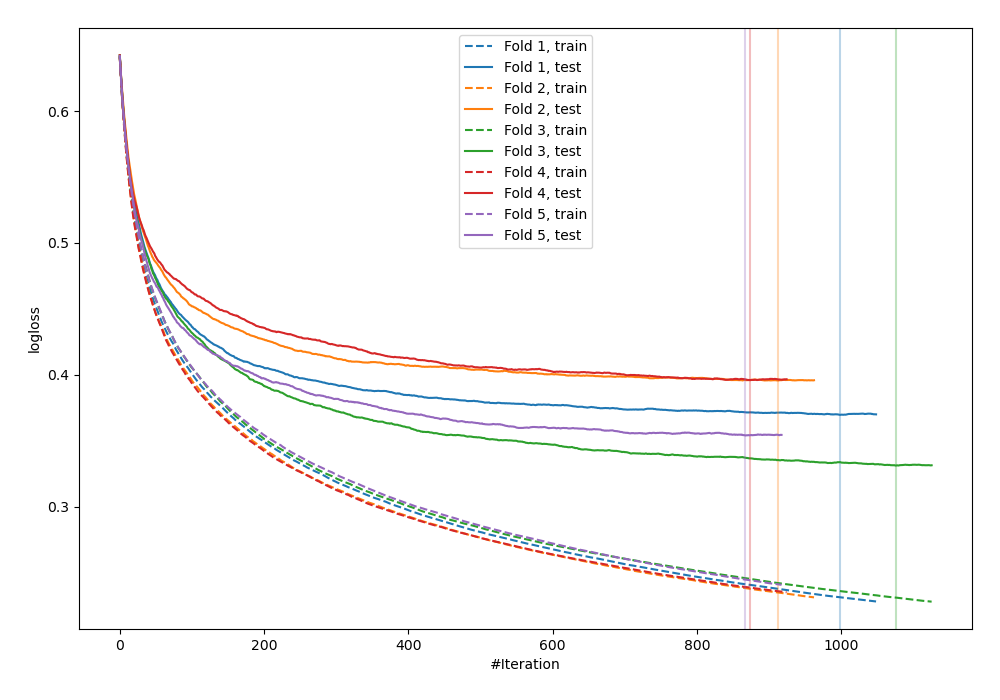
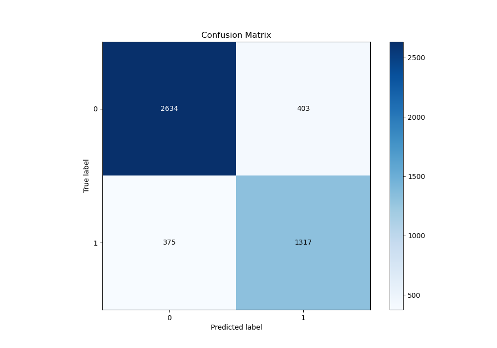
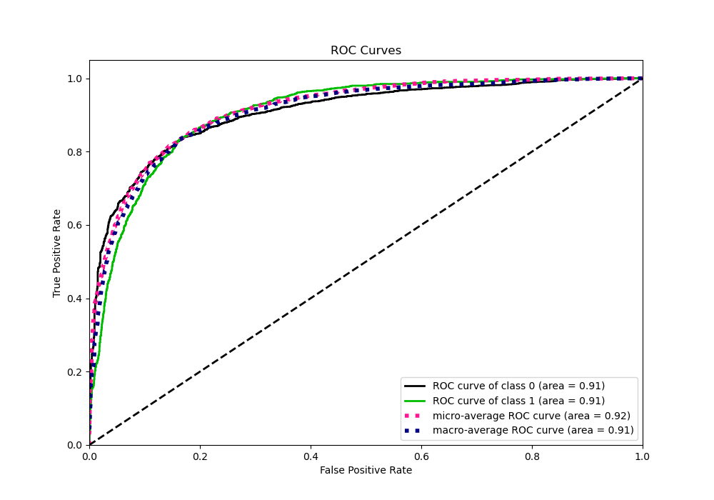
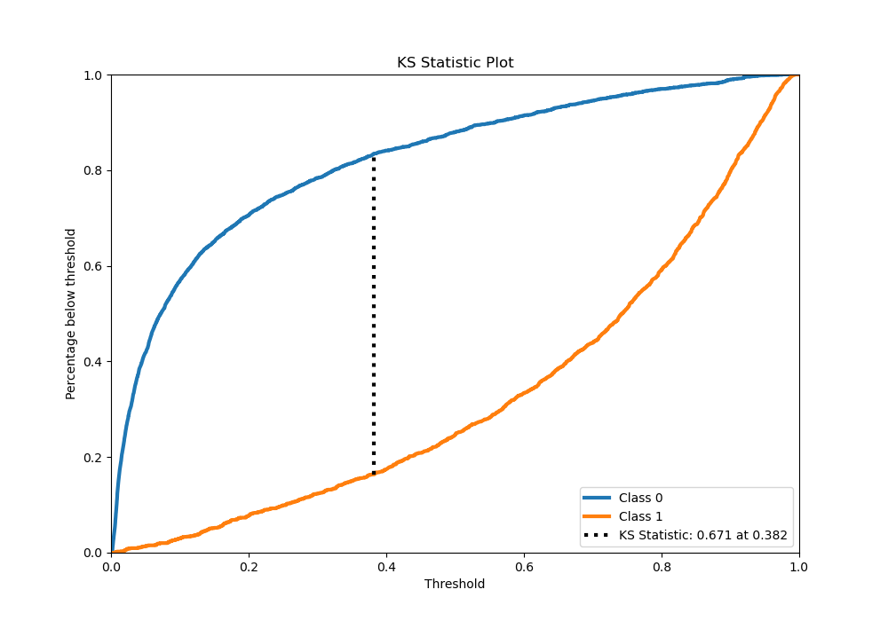
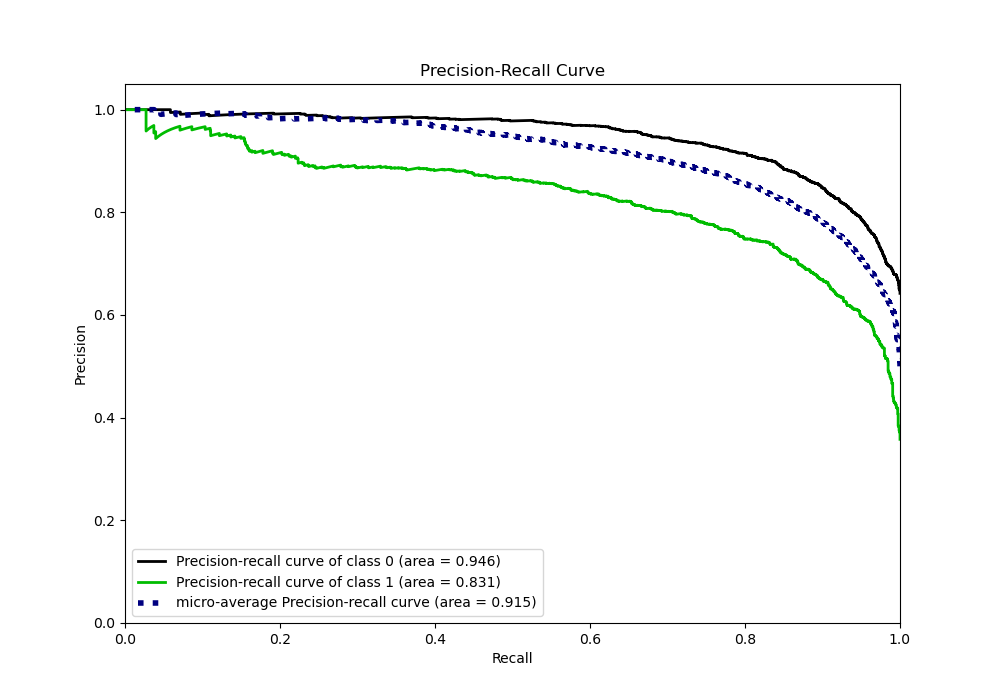
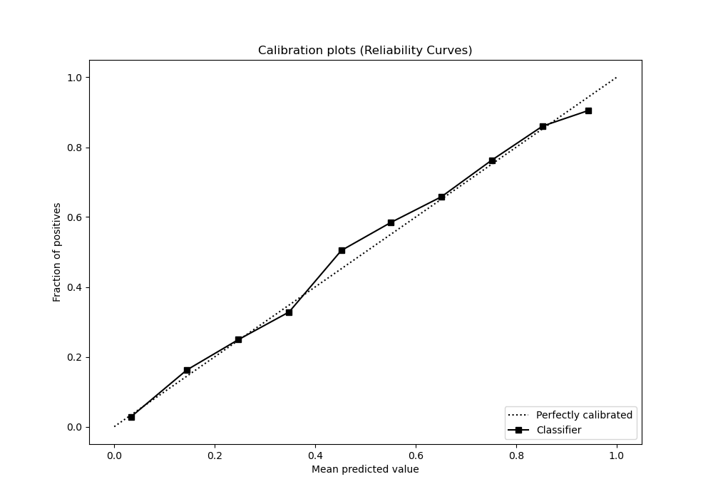
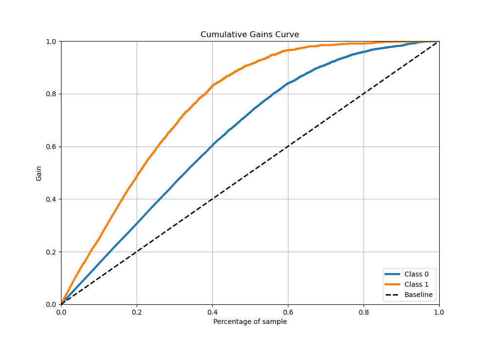
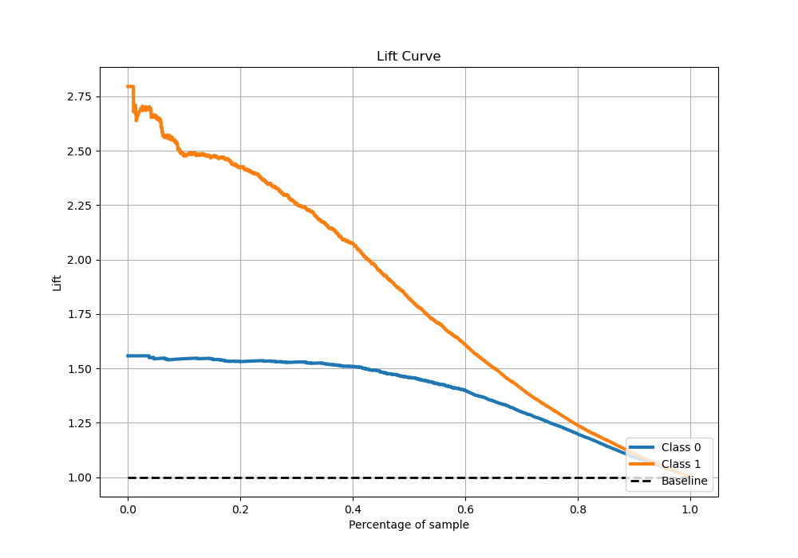

# Summary of 63_Xgboost

[<< Go back](../README.md)

## Extreme Gradient Boosting (Xgboost)
- **n_jobs**: -1
- **objective**: binary:logistic
- **eta**: 0.05
- **max_depth**: 9
- **min_child_weight**: 25
- **subsample**: 0.8
- **colsample_bytree**: 0.6
- **eval_metric**: logloss
- **explain_level**: 0

## Validation
 - **validation_type**: kfold
 - **stratify**: True
 - **k_folds**: 5
 - **shuffle**: True
 - **random_seed**: 42

## Optimized metric
logloss

## Training time

134.2 seconds

## Metric details
|           |    score |     threshold |
|:----------|---------:|--------------:|
| logloss   | 0.369381 | nan           |
| auc       | 0.906821 | nan           |
| f1        | 0.782222 |   0.385965    |
| accuracy  | 0.835483 |   0.471893    |
| precision | 0.967213 |   0.957962    |
| recall    | 1        |   0.000915059 |
| mcc       | 0.652218 |   0.385965    |

## Metric details with threshold from accuracy metric
|           |    score |   threshold |
|:----------|---------:|------------:|
| logloss   | 0.369381 |  nan        |
| auc       | 0.906821 |  nan        |
| f1        | 0.771981 |    0.471893 |
| accuracy  | 0.835483 |    0.471893 |
| precision | 0.765698 |    0.471893 |
| recall    | 0.778369 |    0.471893 |
| mcc       | 0.643368 |    0.471893 |

## Confusion matrix (at threshold=0.471893)
|              |   Predicted as 0 |   Predicted as 1 |
|:-------------|-----------------:|-----------------:|
| Labeled as 0 |             2634 |              403 |
| Labeled as 1 |              375 |             1317 |

## Learning curves

## Confusion Matrix

## Normalized Confusion Matrix

## ROC Curve

## Kolmogorov-Smirnov Statistic

## Precision-Recall Curve

## Calibration Curve

## Cumulative Gains Curve

## Lift Curve

[<< Go back](../README.md)
