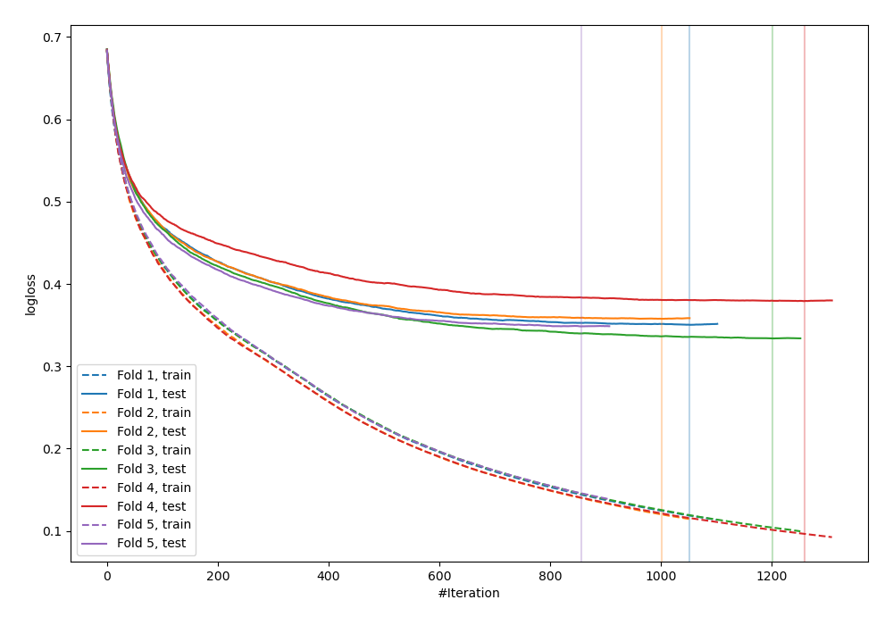
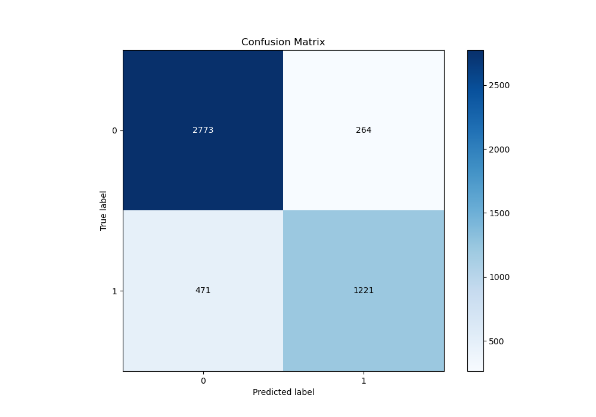
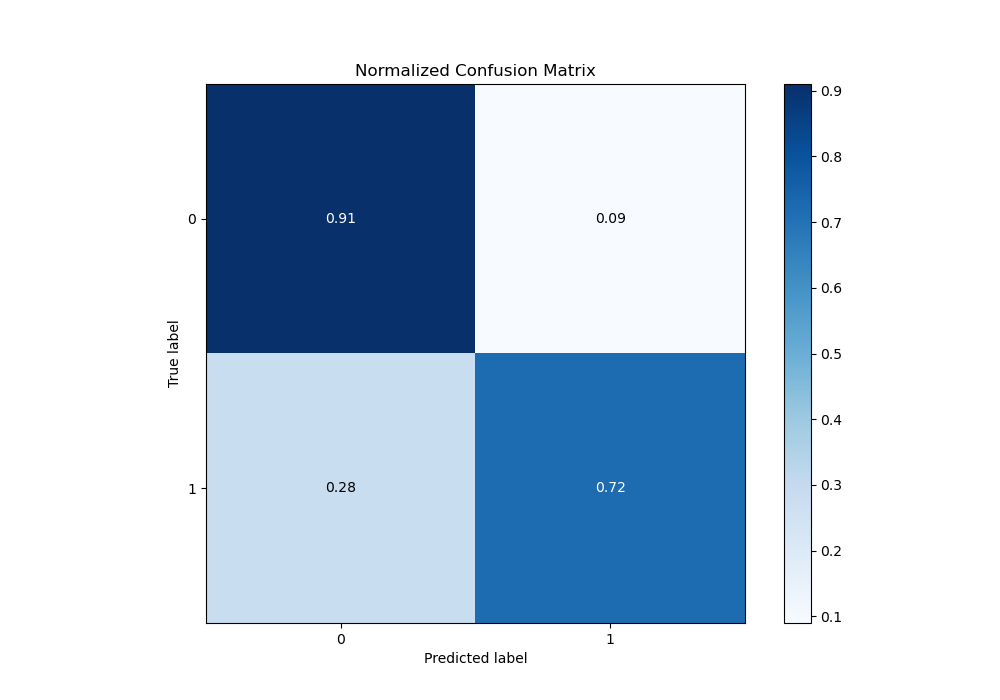
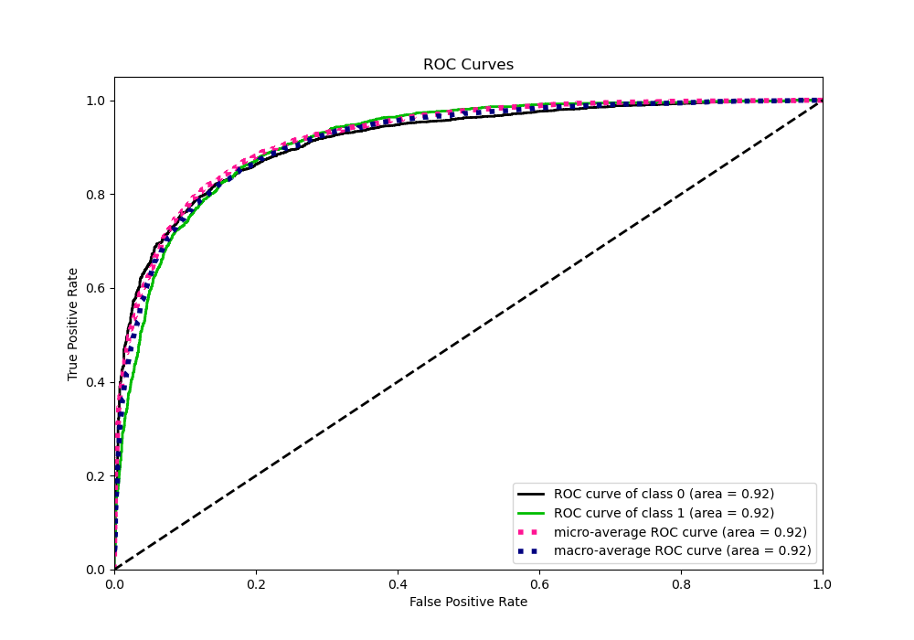
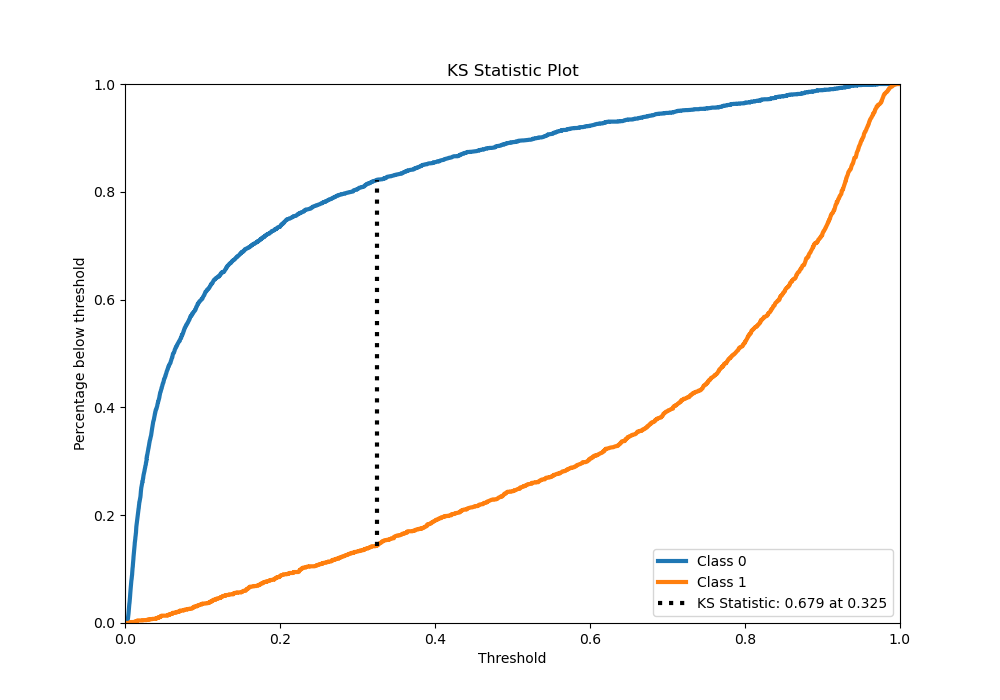
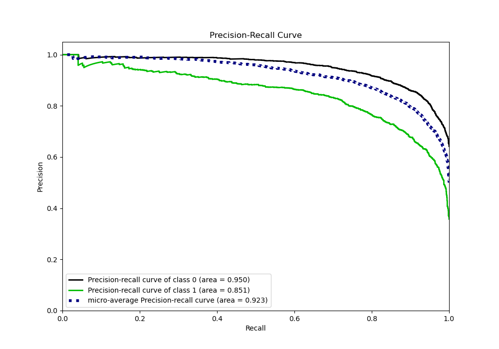
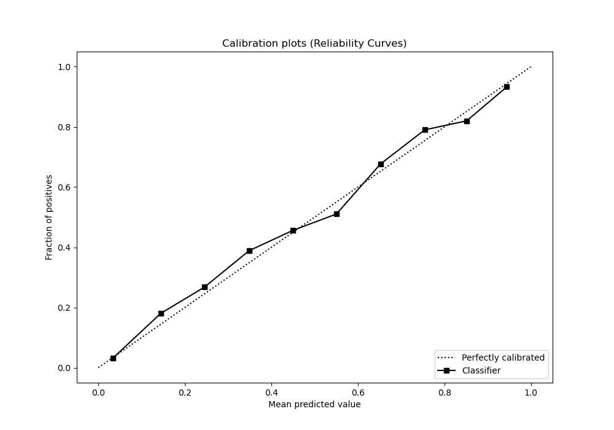
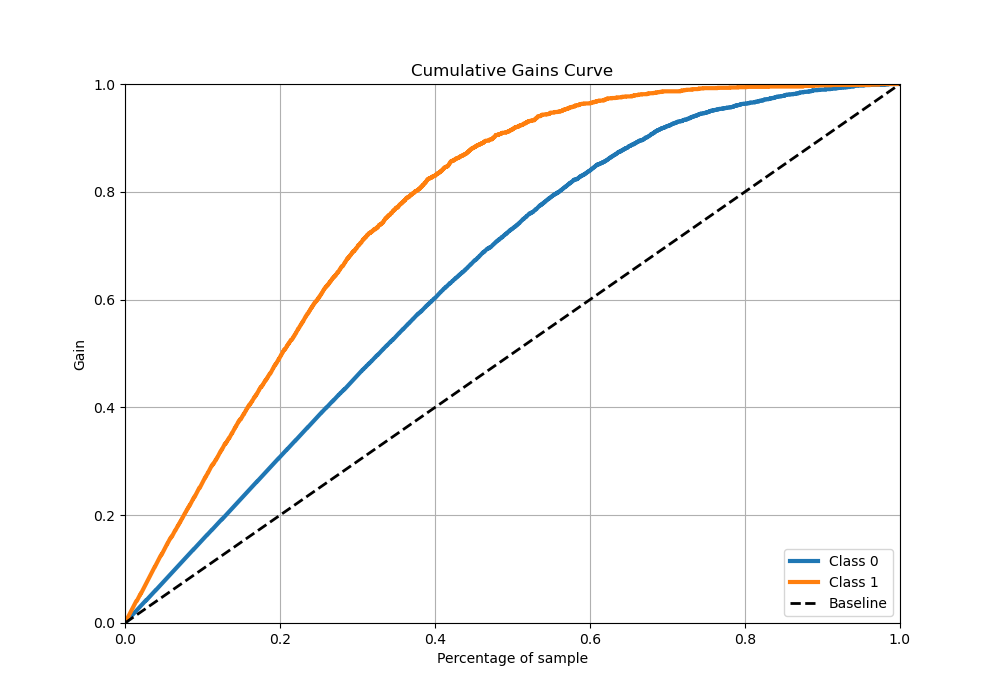
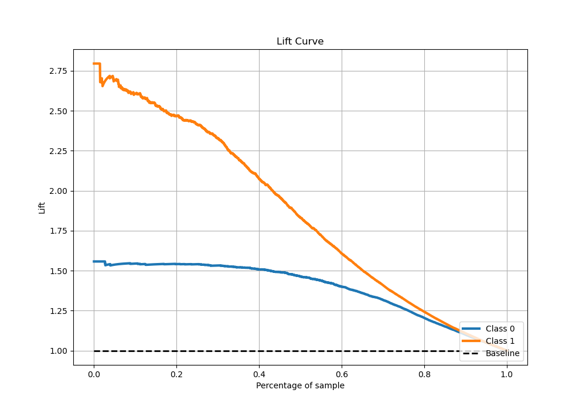

# Summary of 64_CatBoost

[<< Go back](../README.md)

## CatBoost
- **n_jobs**: -1
- **learning_rate**: 0.025
- **depth**: 8
- **rsm**: 0.9
- **loss_function**: Logloss
- **eval_metric**: Logloss
- **explain_level**: 0

## Validation
 - **validation_type**: kfold
 - **stratify**: True
 - **k_folds**: 5
 - **shuffle**: True
 - **random_seed**: 42

## Optimized metric
logloss

## Training time

204.1 seconds

## Metric details
|           |    score |    threshold |
|:----------|---------:|-------------:|
| logloss   | 0.353879 | nan          |
| auc       | 0.915043 | nan          |
| f1        | 0.785815 |   0.380771   |
| accuracy  | 0.844576 |   0.561482   |
| precision | 0.972222 |   0.945313   |
| recall    | 1        |   0.00167486 |
| mcc       | 0.659874 |   0.441162   |

## Metric details with threshold from accuracy metric
|           |    score |   threshold |
|:----------|---------:|------------:|
| logloss   | 0.353879 |  nan        |
| auc       | 0.915043 |  nan        |
| f1        | 0.76865  |    0.561482 |
| accuracy  | 0.844576 |    0.561482 |
| precision | 0.822222 |    0.561482 |
| recall    | 0.721631 |    0.561482 |
| mcc       | 0.655526 |    0.561482 |

## Confusion matrix (at threshold=0.561482)
|              |   Predicted as 0 |   Predicted as 1 |
|:-------------|-----------------:|-----------------:|
| Labeled as 0 |             2773 |              264 |
| Labeled as 1 |              471 |             1221 |

## Learning curves

## Confusion Matrix

## Normalized Confusion Matrix

## ROC Curve

## Kolmogorov-Smirnov Statistic

## Precision-Recall Curve

## Calibration Curve

## Cumulative Gains Curve

## Lift Curve

[<< Go back](../README.md)
