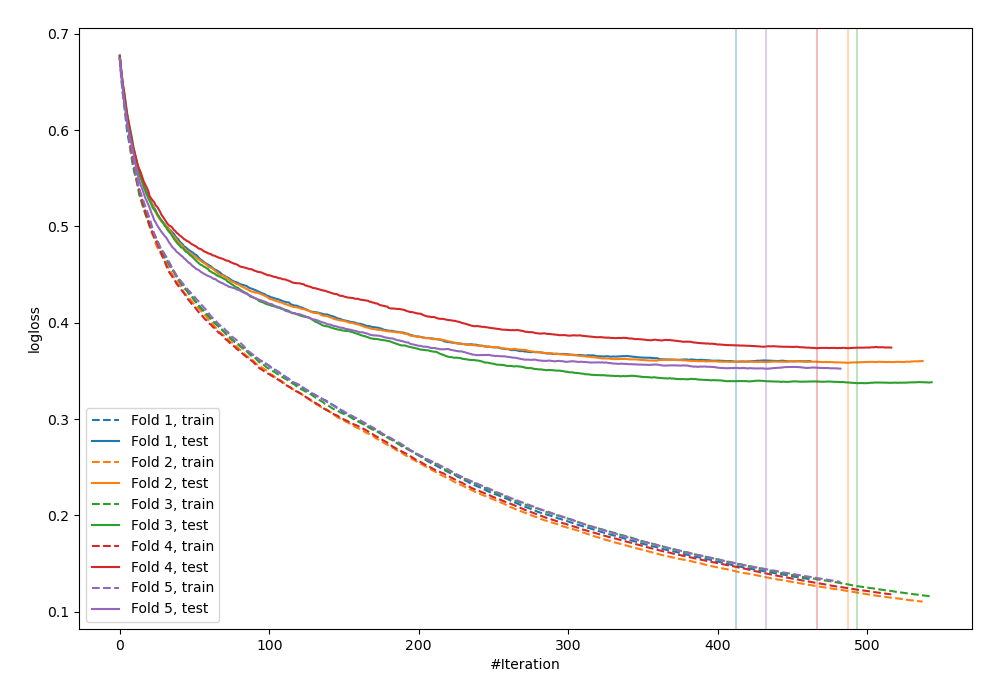
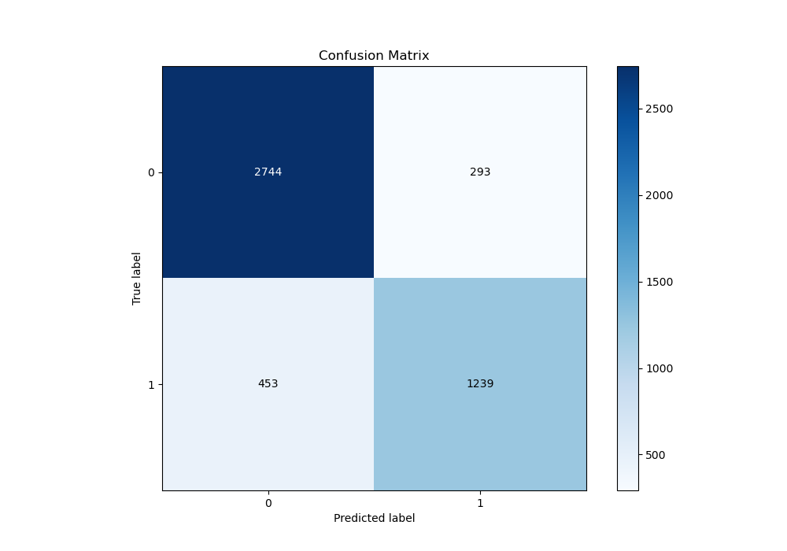
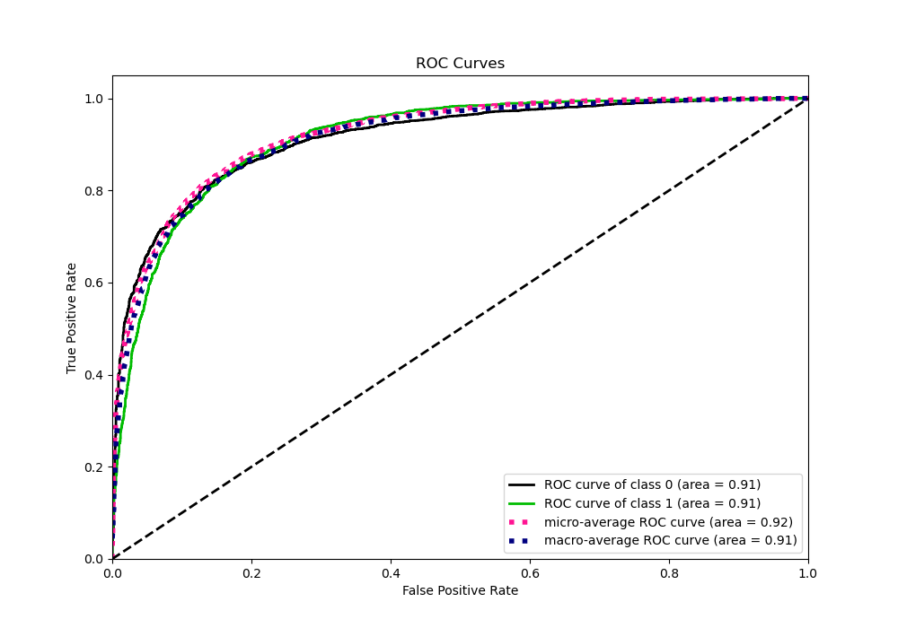
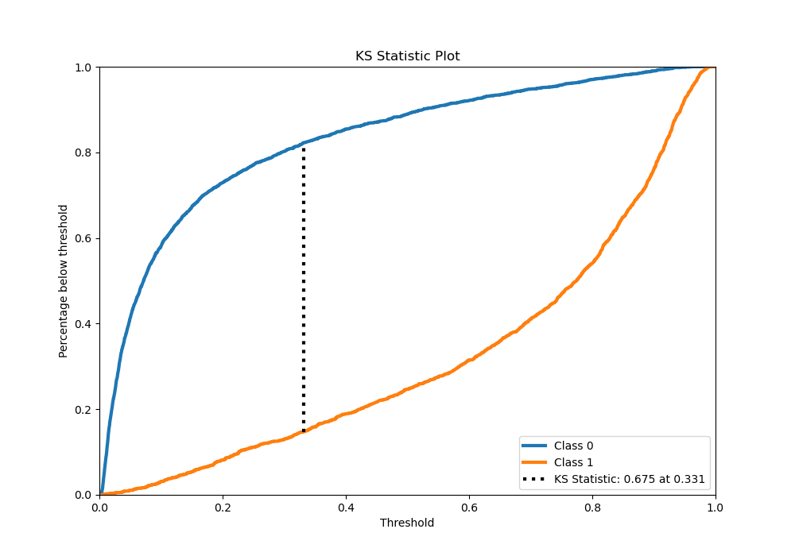
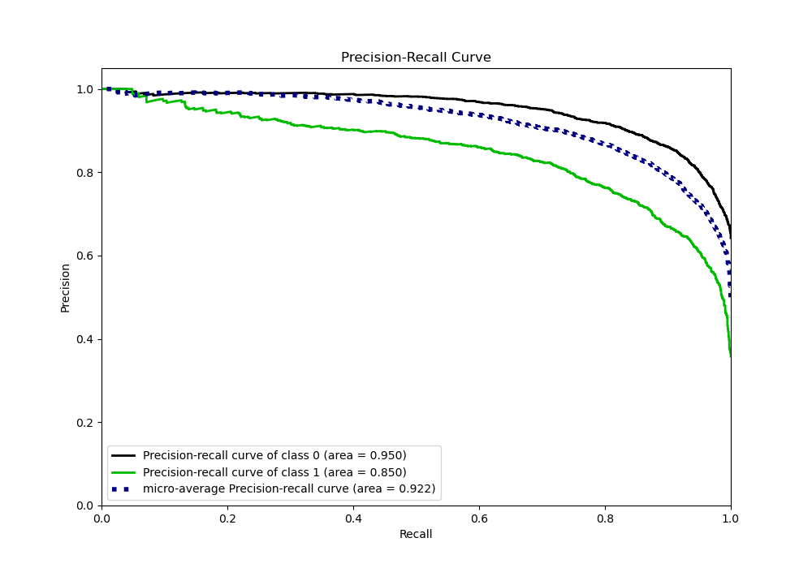
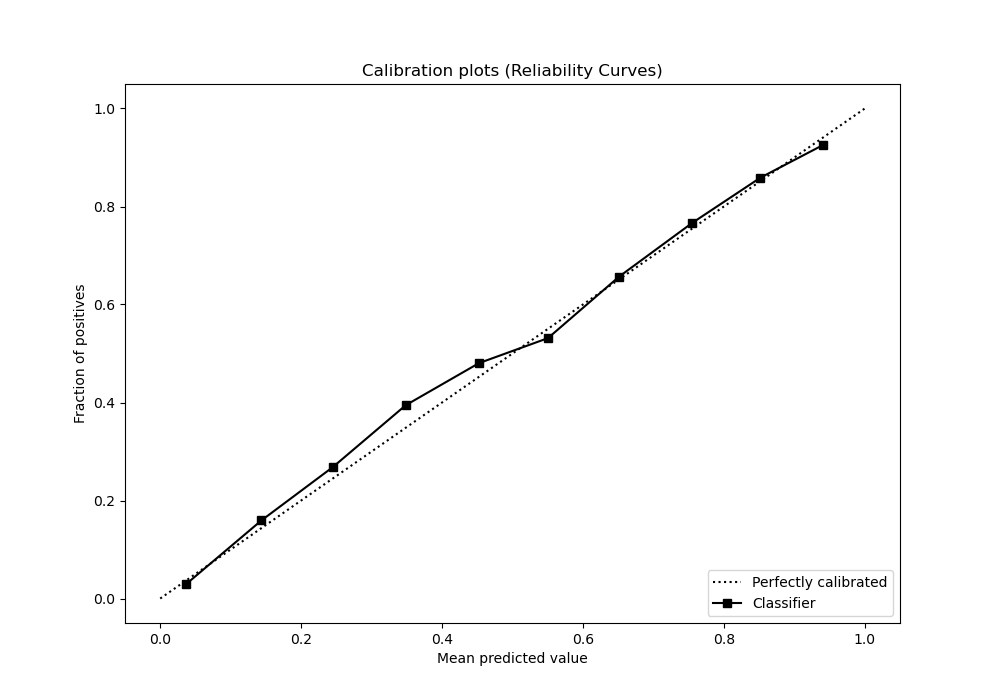
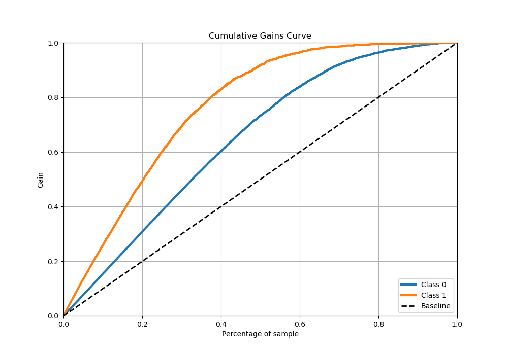
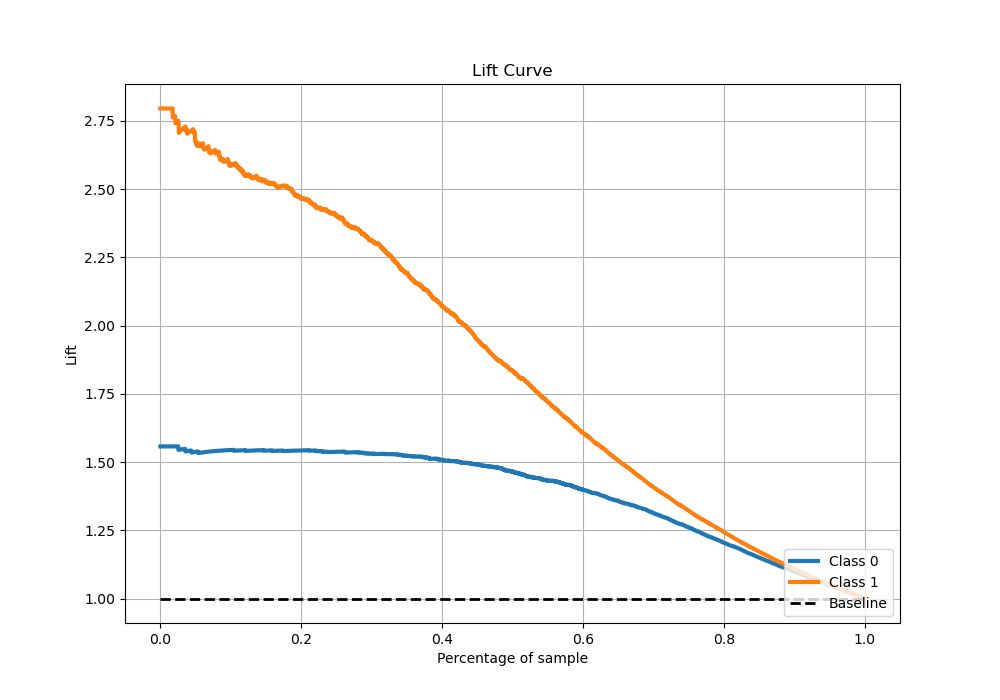

# Summary of 65_CatBoost

[<< Go back](../README.md)

## CatBoost
- **n_jobs**: -1
- **learning_rate**: 0.05
- **depth**: 8
- **rsm**: 0.9
- **loss_function**: Logloss
- **eval_metric**: Logloss
- **explain_level**: 0

## Validation
 - **validation_type**: kfold
 - **stratify**: True
 - **k_folds**: 5
 - **shuffle**: True
 - **random_seed**: 42

## Optimized metric
logloss

## Training time

101.6 seconds

## Metric details
|           |    score |    threshold |
|:----------|---------:|-------------:|
| logloss   | 0.356214 | nan          |
| auc       | 0.913962 | nan          |
| f1        | 0.784206 |   0.343002   |
| accuracy  | 0.84225  |   0.536533   |
| precision | 1        |   0.963395   |
| recall    | 1        |   0.00162905 |
| mcc       | 0.655882 |   0.400519   |

## Metric details with threshold from accuracy metric
|           |    score |   threshold |
|:----------|---------:|------------:|
| logloss   | 0.356214 |  nan        |
| auc       | 0.913962 |  nan        |
| f1        | 0.76861  |    0.536533 |
| accuracy  | 0.84225  |    0.536533 |
| precision | 0.808747 |    0.536533 |
| recall    | 0.73227  |    0.536533 |
| mcc       | 0.651235 |    0.536533 |

## Confusion matrix (at threshold=0.536533)
|              |   Predicted as 0 |   Predicted as 1 |
|:-------------|-----------------:|-----------------:|
| Labeled as 0 |             2744 |              293 |
| Labeled as 1 |              453 |             1239 |

## Learning curves

## Confusion Matrix

## Normalized Confusion Matrix

## ROC Curve

## Kolmogorov-Smirnov Statistic

## Precision-Recall Curve

## Calibration Curve

## Cumulative Gains Curve

## Lift Curve

[<< Go back](../README.md)
