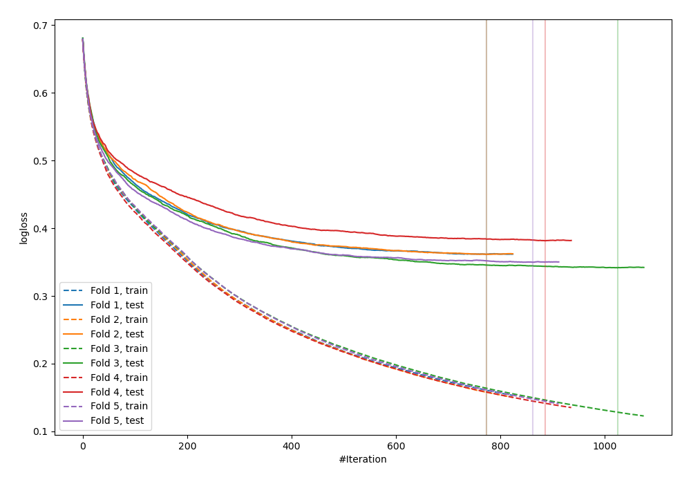
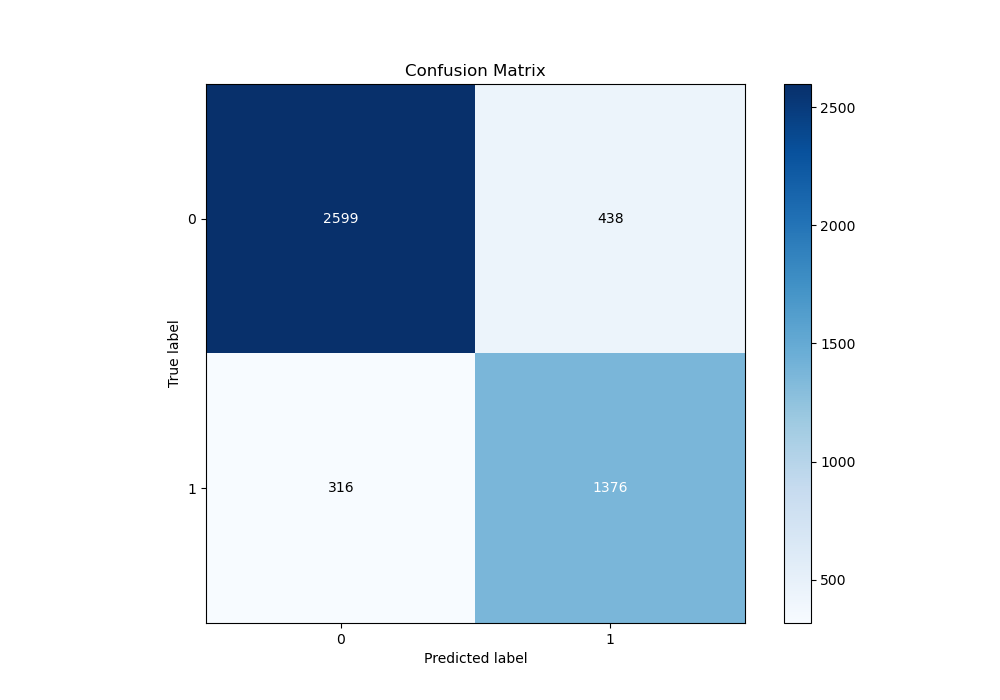
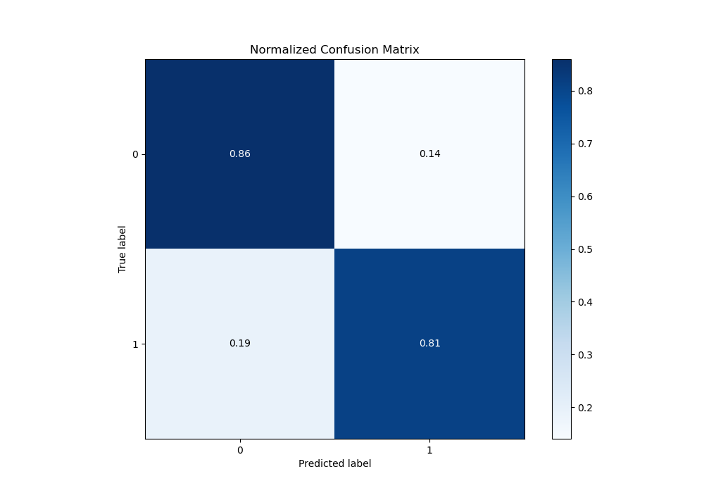
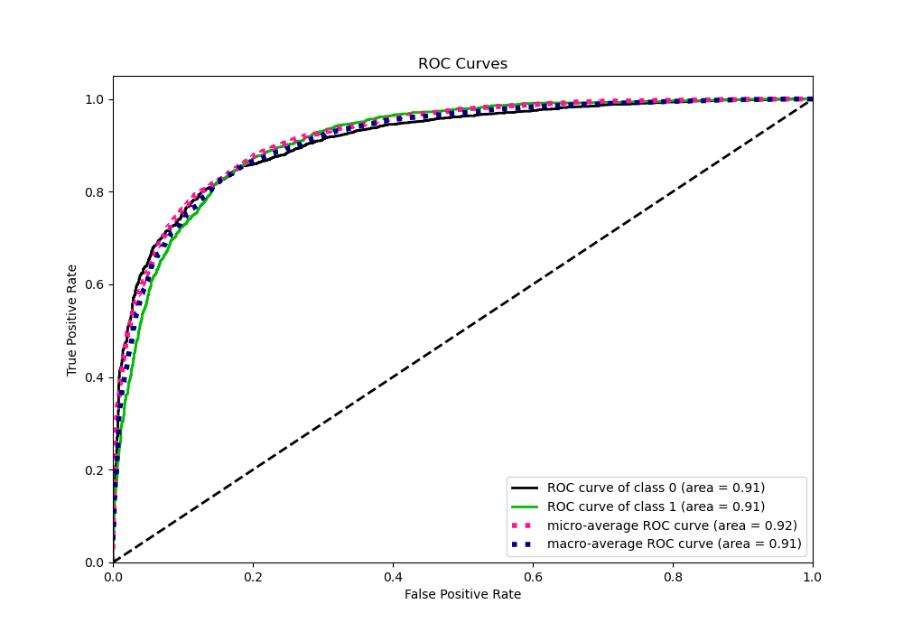
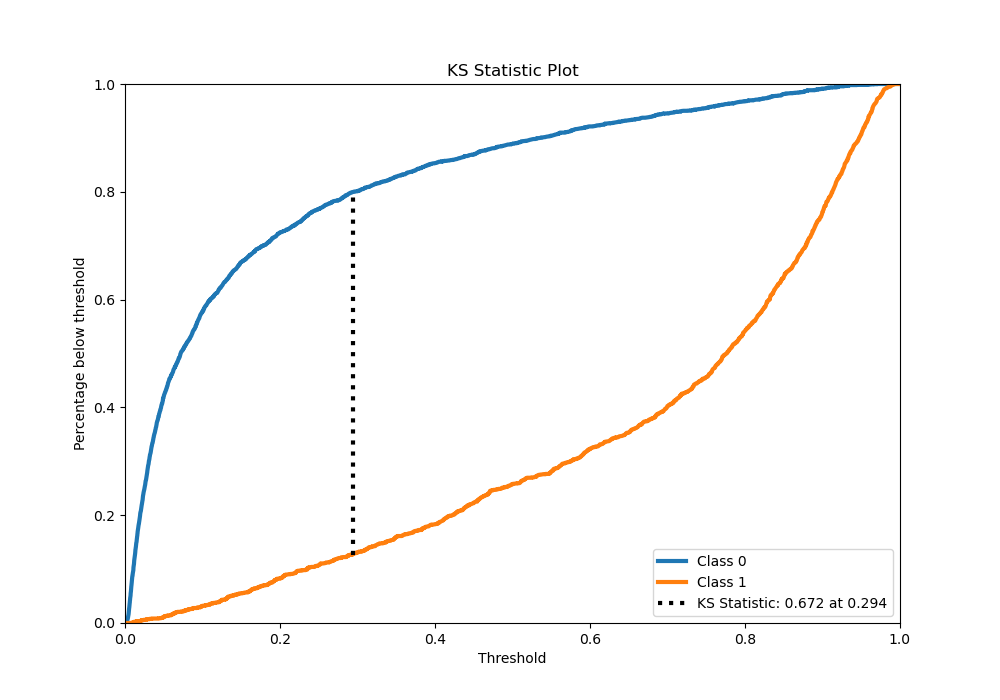
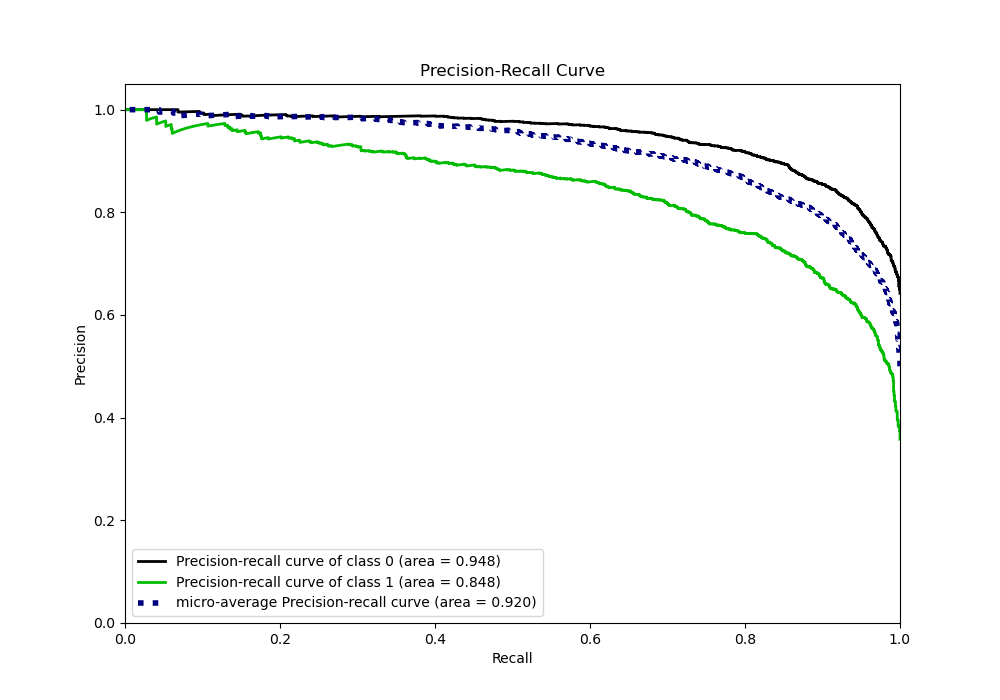
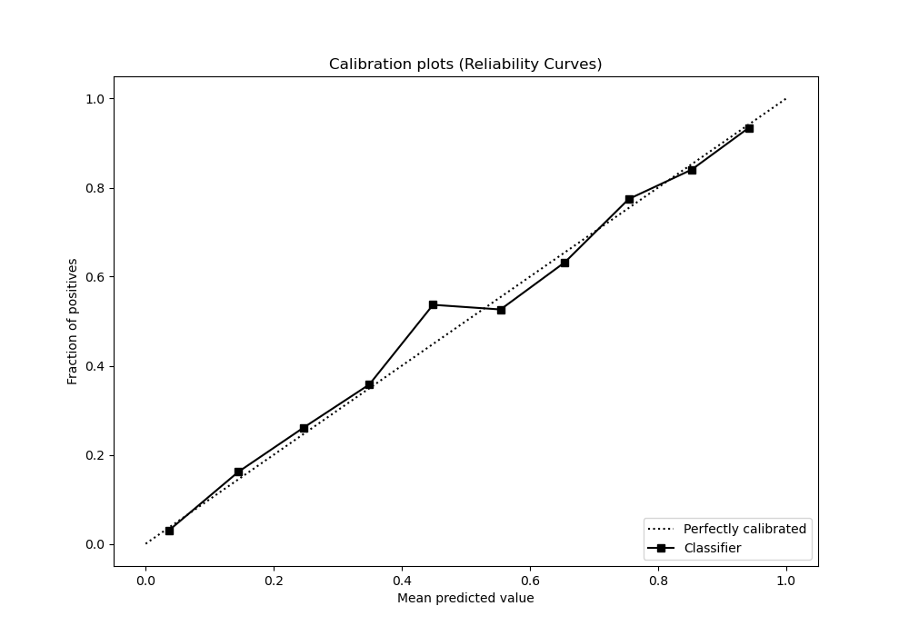
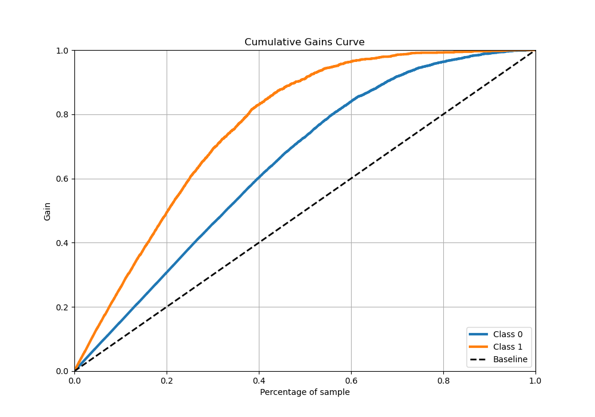
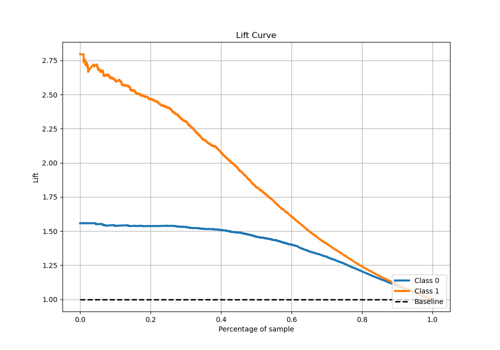

# Summary of 66_CatBoost

[<< Go back](../README.md)

## CatBoost
- **n_jobs**: -1
- **learning_rate**: 0.05
- **depth**: 5
- **rsm**: 0.9
- **loss_function**: Logloss
- **eval_metric**: Logloss
- **explain_level**: 0

## Validation
 - **validation_type**: kfold
 - **stratify**: True
 - **k_folds**: 5
 - **shuffle**: True
 - **random_seed**: 42

## Optimized metric
logloss

## Training time

54.1 seconds

## Metric details
|           |    score |    threshold |
|:----------|---------:|-------------:|
| logloss   | 0.359136 | nan          |
| auc       | 0.912161 | nan          |
| f1        | 0.78494  |   0.405573   |
| accuracy  | 0.840558 |   0.405573   |
| precision | 0.973333 |   0.964977   |
| recall    | 1        |   0.00118868 |
| mcc       | 0.659511 |   0.405573   |

## Metric details with threshold from accuracy metric
|           |    score |   threshold |
|:----------|---------:|------------:|
| logloss   | 0.359136 |  nan        |
| auc       | 0.912161 |  nan        |
| f1        | 0.78494  |    0.405573 |
| accuracy  | 0.840558 |    0.405573 |
| precision | 0.758545 |    0.405573 |
| recall    | 0.813239 |    0.405573 |
| mcc       | 0.659511 |    0.405573 |

## Confusion matrix (at threshold=0.405573)
|              |   Predicted as 0 |   Predicted as 1 |
|:-------------|-----------------:|-----------------:|
| Labeled as 0 |             2599 |              438 |
| Labeled as 1 |              316 |             1376 |

## Learning curves

## Confusion Matrix

## Normalized Confusion Matrix

## ROC Curve

## Kolmogorov-Smirnov Statistic

## Precision-Recall Curve

## Calibration Curve

## Cumulative Gains Curve

## Lift Curve

[<< Go back](../README.md)
