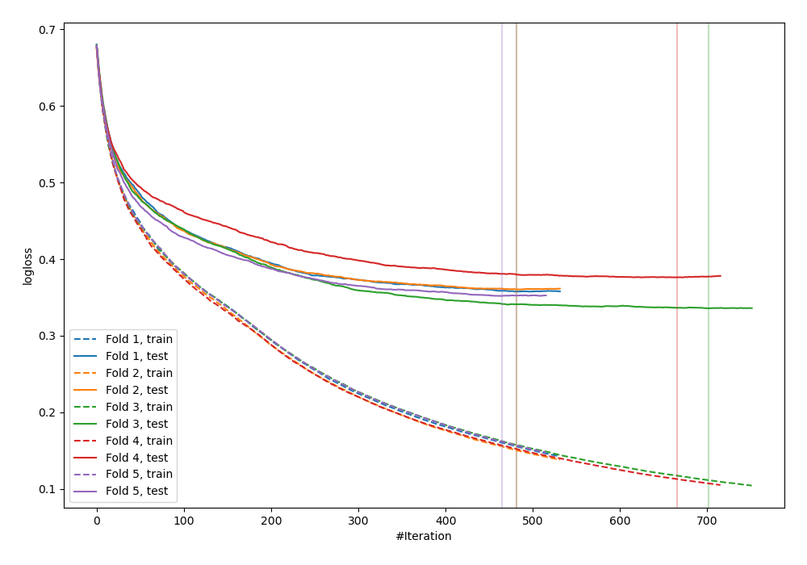
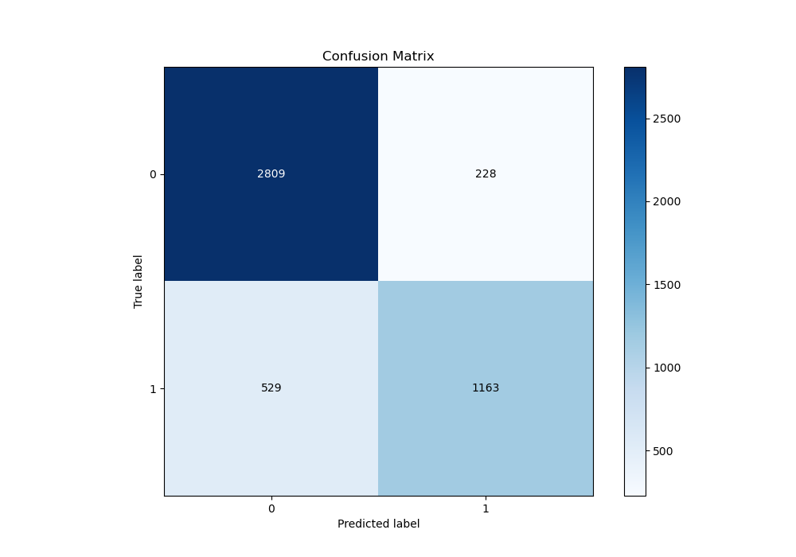
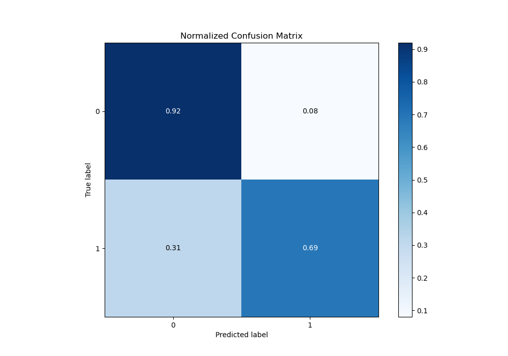
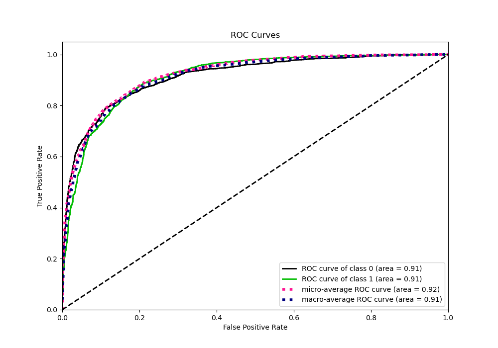
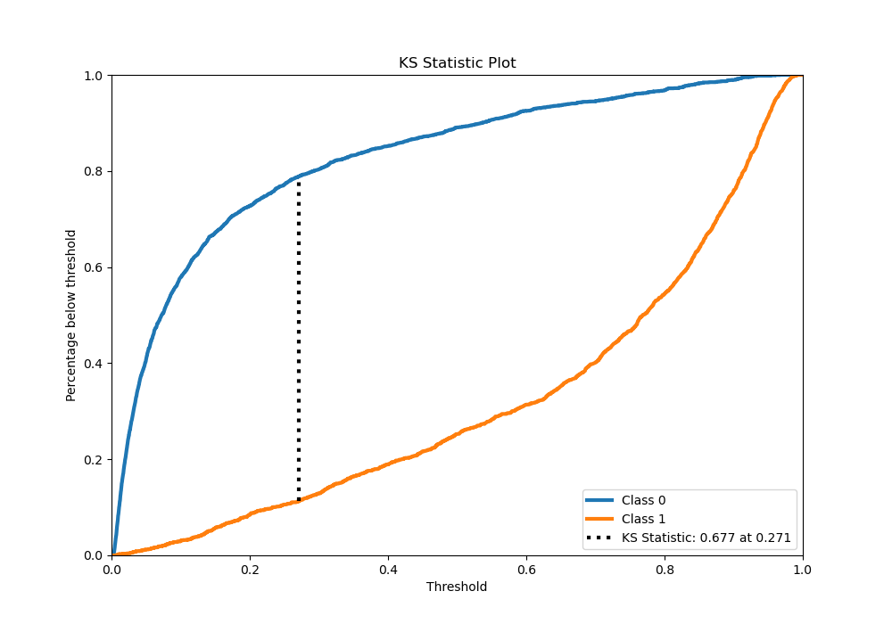
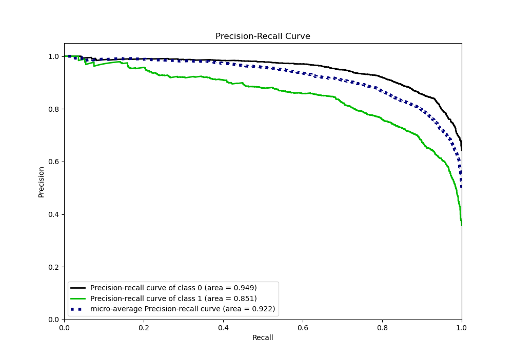
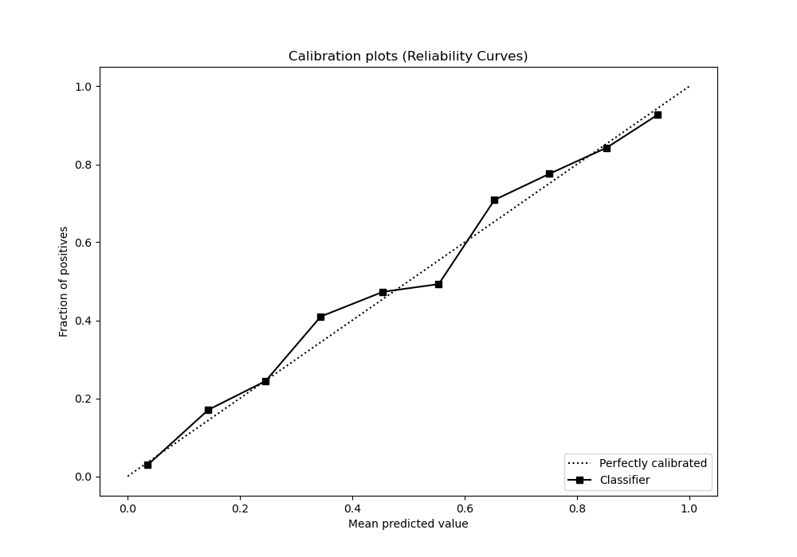
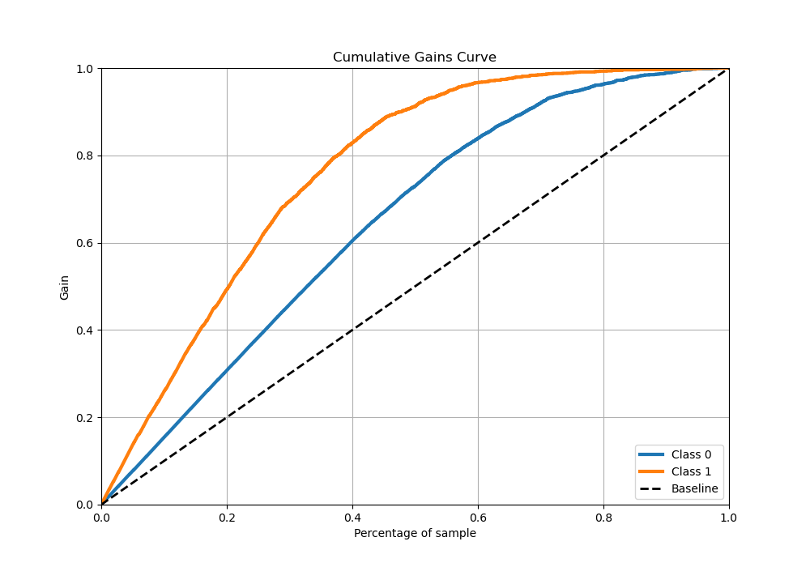
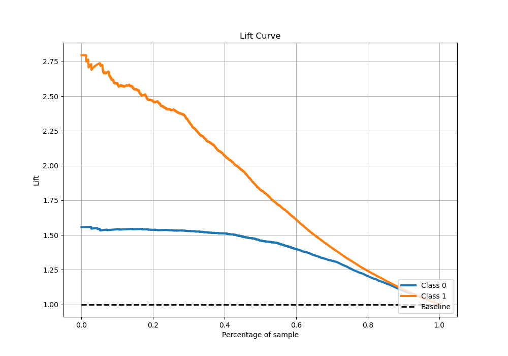

# Summary of 67_CatBoost

[<< Go back](../README.md)

## CatBoost
- **n_jobs**: -1
- **learning_rate**: 0.05
- **depth**: 7
- **rsm**: 0.9
- **loss_function**: Logloss
- **eval_metric**: Logloss
- **explain_level**: 0

## Validation
 - **validation_type**: kfold
 - **stratify**: True
 - **k_folds**: 5
 - **shuffle**: True
 - **random_seed**: 42

## Optimized metric
logloss

## Training time

77.7 seconds

## Metric details
|           |    score |    threshold |
|:----------|---------:|-------------:|
| logloss   | 0.356371 | nan          |
| auc       | 0.913714 | nan          |
| f1        | 0.784515 |   0.317984   |
| accuracy  | 0.839924 |   0.599015   |
| precision | 0.986667 |   0.964652   |
| recall    | 1        |   0.00232939 |
| mcc       | 0.655706 |   0.377967   |

## Metric details with threshold from accuracy metric
|           |    score |   threshold |
|:----------|---------:|------------:|
| logloss   | 0.356371 |  nan        |
| auc       | 0.913714 |  nan        |
| f1        | 0.75446  |    0.599015 |
| accuracy  | 0.839924 |    0.599015 |
| precision | 0.836089 |    0.599015 |
| recall    | 0.687352 |    0.599015 |
| mcc       | 0.644117 |    0.599015 |

## Confusion matrix (at threshold=0.599015)
|              |   Predicted as 0 |   Predicted as 1 |
|:-------------|-----------------:|-----------------:|
| Labeled as 0 |             2809 |              228 |
| Labeled as 1 |              529 |             1163 |

## Learning curves

## Confusion Matrix

## Normalized Confusion Matrix

## ROC Curve

## Kolmogorov-Smirnov Statistic

## Precision-Recall Curve

## Calibration Curve

## Cumulative Gains Curve

## Lift Curve

[<< Go back](../README.md)
