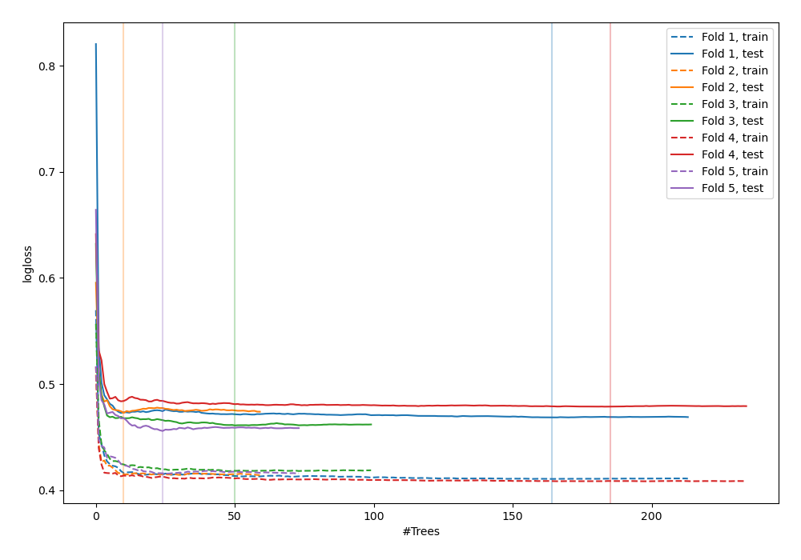
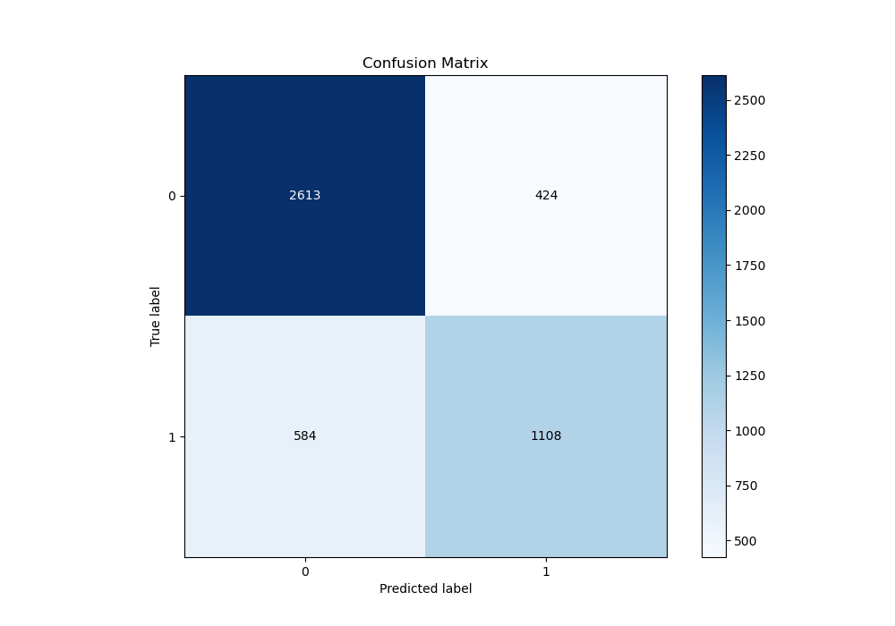
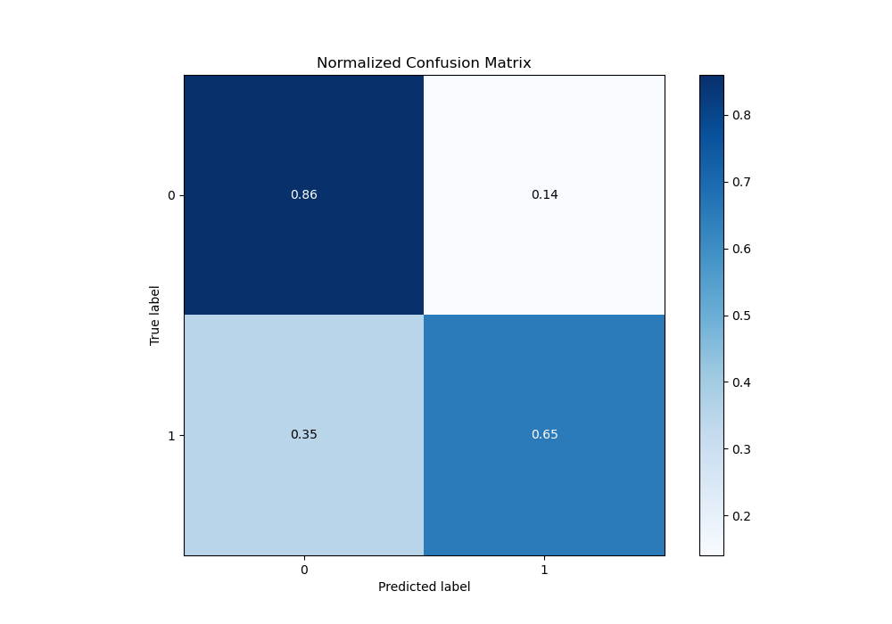
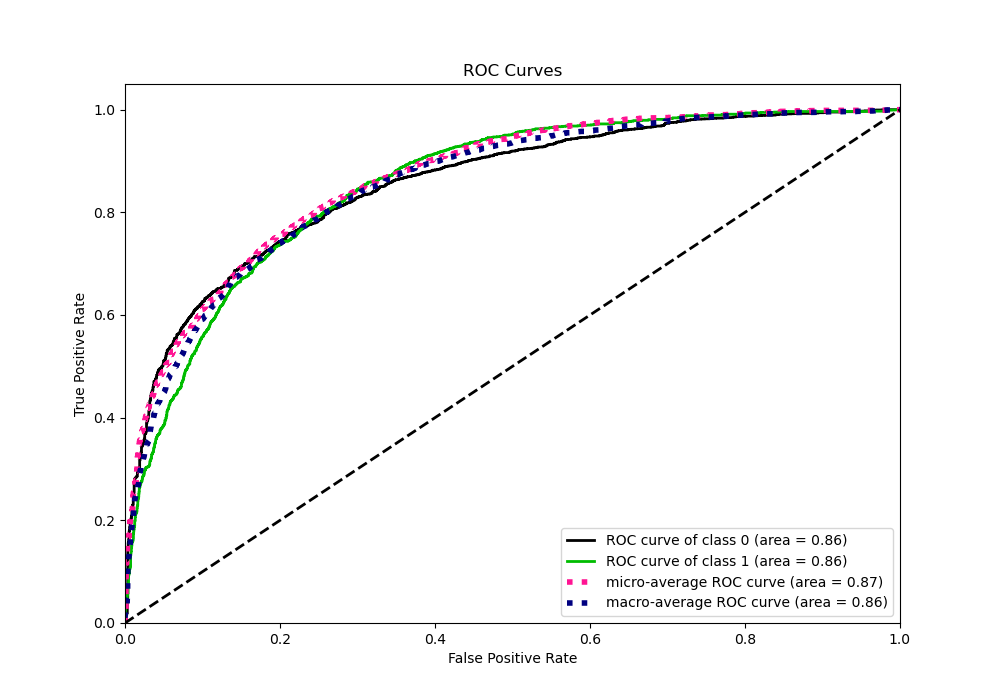
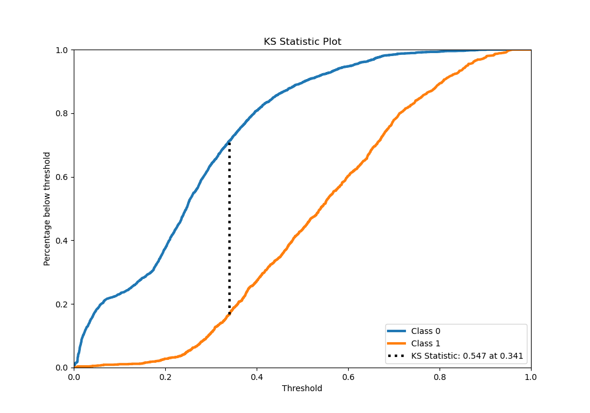
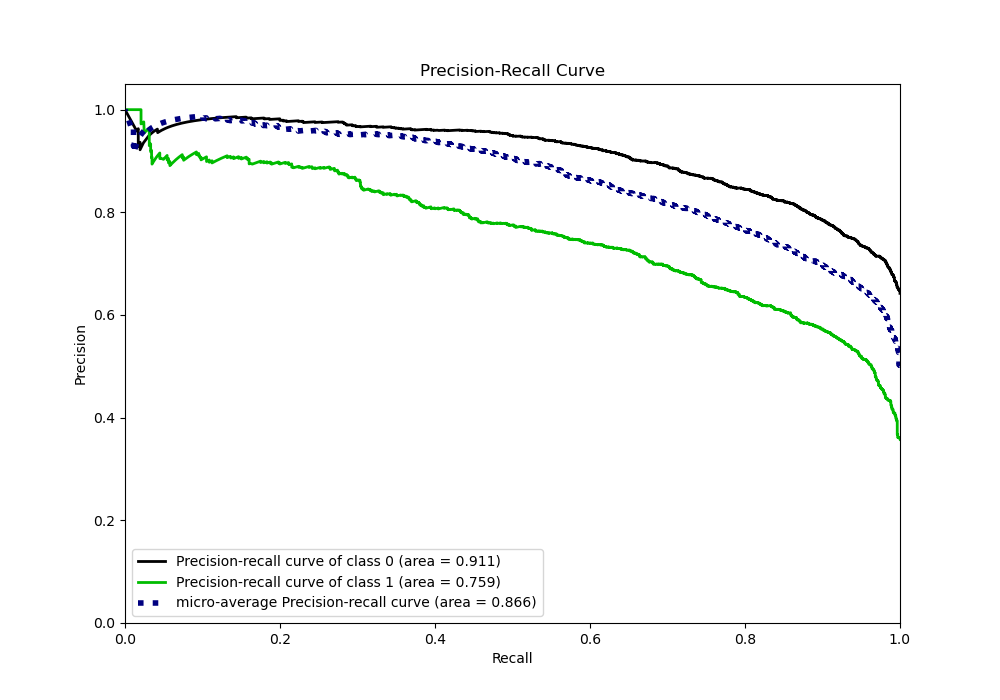
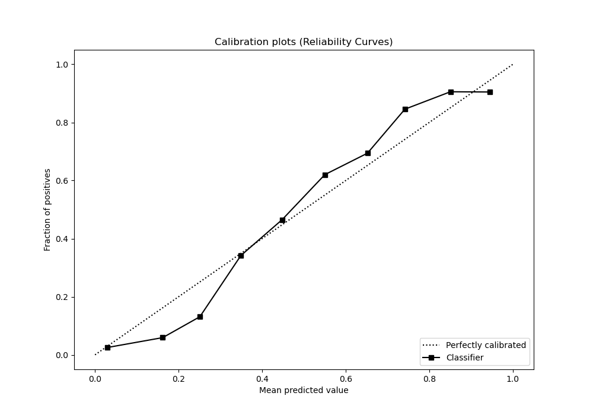
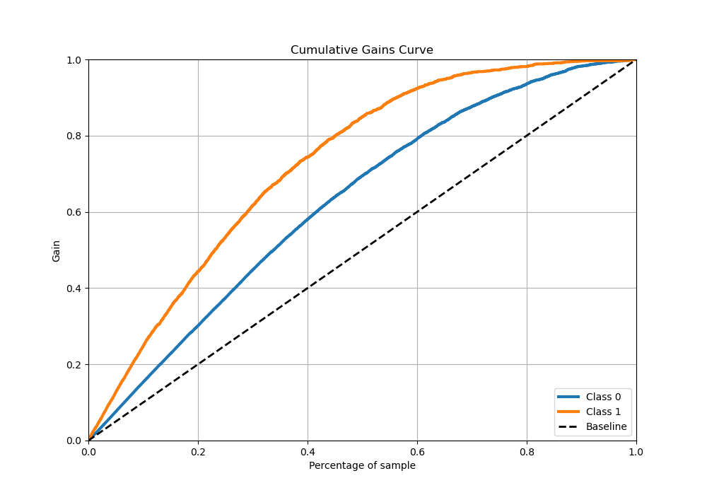
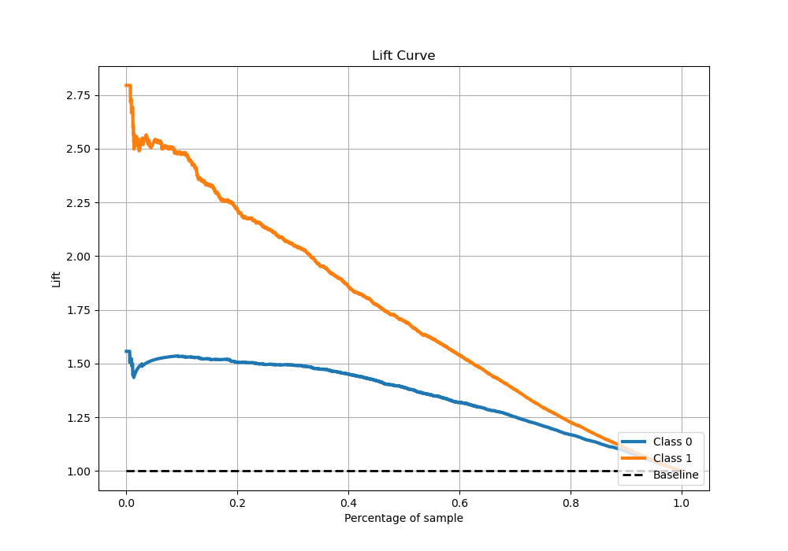

# Summary of 68_RandomForest

[<< Go back](../README.md)

## Random Forest
- **n_jobs**: -1
- **criterion**: entropy
- **max_features**: 0.7
- **min_samples_split**: 50
- **max_depth**: 7
- **eval_metric_name**: logloss
- **explain_level**: 0

## Validation
 - **validation_type**: kfold
 - **stratify**: True
 - **k_folds**: 5
 - **shuffle**: True
 - **random_seed**: 42

## Optimized metric
logloss

## Training time

47.4 seconds

## Metric details
|           |    score |    threshold |
|:----------|---------:|-------------:|
| logloss   | 0.467445 | nan          |
| auc       | 0.855791 | nan          |
| f1        | 0.709256 |   0.3403     |
| accuracy  | 0.786847 |   0.448435   |
| precision | 0.91716  |   0.814806   |
| recall    | 1        |   0.00377688 |
| mcc       | 0.527965 |   0.400249   |

## Metric details with threshold from accuracy metric
|           |    score |   threshold |
|:----------|---------:|------------:|
| logloss   | 0.467445 |  nan        |
| auc       | 0.855791 |  nan        |
| f1        | 0.687345 |    0.448435 |
| accuracy  | 0.786847 |    0.448435 |
| precision | 0.723238 |    0.448435 |
| recall    | 0.654846 |    0.448435 |
| mcc       | 0.527749 |    0.448435 |

## Confusion matrix (at threshold=0.448435)
|              |   Predicted as 0 |   Predicted as 1 |
|:-------------|-----------------:|-----------------:|
| Labeled as 0 |             2613 |              424 |
| Labeled as 1 |              584 |             1108 |

## Learning curves

## Confusion Matrix

## Normalized Confusion Matrix

## ROC Curve

## Kolmogorov-Smirnov Statistic

## Precision-Recall Curve

## Calibration Curve

## Cumulative Gains Curve

## Lift Curve

[<< Go back](../README.md)
