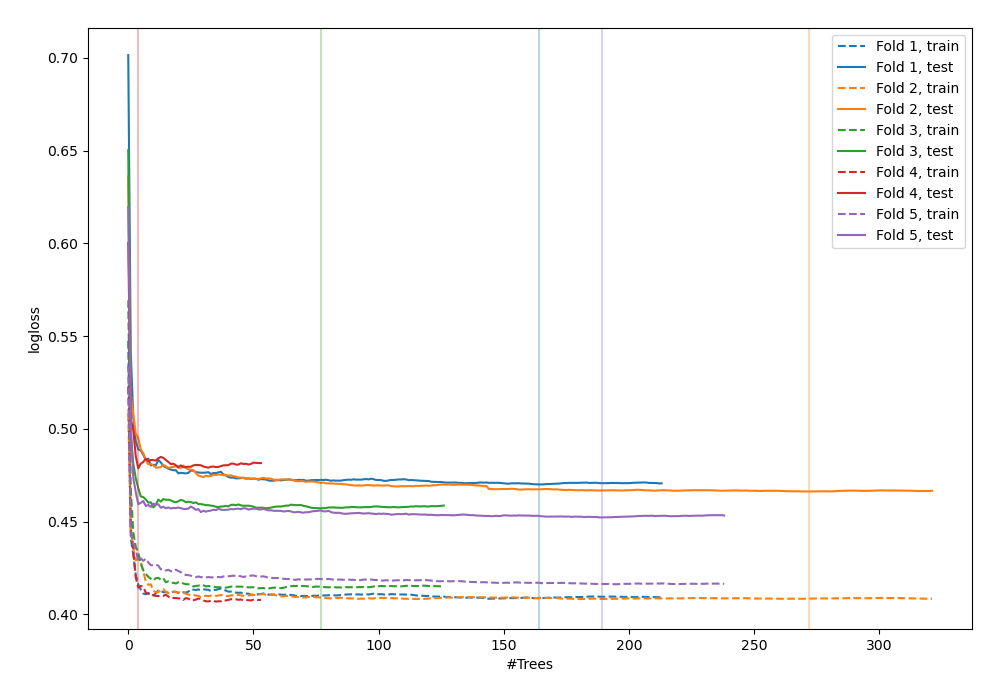
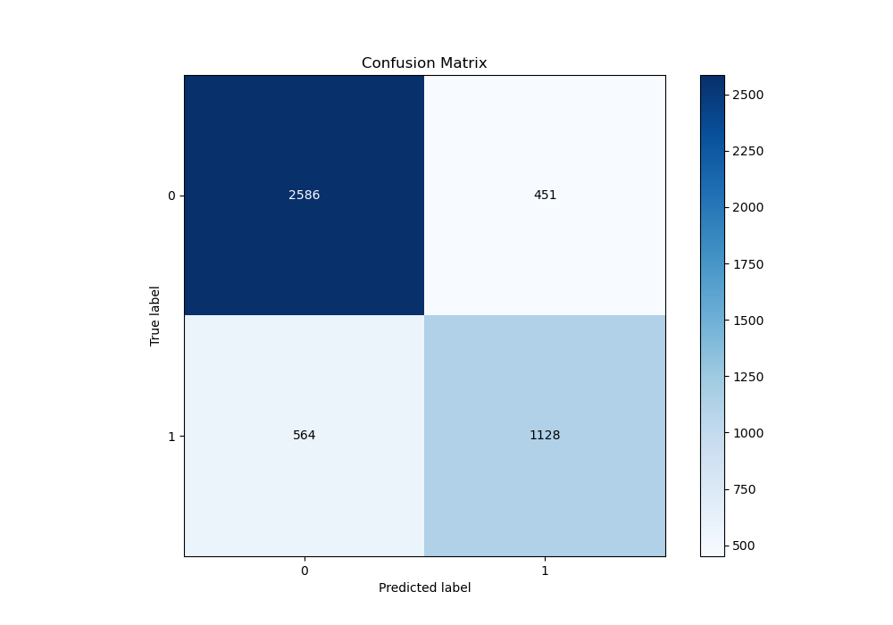
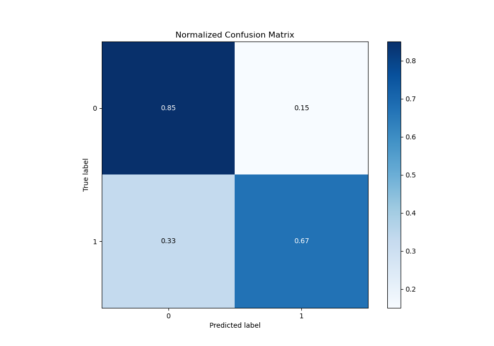
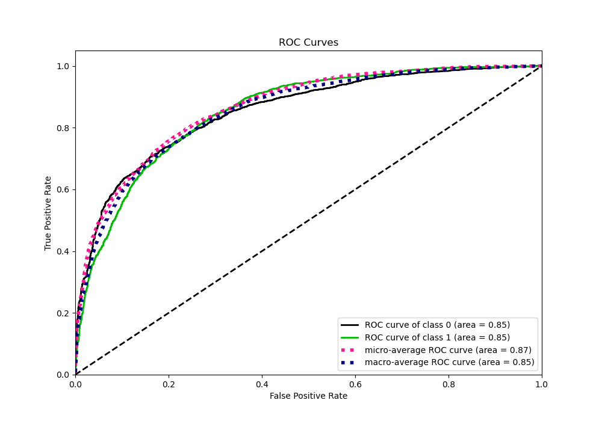
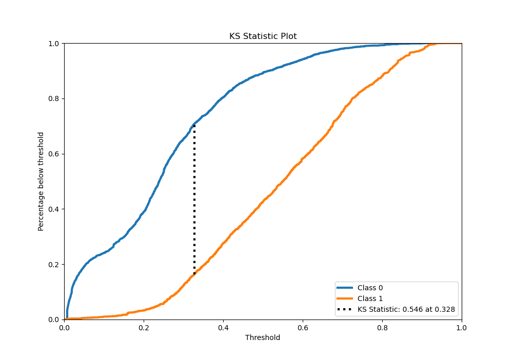
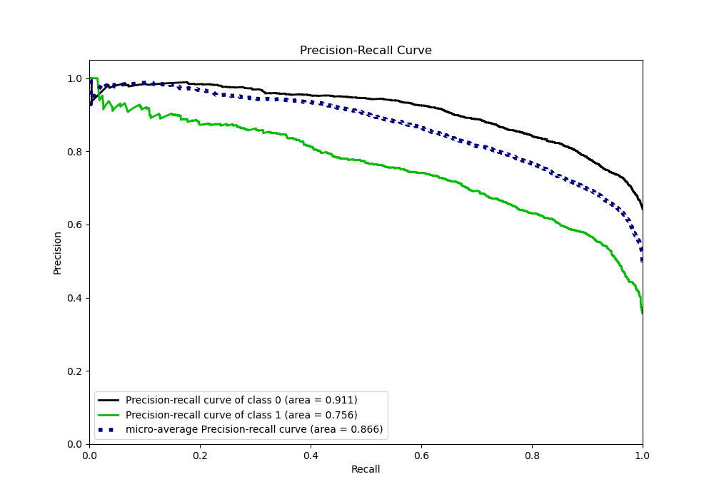
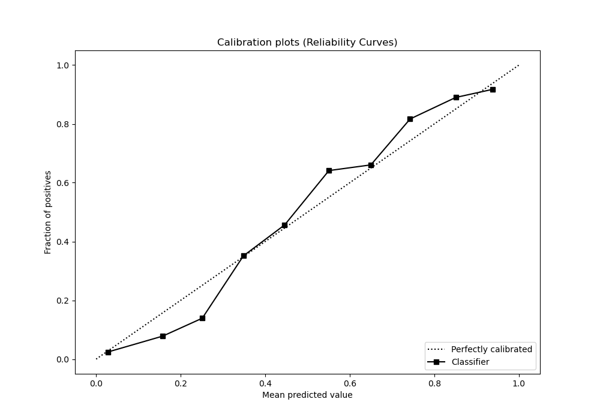
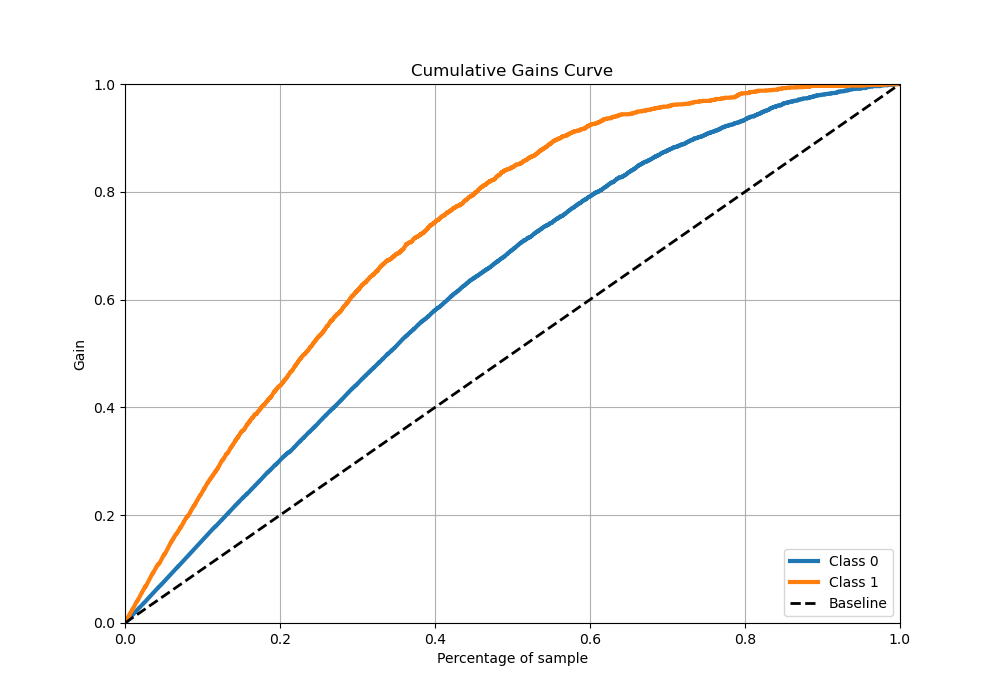
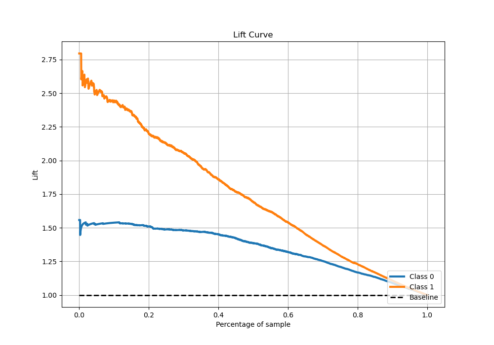

# Summary of 69_RandomForest

[<< Go back](../README.md)

## Random Forest
- **n_jobs**: -1
- **criterion**: entropy
- **max_features**: 0.9
- **min_samples_split**: 50
- **max_depth**: 7
- **eval_metric_name**: logloss
- **explain_level**: 0

## Validation
 - **validation_type**: kfold
 - **stratify**: True
 - **k_folds**: 5
 - **shuffle**: True
 - **random_seed**: 42

## Optimized metric
logloss

## Training time

60.7 seconds

## Metric details
|           |    score |    threshold |
|:----------|---------:|-------------:|
| logloss   | 0.464851 | nan          |
| auc       | 0.85385  | nan          |
| f1        | 0.707883 |   0.345531   |
| accuracy  | 0.785367 |   0.439539   |
| precision | 0.9375   |   0.869102   |
| recall    | 1        |   0.00487111 |
| mcc       | 0.526677 |   0.439539   |

## Metric details with threshold from accuracy metric
|           |    score |   threshold |
|:----------|---------:|------------:|
| logloss   | 0.464851 |  nan        |
| auc       | 0.85385  |  nan        |
| f1        | 0.689697 |    0.439539 |
| accuracy  | 0.785367 |    0.439539 |
| precision | 0.714376 |    0.439539 |
| recall    | 0.666667 |    0.439539 |
| mcc       | 0.526677 |    0.439539 |

## Confusion matrix (at threshold=0.439539)
|              |   Predicted as 0 |   Predicted as 1 |
|:-------------|-----------------:|-----------------:|
| Labeled as 0 |             2586 |              451 |
| Labeled as 1 |              564 |             1128 |

## Learning curves

## Confusion Matrix

## Normalized Confusion Matrix

## ROC Curve

## Kolmogorov-Smirnov Statistic

## Precision-Recall Curve

## Calibration Curve

## Cumulative Gains Curve

## Lift Curve

[<< Go back](../README.md)
