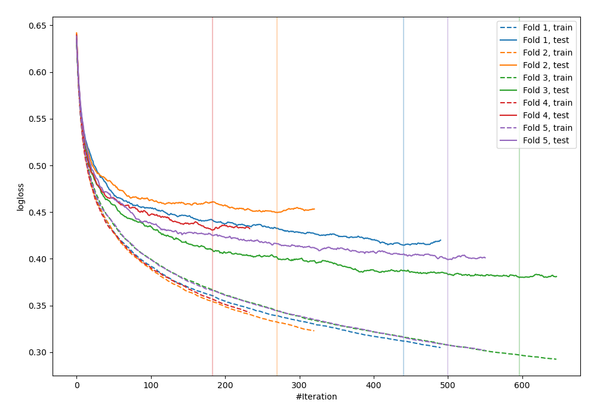
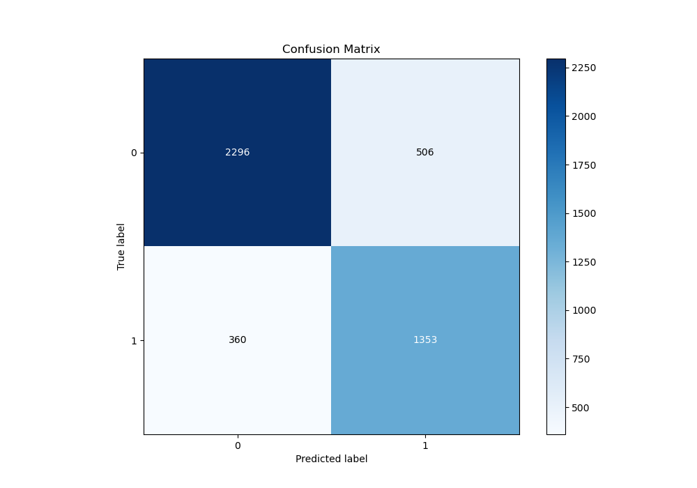
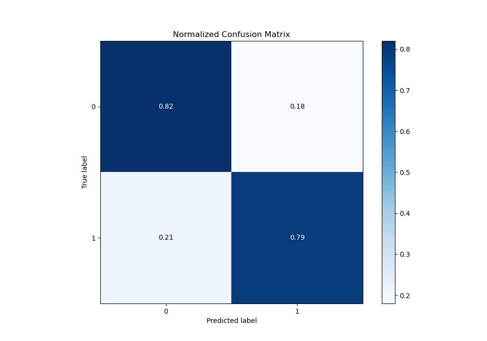
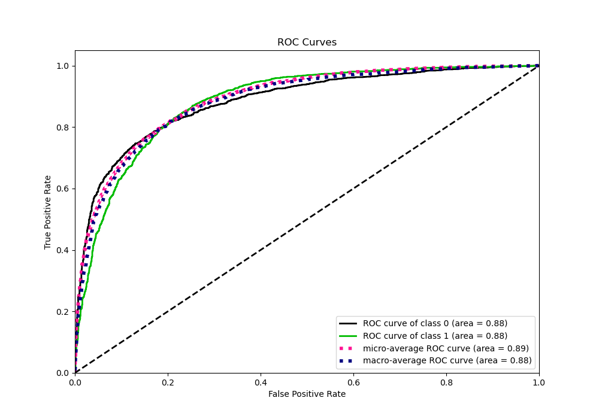
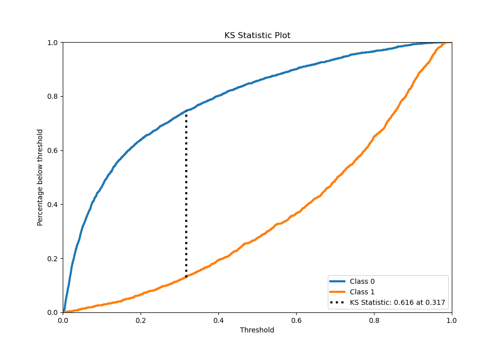
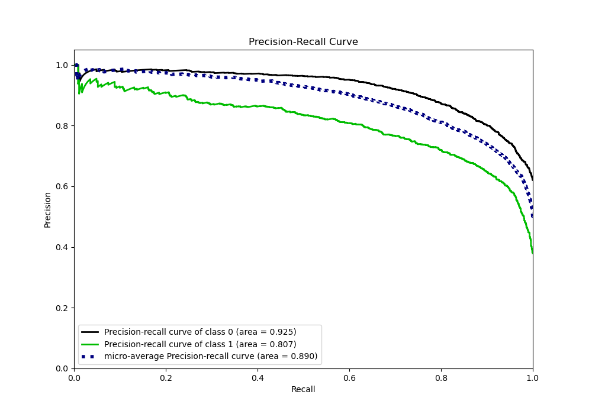
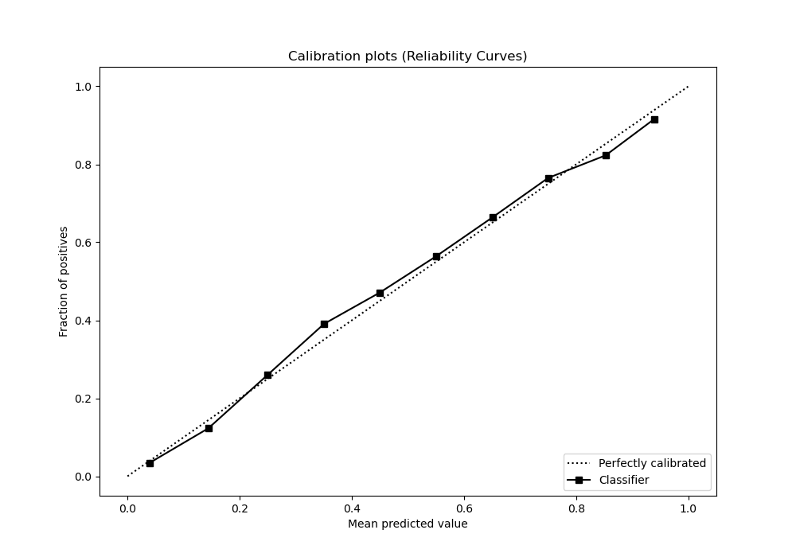
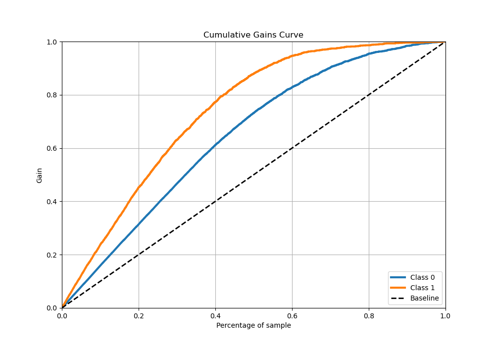
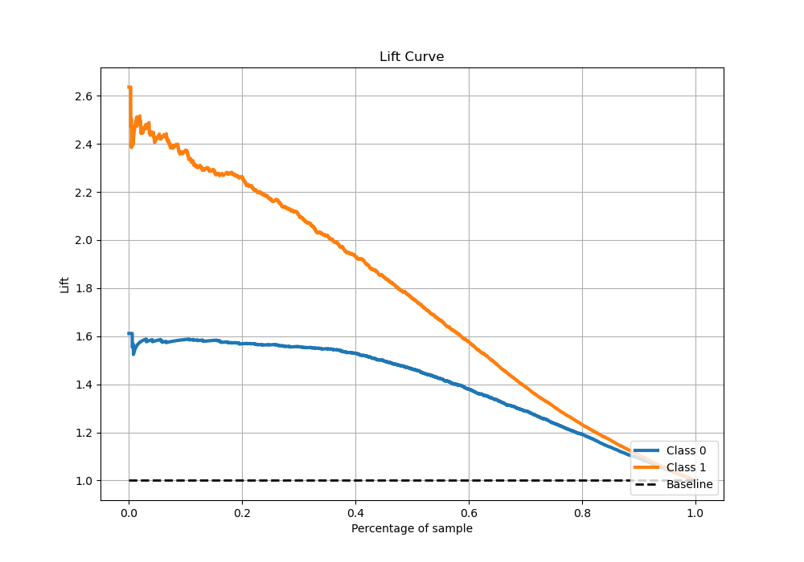

# Summary of 6_Xgboost

[<< Go back](../README.md)

## Extreme Gradient Boosting (Xgboost)
- **n_jobs**: -1
- **objective**: binary:logistic
- **eta**: 0.15
- **max_depth**: 6
- **min_child_weight**: 25
- **subsample**: 0.5
- **colsample_bytree**: 0.5
- **eval_metric**: logloss
- **explain_level**: 0

## Validation
 - **validation_type**: kfold
 - **stratify**: True
 - **k_folds**: 5
 - **shuffle**: True
 - **random_seed**: 42

## Optimized metric
logloss

## Training time

80.9 seconds

## Metric details
|           |    score |    threshold |
|:----------|---------:|-------------:|
| logloss   | 0.414794 | nan          |
| auc       | 0.884195 | nan          |
| f1        | 0.760661 |   0.370762   |
| accuracy  | 0.808195 |   0.426882   |
| precision | 0.949153 |   0.95899    |
| recall    | 1        |   0.00130032 |
| mcc       | 0.600703 |   0.426882   |

## Metric details with threshold from accuracy metric
|           |    score |   threshold |
|:----------|---------:|------------:|
| logloss   | 0.414794 |  nan        |
| auc       | 0.884195 |  nan        |
| f1        | 0.757559 |    0.426882 |
| accuracy  | 0.808195 |    0.426882 |
| precision | 0.727811 |    0.426882 |
| recall    | 0.789842 |    0.426882 |
| mcc       | 0.600703 |    0.426882 |

## Confusion matrix (at threshold=0.426882)
|              |   Predicted as 0 |   Predicted as 1 |
|:-------------|-----------------:|-----------------:|
| Labeled as 0 |             2296 |              506 |
| Labeled as 1 |              360 |             1353 |

## Learning curves

## Confusion Matrix

## Normalized Confusion Matrix

## ROC Curve

## Kolmogorov-Smirnov Statistic

## Precision-Recall Curve

## Calibration Curve

## Cumulative Gains Curve

## Lift Curve

[<< Go back](../README.md)
