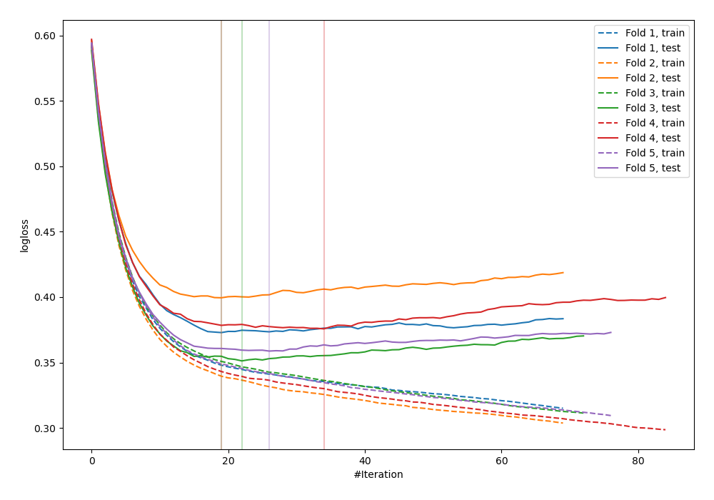
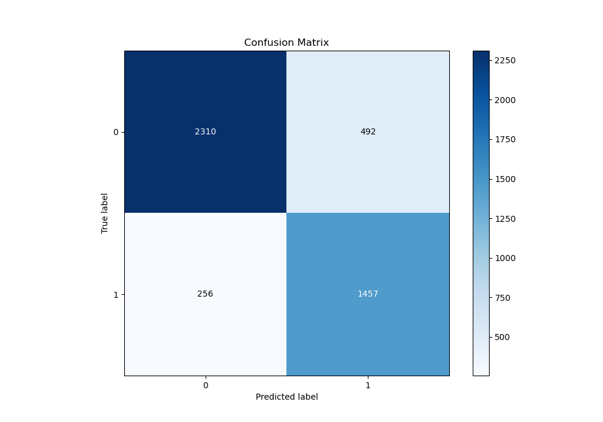
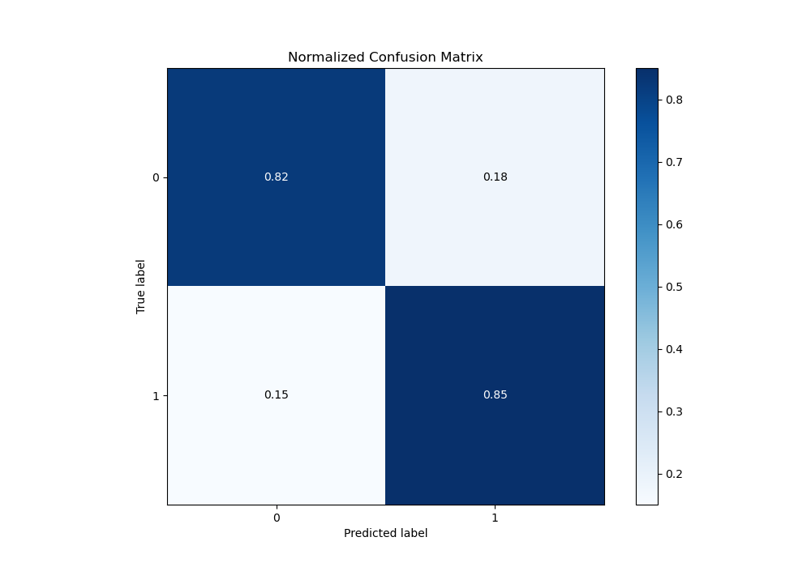
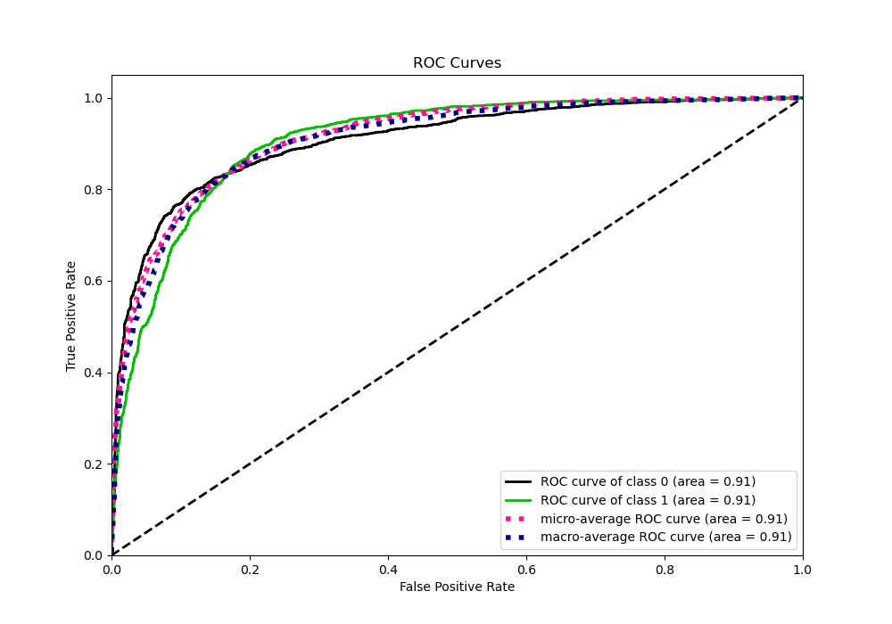
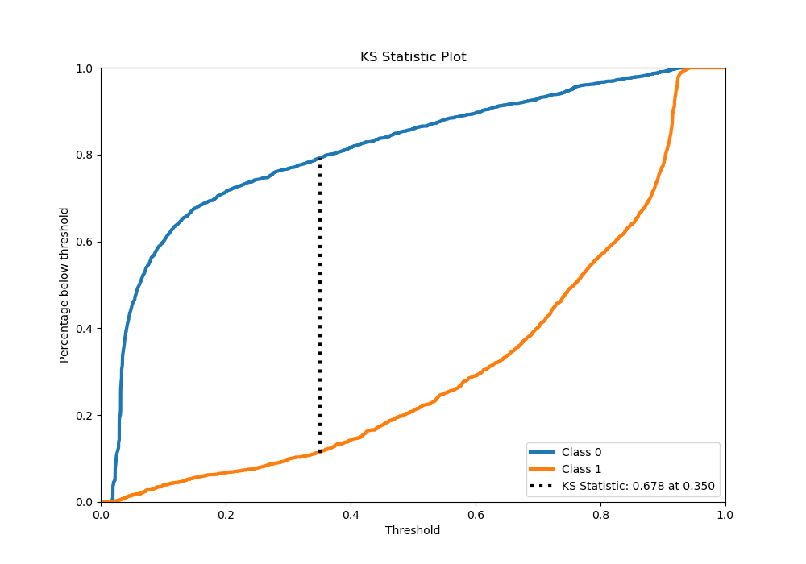
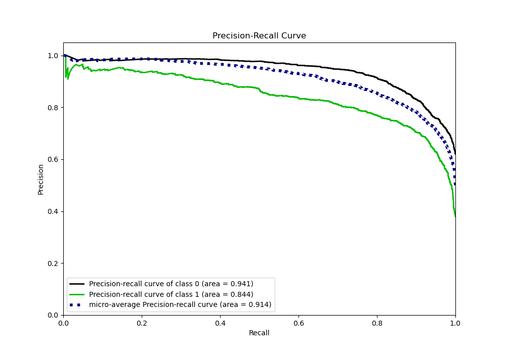
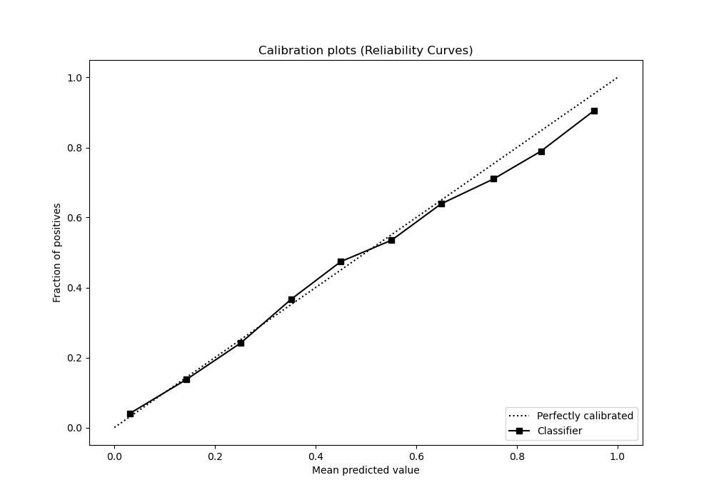
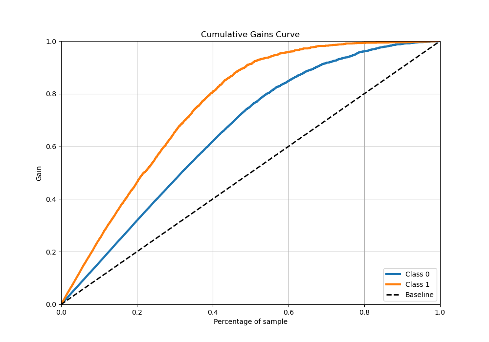
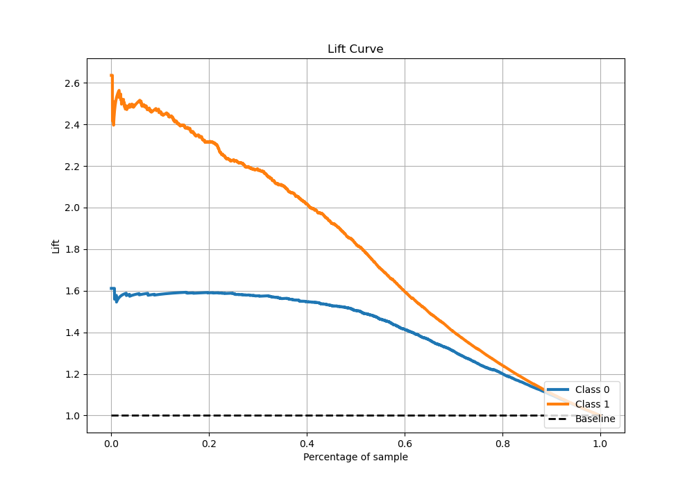

# Summary of 6_Xgboost_Stacked

[<< Go back](../README.md)

## Extreme Gradient Boosting (Xgboost)
- **n_jobs**: -1
- **objective**: binary:logistic
- **eta**: 0.15
- **max_depth**: 6
- **min_child_weight**: 25
- **subsample**: 0.5
- **colsample_bytree**: 0.5
- **eval_metric**: logloss
- **explain_level**: 0

## Validation
 - **validation_type**: kfold
 - **stratify**: True
 - **k_folds**: 5
 - **shuffle**: True
 - **random_seed**: 42

## Optimized metric
logloss

## Training time

44.9 seconds

## Metric details
|           |    score |   threshold |
|:----------|---------:|------------:|
| logloss   | 0.371608 | nan         |
| auc       | 0.9079   | nan         |
| f1        | 0.79574  |   0.416313  |
| accuracy  | 0.83433  |   0.416313  |
| precision | 0.964912 |   0.923163  |
| recall    | 1        |   0.0140723 |
| mcc       | 0.661242 |   0.416313  |

## Metric details with threshold from accuracy metric
|           |    score |   threshold |
|:----------|---------:|------------:|
| logloss   | 0.371608 |  nan        |
| auc       | 0.9079   |  nan        |
| f1        | 0.79574  |    0.416313 |
| accuracy  | 0.83433  |    0.416313 |
| precision | 0.747563 |    0.416313 |
| recall    | 0.850555 |    0.416313 |
| mcc       | 0.661242 |    0.416313 |

## Confusion matrix (at threshold=0.416313)
|              |   Predicted as 0 |   Predicted as 1 |
|:-------------|-----------------:|-----------------:|
| Labeled as 0 |             2310 |              492 |
| Labeled as 1 |              256 |             1457 |

## Learning curves

## Confusion Matrix

## Normalized Confusion Matrix

## ROC Curve

## Kolmogorov-Smirnov Statistic

## Precision-Recall Curve

## Calibration Curve

## Cumulative Gains Curve

## Lift Curve

[<< Go back](../README.md)
