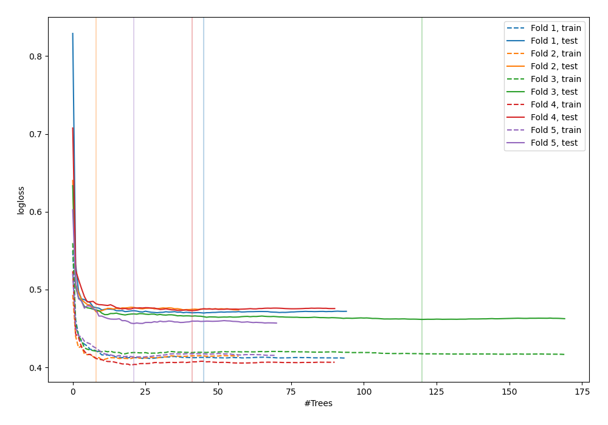
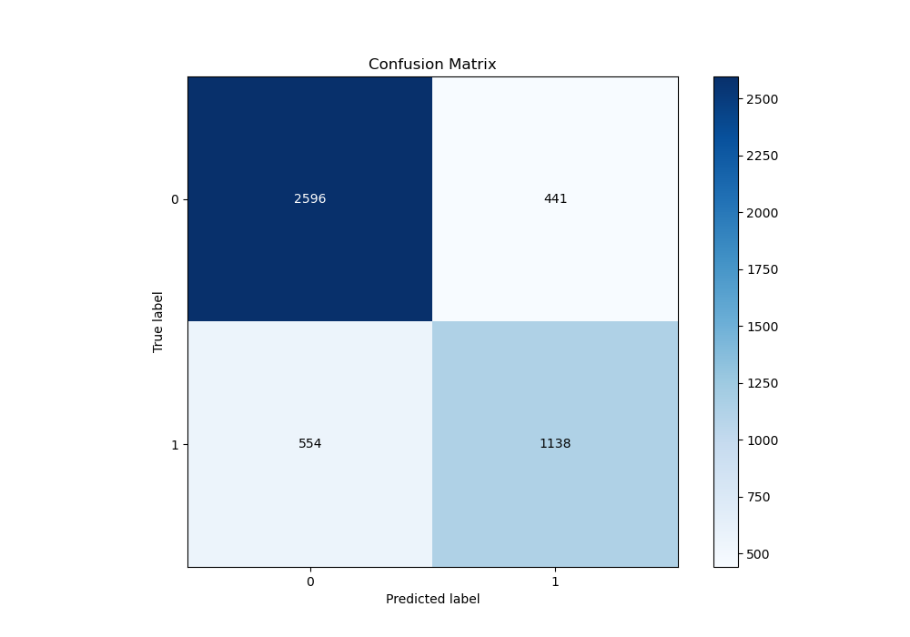
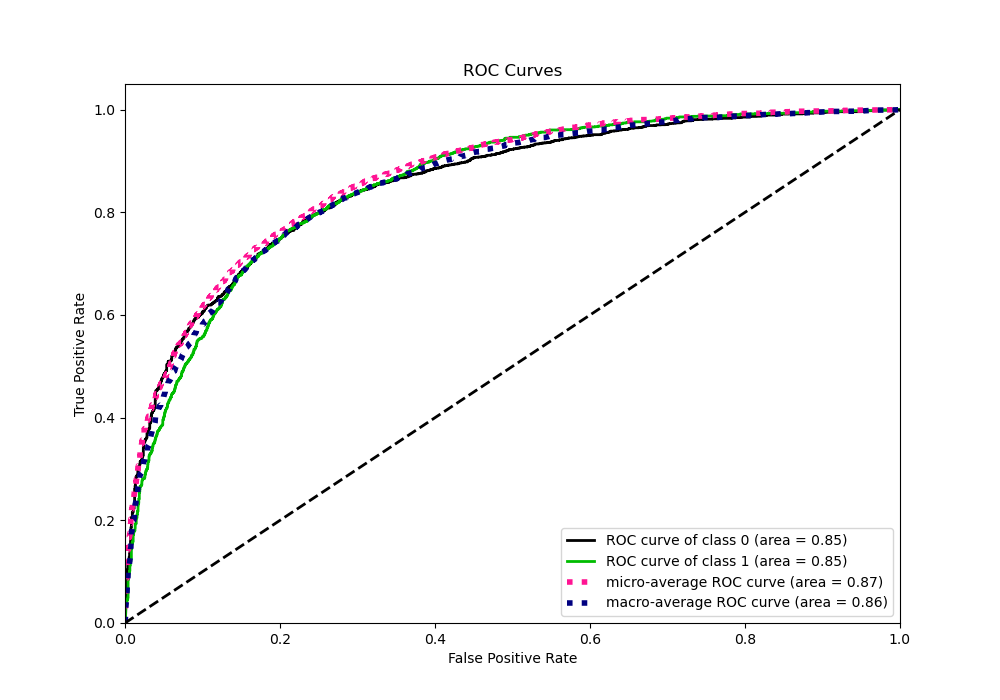
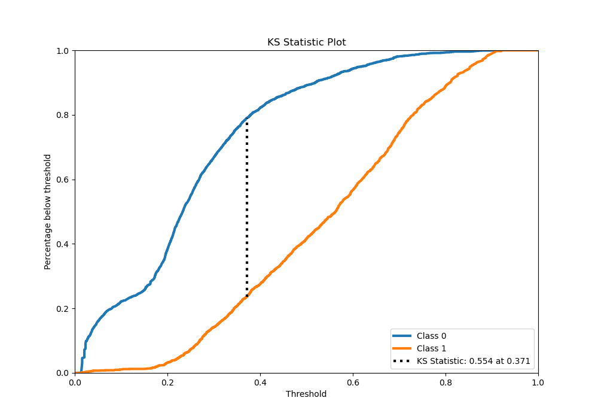
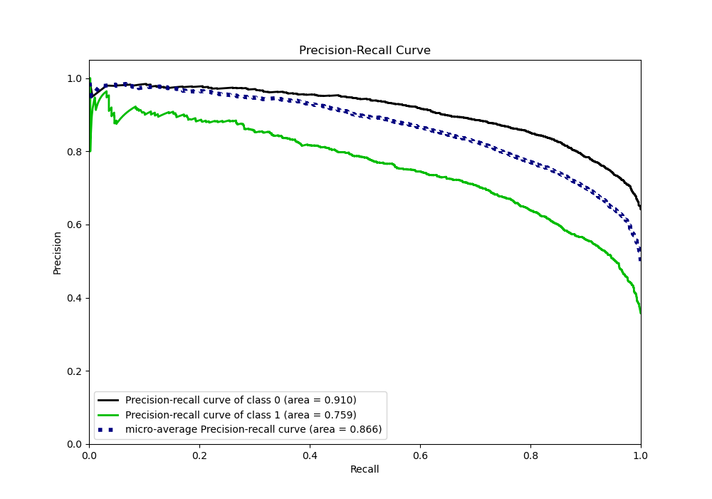
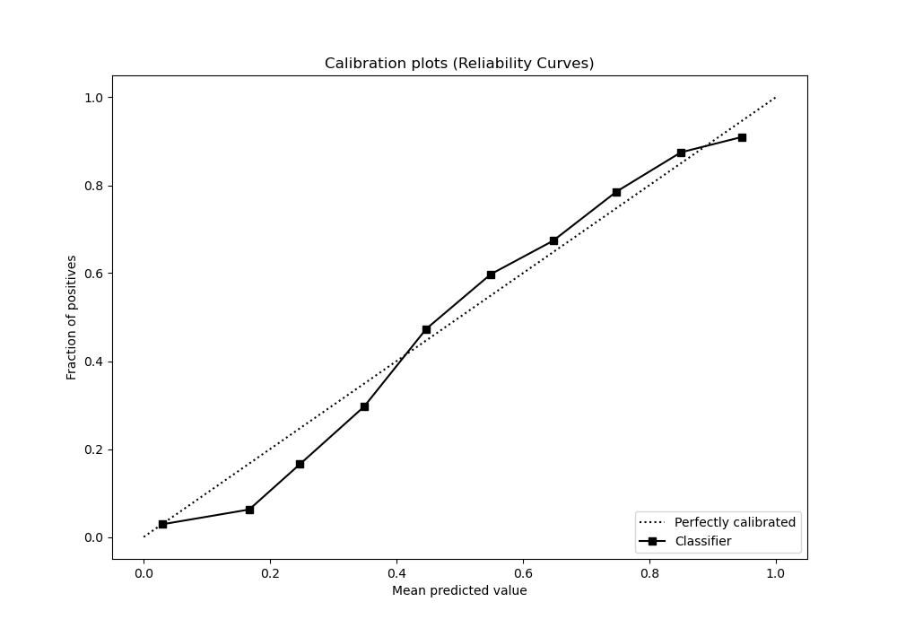
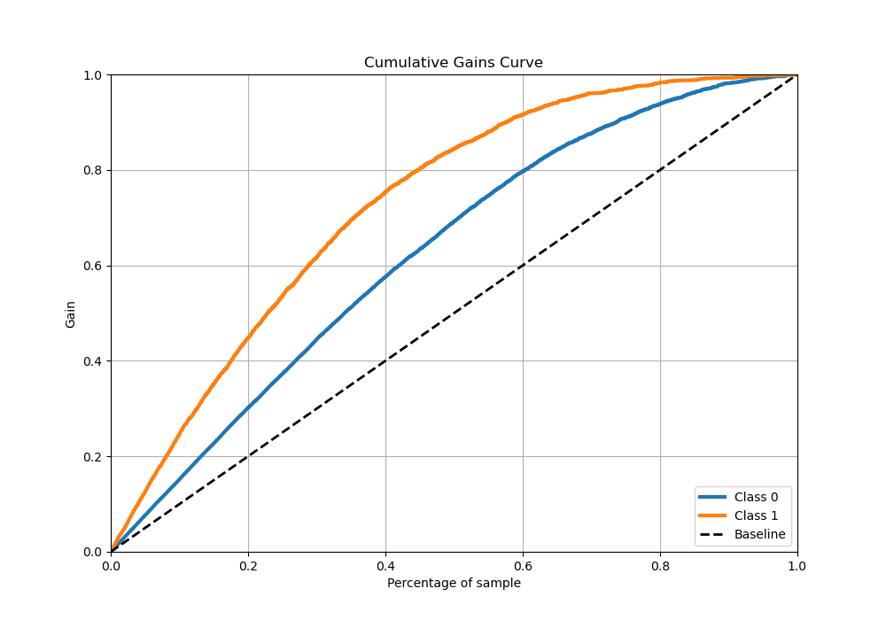
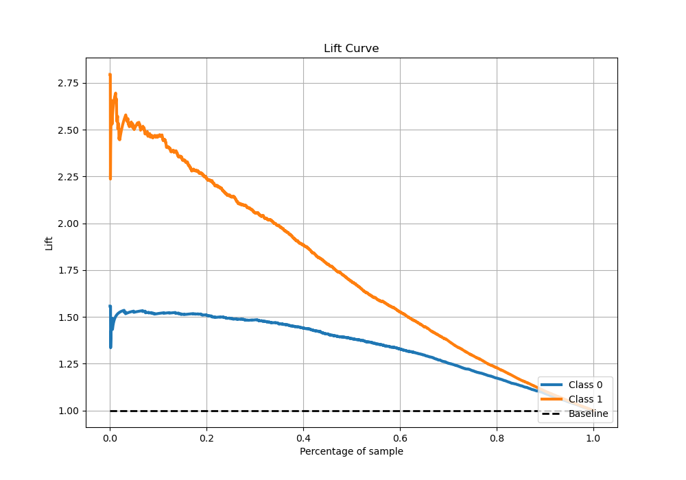

# Summary of 70_RandomForest

[<< Go back](../README.md)

## Random Forest
- **n_jobs**: -1
- **criterion**: gini
- **max_features**: 0.7
- **min_samples_split**: 50
- **max_depth**: 7
- **eval_metric_name**: logloss
- **explain_level**: 0

## Validation
 - **validation_type**: kfold
 - **stratify**: True
 - **k_folds**: 5
 - **shuffle**: True
 - **random_seed**: 42

## Optimized metric
logloss

## Training time

39.5 seconds

## Metric details
|           |    score |   threshold |
|:----------|---------:|------------:|
| logloss   | 0.466431 | nan         |
| auc       | 0.854887 | nan         |
| f1        | 0.712915 |   0.367659  |
| accuracy  | 0.789596 |   0.438141  |
| precision | 0.92     |   0.86574   |
| recall    | 1        |   0.0122883 |
| mcc       | 0.540543 |   0.400405  |

## Metric details with threshold from accuracy metric
|           |    score |   threshold |
|:----------|---------:|------------:|
| logloss   | 0.466431 |  nan        |
| auc       | 0.854887 |  nan        |
| f1        | 0.695812 |    0.438141 |
| accuracy  | 0.789596 |    0.438141 |
| precision | 0.720709 |    0.438141 |
| recall    | 0.672577 |    0.438141 |
| mcc       | 0.536031 |    0.438141 |

## Confusion matrix (at threshold=0.438141)
|              |   Predicted as 0 |   Predicted as 1 |
|:-------------|-----------------:|-----------------:|
| Labeled as 0 |             2596 |              441 |
| Labeled as 1 |              554 |             1138 |

## Learning curves

## Confusion Matrix

## Normalized Confusion Matrix

## ROC Curve

## Kolmogorov-Smirnov Statistic

## Precision-Recall Curve

## Calibration Curve

## Cumulative Gains Curve

## Lift Curve

[<< Go back](../README.md)
