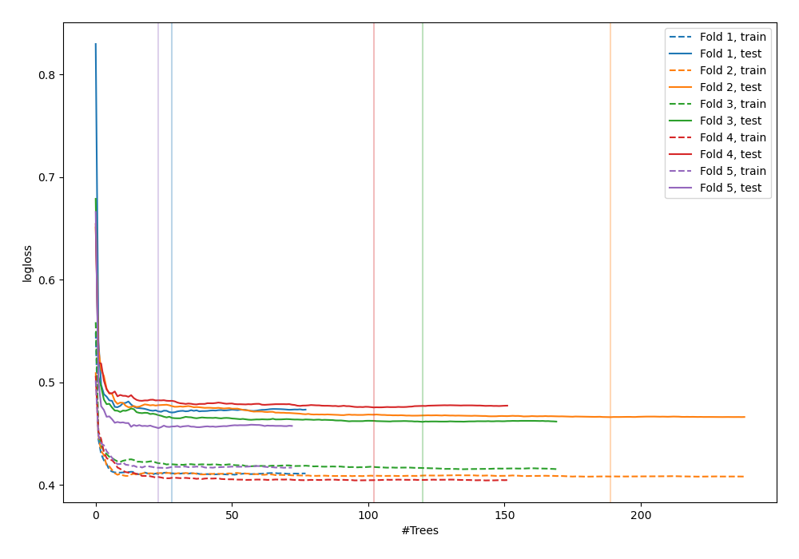
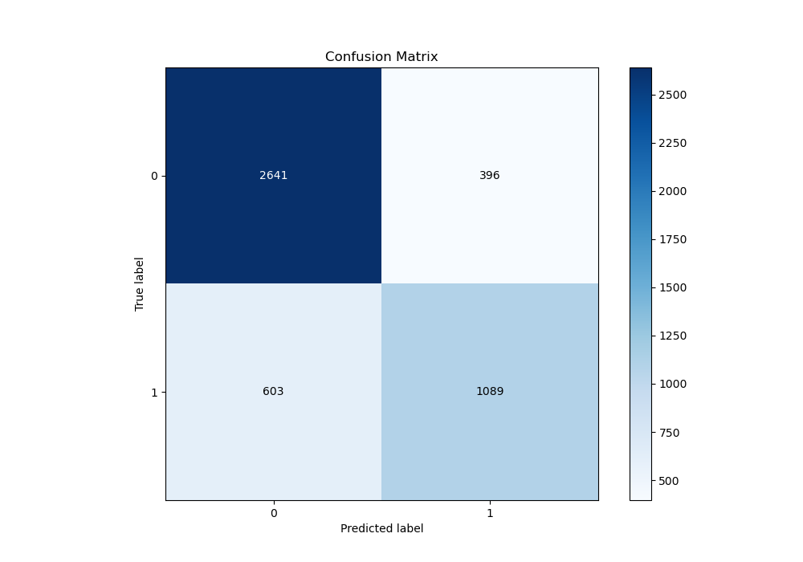
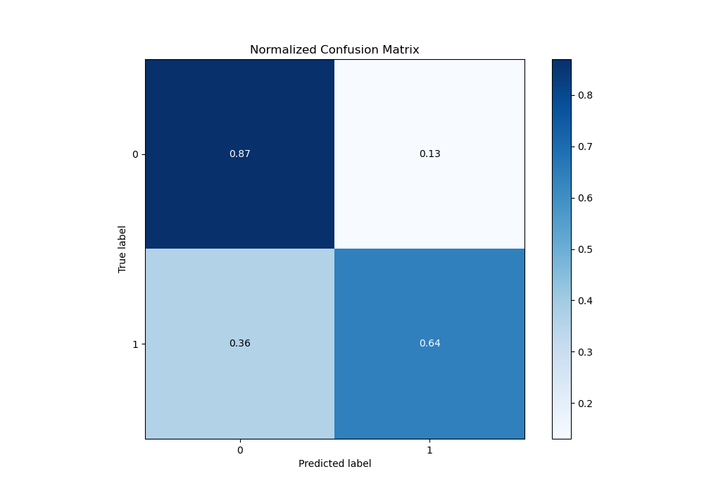
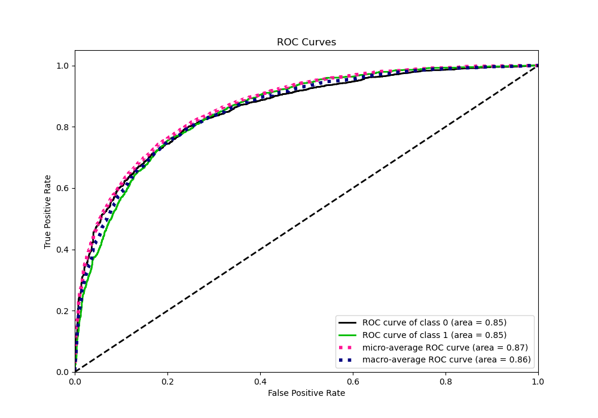
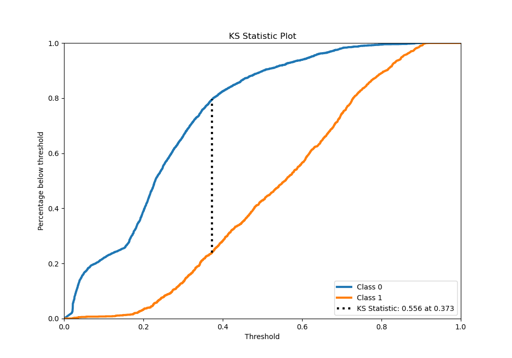
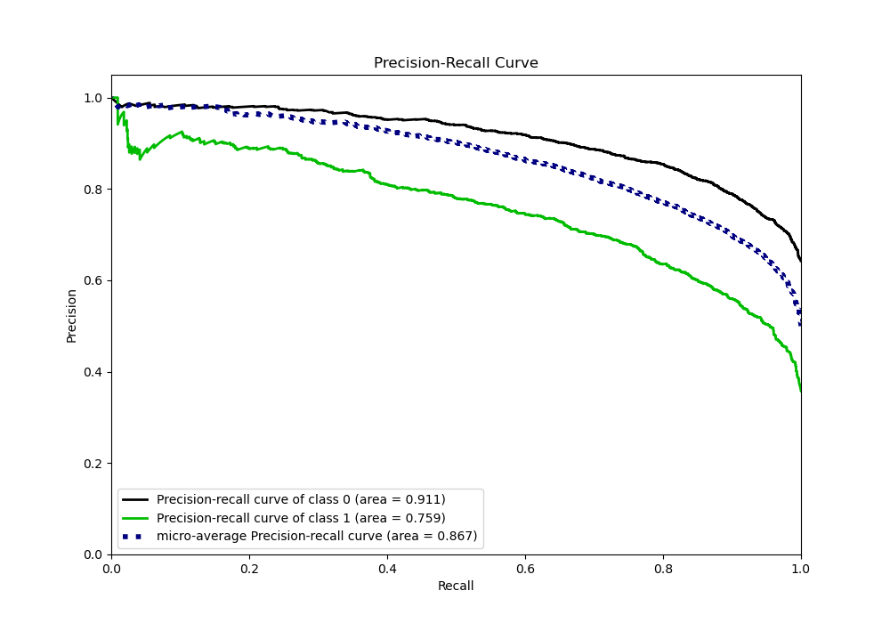
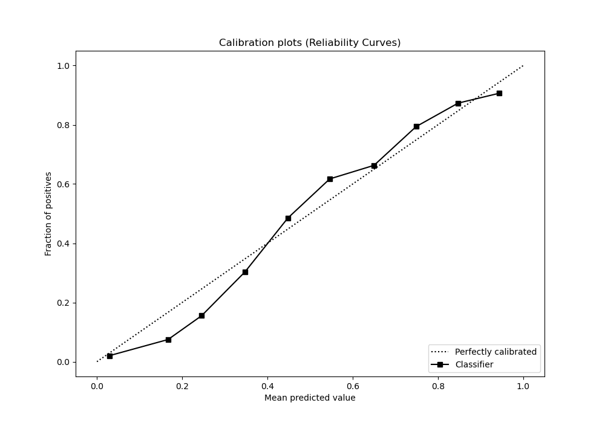
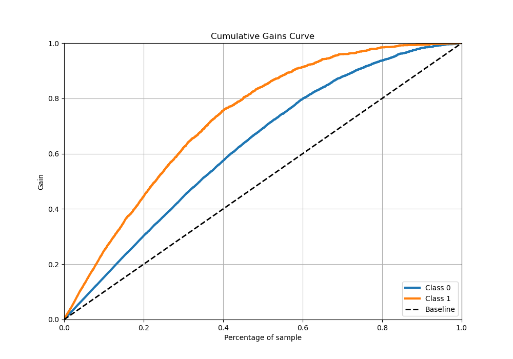
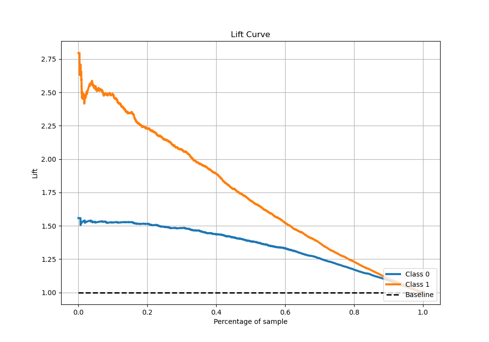

# Summary of 71_RandomForest

[<< Go back](../README.md)

## Random Forest
- **n_jobs**: -1
- **criterion**: gini
- **max_features**: 0.9
- **min_samples_split**: 50
- **max_depth**: 7
- **eval_metric_name**: logloss
- **explain_level**: 0

## Validation
 - **validation_type**: kfold
 - **stratify**: True
 - **k_folds**: 5
 - **shuffle**: True
 - **random_seed**: 42

## Optimized metric
logloss

## Training time

51.0 seconds

## Metric details
|           |    score |   threshold |
|:----------|---------:|------------:|
| logloss   | 0.465746 | nan         |
| auc       | 0.85484  | nan         |
| f1        | 0.715    |   0.373267  |
| accuracy  | 0.78875  |   0.45423   |
| precision | 0.91716  |   0.819326  |
| recall    | 1        |   0.0132463 |
| mcc       | 0.543415 |   0.373267  |

## Metric details with threshold from accuracy metric
|           |    score |   threshold |
|:----------|---------:|------------:|
| logloss   | 0.465746 |   nan       |
| auc       | 0.85484  |   nan       |
| f1        | 0.685552 |     0.45423 |
| accuracy  | 0.78875  |     0.45423 |
| precision | 0.733333 |     0.45423 |
| recall    | 0.643617 |     0.45423 |
| mcc       | 0.530062 |     0.45423 |

## Confusion matrix (at threshold=0.45423)
|              |   Predicted as 0 |   Predicted as 1 |
|:-------------|-----------------:|-----------------:|
| Labeled as 0 |             2641 |              396 |
| Labeled as 1 |              603 |             1089 |

## Learning curves

## Confusion Matrix

## Normalized Confusion Matrix

## ROC Curve

## Kolmogorov-Smirnov Statistic

## Precision-Recall Curve

## Calibration Curve

## Cumulative Gains Curve

## Lift Curve

[<< Go back](../README.md)
