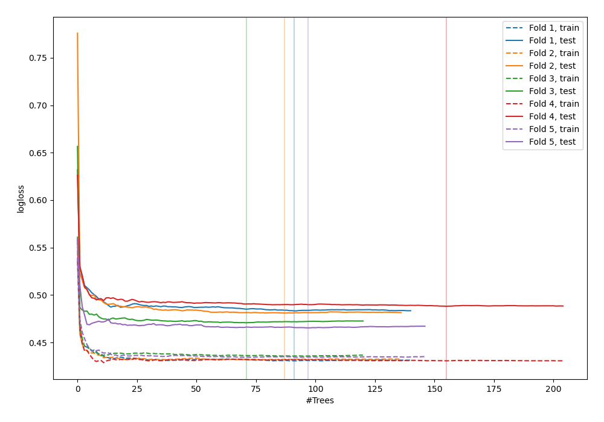
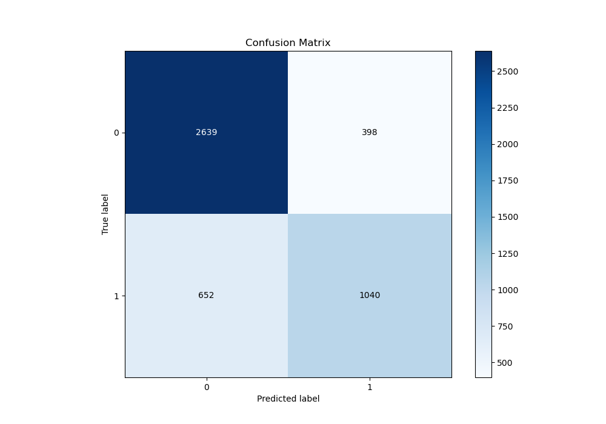
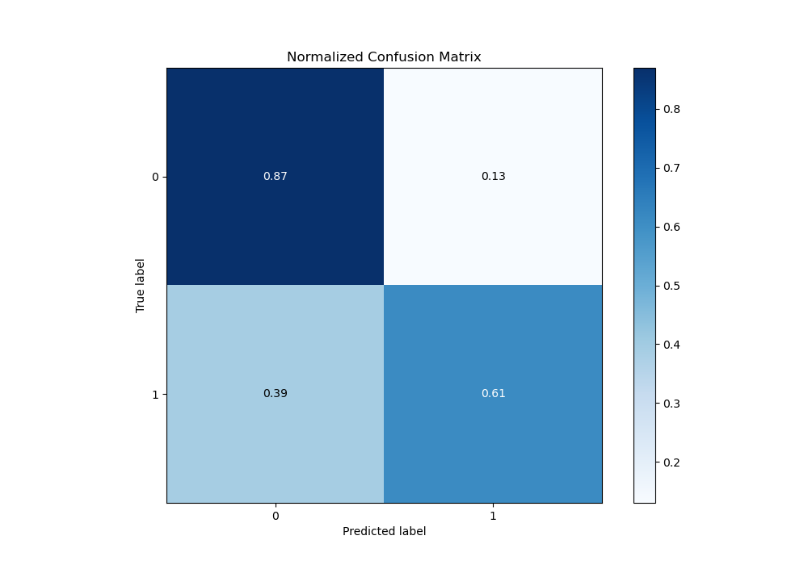
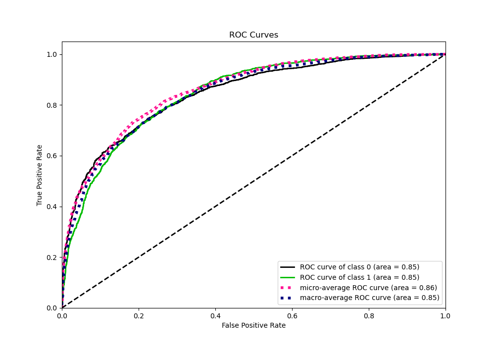
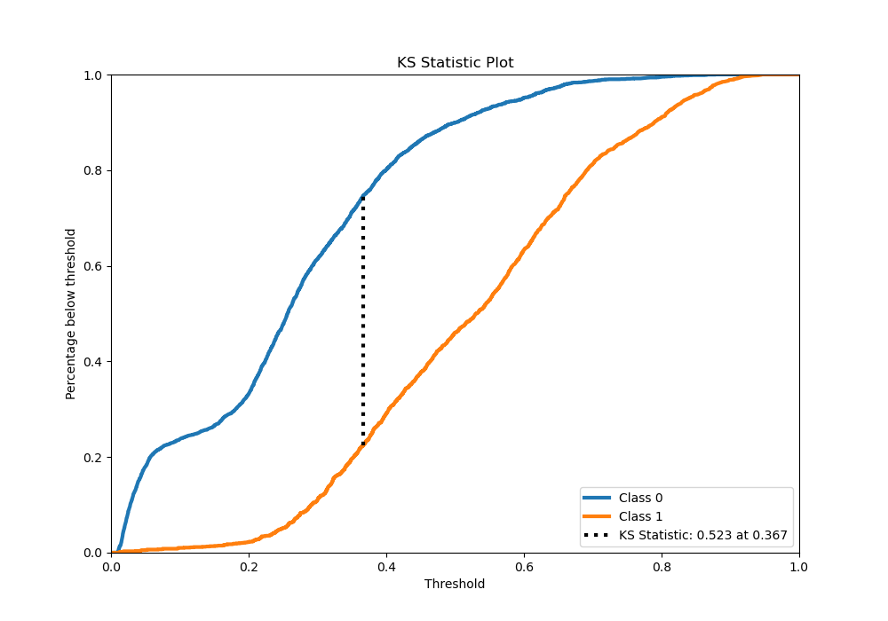
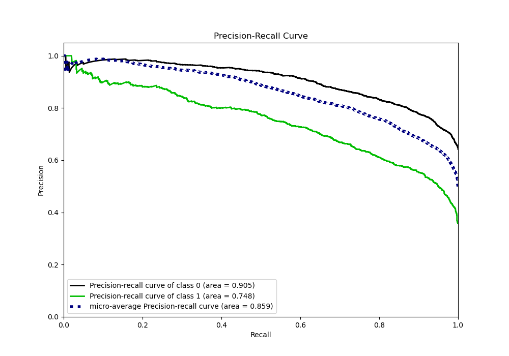
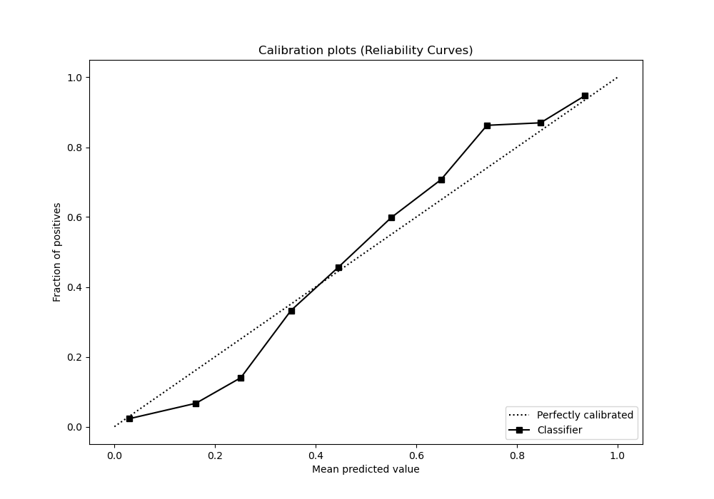
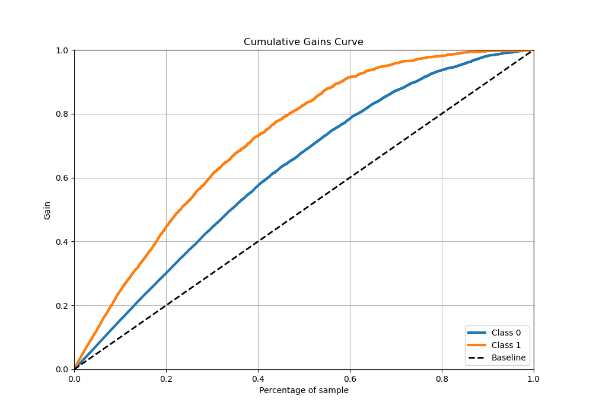
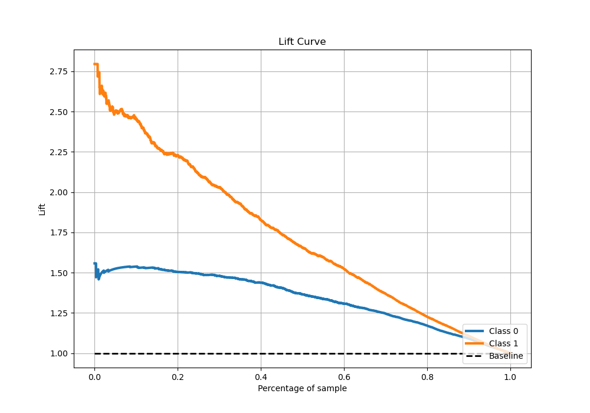

# Summary of 72_RandomForest

[<< Go back](../README.md)

## Random Forest
- **n_jobs**: -1
- **criterion**: entropy
- **max_features**: 0.7
- **min_samples_split**: 40
- **max_depth**: 6
- **eval_metric_name**: logloss
- **explain_level**: 0

## Validation
 - **validation_type**: kfold
 - **stratify**: True
 - **k_folds**: 5
 - **shuffle**: True
 - **random_seed**: 42

## Optimized metric
logloss

## Training time

50.0 seconds

## Metric details
|           |    score |    threshold |
|:----------|---------:|-------------:|
| logloss   | 0.477704 | nan          |
| auc       | 0.845609 | nan          |
| f1        | 0.694298 |   0.365072   |
| accuracy  | 0.777966 |   0.456469   |
| precision | 0.946667 |   0.85294    |
| recall    | 1        |   0.00911809 |
| mcc       | 0.510325 |   0.392842   |

## Metric details with threshold from accuracy metric
|           |    score |   threshold |
|:----------|---------:|------------:|
| logloss   | 0.477704 |  nan        |
| auc       | 0.845609 |  nan        |
| f1        | 0.664537 |    0.456469 |
| accuracy  | 0.777966 |    0.456469 |
| precision | 0.723227 |    0.456469 |
| recall    | 0.614657 |    0.456469 |
| mcc       | 0.503932 |    0.456469 |

## Confusion matrix (at threshold=0.456469)
|              |   Predicted as 0 |   Predicted as 1 |
|:-------------|-----------------:|-----------------:|
| Labeled as 0 |             2639 |              398 |
| Labeled as 1 |              652 |             1040 |

## Learning curves

## Confusion Matrix

## Normalized Confusion Matrix

## ROC Curve

## Kolmogorov-Smirnov Statistic

## Precision-Recall Curve

## Calibration Curve

## Cumulative Gains Curve

## Lift Curve

[<< Go back](../README.md)
