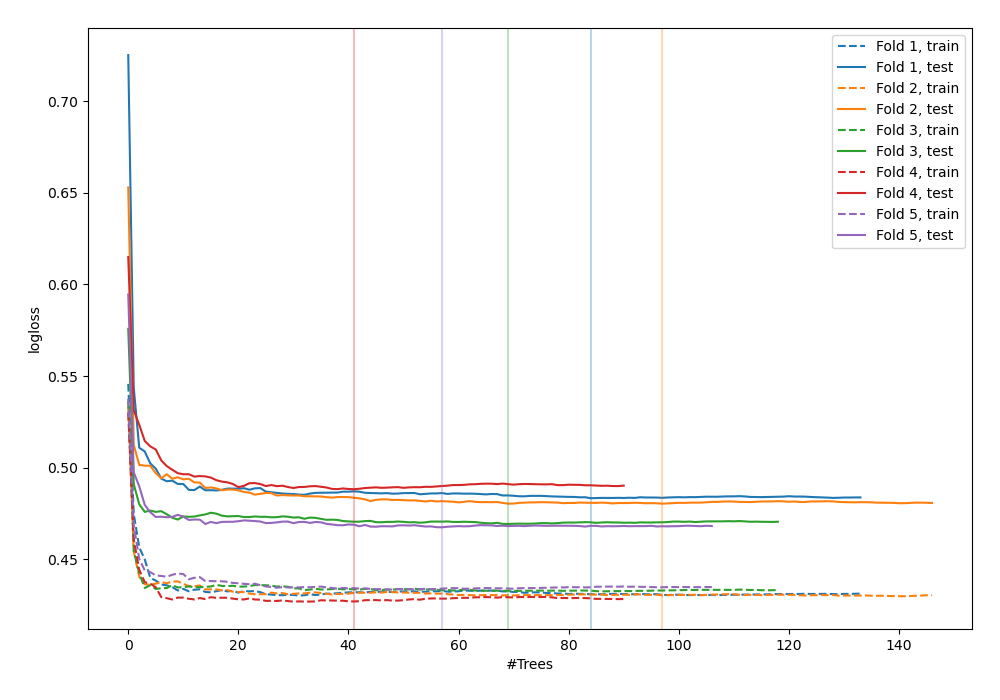
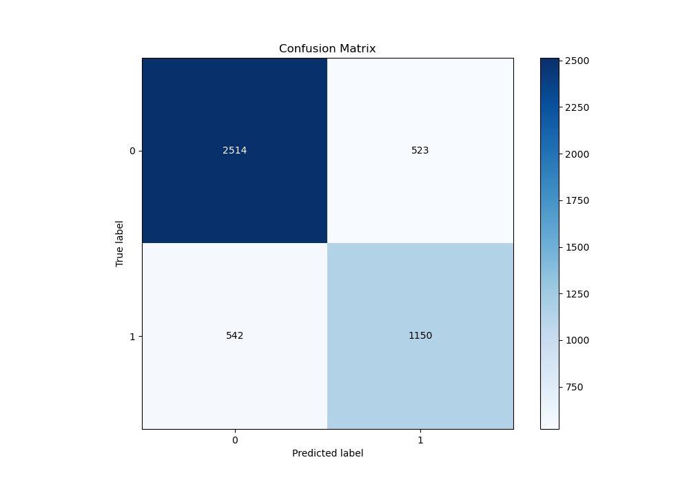
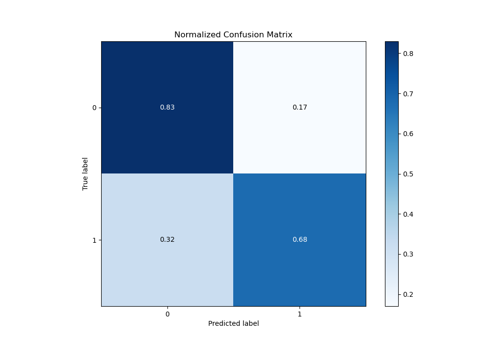
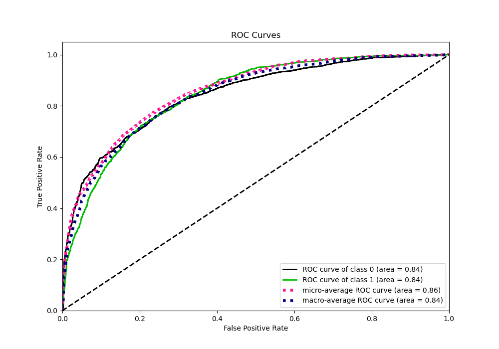
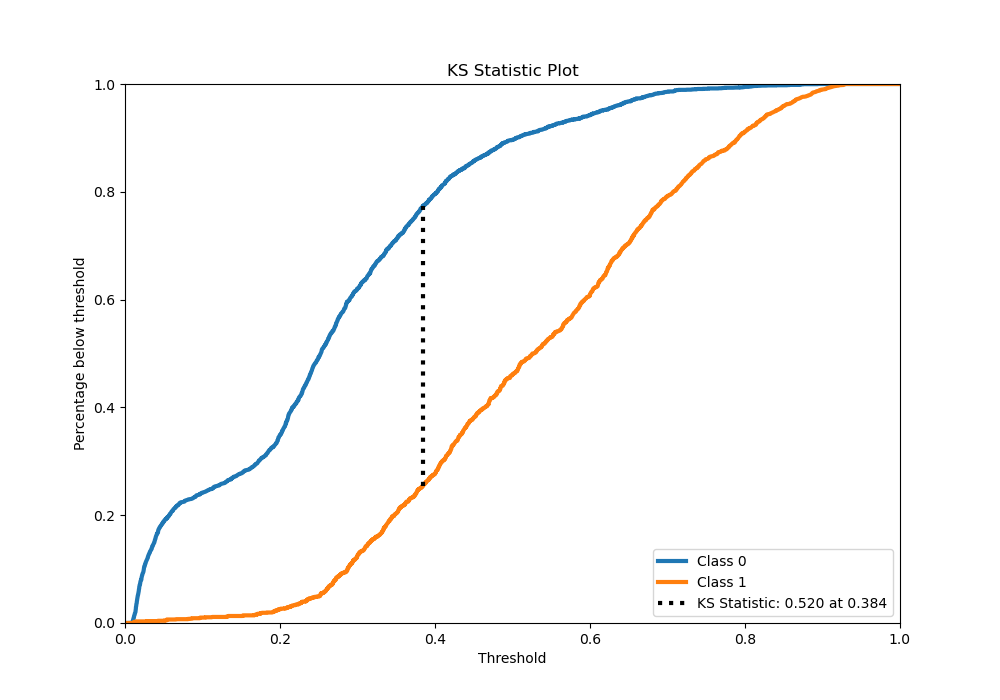
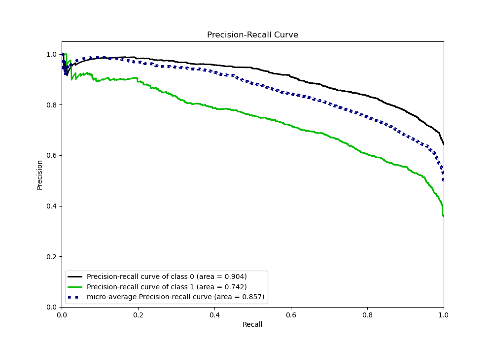
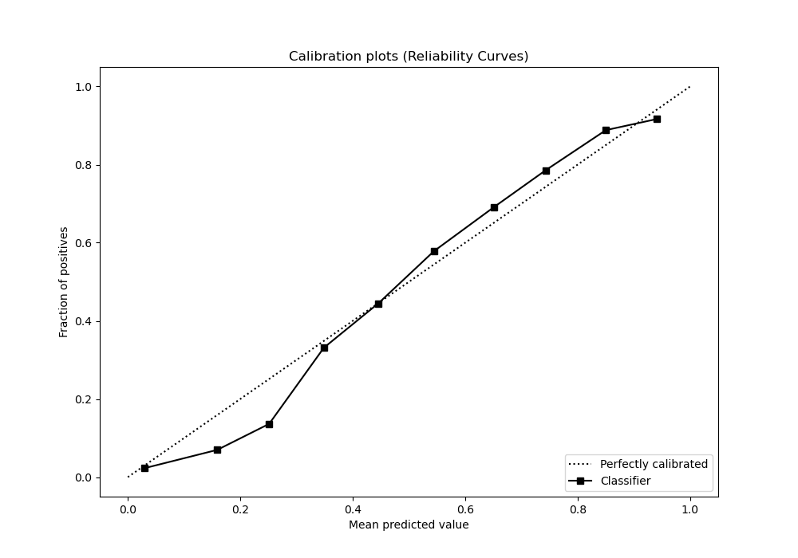
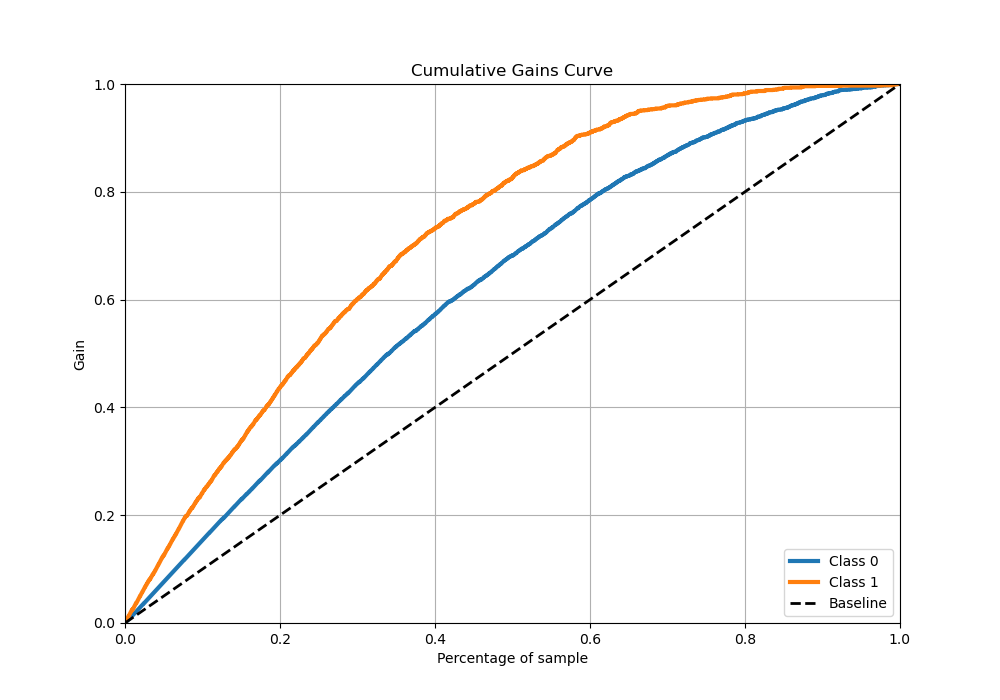
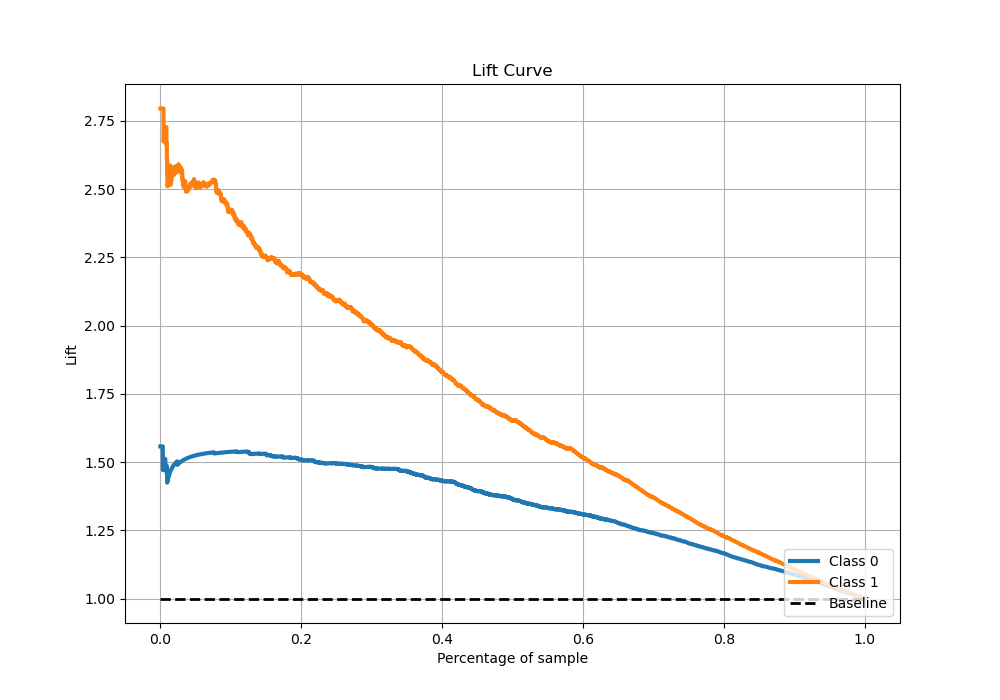

# Summary of 73_RandomForest

[<< Go back](../README.md)

## Random Forest
- **n_jobs**: -1
- **criterion**: entropy
- **max_features**: 0.9
- **min_samples_split**: 40
- **max_depth**: 6
- **eval_metric_name**: logloss
- **explain_level**: 0

## Validation
 - **validation_type**: kfold
 - **stratify**: True
 - **k_folds**: 5
 - **shuffle**: True
 - **random_seed**: 42

## Optimized metric
logloss

## Training time

47.4 seconds

## Metric details
|           |    score |    threshold |
|:----------|---------:|-------------:|
| logloss   | 0.47766  | nan          |
| auc       | 0.84308  | nan          |
| f1        | 0.692624 |   0.383786   |
| accuracy  | 0.774794 |   0.420281   |
| precision | 0.92623  |   0.820132   |
| recall    | 1        |   0.00822662 |
| mcc       | 0.509485 |   0.414024   |

## Metric details with threshold from accuracy metric
|           |    score |   threshold |
|:----------|---------:|------------:|
| logloss   | 0.47766  |  nan        |
| auc       | 0.84308  |  nan        |
| f1        | 0.683507 |    0.420281 |
| accuracy  | 0.774794 |    0.420281 |
| precision | 0.687388 |    0.420281 |
| recall    | 0.679669 |    0.420281 |
| mcc       | 0.508744 |    0.420281 |

## Confusion matrix (at threshold=0.420281)
|              |   Predicted as 0 |   Predicted as 1 |
|:-------------|-----------------:|-----------------:|
| Labeled as 0 |             2514 |              523 |
| Labeled as 1 |              542 |             1150 |

## Learning curves

## Confusion Matrix

## Normalized Confusion Matrix

## ROC Curve

## Kolmogorov-Smirnov Statistic

## Precision-Recall Curve

## Calibration Curve

## Cumulative Gains Curve

## Lift Curve

[<< Go back](../README.md)
