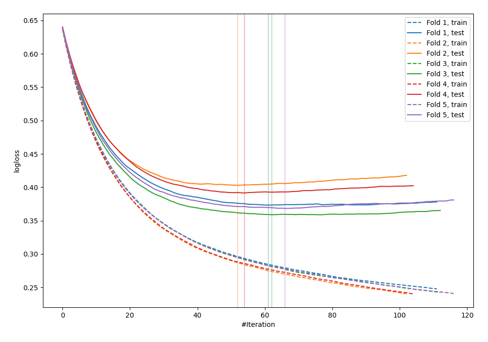
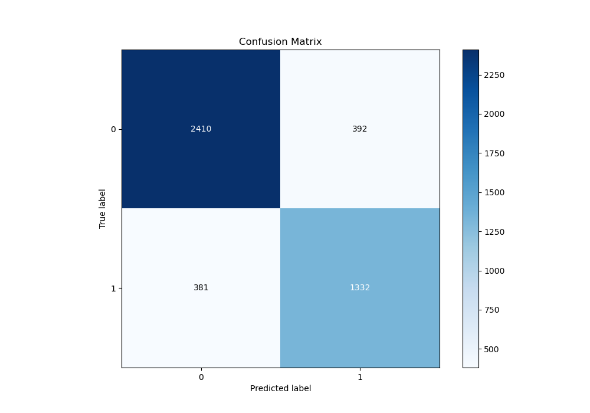
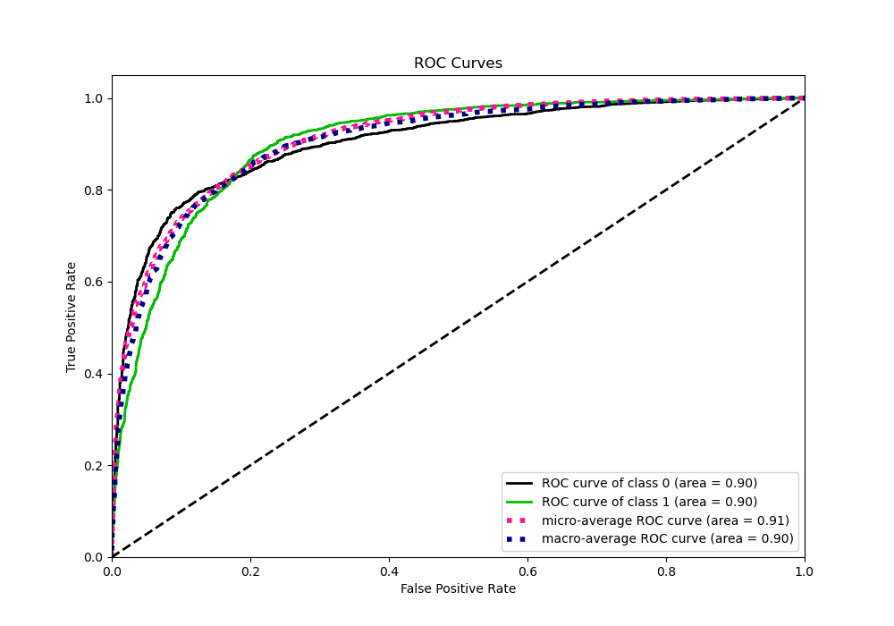
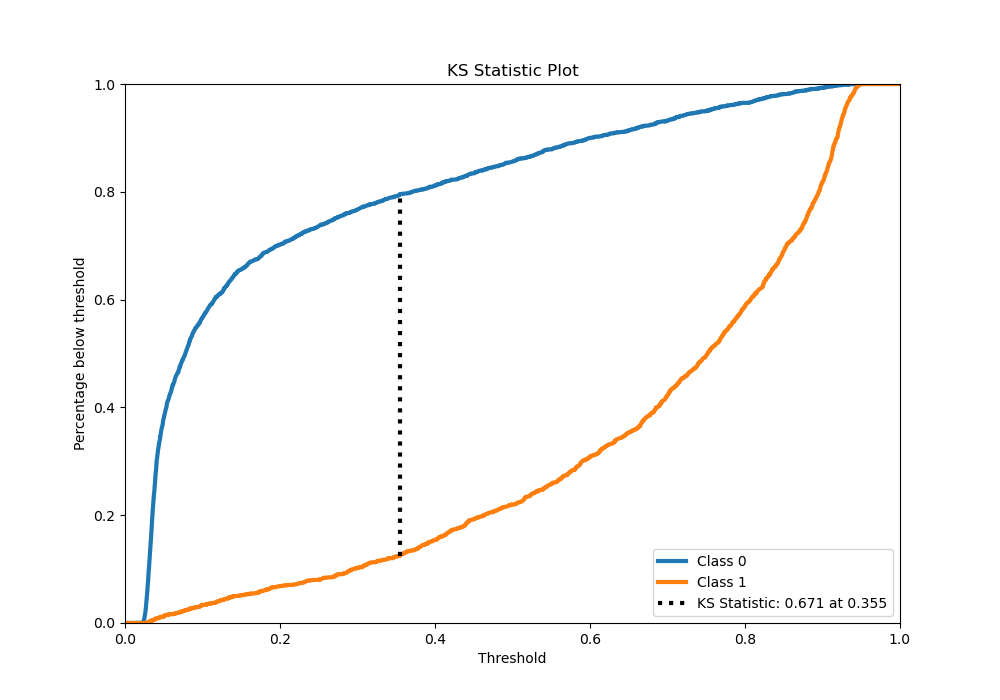
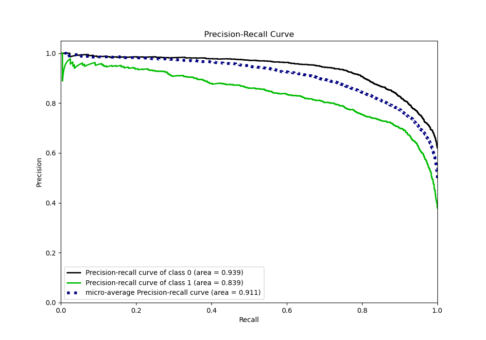
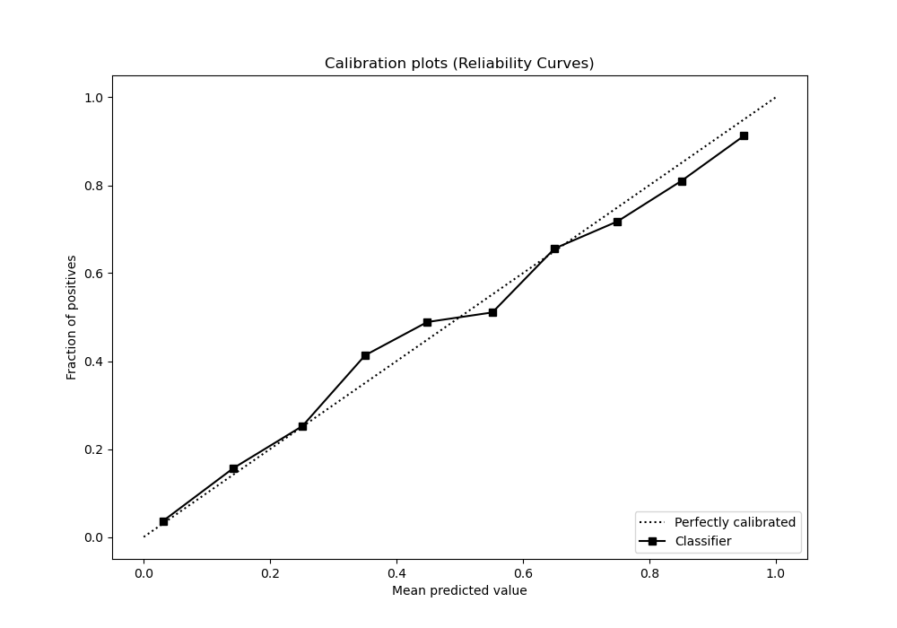
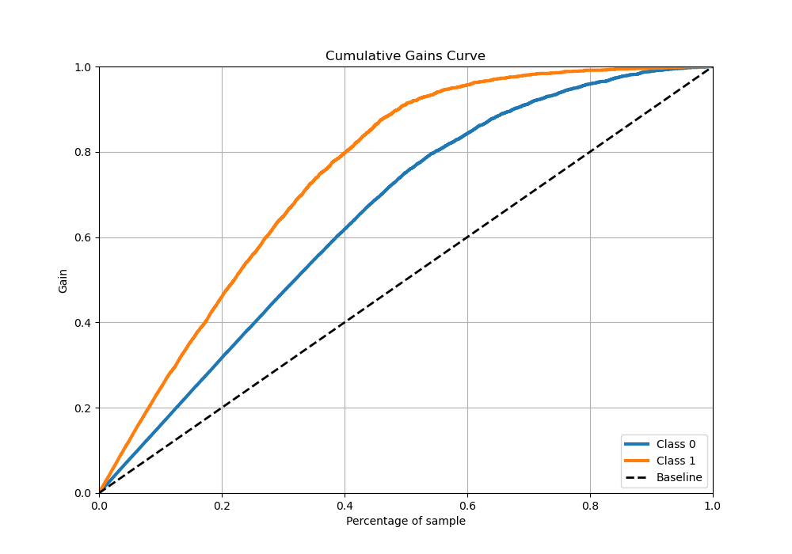
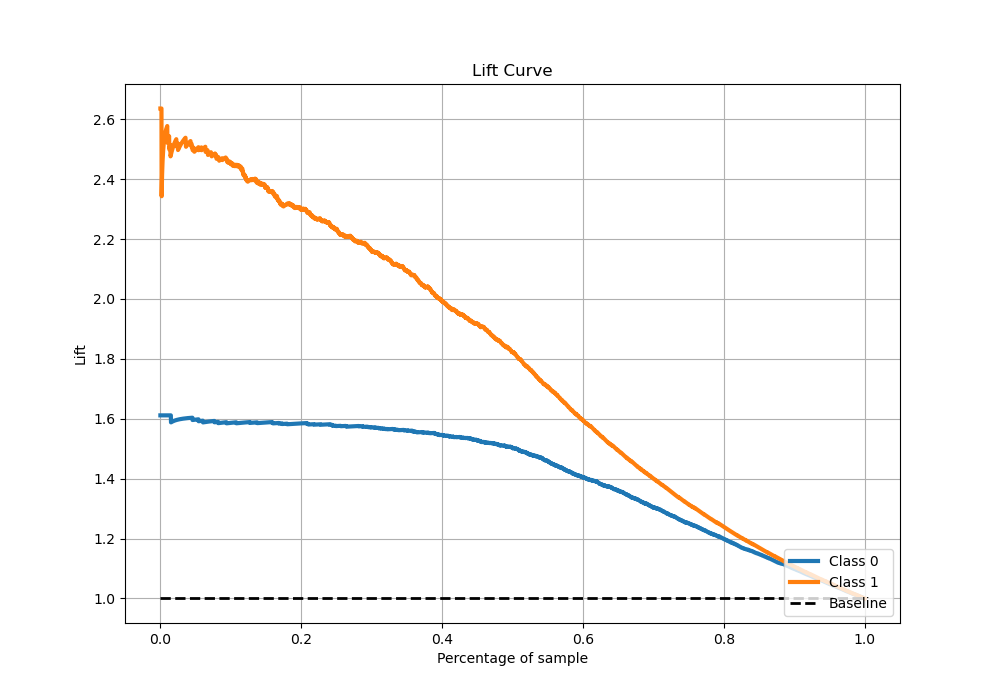

# Summary of 7_Xgboost_Stacked

[<< Go back](../README.md)

## Extreme Gradient Boosting (Xgboost)
- **n_jobs**: -1
- **objective**: binary:logistic
- **eta**: 0.05
- **max_depth**: 9
- **min_child_weight**: 10
- **subsample**: 0.8
- **colsample_bytree**: 0.6
- **eval_metric**: logloss
- **explain_level**: 0

## Validation
 - **validation_type**: kfold
 - **stratify**: True
 - **k_folds**: 5
 - **shuffle**: True
 - **random_seed**: 42

## Optimized metric
logloss

## Training time

33.1 seconds

## Metric details
|           |    score |   threshold |
|:----------|---------:|------------:|
| logloss   | 0.379003 | nan         |
| auc       | 0.904204 | nan         |
| f1        | 0.791151 |   0.35087   |
| accuracy  | 0.828793 |   0.506372  |
| precision | 0.959459 |   0.921315  |
| recall    | 1        |   0.0203673 |
| mcc       | 0.651287 |   0.35087   |

## Metric details with threshold from accuracy metric
|           |    score |   threshold |
|:----------|---------:|------------:|
| logloss   | 0.379003 |  nan        |
| auc       | 0.904204 |  nan        |
| f1        | 0.775095 |    0.506372 |
| accuracy  | 0.828793 |    0.506372 |
| precision | 0.772622 |    0.506372 |
| recall    | 0.777583 |    0.506372 |
| mcc       | 0.636897 |    0.506372 |

## Confusion matrix (at threshold=0.506372)
|              |   Predicted as 0 |   Predicted as 1 |
|:-------------|-----------------:|-----------------:|
| Labeled as 0 |             2410 |              392 |
| Labeled as 1 |              381 |             1332 |

## Learning curves

## Confusion Matrix

## Normalized Confusion Matrix

## ROC Curve

## Kolmogorov-Smirnov Statistic

## Precision-Recall Curve

## Calibration Curve

## Cumulative Gains Curve

## Lift Curve

[<< Go back](../README.md)
