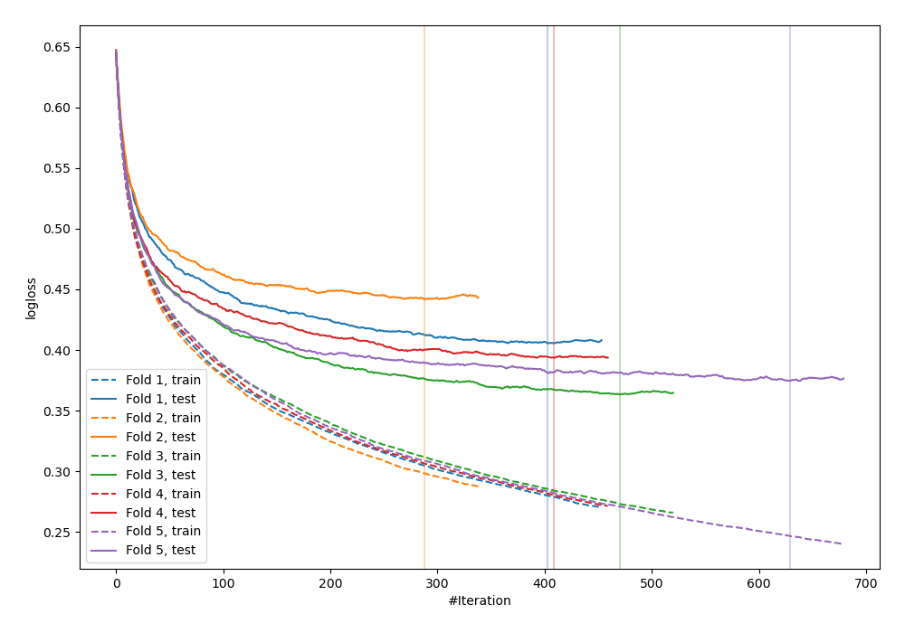
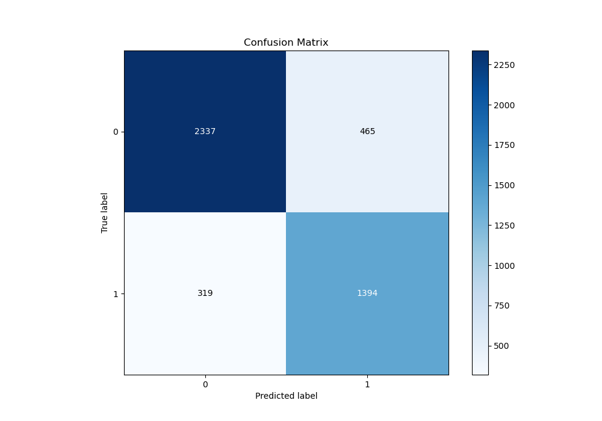
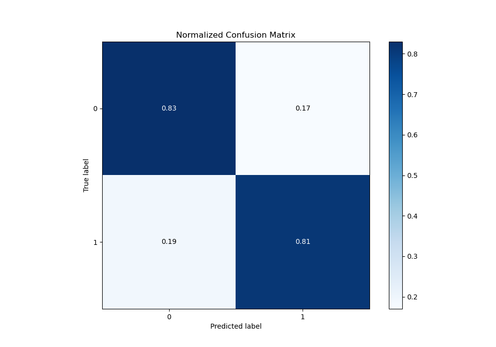
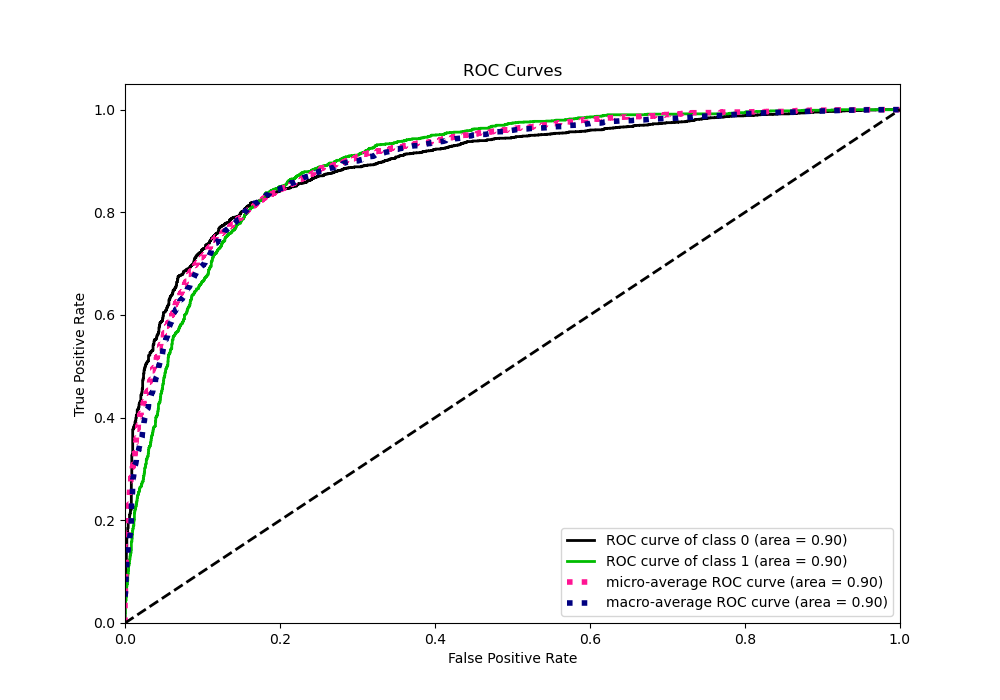
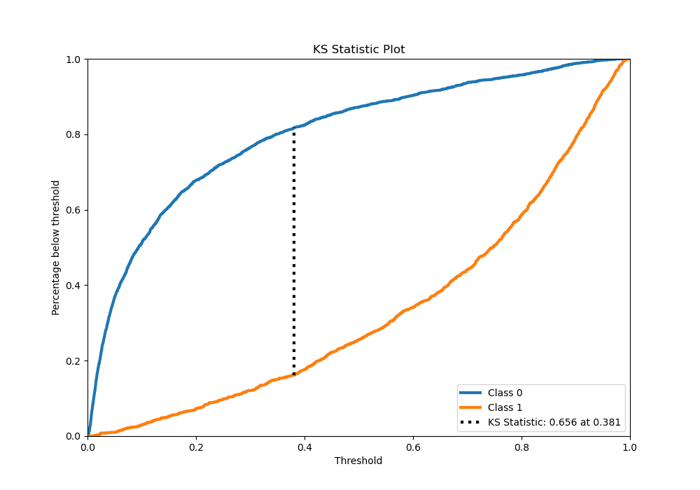
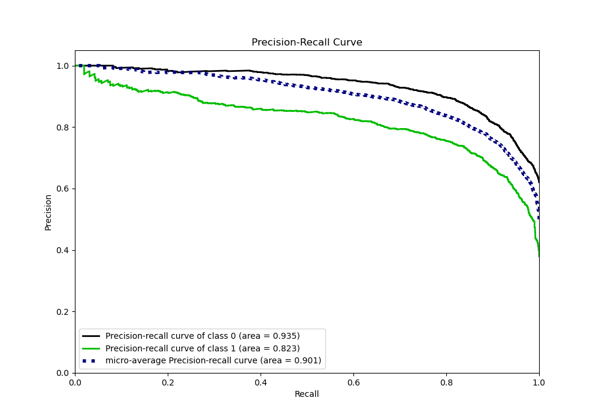
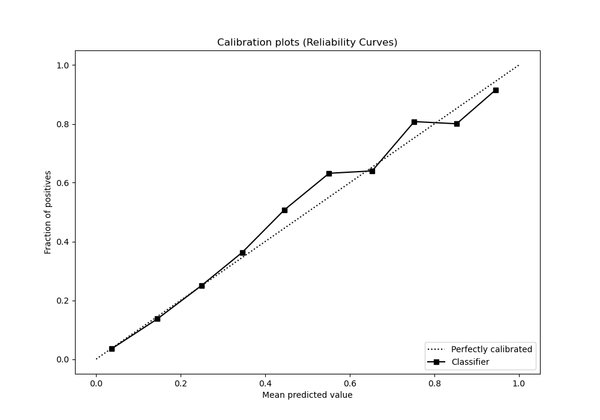
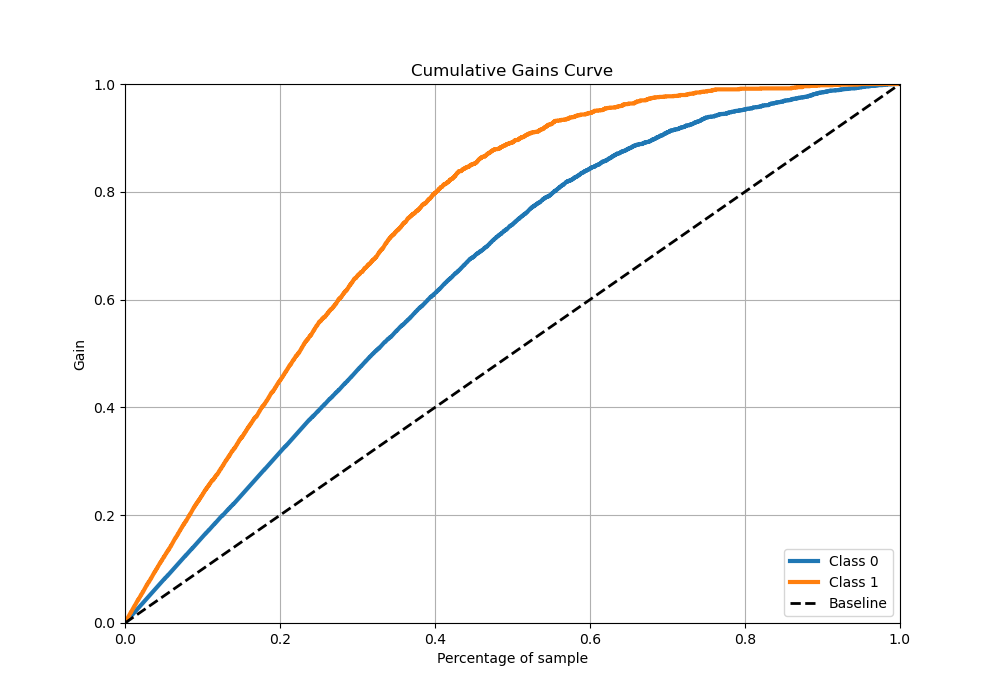
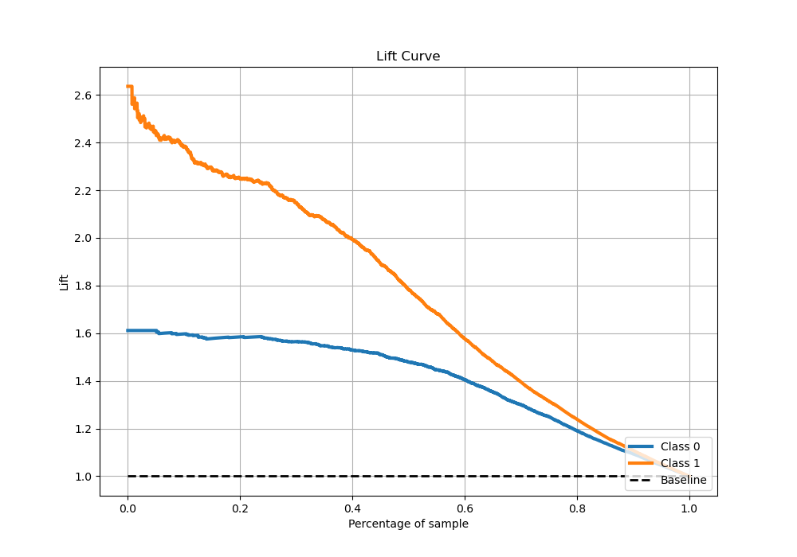

# Summary of 8_Xgboost

[<< Go back](../README.md)

## Extreme Gradient Boosting (Xgboost)
- **n_jobs**: -1
- **objective**: binary:logistic
- **eta**: 0.1
- **max_depth**: 4
- **min_child_weight**: 10
- **subsample**: 0.6
- **colsample_bytree**: 0.6
- **eval_metric**: logloss
- **explain_level**: 0

## Validation
 - **validation_type**: kfold
 - **stratify**: True
 - **k_folds**: 5
 - **shuffle**: True
 - **random_seed**: 42

## Optimized metric
logloss

## Training time

67.0 seconds

## Metric details
|           |    score |    threshold |
|:----------|---------:|-------------:|
| logloss   | 0.395716 | nan          |
| auc       | 0.895517 | nan          |
| f1        | 0.784271 |   0.3806     |
| accuracy  | 0.826357 |   0.411925   |
| precision | 0.966102 |   0.97405    |
| recall    | 1        |   0.00103908 |
| mcc       | 0.641889 |   0.3806     |

## Metric details with threshold from accuracy metric
|           |    score |   threshold |
|:----------|---------:|------------:|
| logloss   | 0.395716 |  nan        |
| auc       | 0.895517 |  nan        |
| f1        | 0.780515 |    0.411925 |
| accuracy  | 0.826357 |    0.411925 |
| precision | 0.749866 |    0.411925 |
| recall    | 0.813777 |    0.411925 |
| mcc       | 0.638728 |    0.411925 |

## Confusion matrix (at threshold=0.411925)
|              |   Predicted as 0 |   Predicted as 1 |
|:-------------|-----------------:|-----------------:|
| Labeled as 0 |             2337 |              465 |
| Labeled as 1 |              319 |             1394 |

## Learning curves

## Confusion Matrix

## Normalized Confusion Matrix

## ROC Curve

## Kolmogorov-Smirnov Statistic

## Precision-Recall Curve

## Calibration Curve

## Cumulative Gains Curve

## Lift Curve

[<< Go back](../README.md)
