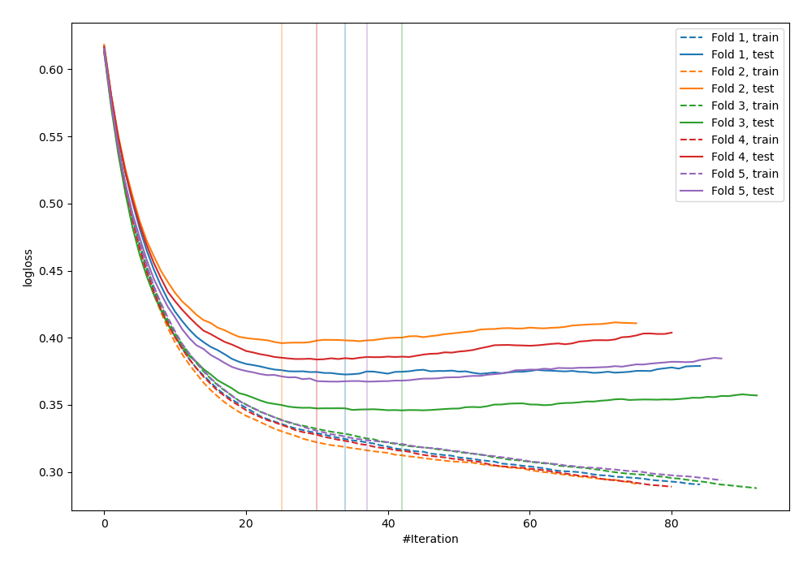
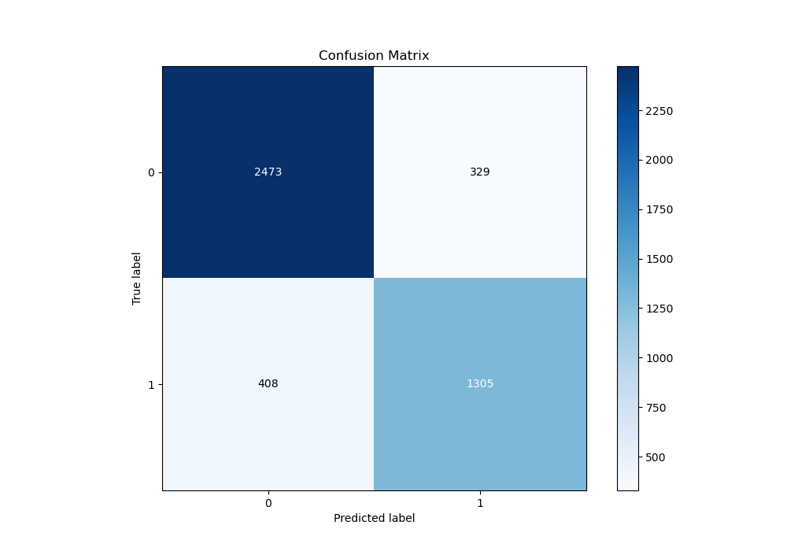
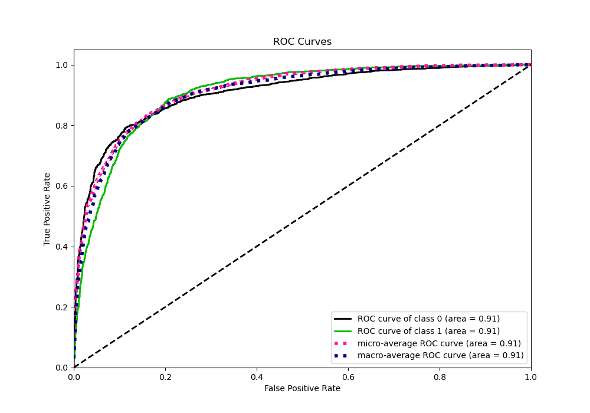
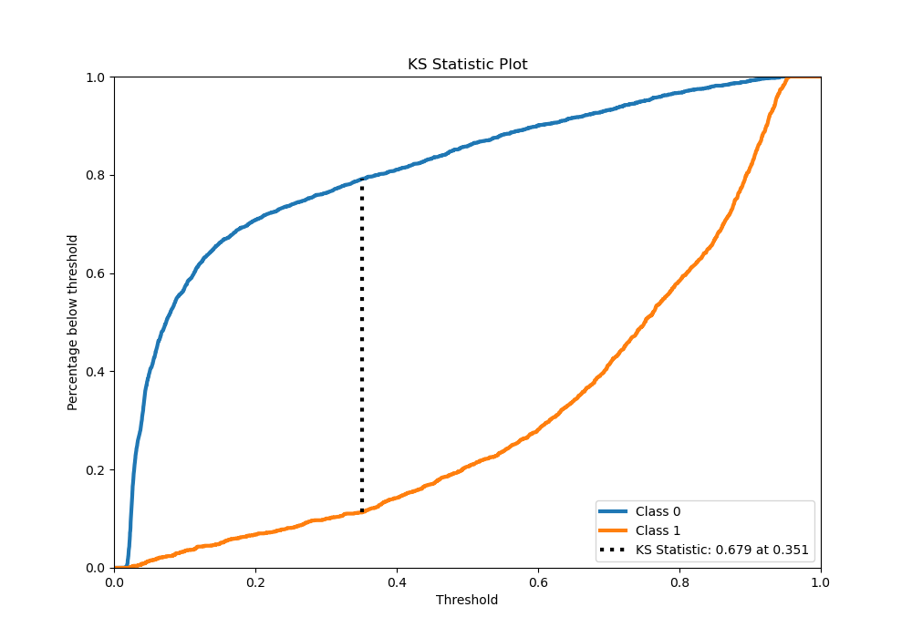
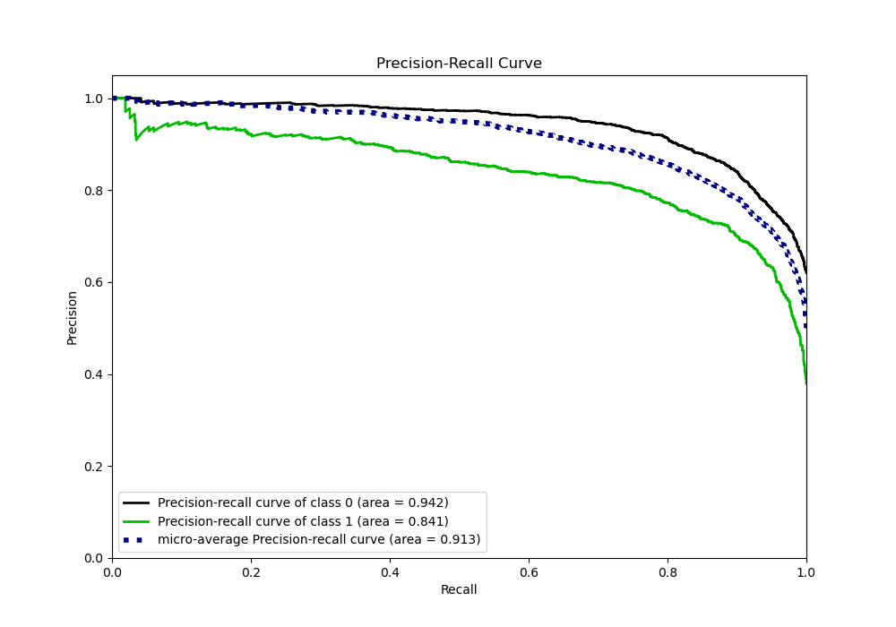
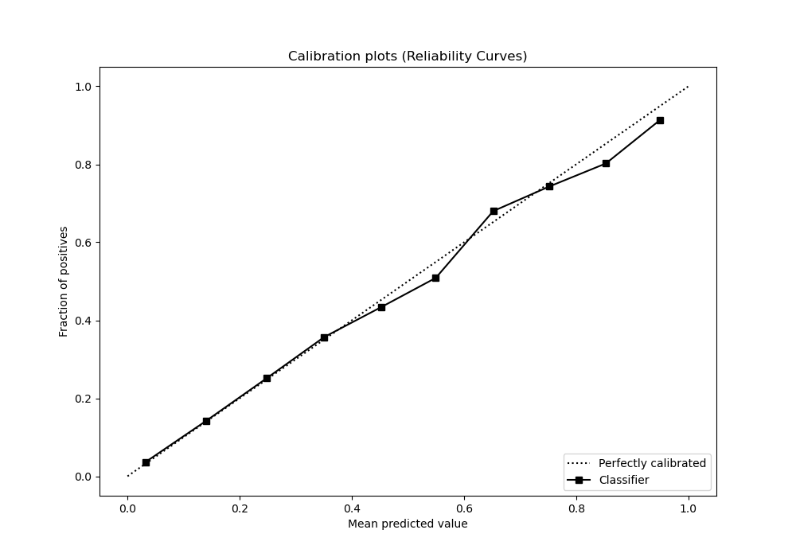
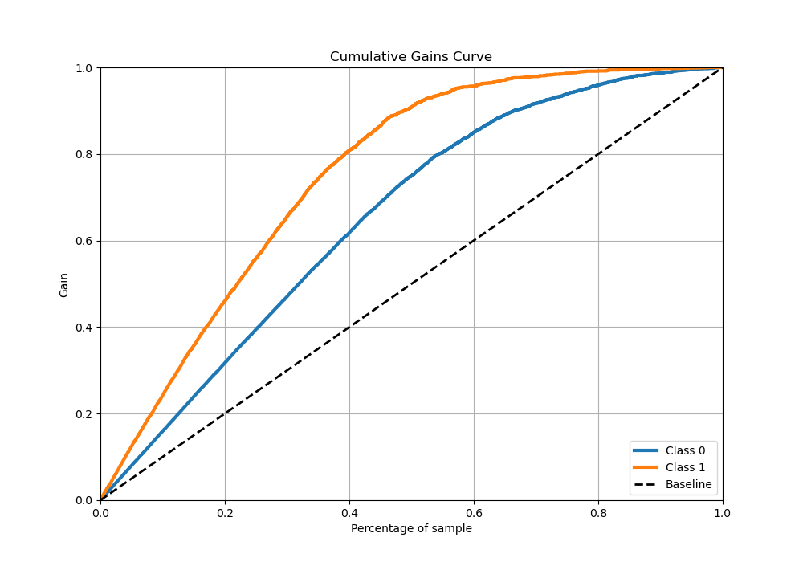
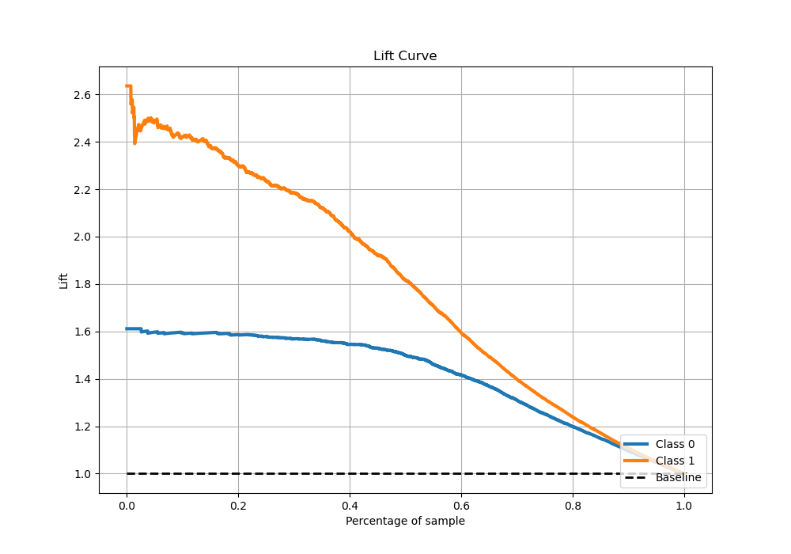

# Summary of 8_Xgboost_Stacked

[<< Go back](../README.md)

## Extreme Gradient Boosting (Xgboost)
- **n_jobs**: -1
- **objective**: binary:logistic
- **eta**: 0.1
- **max_depth**: 4
- **min_child_weight**: 10
- **subsample**: 0.6
- **colsample_bytree**: 0.6
- **eval_metric**: logloss
- **explain_level**: 0

## Validation
 - **validation_type**: kfold
 - **stratify**: True
 - **k_folds**: 5
 - **shuffle**: True
 - **random_seed**: 42

## Optimized metric
logloss

## Training time

21.1 seconds

## Metric details
|           |    score |   threshold |
|:----------|---------:|------------:|
| logloss   | 0.373095 | nan         |
| auc       | 0.907161 | nan         |
| f1        | 0.795891 |   0.359162  |
| accuracy  | 0.836766 |   0.552188  |
| precision | 0.949153 |   0.941365  |
| recall    | 1        |   0.0139092 |
| mcc       | 0.659528 |   0.359162  |

## Metric details with threshold from accuracy metric
|           |    score |   threshold |
|:----------|---------:|------------:|
| logloss   | 0.373095 |  nan        |
| auc       | 0.907161 |  nan        |
| f1        | 0.779803 |    0.552188 |
| accuracy  | 0.836766 |    0.552188 |
| precision | 0.798654 |    0.552188 |
| recall    | 0.761821 |    0.552188 |
| mcc       | 0.65069  |    0.552188 |

## Confusion matrix (at threshold=0.552188)
|              |   Predicted as 0 |   Predicted as 1 |
|:-------------|-----------------:|-----------------:|
| Labeled as 0 |             2473 |              329 |
| Labeled as 1 |              408 |             1305 |

## Learning curves

## Confusion Matrix

## Normalized Confusion Matrix

## ROC Curve

## Kolmogorov-Smirnov Statistic

## Precision-Recall Curve

## Calibration Curve

## Cumulative Gains Curve

## Lift Curve

[<< Go back](../README.md)
