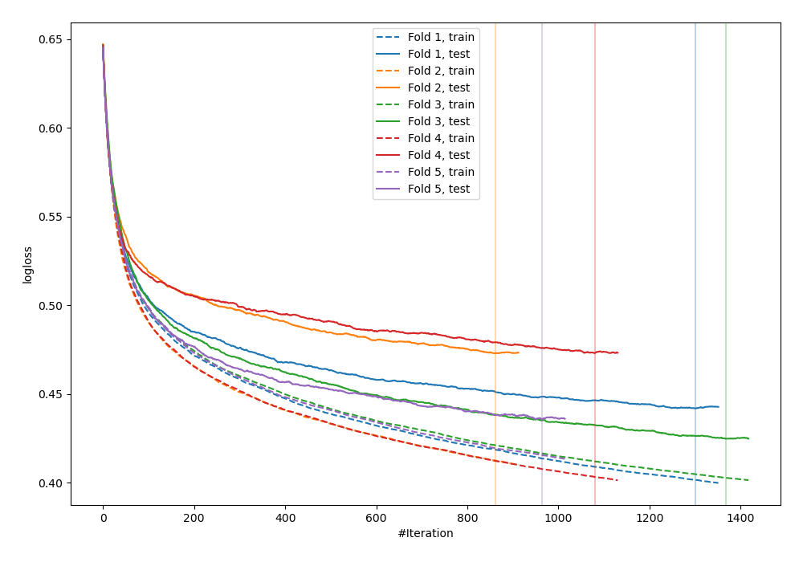
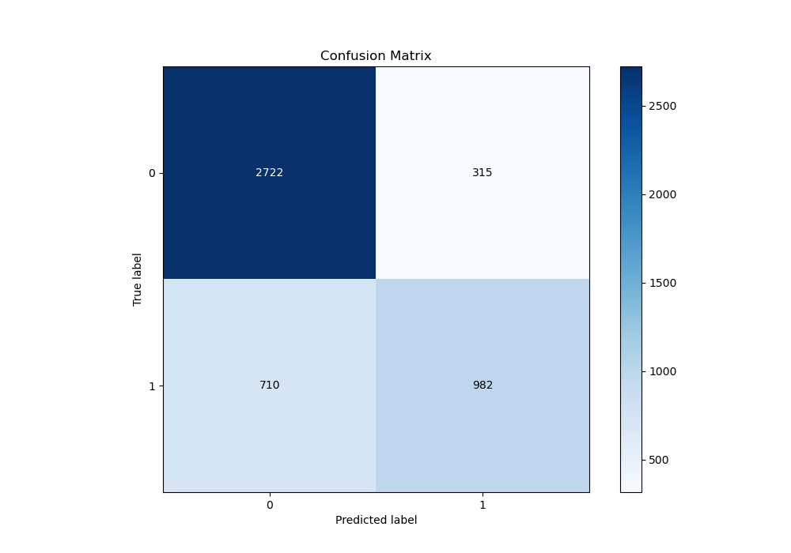
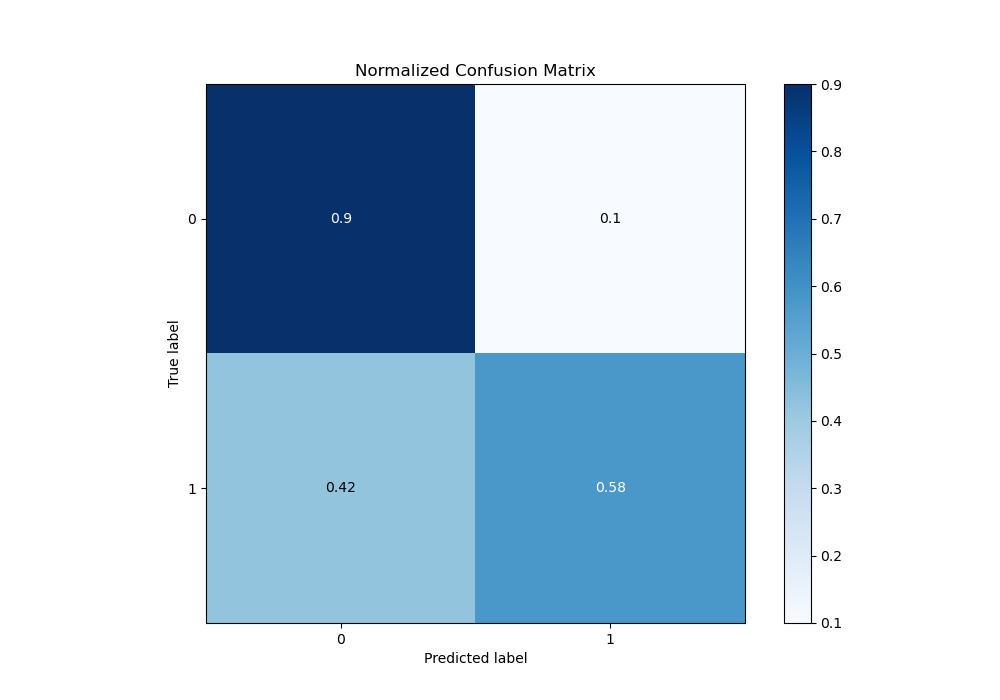
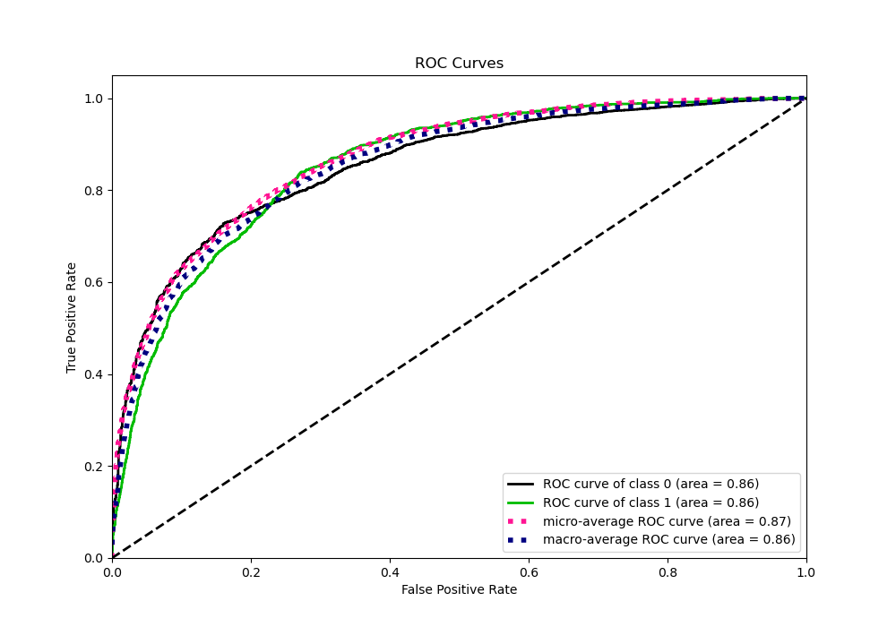
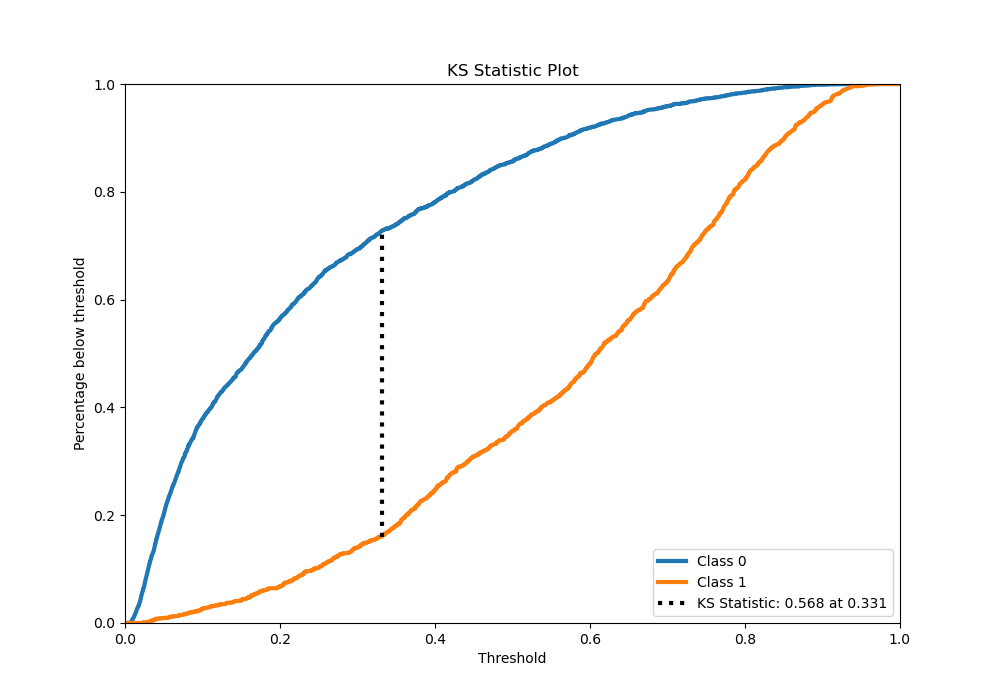
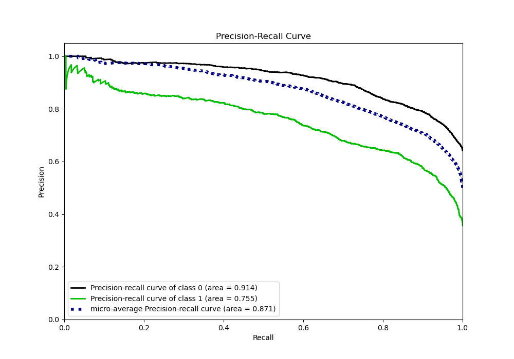
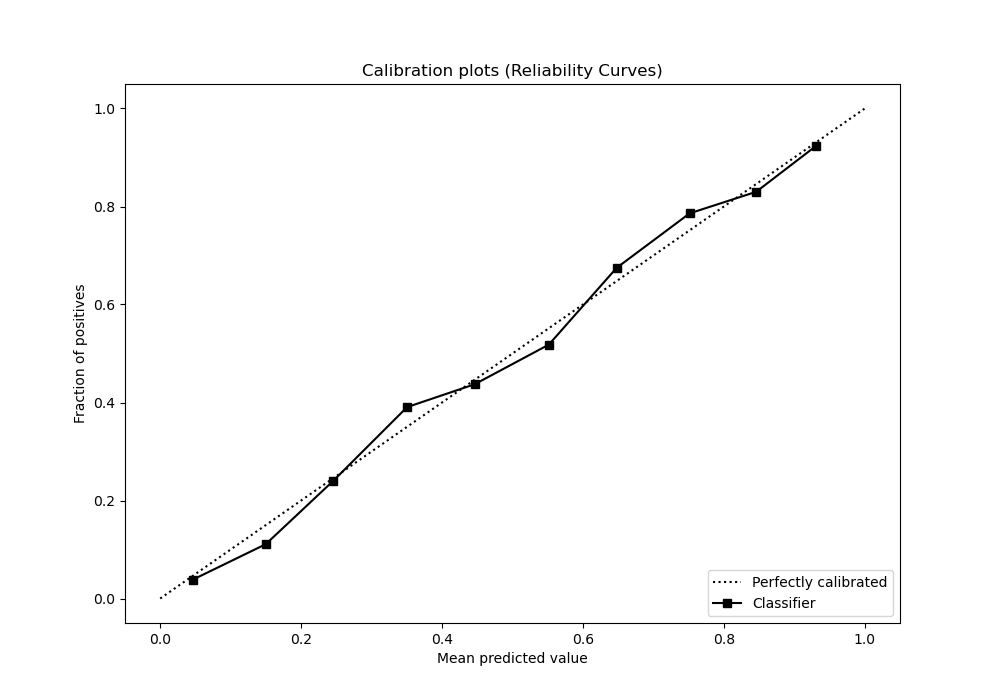
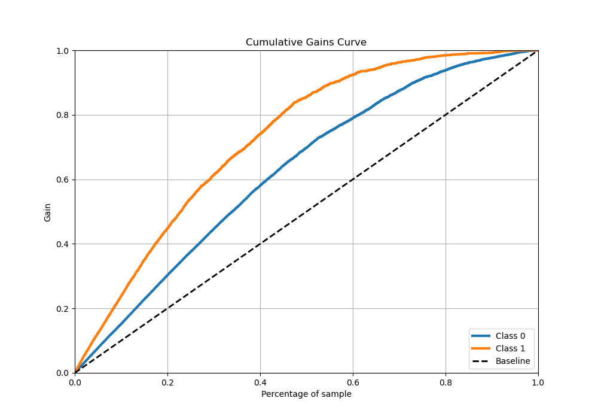
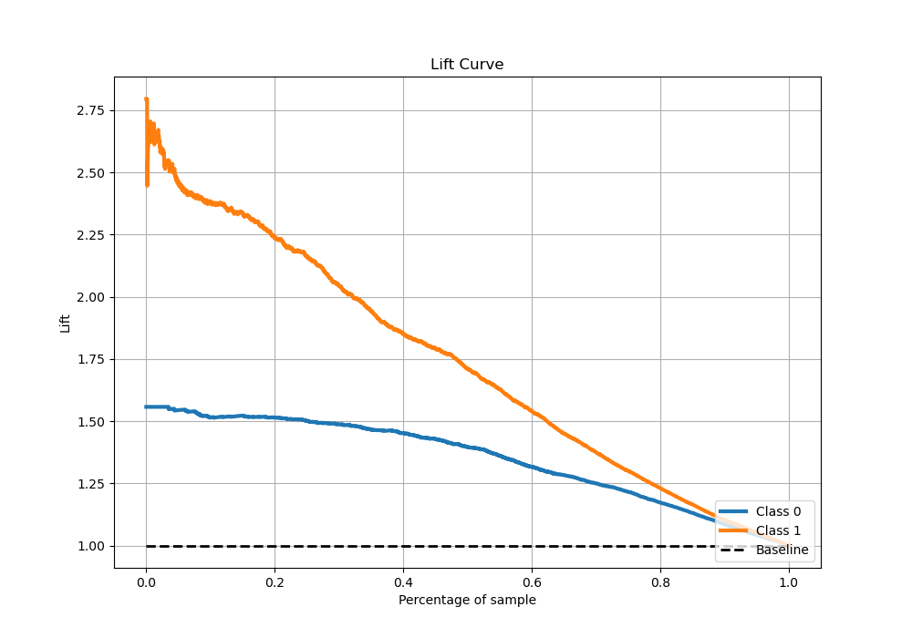

# Summary of 9_Xgboost

[<< Go back](../README.md)

## Extreme Gradient Boosting (Xgboost)
- **n_jobs**: -1
- **objective**: binary:logistic
- **eta**: 0.05
- **max_depth**: 6
- **min_child_weight**: 50
- **subsample**: 0.5
- **colsample_bytree**: 0.7
- **eval_metric**: logloss
- **explain_level**: 0

## Validation
 - **validation_type**: kfold
 - **stratify**: True
 - **k_folds**: 5
 - **shuffle**: True
 - **random_seed**: 42

## Optimized metric
logloss

## Training time

79.0 seconds

## Metric details
|           |    score |   threshold |
|:----------|---------:|------------:|
| logloss   | 0.449617 | nan         |
| auc       | 0.85609  | nan         |
| f1        | 0.720285 |   0.333772  |
| accuracy  | 0.783252 |   0.559099  |
| precision | 0.946667 |   0.896305  |
| recall    | 1        |   0.0055892 |
| mcc       | 0.543057 |   0.333772  |

## Metric details with threshold from accuracy metric
|           |    score |   threshold |
|:----------|---------:|------------:|
| logloss   | 0.449617 |  nan        |
| auc       | 0.85609  |  nan        |
| f1        | 0.657076 |    0.559099 |
| accuracy  | 0.783252 |    0.559099 |
| precision | 0.757132 |    0.559099 |
| recall    | 0.580378 |    0.559099 |
| mcc       | 0.512136 |    0.559099 |

## Confusion matrix (at threshold=0.559099)
|              |   Predicted as 0 |   Predicted as 1 |
|:-------------|-----------------:|-----------------:|
| Labeled as 0 |             2722 |              315 |
| Labeled as 1 |              710 |              982 |

## Learning curves

## Confusion Matrix

## Normalized Confusion Matrix

## ROC Curve

## Kolmogorov-Smirnov Statistic

## Precision-Recall Curve

## Calibration Curve

## Cumulative Gains Curve

## Lift Curve

[<< Go back](../README.md)
