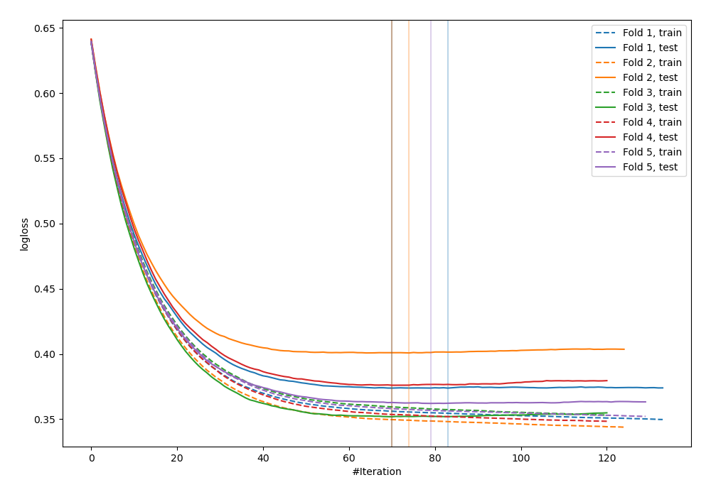
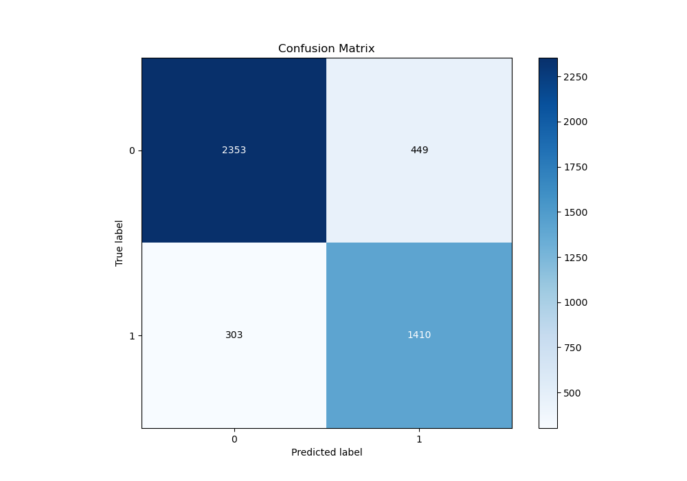
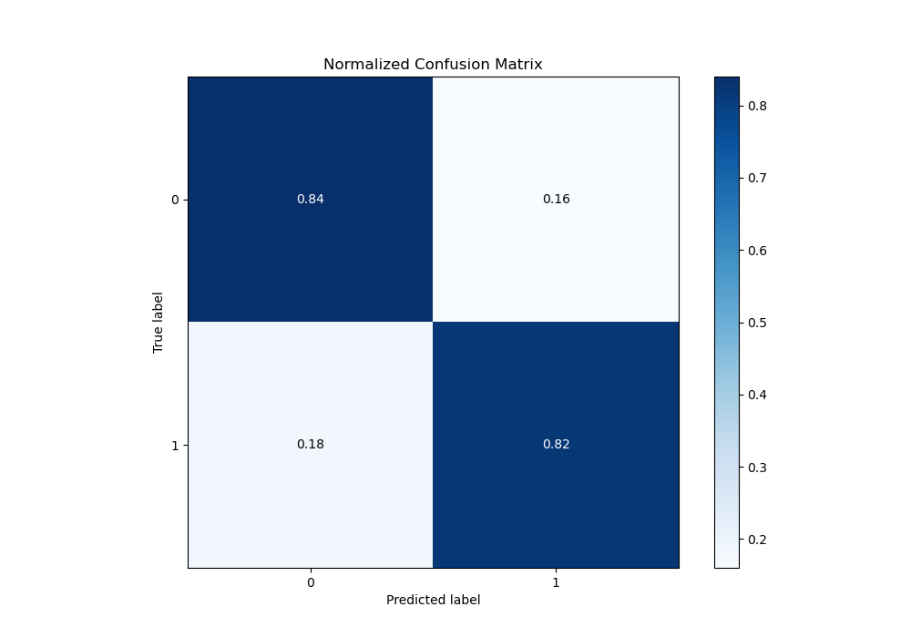
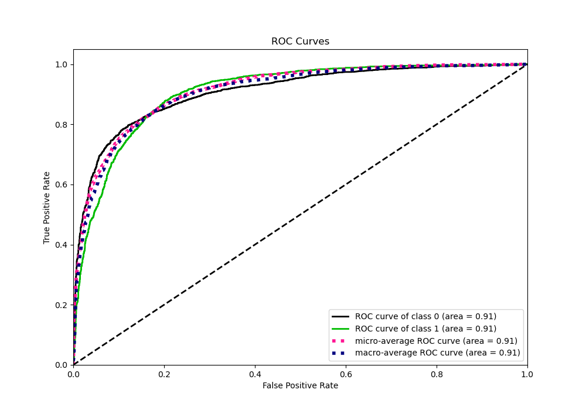
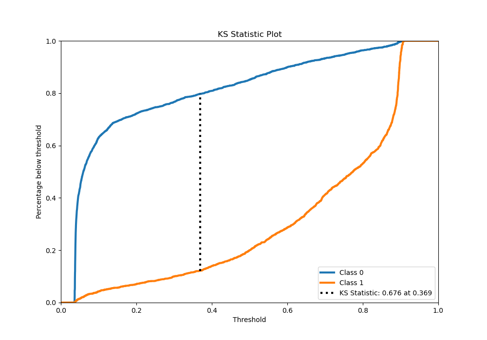
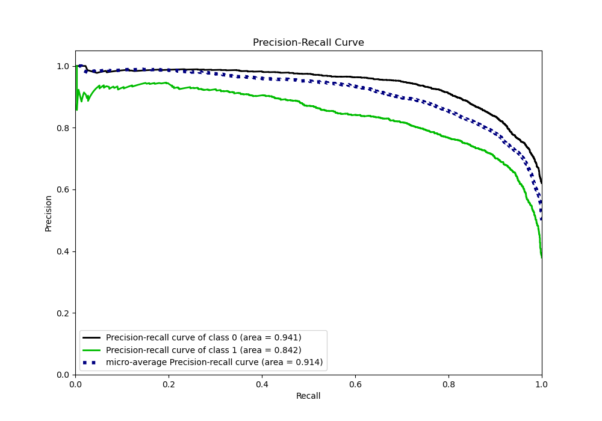
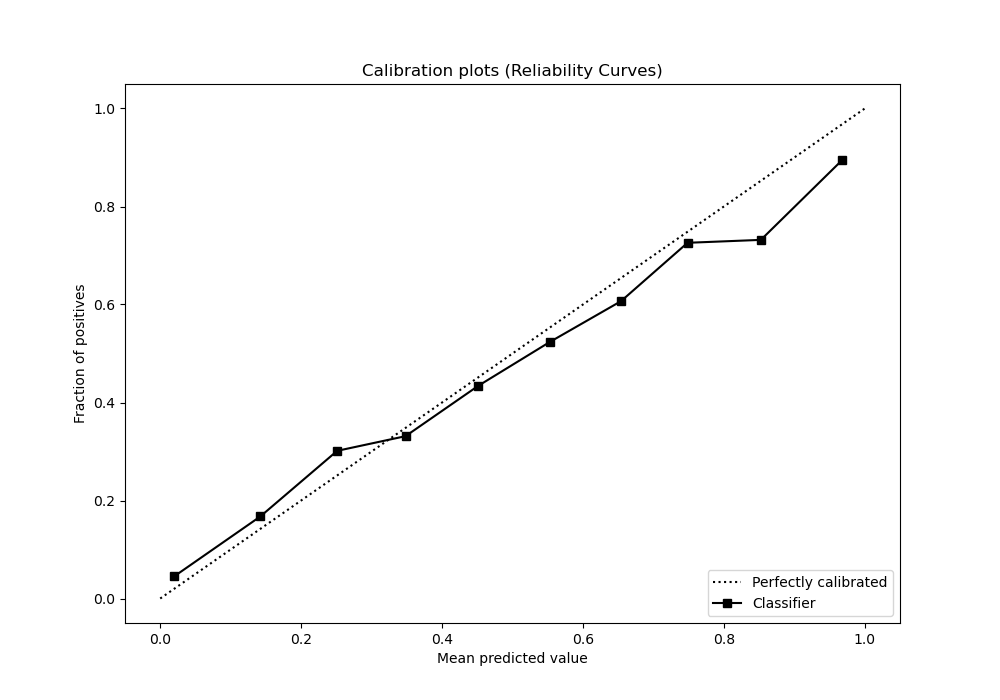
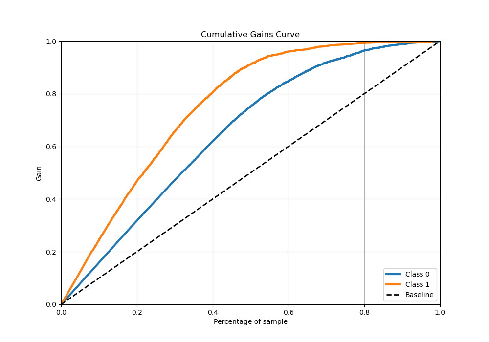
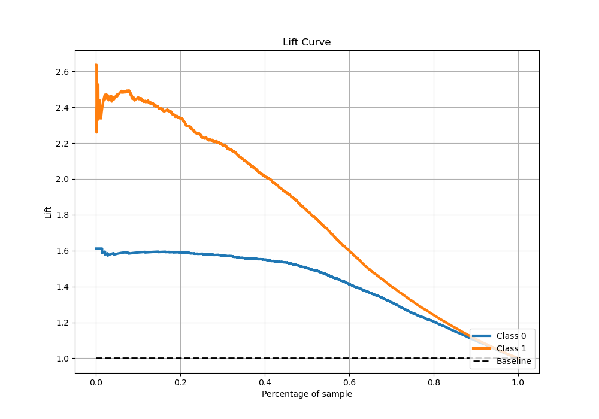

# Summary of 9_Xgboost_Stacked

[<< Go back](../README.md)

## Extreme Gradient Boosting (Xgboost)
- **n_jobs**: -1
- **objective**: binary:logistic
- **eta**: 0.05
- **max_depth**: 6
- **min_child_weight**: 50
- **subsample**: 0.5
- **colsample_bytree**: 0.7
- **eval_metric**: logloss
- **explain_level**: 0

## Validation
 - **validation_type**: kfold
 - **stratify**: True
 - **k_folds**: 5
 - **shuffle**: True
 - **random_seed**: 42

## Optimized metric
logloss

## Training time

27.5 seconds

## Metric details
|           |    score |   threshold |
|:----------|---------:|------------:|
| logloss   | 0.372915 |  nan        |
| auc       | 0.90839  |  nan        |
| f1        | 0.793857 |    0.330202 |
| accuracy  | 0.833444 |    0.472379 |
| precision | 0.944785 |    0.893212 |
| recall    | 1        |    0.031714 |
| mcc       | 0.655865 |    0.36157  |

## Metric details with threshold from accuracy metric
|           |    score |   threshold |
|:----------|---------:|------------:|
| logloss   | 0.372915 |  nan        |
| auc       | 0.90839  |  nan        |
| f1        | 0.789474 |    0.472379 |
| accuracy  | 0.833444 |    0.472379 |
| precision | 0.758472 |    0.472379 |
| recall    | 0.823117 |    0.472379 |
| mcc       | 0.653567 |    0.472379 |

## Confusion matrix (at threshold=0.472379)
|              |   Predicted as 0 |   Predicted as 1 |
|:-------------|-----------------:|-----------------:|
| Labeled as 0 |             2353 |              449 |
| Labeled as 1 |              303 |             1410 |

## Learning curves

## Confusion Matrix

## Normalized Confusion Matrix

## ROC Curve

## Kolmogorov-Smirnov Statistic

## Precision-Recall Curve

## Calibration Curve

## Cumulative Gains Curve

## Lift Curve

[<< Go back](../README.md)
