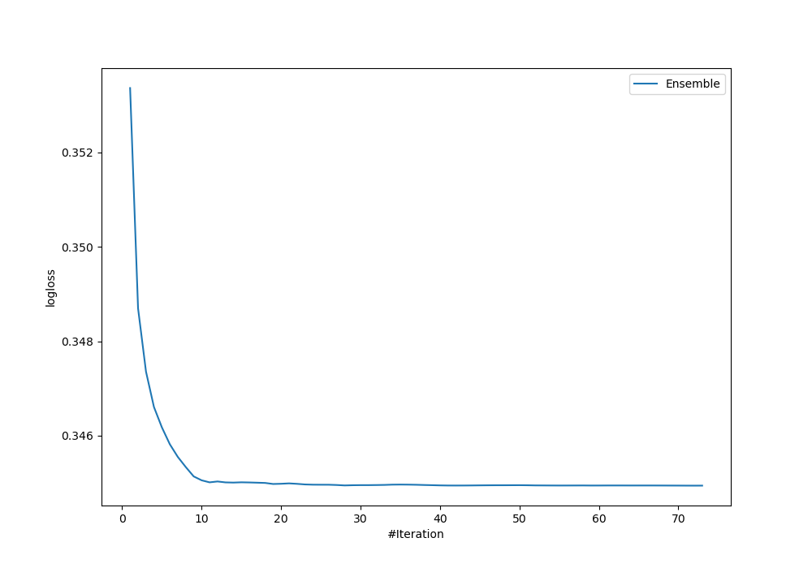
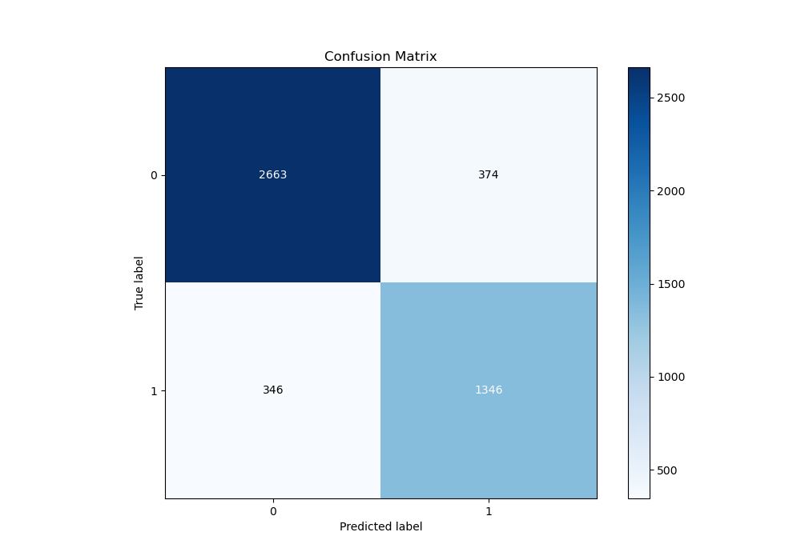
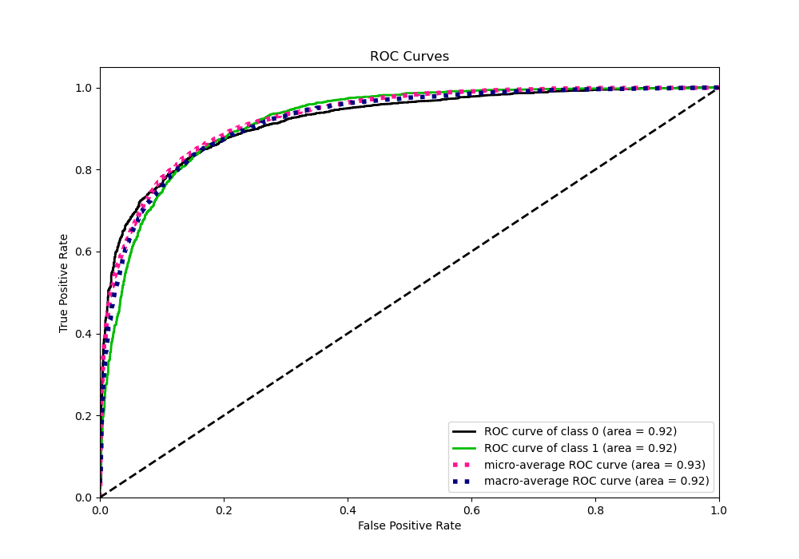
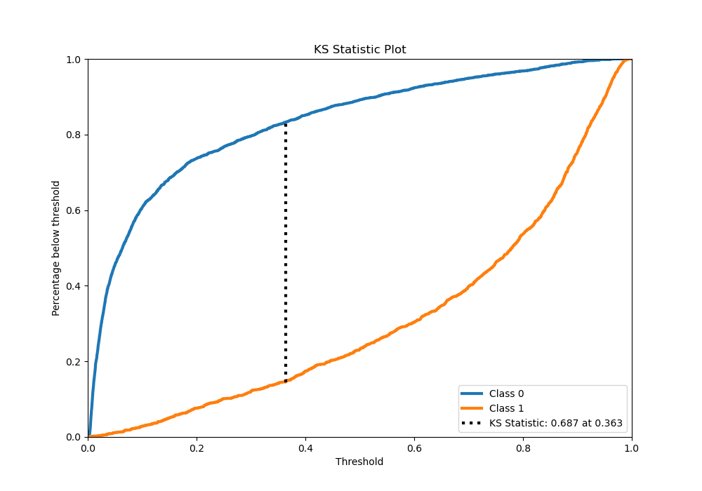
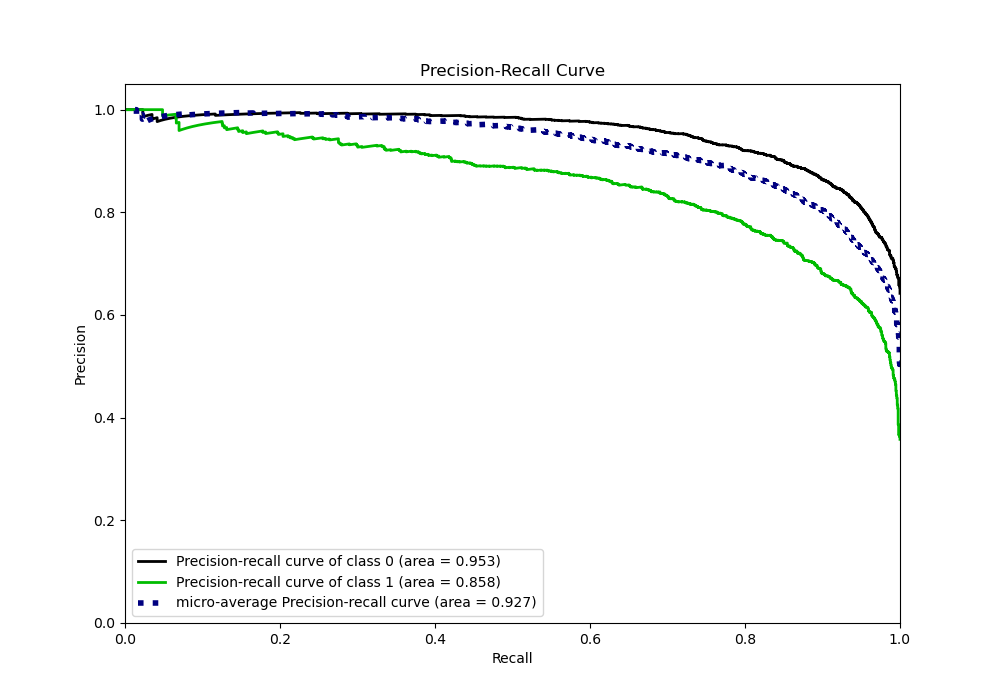
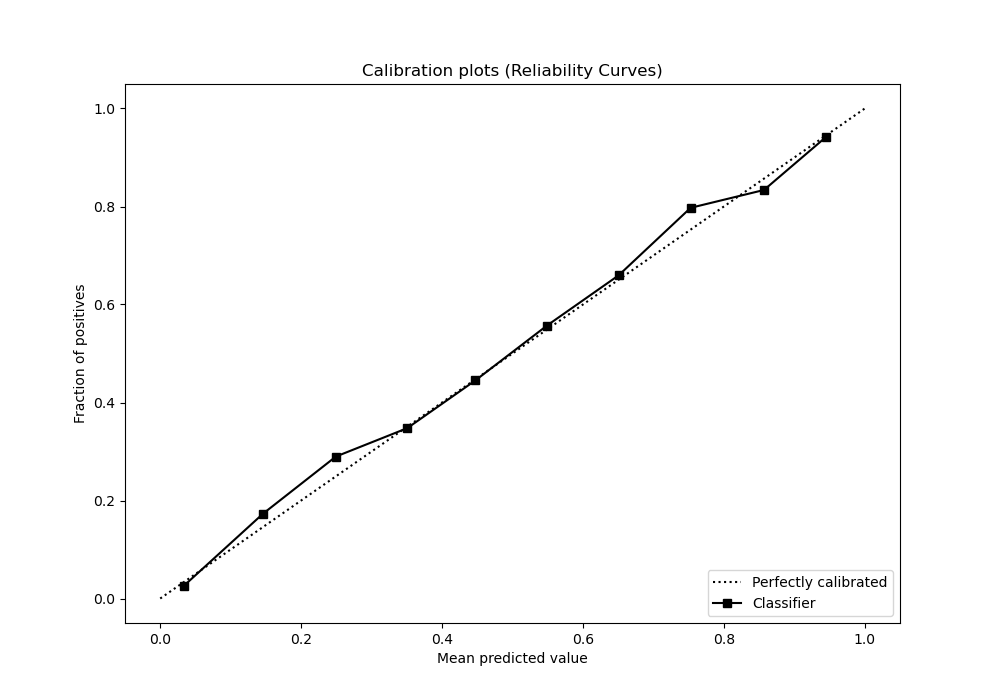
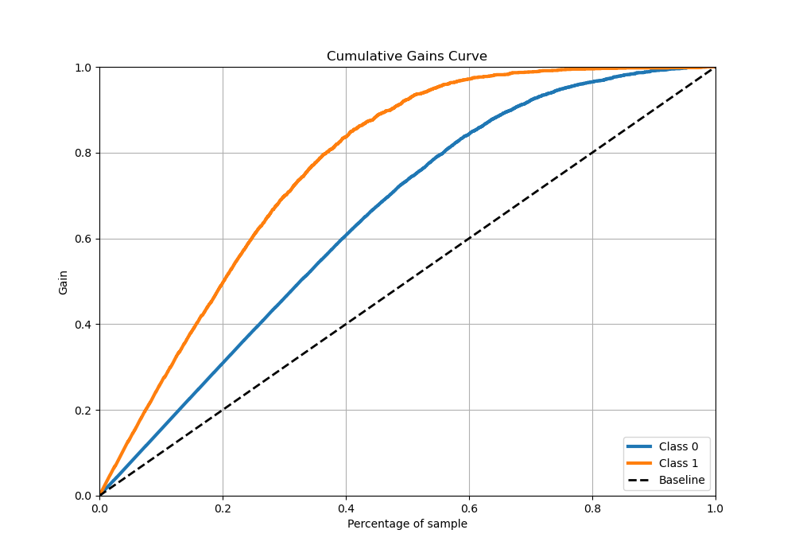
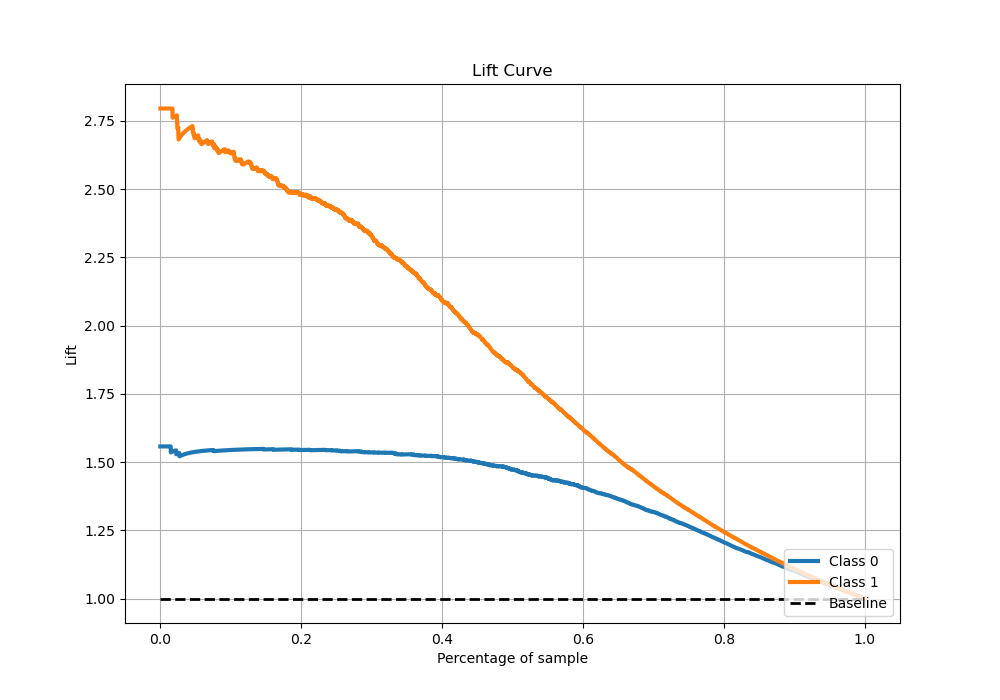

# Summary of Ensemble

[<< Go back](../README.md)

## Ensemble structure
| Model       |   Weight |
|:------------|---------:|
| 11_Xgboost  |        5 |
| 12_Xgboost  |        8 |
| 14_LightGBM |        5 |
| 18_LightGBM |        7 |
| 19_LightGBM |        5 |
| 20_LightGBM |       11 |
| 22_LightGBM |        3 |
| 29_CatBoost |        7 |
| 46_Xgboost  |        7 |
| 47_Xgboost  |        5 |
| 64_CatBoost |        6 |
| 7_Xgboost   |        3 |

## Metric details
|           |    score |    threshold |
|:----------|---------:|-------------:|
| logloss   | 0.344944 | nan          |
| auc       | 0.919516 | nan          |
| f1        | 0.792981 |   0.362749   |
| accuracy  | 0.847748 |   0.454487   |
| precision | 1        |   0.968353   |
| recall    | 1        |   0.00152182 |
| mcc       | 0.669961 |   0.454487   |

## Metric details with threshold from accuracy metric
|           |    score |   threshold |
|:----------|---------:|------------:|
| logloss   | 0.344944 |  nan        |
| auc       | 0.919516 |  nan        |
| f1        | 0.78898  |    0.454487 |
| accuracy  | 0.847748 |    0.454487 |
| precision | 0.782558 |    0.454487 |
| recall    | 0.795508 |    0.454487 |
| mcc       | 0.669961 |    0.454487 |

## Confusion matrix (at threshold=0.454487)
|              |   Predicted as 0 |   Predicted as 1 |
|:-------------|-----------------:|-----------------:|
| Labeled as 0 |             2663 |              374 |
| Labeled as 1 |              346 |             1346 |

## Learning curves

## Confusion Matrix

## Normalized Confusion Matrix

## ROC Curve

## Kolmogorov-Smirnov Statistic

## Precision-Recall Curve

## Calibration Curve

## Cumulative Gains Curve

## Lift Curve

[<< Go back](../README.md)
