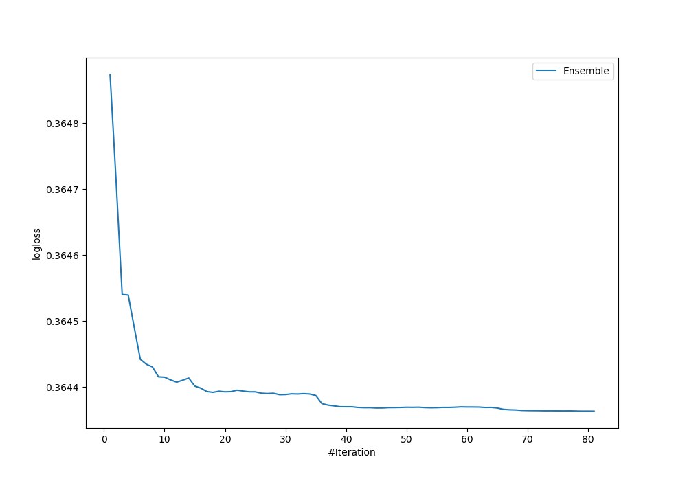
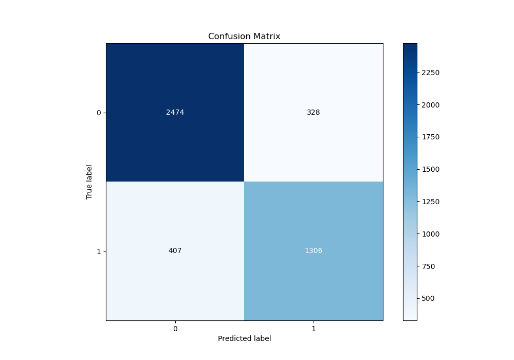
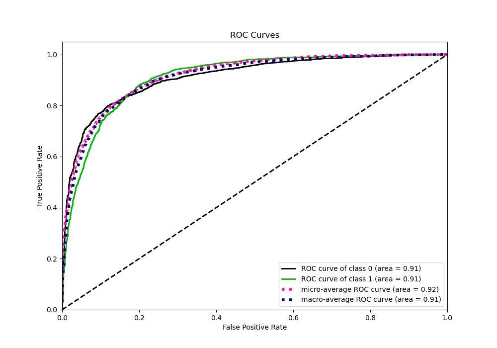
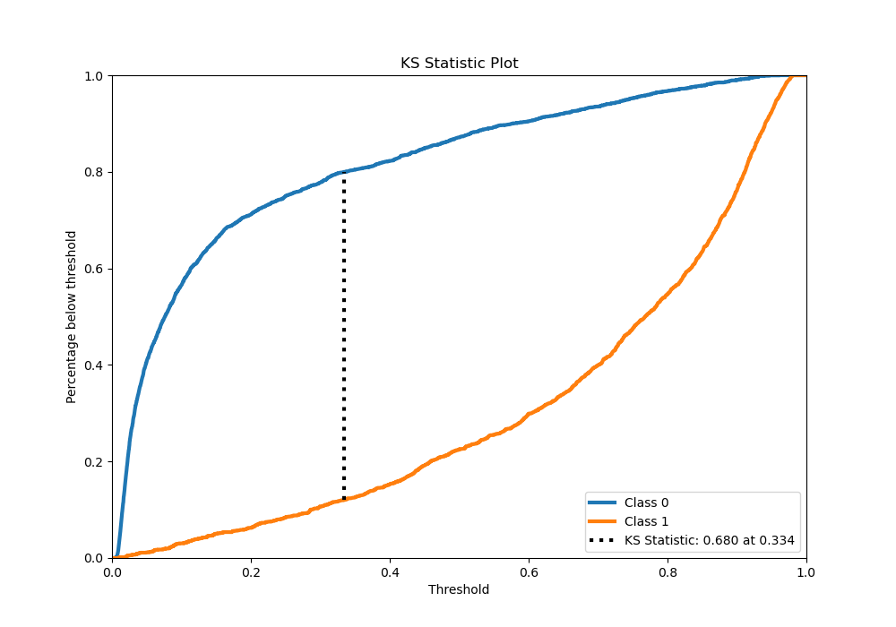
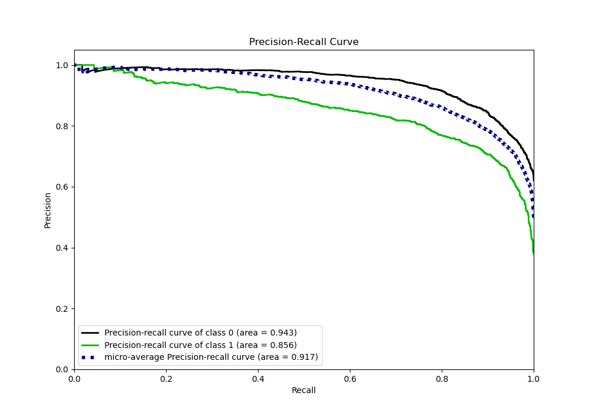
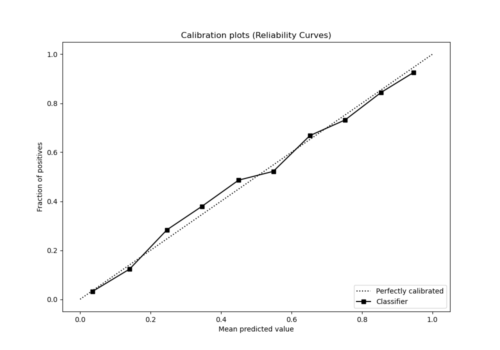
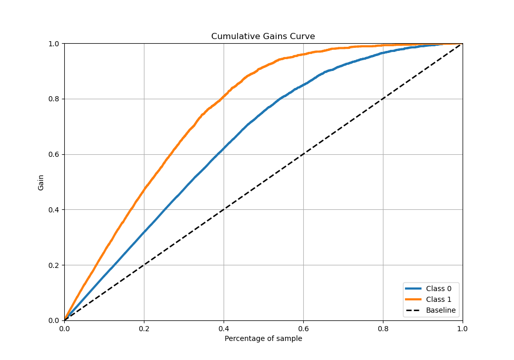
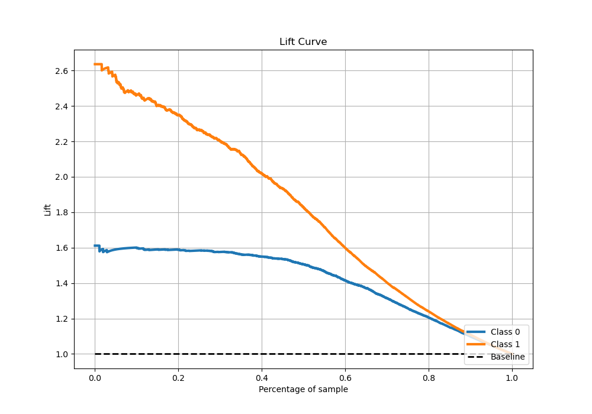

# Summary of Ensemble_Stacked

[<< Go back](../README.md)

## Ensemble structure
| Model                   |   Weight |
|:------------------------|---------:|
| 11_Xgboost              |        1 |
| 17_LightGBM             |        5 |
| 18_LightGBM             |        2 |
| 19_LightGBM             |        1 |
| 33_RandomForest_Stacked |       14 |
| 38_RandomForest_Stacked |        9 |
| 40_RandomForest_Stacked |        6 |
| 6_Xgboost               |        1 |
| Ensemble                |       42 |

## Metric details
|           |    score |    threshold |
|:----------|---------:|-------------:|
| logloss   | 0.364363 | nan          |
| auc       | 0.911521 | nan          |
| f1        | 0.796945 |   0.323985   |
| accuracy  | 0.837209 |   0.525338   |
| precision | 1        |   0.964246   |
| recall    | 1        |   0.00488569 |
| mcc       | 0.661359 |   0.323985   |

## Metric details with threshold from accuracy metric
|           |    score |   threshold |
|:----------|---------:|------------:|
| logloss   | 0.364363 |  nan        |
| auc       | 0.911521 |  nan        |
| f1        | 0.7804   |    0.525338 |
| accuracy  | 0.837209 |    0.525338 |
| precision | 0.799266 |    0.525338 |
| recall    | 0.762405 |    0.525338 |
| mcc       | 0.65164  |    0.525338 |

## Confusion matrix (at threshold=0.525338)
|              |   Predicted as 0 |   Predicted as 1 |
|:-------------|-----------------:|-----------------:|
| Labeled as 0 |             2474 |              328 |
| Labeled as 1 |              407 |             1306 |

## Learning curves

## Confusion Matrix

## Normalized Confusion Matrix

## ROC Curve

## Kolmogorov-Smirnov Statistic

## Precision-Recall Curve

## Calibration Curve

## Cumulative Gains Curve

## Lift Curve

[<< Go back](../README.md)
