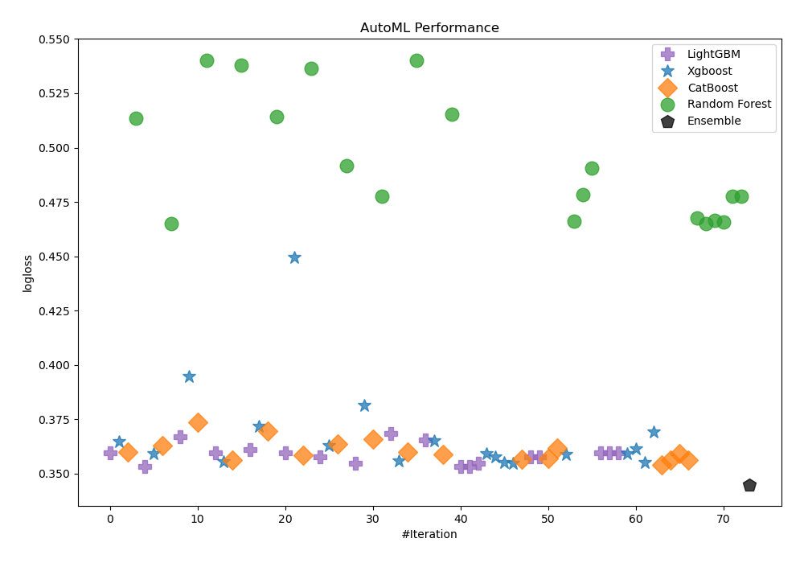
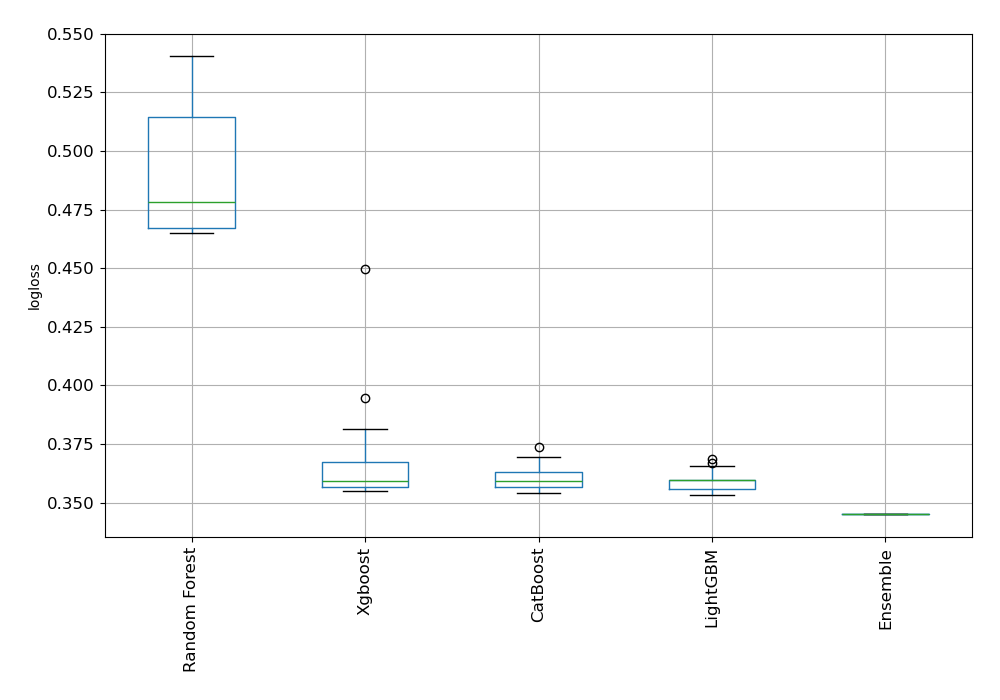
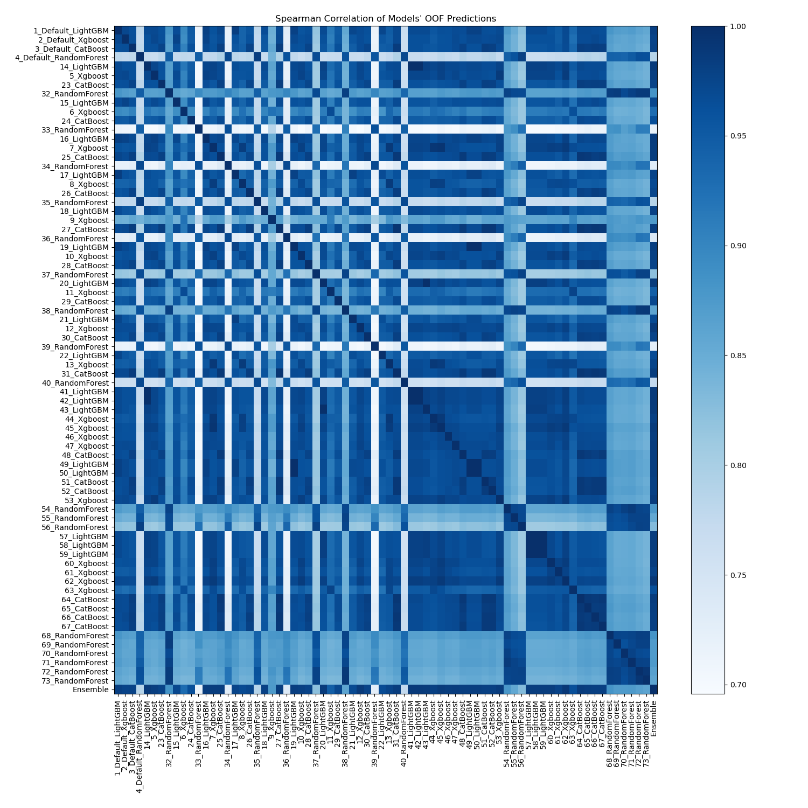

# AutoML Leaderboard

| Best model   | name                                                       | model_type    | metric_type   |   metric_value |   train_time |
|:-------------|:-----------------------------------------------------------|:--------------|:--------------|---------------:|-------------:|
|              | [1_Default_LightGBM](1_Default_LightGBM/README.md)         | LightGBM      | logloss       |       0.359575 |        33.86 |
|              | [2_Default_Xgboost](2_Default_Xgboost/README.md)           | Xgboost       | logloss       |       0.3649   |        37.61 |
|              | [3_Default_CatBoost](3_Default_CatBoost/README.md)         | CatBoost      | logloss       |       0.359847 |        47.95 |
|              | [4_Default_RandomForest](4_Default_RandomForest/README.md) | Random Forest | logloss       |       0.513478 |        47.07 |
|              | [14_LightGBM](14_LightGBM/README.md)                       | LightGBM      | logloss       |       0.353357 |        31.47 |
|              | [5_Xgboost](5_Xgboost/README.md)                           | Xgboost       | logloss       |       0.359343 |        42.28 |
|              | [23_CatBoost](23_CatBoost/README.md)                       | CatBoost      | logloss       |       0.362981 |        57.85 |
|              | [32_RandomForest](32_RandomForest/README.md)               | Random Forest | logloss       |       0.464926 |        51.76 |
|              | [15_LightGBM](15_LightGBM/README.md)                       | LightGBM      | logloss       |       0.366972 |        23.82 |
|              | [6_Xgboost](6_Xgboost/README.md)                           | Xgboost       | logloss       |       0.394562 |        52.51 |
|              | [24_CatBoost](24_CatBoost/README.md)                       | CatBoost      | logloss       |       0.373515 |        28.35 |
|              | [33_RandomForest](33_RandomForest/README.md)               | Random Forest | logloss       |       0.540332 |        34.93 |
|              | [16_LightGBM](16_LightGBM/README.md)                       | LightGBM      | logloss       |       0.359731 |        26.01 |
|              | [7_Xgboost](7_Xgboost/README.md)                           | Xgboost       | logloss       |       0.355609 |        57.95 |
|              | [25_CatBoost](25_CatBoost/README.md)                       | CatBoost      | logloss       |       0.356393 |       303.28 |
|              | [34_RandomForest](34_RandomForest/README.md)               | Random Forest | logloss       |       0.53785  |        33.92 |
|              | [17_LightGBM](17_LightGBM/README.md)                       | LightGBM      | logloss       |       0.36119  |        22.72 |
|              | [8_Xgboost](8_Xgboost/README.md)                           | Xgboost       | logloss       |       0.371721 |        51.74 |
|              | [26_CatBoost](26_CatBoost/README.md)                       | CatBoost      | logloss       |       0.369523 |        35.22 |
|              | [35_RandomForest](35_RandomForest/README.md)               | Random Forest | logloss       |       0.514067 |        33.58 |
|              | [18_LightGBM](18_LightGBM/README.md)                       | LightGBM      | logloss       |       0.359414 |        30.93 |
|              | [9_Xgboost](9_Xgboost/README.md)                           | Xgboost       | logloss       |       0.449617 |        79.59 |
|              | [27_CatBoost](27_CatBoost/README.md)                       | CatBoost      | logloss       |       0.358515 |        87.97 |
|              | [36_RandomForest](36_RandomForest/README.md)               | Random Forest | logloss       |       0.536334 |        31.37 |
|              | [19_LightGBM](19_LightGBM/README.md)                       | LightGBM      | logloss       |       0.357755 |        29.44 |
|              | [10_Xgboost](10_Xgboost/README.md)                         | Xgboost       | logloss       |       0.363038 |        41.91 |
|              | [28_CatBoost](28_CatBoost/README.md)                       | CatBoost      | logloss       |       0.363685 |        37.79 |
|              | [37_RandomForest](37_RandomForest/README.md)               | Random Forest | logloss       |       0.491738 |        39.68 |
|              | [20_LightGBM](20_LightGBM/README.md)                       | LightGBM      | logloss       |       0.354865 |        28.9  |
|              | [11_Xgboost](11_Xgboost/README.md)                         | Xgboost       | logloss       |       0.381544 |        44.83 |
|              | [29_CatBoost](29_CatBoost/README.md)                       | CatBoost      | logloss       |       0.365989 |        37.61 |
|              | [38_RandomForest](38_RandomForest/README.md)               | Random Forest | logloss       |       0.47756  |        44.84 |
|              | [21_LightGBM](21_LightGBM/README.md)                       | LightGBM      | logloss       |       0.368519 |        24.96 |
|              | [12_Xgboost](12_Xgboost/README.md)                         | Xgboost       | logloss       |       0.355706 |        28.91 |
|              | [30_CatBoost](30_CatBoost/README.md)                       | CatBoost      | logloss       |       0.359767 |        72.6  |
|              | [39_RandomForest](39_RandomForest/README.md)               | Random Forest | logloss       |       0.540019 |        34.87 |
|              | [22_LightGBM](22_LightGBM/README.md)                       | LightGBM      | logloss       |       0.365573 |        23.54 |
|              | [13_Xgboost](13_Xgboost/README.md)                         | Xgboost       | logloss       |       0.365062 |        64.9  |
|              | [31_CatBoost](31_CatBoost/README.md)                       | CatBoost      | logloss       |       0.358994 |        92.93 |
|              | [40_RandomForest](40_RandomForest/README.md)               | Random Forest | logloss       |       0.515309 |        34.52 |
|              | [41_LightGBM](41_LightGBM/README.md)                       | LightGBM      | logloss       |       0.353357 |        32.22 |
|              | [42_LightGBM](42_LightGBM/README.md)                       | LightGBM      | logloss       |       0.353357 |        29.07 |
|              | [43_LightGBM](43_LightGBM/README.md)                       | LightGBM      | logloss       |       0.354865 |        31.77 |
|              | [44_Xgboost](44_Xgboost/README.md)                         | Xgboost       | logloss       |       0.359043 |        58.58 |
|              | [45_Xgboost](45_Xgboost/README.md)                         | Xgboost       | logloss       |       0.357745 |        44.91 |
|              | [46_Xgboost](46_Xgboost/README.md)                         | Xgboost       | logloss       |       0.355223 |        35.1  |
|              | [47_Xgboost](47_Xgboost/README.md)                         | Xgboost       | logloss       |       0.354842 |        30.09 |
|              | [48_CatBoost](48_CatBoost/README.md)                       | CatBoost      | logloss       |       0.356548 |       188.11 |
|              | [49_LightGBM](49_LightGBM/README.md)                       | LightGBM      | logloss       |       0.357755 |        26.09 |
|              | [50_LightGBM](50_LightGBM/README.md)                       | LightGBM      | logloss       |       0.357755 |        29.71 |
|              | [51_CatBoost](51_CatBoost/README.md)                       | CatBoost      | logloss       |       0.356983 |        63.9  |
|              | [52_CatBoost](52_CatBoost/README.md)                       | CatBoost      | logloss       |       0.361659 |        58.66 |
|              | [53_Xgboost](53_Xgboost/README.md)                         | Xgboost       | logloss       |       0.358999 |        31.33 |
|              | [54_RandomForest](54_RandomForest/README.md)               | Random Forest | logloss       |       0.466048 |        44.02 |
|              | [55_RandomForest](55_RandomForest/README.md)               | Random Forest | logloss       |       0.478375 |        42.6  |
|              | [56_RandomForest](56_RandomForest/README.md)               | Random Forest | logloss       |       0.490398 |        48.16 |
|              | [57_LightGBM](57_LightGBM/README.md)                       | LightGBM      | logloss       |       0.359625 |        30.66 |
|              | [58_LightGBM](58_LightGBM/README.md)                       | LightGBM      | logloss       |       0.359625 |        28.55 |
|              | [59_LightGBM](59_LightGBM/README.md)                       | LightGBM      | logloss       |       0.359625 |        32.72 |
|              | [60_Xgboost](60_Xgboost/README.md)                         | Xgboost       | logloss       |       0.359061 |        34.76 |
|              | [61_Xgboost](61_Xgboost/README.md)                         | Xgboost       | logloss       |       0.36135  |        39.14 |
|              | [62_Xgboost](62_Xgboost/README.md)                         | Xgboost       | logloss       |       0.355143 |        49.73 |
|              | [63_Xgboost](63_Xgboost/README.md)                         | Xgboost       | logloss       |       0.369381 |       134.79 |
|              | [64_CatBoost](64_CatBoost/README.md)                       | CatBoost      | logloss       |       0.353879 |       204.68 |
|              | [65_CatBoost](65_CatBoost/README.md)                       | CatBoost      | logloss       |       0.356214 |       102.16 |
|              | [66_CatBoost](66_CatBoost/README.md)                       | CatBoost      | logloss       |       0.359136 |        54.67 |
|              | [67_CatBoost](67_CatBoost/README.md)                       | CatBoost      | logloss       |       0.356371 |        78.22 |
|              | [68_RandomForest](68_RandomForest/README.md)               | Random Forest | logloss       |       0.467445 |        47.97 |
|              | [69_RandomForest](69_RandomForest/README.md)               | Random Forest | logloss       |       0.464851 |        61.29 |
|              | [70_RandomForest](70_RandomForest/README.md)               | Random Forest | logloss       |       0.466431 |        40.02 |
|              | [71_RandomForest](71_RandomForest/README.md)               | Random Forest | logloss       |       0.465746 |        51.56 |
|              | [72_RandomForest](72_RandomForest/README.md)               | Random Forest | logloss       |       0.477704 |        50.63 |
|              | [73_RandomForest](73_RandomForest/README.md)               | Random Forest | logloss       |       0.47766  |        48.04 |
| **the best** | [Ensemble](Ensemble/README.md)                             | Ensemble      | logloss       |       0.344944 |        36.06 |

### AutoML Performance

### AutoML Performance Boxplot

### Spearman Correlation of Models

